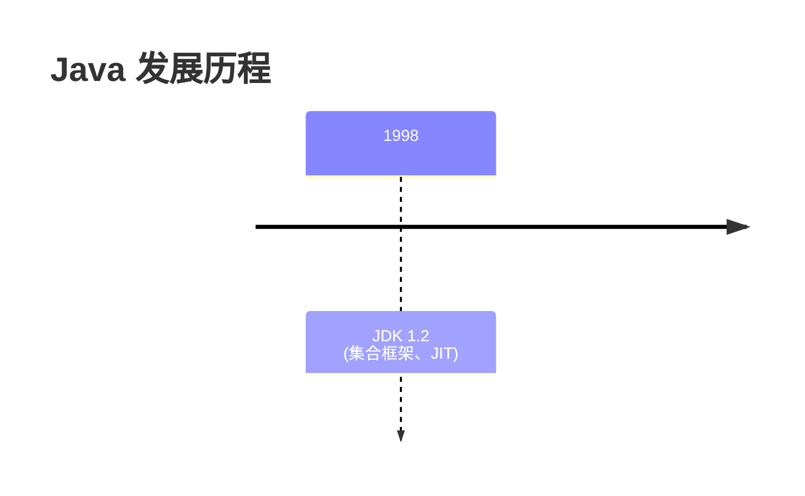
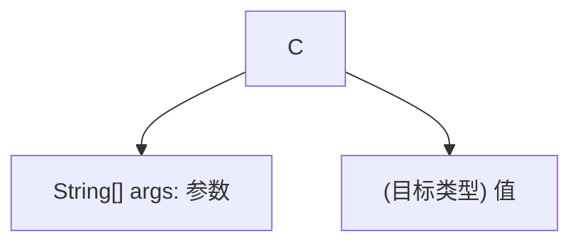
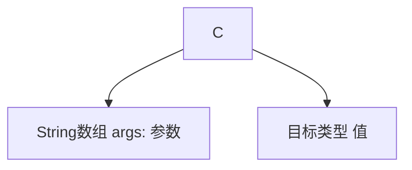

# VuePress 项目错误记录

本文档记录项目开发过程中遇到的所有错误及其解决方案。

---

## Mermaid 图表错误

### 1. 概述

在 VuePress Theme Hope 中使用 Mermaid 图表时，由于 Mermaid 语法的特殊性，某些字符会导致解析错误。

### 2. 特殊字符问题

#### 问题说明

Mermaid 使用方括号 `[]` 和括号 `()` 作为节点定义的特殊语法：

| 语法 | 节点形状 | 示例 |
|------|----------|------|
| `[text]` | 矩形 | `[节点]` |
| `[(text)]` | 圆角矩形（体育场形） | `[(节点)]` |
| `[[text]]` | 圆柱形 | `[[节点]]` |
| `{text}` | 菱形 | `{节点}` |
| `{{text}}` | 消息形状 | `{{节点}}` |

#### 错误示例

以下写法会导致 Mermaid 解析错误：

```mermaid
graph TD
    C --> C4[String[] args: 参数]
```

**问题**：`String[]` 中的 `[]` 会被 Mermaid 误解析为节点定义分隔符。

```mermaid
graph TD
    C --> C1[(目标类型) 值]
```

**问题**：`[(目标类型)]` 会被解析为圆角矩形节点形状，导致后续的 ` 值]` 成为无效语法。



**问题**：timeline 中的括号 `()` 会导致解析错误。

### 3. Timeline 特殊语法

Timeline 图表对特殊字符更敏感，**不支持使用括号**：

```mermaid
## ❌ 错误：括号导致解析失败
timeline
    title Java 发展历程
    1998 : JDK 1.2 (集合框架、JIT)
    2004 : JDK 5.0 (泛型、枚举、注解)

## ✅ 正确：移除括号，使用空格分隔
timeline
    title Java 发展历程
    1998 : JDK 1.2 集合框架 JIT
    2004 : JDK 5.0 泛型 枚举 注解
```

**Timeline 注意事项**：
- 不要使用括号 `()`
- 不要使用方括号 `[]`
- 使用空格或逗号分隔多个项目
- 保持简洁，每行内容不要过长

### 4. 节点标签中的引号问题

节点标签中包含引号 `"` 会导致解析错误：

```mermaid
## ❌ 错误：引号导致解析失败
graph LR
    B --> B1[123 "Hello" true]
    A --> B[字面量 "Hello"]

## ✅ 正确：使用双引号包裹或移除引号
graph LR
    B --> B1["整数123 字符串Hello 布尔值true"]
    A --> B["字面量 Hello"]
```

**注意事项**：
- 节点标签内避免直接使用引号
- 如果必须使用引号，用双引号包裹整个标签
- 或用中文描述替代引号内容

### 5. 节点标签中的运算符问题

节点标签中包含运算符 `&&`、`||` 会导致解析错误：

```mermaid
## ❌ 错误：|| 和 && 是 Mermaid 特殊字符
flowchart TD
    F[表达式1 || 表达式2] --> G{表达式1}
    A[表达式1 && 表达式2] --> B{表达式1}

## ✅ 正确：使用双引号包裹或中文描述
flowchart TD
    F["表达式1 或 表达式2"] --> G{表达式1}
    A["表达式1 与 表达式2"] --> B{表达式1}
```

**注意事项**：
- `&&` 和 `||` 是 Mermaid 的边定义语法
- 节点标签内避免使用这些运算符
- 使用中文"与"、"或"替代，或用双引号包裹

### 6. 已修复的问题

| 文件路径 | 行号 | 原代码 | 修复后 |
|----------|------|--------|--------|
| `vuepress-hope/java/base/00-overview/hello-world.md` | 46 | `C --> C4[String[] args: 参数]` | `C --> C4["String数组 args: 参数"]` |
| `vuepress-hope/java/base/00-overview/overview.md` | 21-28 | `1998 : JDK 1.2 (集合框架、JIT)` | `1998 : JDK 1.2 集合框架 JIT` |
| `vuepress-hope/java/base/01-syntax/variables.md` | 513 | `B --> B1[123 "Hello" true]` | `B --> B1["整数123 字符串Hello 布尔值true"]` |
| `vuepress-hope/java/base/01-syntax/variables.md` | 425 | `C --> C1[(目标类型) 值]` | `C --> C1["目标类型 值"]` |
| `vuepress-hope/java/base/01-syntax/operators.md` | 267,272 | `A[表达式1 && 表达式2]` | `A["表达式1 与 表达式2"]` |
| `vuepress-hope/java/base/03-array-string/string.md` | 58-59 | `B[字面量 "Hello"]` | `B["字面量 Hello"]` |
| `vuepress-hope/java/base/09-generic-reflection/wildcard.md` | 23 | `C --> C1[Integer[] 是 Number[] 的子类型]` | `C --> C1["Integer数组 是 Number数组的子类型"]` |
| `vuepress-hope/java/base/09-generic-reflection/generic-overview.md` | 337 | `C --> C1[Integer[] 是 Number[] 的子类型]` | `C --> C1["Integer数组 是 Number数组的子类型"]` |
| `vuepress-hope/java/base/11-lambda-stream/lambda.md` | 83 | `B --> B1[a 或 (a) 或 (a, b)]` | `B --> B1["a 或 a 或 a, b"]` |

### 6. 解决方案

#### 方案 1：使用双引号包裹（推荐）

当节点标签包含特殊字符时，使用双引号包裹：



#### 方案 2：替换特殊字符

用中文描述替换特殊字符：



#### 方案 3：使用 HTML 实体

使用 HTML 实体转义特殊字符：

```mermaid
graph TD
    C --> C4["String&#91;&#93; args: 参数"]
    C --> C1["&#40;目标类型&#41; 值"]
```



**HTML 实体对照表**：

| 字符 | HTML 实体 |
|------|-----------|
| `<` | `&lt;` |
| `>` | `&gt;` |
| `&` | `&amp;` |
| `"` | `&quot;` |
| `'` | `&apos;` |
| `[` | `&#91;` |
| `]` | `&#93;` |
| `(` | `&#40;` |
| `)` | `&#41;` |

### 5. 最佳实践

#### 编写 Mermaid 图表时的注意事项

1. **避免在节点标签中使用方括号**
   ```mermaid
   ## ❌ 错误
   A[List<String>]

   ## ✅ 正确
   A["List<String>"]
   A[泛型列表]
   ```

2. **避免在节点标签中使用括号（除非想要圆角矩形）**
   ```mermaid
   ## ❌ 可能导致错误（如果后续还有内容）
   A[(说明) 更多内容]

   ## ✅ 正确
   A["(说明) 更多内容"]
   A[说明 更多内容]
   ```

3. **使用双引号包裹复杂标签**
   ```mermaid
   ## ✅ 推荐
   A["包含特殊字符: <>()[]{}"]
   ```

4. **测试和验证**
   - 修改后运行 `pnpm dev` 验证
   - 检查浏览器控制台是否有 Mermaid 错误
   - 确认图表正确渲染

### 6. 错误检测脚本

```bash
# 查找 Mermaid 块中的嵌套方括号
find vuepress-hope/java/base -name "*.md" -exec sh -c '
  file="$1"
  in_mermaid=0
  while IFS= read -r line; do
    if echo "$line" | grep -q "^[[:space:]]*\`\`\`mermaid"; then
      in_mermaid=1
    elif echo "$line" | grep -q "^[[:space:]]*\`\`\`"; then
      in_mermaid=0
    elif [ $in_mermaid -eq 1 ]; then
      if echo "$line" | grep -q "\[.*\[\].*\]"; then
        echo "$file:$line"
      fi
    fi
  done < "$file"
' sh {} \;

# 查找 Mermaid 块中的括号问题
find vuepress-hope/java/base -name "*.md" -exec sh -c '
  file="$1"
  in_mermaid=0
  while IFS= read -r line; do
    if echo "$line" | grep -q "^[[:space:]]*\`\`\`mermaid"; then
      in_mermaid=1
    elif echo "$line" | grep -q "^[[:space:]]*\`\`\`"; then
      in_mermaid=0
    elif [ $in_mermaid -eq 1 ]; then
      if echo "$line" | grep -q "\[.*(.*)"; then
        echo "$file:$line"
      fi
    fi
  done < "$file"
' sh {} \;

# 查找 Timeline 块中的括号问题
find vuepress-hope/java/base -name "*.md" -exec sh -c '
  file="$1"
  in_mermaid=0
  is_timeline=0
  while IFS= read -r line; do
    if echo "$line" | grep -q "^[[:space:]]*\`\`\`mermaid"; then
      in_mermaid=1
    elif echo "$line" | grep -q "^[[:space:]]*\`\`\`"; then
      in_mermaid=0
      is_timeline=0
    elif [ $in_mermaid -eq 1 ]; then
      if echo "$line" | grep -q "timeline"; then
        is_timeline=1
      elif [ $is_timeline -eq 1 ] && echo "$line" | grep -q "("; then
        echo "$file:$line"
      fi
    fi
  done < "$file"
' sh {} \;
```

---

## 其他错误

### 1. SVG 标签导致编译失败

**错误信息**：
```
error [vite:vue] [plugin vite:vue] Tags with side effect (<script> and <style>)
are ignored in client component templates.
```

**原因**：直接在 Markdown 中使用 `<svg>` 标签

**解决方案**：使用 Mermaid 图表替代 SVG

**修复文件**：`vuepress-hope/java/base/00-overview/overview.md`

### 2. Mermaid 中的 `<br/>` 语法错误

**错误信息**：
```
Syntax error in graph
```

**原因**：在 Mermaid 节点标签中使用 `<br/>` 进行换行

**解决方案**：批量替换 `<br/>` 为空格

**修复命令**：
```bash
find vuepress-hope/java/base -name "*.md" -exec sed -i '' 's/<br\/>/ /g' {} \;
```

### 3. CI 构建时内存溢出错误

**错误信息**：
```
FATAL ERROR: Ineffective mark-compacts near heap limit Allocation failed - JavaScript heap out of memory
```

**原因**：
Node.js 的默认内存限制（约 2GB）不足以处理大型 VuePress 项目的构建。

**解决方案**：
在 `package.json` 的 build 脚本中增加 Node.js 内存限制：

```json
{
  "scripts": {
    "build": "NODE_OPTIONS=--max-old-space-size=8192 vuepress-vite build vuepress-hope"
  }
}
```

**修复文件**：`package.json`

**修复日期**：2025-02-01

---

## 更新日志

| 日期 | 错误类型 | 影响文件 | 状态 |
|------|----------|----------|------|
| 2025-02-01 | CI 构建内存溢出 | package.json | ✅ 已修复 |
| 2025-01-31 | Mermaid 节点运算符错误 | operators.md | ✅ 已修复 |
| 2025-01-31 | Mermaid 节点引号错误 | variables.md, string.md | ✅ 已修复 |
| 2025-01-31 | Mermaid Timeline 括号错误 | overview.md | ✅ 已修复 |
| 2025-01-31 | Mermaid 特殊字符错误 | 9 个 Java 文档 | ✅ 已修复 |
| 2025-01-31 | SVG 标签编译错误 | overview.md | ✅ 已修复 |
| 2025-01-31 | Mermaid `<br/>` 语法错误 | 多个文档 | ✅ 已修复 |
