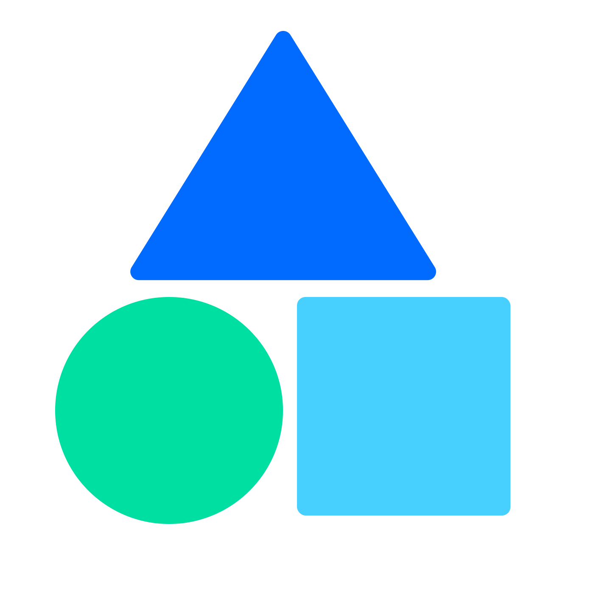

<h1 align="center">蔚蓝空间栈 SpaceX</h1>

<h3 align="center">沉淀深度思考，重构技术边界</h3>

   

[👀 在线预览](https://www.guide.weilanx.com) · [🐞 报告 Bug](https://github.com/Azure12355/weilanx-guide/issues) · [✨ 提出新特性](https://github.com/Azure12355/weilanx-guide/issues)

## 📖 简介

**蔚蓝空间栈 (Weilan Space Stack)** 是一个基于 `VuePress 2` + `vuepress-theme-hope` 打造的高性能、沉浸式编程知识库。

区别于传统的静态文档，本项目采用了**深度定制的 UI 设计**，融合了动态 SVG 星空背景、极光玻璃拟态（Aurora Glassmorphism）卡片以及丝滑的微交互动画。旨在为开发者提供一个**体系化、高颜值、可复盘**的学习环境。

## ✨ 核心亮点

### 🎨 极致的 UI/UX 设计
*   **🌌 动态几何宇宙**：全屏 SVG 动态背景，随时间流转，营造沉浸式深空体验（仅主页生效，不干扰阅读）。
*   **🔮 极光玻璃拟态**：深度定制 CSS，全站采用 Aurora Glassmorphism 风格，卡片悬停光效，细腻的磨砂质感。
*   **🌓 完美暗黑适配**：重写 CSS 变量系统，亮色/暗色模式自动无缝切换，夜间阅读更护眼。
*   **📱 响应式布局**：针对移动端、平板、宽屏显示器进行像素级适配，原生 Grid 布局重构知识星图。

### 📚 硬核知识体系
*   **☕ Java 后端核心**：JVM 底层、JUC 并发、Spring 全家桶源码剖析。
*   **🏗️ 架构设计思维**：DDD 领域驱动设计、分布式系统演进、中间件深度实践。
*   **🤖 AI 与未来编程**：LLM 大模型应用开发、Prompt Engineering 实战。
*   **⚡ 全栈开发视野**：Vue3/React 前端工程化、Docker/K8s 容器化部署。

## 🛠️ 技术栈

*   **核心框架**: [VuePress 2](https://v2.vuepress.vuejs.org/) (基于 Vite & Vue 3)
*   **主题系统**: [vuepress-theme-hope](https://theme-hope.vuejs.press/)
*   **样式定制**: SCSS + CSS Variables + CSS Grid
*   **部署托管**: GitHub Pages / 腾讯云 EdgeOne

## 🤝 参与贡献

非常欢迎任何形式的贡献！无论是修复错别字、补充文档内容，还是提交新的 CSS 特效。

1.  Fork 本仓库
2.  新建 Feat_xxx 分支
3.  提交代码
4.  新建 Pull Request

## 📄 开源协议

本项目采用 [MIT License](LICENSE) 协议开源。
文档内容版权归作者 **蔚蓝 (Weilan)** 所有。

---

  
如果觉得这个项目对你有帮助，请给一个 ⭐️ Star 吧！

  

    Designed with ❤️ by <a href="https://github.com/Azure12355">Weilan</a>
  

