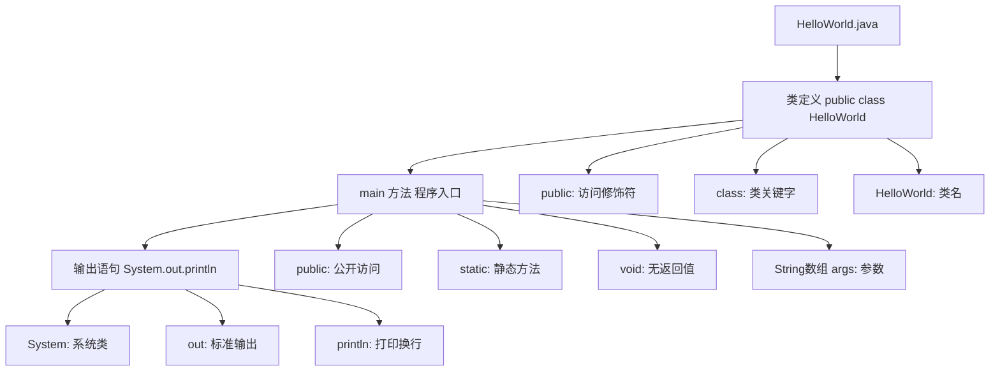
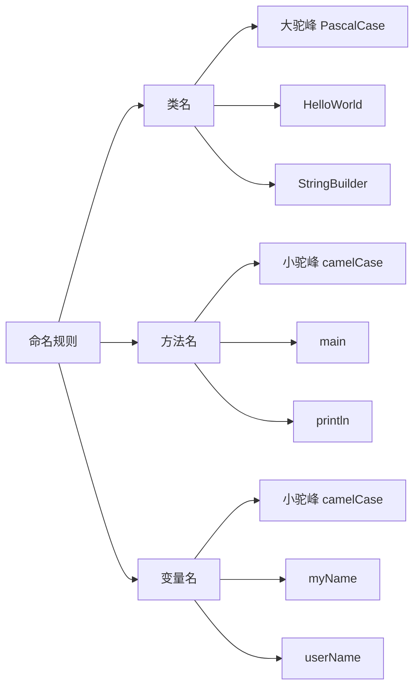
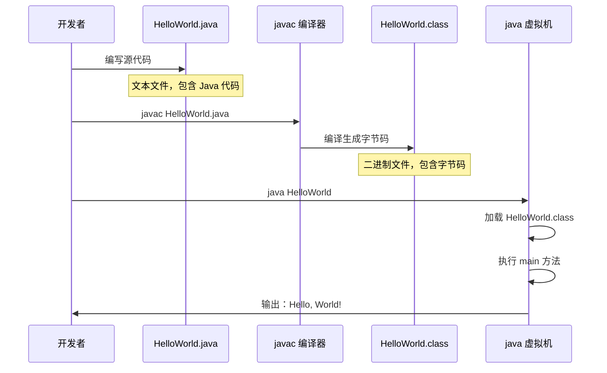
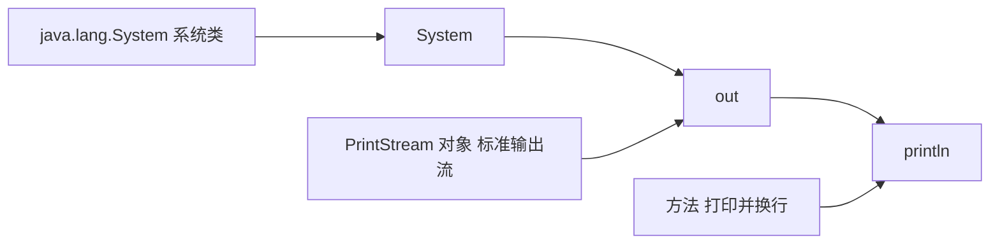
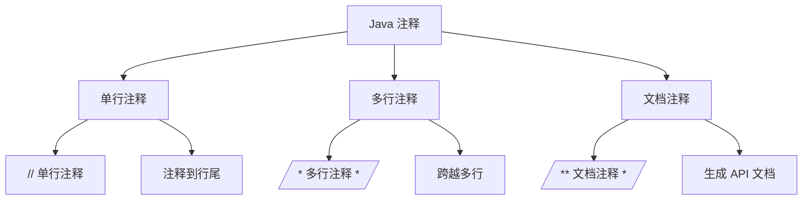
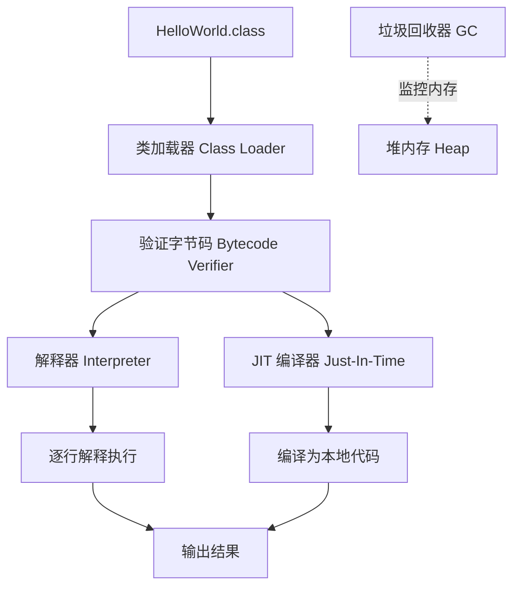
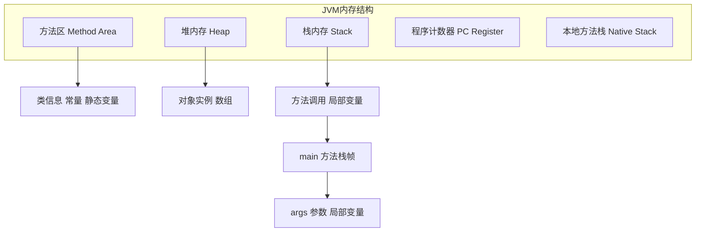
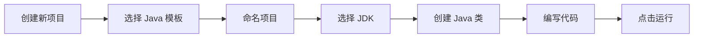

# Hello World

让我们开始编写第一个 Java 程序——经典的 **Hello World**！

## 程序代码

创建文件 `HelloWorld.java`：

```java
/**
 * 我的第一个 Java 程序
 */
public class HelloWorld {
    public static void main(String[] args) {
        System.out.println("Hello, World!");
    }
}
```

## 代码详解

### 程序结构分解



### 关键字说明

| 关键字           | 说明                                       |
| ---------------- | ------------------------------------------ |
| **public** | 访问修饰符，表示公开的，任何地方都可以访问 |
| **class**  | 定义类的关键字                             |
| **static** | 静态修饰符，表示属于类而非对象             |
| **void**   | 表示方法无返回值                           |
| **main**   | 主方法名，Java 程序的入口点                |

::: tip 核心概念
**main 方法**是 Java 程序的入口，JVM 执行程序时从这里开始。
:::

### 命名规则



::: tabs

@tab 类名规则

- **首字母大写**：`HelloWorld` ✅
- **多个单词拼接**：`StringBuilder` ✅
- **禁止特殊字符**：`Hello-World` ❌ `Hello World` ❌
- **禁止数字开头**：`1HelloWorld` ❌

@tab 方法名规则

- **首字母小写**：`main` ✅ `println` ✅
- **多个单词后续首字母大写**：`toString` ✅
- **使用动词**：`getName` ✅ `setData` ✅

@tab 变量名规则

- **首字母小写**：`name` ✅
- **见名知意**：`studentAge` ✅ `s` ❌
- **避免单个字符**：除循环变量 `i`, `j`, `k`

:::

## 编译与运行

### 完整流程



### 命令行操作

::: tabs

@tab Windows (CMD)

```batch
# 切换到源文件所在目录
cd C:\JavaProjects

# 编译源代码
javac HelloWorld.java

# 运行程序
java HelloWorld

# 输出结果
Hello, World!
```

@tab macOS/Linux (Terminal)

```bash
# 切换到源文件所在目录
cd ~/java/projects

# 编译源代码
javac HelloWorld.java

# 运行程序
java HelloWorld

# 输出结果
Hello, World!
```

:::

::: tip 注意事项

1. **编译命令**：`javac HelloWorld.java`（带 `.java` 后缀）
2. **运行命令**：`java HelloWorld`（不带 `.class` 后缀）
3. **文件名与类名一致**：`public class HelloWorld` 的文件名必须是 `HelloWorld.java`

:::

### 目录结构

编译后的目录结构：

```
java/projects/
├── HelloWorld.java      # 源代码文件
└── HelloWorld.class     # 编译后的字节码文件
```

## 输出语句详解

### System.out.println



::: tabs

@tab println - 打印并换行

```java
System.out.println("Hello");      // 输出：Hello
System.out.println("World");      // 输出：World
// 结果：
// Hello
// World
```

@tab print - 打印不换行

```java
System.out.print("Hello ");       // 输出：Hello
System.out.print("World");        // 输出：World
// 结果：
// Hello World
```

@tab printf - 格式化输出

```java
int age = 18;
String name = "Alice";

// 占位符：%s字符串, %d整数, %f浮点数
System.out.printf("Name: %s, Age: %d\n", name, age);
// 输出：Name: Alice, Age: 18

// 格式化浮点数
double pi = 3.1415926;
System.out.printf("Pi: %.2f", pi);  // 输出：Pi: 3.14
```

:::

### 转义字符

| 转义字符 | 含义   | 示例                    |
| -------- | ------ | ----------------------- |
| `\n`   | 换行   | `"Hello\nWorld"`      |
| `\t`   | 制表符 | `"Name\tAge"`         |
| `\\`   | 反斜杠 | `"C:\\Program Files"` |
| `\"`   | 双引号 | `"He said \"Hi\""`    |
| `\'`   | 单引号 | `'It\'s me'`          |

```java
System.out.println("姓名\t年龄\t成绩");
System.out.println("张三\t20\t95.5");
System.out.println("李四\t21\t87.0");

// 输出：
// 姓名    年龄  成绩
// 张三    20    95.5
// 李四    21    87.0
```

## 注释

### 注释类型



::: tabs

@tab 单行注释

```java
// 这是单行注释
public class HelloWorld {
    public static void main(String[] args) {
        // 输出 Hello World
        System.out.println("Hello, World!");  // 这里也是注释
    }
}
```

@tab 多行注释

```java
/*
 * 这是多行注释
 * 可以跨越多行
 * 用于注释一段代码
 */
public class HelloWorld {
    public static void main(String[] args) {
        /* 
         * 输出经典的
         * Hello World 消息
         */
        System.out.println("Hello, World!");
    }
}
```

@tab 文档注释

```java
/**
 * 这是文档注释（JavaDoc）
 * 用于生成 API 文档
 * 
 * @author 作者名
 * @version 1.0
 * @since 2024-01-01
 */
public class HelloWorld {
    /**
     * 程序入口方法
     * 
     * @param args 命令行参数
     */
    public static void main(String[] args) {
        System.out.println("Hello, World!");
    }
}
```

:::

### 注释的使用场景

::: tip 注释最佳实践

```java
// 1. 解释"为什么"而非"是什么"
// 好的注释
// 使用 HashMap 查找，时间复杂度 O(1)
Map<String, User> userMap = new HashMap<>();

// 不好的注释
// 创建一个 HashMap
Map<String, User> userMap = new HashMap<>();

// 2. 注释复杂的算法逻辑
// 使用双指针法，一个从头开始，一个从尾开始
int left = 0, right = arr.length - 1;

// 3. 标记待完成的功能
// TODO: 添加输入验证
// FIXME: 修复边界条件错误

// 4. 文档注释用于公共 API
/**
 * 计算两个数的和
 * 
 * @param a 第一个数
 * @param b 第二个数
 * @return 两数之和
 */
public int add(int a, int b) {
    return a + b;
}
```

:::

## 程序执行过程

### JVM 内部流程



### 内存模型



::: tip 简化理解

- **栈内存**：存储方法调用和局部变量（main 方法在栈中）
- **堆内存**：存储创建的对象
- **方法区**：存储类信息和常量
  :::

## 常见错误

### 编译错误

::: tabs

@tab 文件名与类名不一致

```java
// 文件名：Test.java
public class HelloWorld {  // ❌ 错误：类名 HelloWorld 与文件名 Test 不匹配
    public static void main(String[] args) {
        System.out.println("Hello");
    }
}
```

**解决方案**：将文件重命名为 `HelloWorld.java`，或修改类名为 `Test`

@tab 缺少分号

```java
public class HelloWorld {
    public static void main(String[] args) {
        System.out.println("Hello")  // ❌ 错误：缺少分号
    }
}
```

**解决方案**：在语句末尾添加 `;`

```java
System.out.println("Hello");  // ✅
```

@tab 字符串引号不匹配

```java
public class HelloWorld {
    public static void main(String[] args) {
        System.out.println("Hello);  // ❌ 错误：缺少右引号
    }
}
```

:::

### 运行时错误

::: tabs

@tab 找不到 main 方法

```java
public class HelloWorld {
    // ❌ 错误：缺少 main 方法
    public static void main(String[] args) {
        System.out.println("Hello");
    }
}
```

**解决方案**：确保 main 方法签名正确

```java
public static void main(String[] args) { }  // ✅
```

@tab main 方法签名错误

```java
public static void Main(String[] args) { }  // ❌ 错误：Main 大写
public static void main(string[] args) { }  // ❌ 错误：string 小写
public void main(String[] args) { }         // ❌ 错误：缺少 static
```

:::

## IDE 快速开始

### IntelliJ IDEA



**步骤**：

1. 创建新项目

   - File → New → Project
   - 选择 "Java" 模板
   - 选择 Project SDK（JDK）
   - 命名项目并创建
2. 创建 Java 类

   - 右键 `src` 文件夹
   - New → Java Class
   - 命名：`HelloWorld`
3. 编写代码

   ```java
   public class HelloWorld {
       public static void main(String[] args) {
           System.out.println("Hello, World!");
       }
   }
   ```
4. 运行程序

   - 点击代码左侧的绿色三角形 ▶️
   - 或右键编辑区 → Run 'HelloWorld.main()'

### VS Code

**扩展安装**：

- **Extension Pack for Java**（Microsoft 官方）
- **Code Runner**
- **Java Code Generators**

**步骤**：

1. 创建项目文件夹
2. VS Code 打开文件夹
3. 创建 `HelloWorld.java`
4. 编写代码
5. 按 `F5` 或点击右上角运行按钮

## 练习

### 基础练习

::: tabs

@tab 练习 1：个人信息输出

```java
public class PersonalInfo {
    public static void main(String[] args) {
        System.out.println("========== 个人信息 ==========");
        System.out.println("姓名：张三");
        System.out.println("年龄：20");
        System.out.println("性别：男");
        System.out.println("学校：清华大学");
        System.out.println("专业：计算机科学与技术");
        System.out.println("==============================");
    }
}
```

@tab 练习 2：打印图形

```java
public class PrintPattern {
    public static void main(String[] args) {
        System.out.println("    *    ");
        System.out.println("   ***   ");
        System.out.println("  *****  ");
        System.out.println(" ******* ");
        System.out.println("*********");
        System.out.println(" ******* ");
        System.out.println("  *****  ");
        System.out.println("   ***   ");
        System.out.println("    *    ");
    }
}
```

@tab 练习 3：使用 printf

```java
public class FormatOutput {
    public static void main(String[] args) {
        String name = "李华";
        int age = 18;
        double height = 175.5;
        String hobby = "编程";
      
        System.out.printf("姓名：%s\n", name);
        System.out.printf("年龄：%d 岁\n", age);
        System.out.printf("身高：%.1f cm\n", height);
        System.out.printf("爱好：%s\n", hobby);
    }
}
```

:::

## 小结

::: tip 核心要点

1. **Java 程序结构**：类 → 方法 → 语句
2. **main 方法**：程序入口，必须定义为 `public static void main(String[] args)`
3. **编译运行**：`javac` 编译 → `java` 运行
4. **输出语句**：`System.out.println()` 打印并换行
5. **命名规范**：类名大驼峰，方法名小驼峰
6. **注释**：单行 `//`、多行 `/* */`、文档 `/** */`

:::

::: info 下一步

- [变量与数据类型](/java/base/01-syntax/variables.md) - 学习 Java 基础语法
  :::
