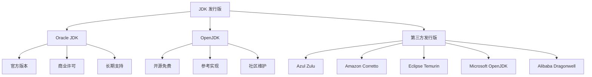
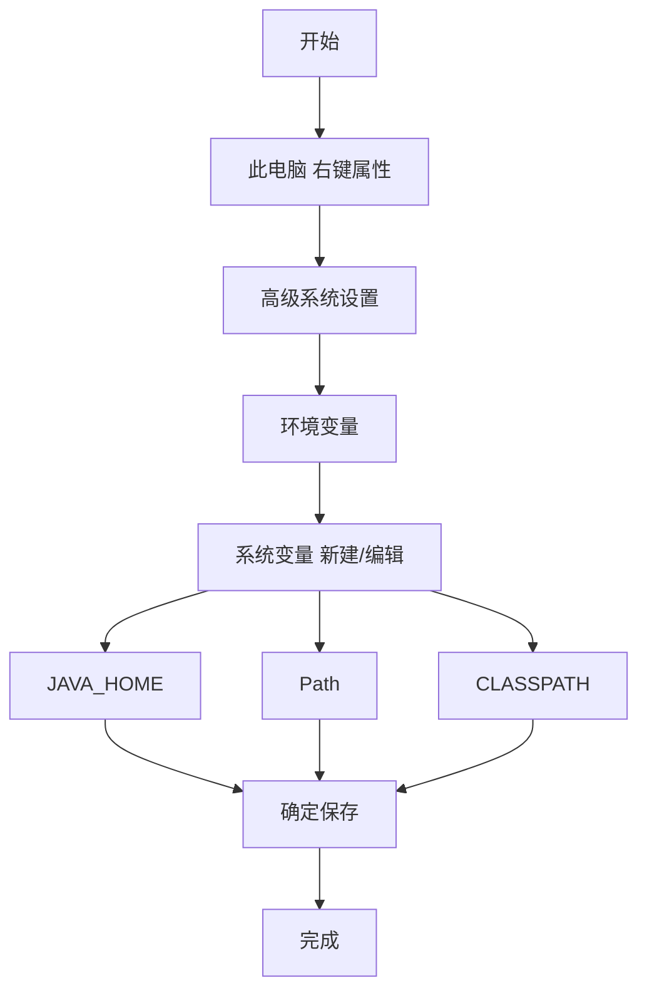
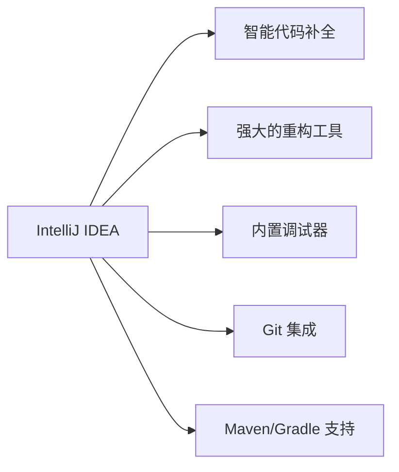

# JDK 安装配置

本文介绍如何在不同操作系统上安装和配置 Java 开发环境。

## JDK 版本选择

### 当前主流版本

| 版本 | LTS | 发布时间 | 推荐场景 |
|------|-----|----------|----------|
| **Java 8** | ✅ | 2014.03 | 传统项目、稳定性优先 |
| **Java 11** | ✅ | 2018.09 | 中长期项目、平衡稳定 |
| **Java 17** | ✅ | 2021.09 | 新项目、现代特性 |
| **Java 21** | ✅ | 2023.09 | 最新特性、虚拟线程 |

::: tip 版本选择建议
- **学习/新手**：选择 **Java 17** 或 **Java 21**（LTS 版本）
- **企业开发**：根据项目要求，通常 Java 8/11/17
- **最新技术尝鲜**：选择 Java 21+
:::

### JDK 发行版



::: tabs

@tab Oracle JDK

**官方版本**，由 Oracle 公司维护：

- ✅ 官方支持和更新
- ✅ 长期支持版本（LTS）
- ❌ 商业使用需付费（Java 8u211+）
- 📍 下载：https://www.oracle.com/java/technologies/downloads/

@tab OpenJDK

**开源版本**，Java 的官方参考实现：

- ✅ 完全免费开源
- ✅ 社区活跃
- ❌ 只有 6 个月支持周期
- 📍 下载：https://openjdk.org/

@tab Azul Zulu

**Azul Systems** 提供的 OpenJDK 发行版：

- ✅ 完全免费
- ✅ 支持 Java 8 - 21+
- ✅ 多平台支持
- 📍 下载：https://www.azul.com/downloads/

@tab Eclipse Temurin

**Eclipse 基金会**维护的 OpenJDK 发行版：

- ✅ 完全免费
- ✅ LTS 版本长期支持
- ✅ 企业级质量
- 📍 下载：https://adoptium.net/

@tab Amazon Corretto

**Amazon** 提供的 OpenJDK 发行版：

- ✅ 完全免费
- ✅ 长期支持
- ✅ AWS 优化
- 📍 下载：https://aws.amazon.com/cn/corretto/

:::

::: tip 推荐
**新手学习**推荐使用 **Eclipse Temurin** 或 **Azul Zulu**，免费且支持长期。
:::

## Windows 安装

### 下载 JDK

1. 访问 https://adoptium.net/
2. 选择 **Java 17 (LTS)** 版本
3. 选择操作系统 **Windows**
4. 下载 **.msi** 安装包（推荐）或 **.zip** 压缩包

### 安装步骤

::: tabs

@tab MSI 安装（推荐）

双击 `.msi` 安装包：


**安装路径建议**：
```
C:\Program Files\Java\jdk-17\
```

**配置选项**：
- ☑️ 设置 JAVA_HOME 环境变量
- ☑️ 将 Java 添加到 PATH
- ☑️ 关联 .java 文件

@tab ZIP 压缩包

1. 解压到指定目录，例如：
   ```
   C:\Java\jdk-17\
   ```

2. 手动配置环境变量（见下方）

:::

### 配置环境变量

::: info 什么是环境变量？
环境变量是操作系统用来存储系统信息的变量，程序可以通过环境变量获取重要配置信息。
:::

#### 图形界面配置



**步骤详解**：

1. **打开环境变量设置**
   - 右键「此电脑」→「属性」
   - 选择「高级系统设置」
   - 点击「环境变量」

2. **配置 JAVA_HOME**
   
   在「系统变量」区域点击「新建」：
   ```
   变量名：JAVA_HOME
   变量值：C:\Program Files\Java\jdk-17
   ```

3. **配置 Path**
   
   在「系统变量」中找到 `Path`，点击「编辑」：
   
   **Windows 10/11**：点击「新建」，添加：
   ```
   %JAVA_HOME%\bin
   ```

4. **配置 CLASSPATH**（可选）
   
   在「系统变量」区域点击「新建」：
   ```
   变量名：CLASSPATH
   变量值：.;%JAVA_HOME%\lib\dt.jar;%JAVA_HOME%\lib\tools.jar
   ```

#### 命令行配置（管理员权限）

```batch
# 设置 JAVA_HOME
setx JAVA_HOME "C:\Program Files\Java\jdk-17" /M

# 添加到 Path
setx Path "%Path%;%JAVA_HOME%\bin" /M
```

### 验证安装

打开新的 **命令提示符（CMD）** 或 **PowerShell**：

```bash
# 查看 Java 版本
java -version

# 查看 Java 编译器
javac -version

# 查看 JAVA_HOME
echo %JAVA_HOME%
```

::: tip 预期输出
```
C:\> java -version
java version "17.0.x" 2023-xx-xx LTS
Java(TM) SE Runtime Environment 17.0.x (build 17.0.x+xx)
Java HotSpot(TM) 64-Bit Server VM 17.0.x (build 17.0.x+xx, mixed mode)

C:\> javac -version
javac 17.0.x
```
:::

## macOS 安装

### 下载 JDK

推荐使用 **Homebrew** 安装：

```bash
# 安装 Homebrew（如果未安装）
/bin/bash -c "$(curl -fsSL https://raw.githubusercontent.com/Homebrew/install/HEAD/install.sh)"

# 安装 OpenJDK 17
brew install openjdk@17

# 创建符号链接
sudo ln -sfn /opt/homebrew/opt/openjdk@17/libexec/openjdk.jdk /Library/Java/JavaVirtualMachines/openjdk-17.jdk
```

### 手动安装

1. 访问 https://adoptium.net/
2. 下载 macOS 版本的 **.pkg** 安装包
3. 双击安装包，按提示安装

### 配置环境变量

编辑 shell 配置文件：

::: tabs

@tab Zsh（macOS Catalina 及以后）

编辑 `~/.zshrc`：

```bash
# Java Environment
export JAVA_HOME=$(/usr/libexec/java_home -v 17)
export PATH="$JAVA_HOME/bin:$PATH"
export CLASSPATH=.:$JAVA_HOME/lib
```

@tab Bash（macOS Catalina 之前）

编辑 `~/.bash_profile` 或 `~/.bashrc`：

```bash
# Java Environment
export JAVA_HOME=$(/usr/libexec/java_home -v 17)
export PATH="$JAVA_HOME/bin:$PATH"
export CLASSPATH=.:$JAVA_HOME/lib
```

:::

使配置生效：

```bash
source ~/.zshrc   # Zsh
# 或
source ~/.bash_profile  # Bash
```

### 验证安装

```bash
# 查看 Java 版本
java -version

# 查看编译器版本
javac -version

# 查看 JAVA_HOME
echo $JAVA_HOME

# 列出所有已安装的 JDK
/usr/libexec/java_home -V
```

## Linux 安装

### Debian/Ubuntu

```bash
# 更新包管理器
sudo apt update

# 安装 OpenJDK 17
sudo apt install openjdk-17-jdk -y

# 验证安装
java -version
javac -version

# 查看 JAVA_HOME
readlink -f $(which java)
# 输出: /usr/lib/jvm/java-17-openjdk-amd64/bin/java
```

**配置环境变量**（可选，通常自动配置）：

```bash
# 编辑 /etc/environment
sudo nano /etc/environment

# 添加以下内容
JAVA_HOME="/usr/lib/jvm/java-17-openjdk-amd64"
PATH="$JAVA_HOME/bin:$PATH"
```

### CentOS/RHEL/Fedora

```bash
# 安装 OpenJDK 17
sudo dnf install java-17-openjdk-devel -y
# 或 (CentOS 7)
sudo yum install java-17-openjdk-devel -y

# 验证安装
java -version
javac -version

# 设置 JAVA_HOME
echo 'export JAVA_HOME=/usr/lib/jvm/java-17-openjdk' | sudo tee -a /etc/profile.d/java.sh
source /etc/profile.d/java.sh
```

### Arch Linux

```bash
# 安装 OpenJDK 17
sudo pacman -S jdk17-openjdk

# 验证安装
java -version
javac -version
```

## 多版本 JDK 管理

### Windows 多版本切换

使用 `JAVA_HOME` 环境变量切换：

```batch
# 切换到 Java 8
set JAVA_HOME=C:\Java\jdk-1.8
set Path=%JAVA_HOME%\bin;%Path%

# 切换到 Java 17
set JAVA_HOME=C:\Java\jdk-17
set Path=%JAVA_HOME%\bin;%Path%
```

### macOS 多版本切换

```bash
# 查看所有已安装的 JDK
/usr/libexec/java_home -V

# 切换默认版本
# 编辑 ~/.zshrc，修改 JAVA_HOME：
export JAVA_HOME=$(/usr/libexec/java_home -v 17)  # 使用 Java 17
export JAVA_HOME=$(/usr/libexec/java_home -v 8)   # 使用 Java 8

# 或使用别名
alias j8='export JAVA_HOME=$(/usr/libexec/java_home -v 8)'
alias j17='export JAVA_HOME=$(/usr/libexec/java_home -v 17)'
```

### Linux 多版本切换

```bash
# Ubuntu/Debian
sudo update-alternatives --config java
sudo update-alternatives --config javac

# CentOS/RHEL
sudo alternatives --config java
sudo alternatives --config javac
```

### SDKMAN（跨平台）

**SDKMAN** 是管理多个 SDK 的工具，支持 Java、Groovy、Scala 等：

```bash
# 安装 SDKMAN
curl -s "https://get.sdkman.io" | bash
source "$HOME/.sdkman/bin/sdkman-init.sh"

# 列出可用的 Java 版本
sdk list java

# 安装 Java 17
sdk install java 17.0.9-tem

# 安装 Java 8
sdk install java 8.0.392-tem

# 切换默认版本
sdk use java 17.0.9-tem
sdk default java 17.0.9-tem

# 查看当前版本
sdk current java
```

## 常见问题

### 找不到 java 命令

```bash
# 检查环境变量
echo $JAVA_HOME    # macOS/Linux
echo %JAVA_HOME%   # Windows

# 检查 PATH
echo $PATH         # macOS/Linux
echo %Path%        # Windows

# 重新加载配置
source ~/.zshrc    # Zsh
source ~/.bash_profile  # Bash
```

### 版本不匹配

```bash
# 确认 java 和 javac 版本一致
java -version
javac -version

# 如果不一致，检查 PATH 中是否有其他 JDK
where java   # Windows
which java   # macOS/Linux
```

### 权限问题（macOS）

```bash
# 允许来自身份不明开发者的应用
sudo spctl --master-disable

# 安装完成后重新启用
sudo spctl --master-enable
```

## 开发工具推荐

### IDE（集成开发环境）

::: tabs

@tab IntelliJ IDEA

**推荐指数**：⭐⭐⭐⭐⭐

- 下载：https://www.jetbrains.com/idea/
- **Community 版本**：免费，功能完整
- **Ultimate 版本**：付费，支持 Web 开发



@tab Eclipse

**推荐指数**：⭐⭐⭐⭐

- 下载：https://www.eclipse.org/downloads/
- 完全免费开源
- 插件生态丰富
- 适合大型项目开发

@tab VS Code

**推荐指数**：⭐⭐⭐⭐

- 下载：https://code.visualstudio.com/
- 轻量级编辑器
- 丰富的 Java 扩展
- 适合快速开发和轻量级项目

:::

### 代码编辑器

- **Visual Studio Code**：轻量、插件丰富
- **Sublime Text**：快速启动、简洁界面
- **Vim/Neovim**：键盘操作、高度可定制

## 小结

::: tip 安装检查清单

- [ ] 下载并安装 JDK
- [ ] 配置 JAVA_HOME 环境变量
- [ ] 配置 Path 环境变量
- [ ] 运行 `java -version` 验证
- [ ] 运行 `javac -version` 验证
- [ ] 安装 IDE（可选）

:::

::: info 下一步
- [Hello World](/java/base/00-overview/hello-world.md) - 编写第一个 Java 程序
:::
