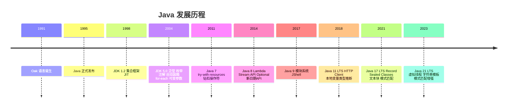
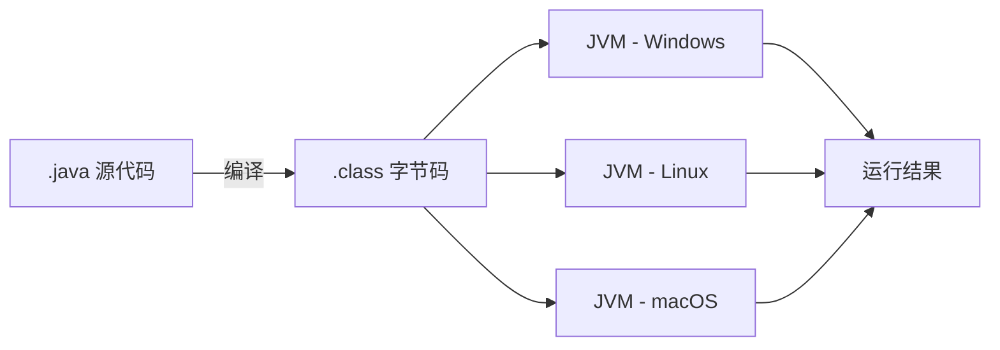
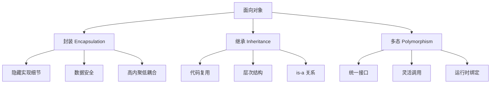
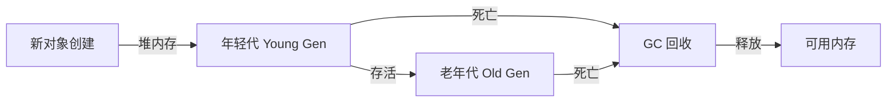
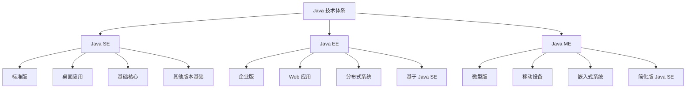
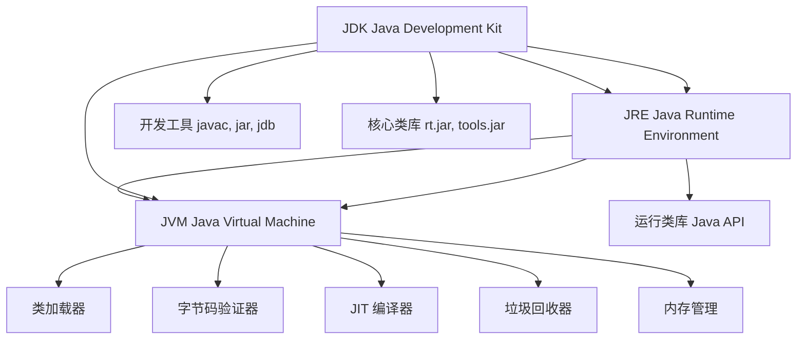
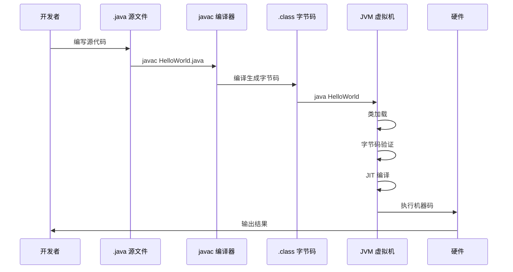
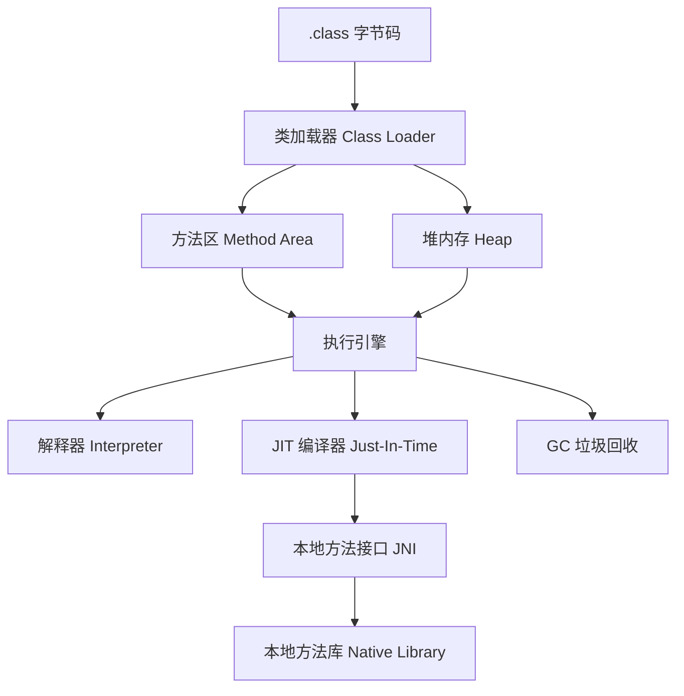
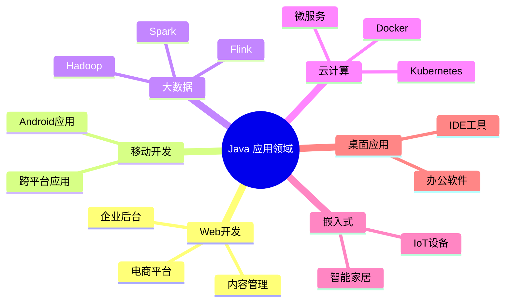

# Java 概述

Java 是一门**面向对象**的编程语言，不仅吸收了 C++ 语言的各种优点，还摒弃了 C++ 里难以理解的多继承、指针等概念。

## Java 发展史



**重要版本特性**：

::: tabs

@tab JDK 5.0 (2004)

- 泛型（Generics）
- 枚举（Enum）
- 注解（Annotation）
- 自动装箱/拆箱
- for-each 循环
- 可变参数
- 静态导入

@tab Java 8 (2014)

- Lambda 表达式
- Stream API
- Optional 类
- 新日期时间 API
- 默认方法

@tab Java 17 (2021)

- Record 类
- 模式匹配
- Sealed Classes
- 文本块
- 增强 Switch

@tab Java 21+ (2023)

- 虚拟线程
- 字符串模板
- 模式匹配增强
- 作用域值
- 结构化并发

:::

## Java 主要特点

::: tabs

@tab 跨平台性

**Write Once, Run Anywhere**（一次编写，到处运行）

Java 通过 **JVM（Java 虚拟机）** 实现跨平台：



::: tip 核心机制
- **源代码** (.java) → **编译器** → **字节码** (.class)
- **字节码** → **JVM** → **机器码** → **执行**
:::

@tab 面向对象

Java 是纯面向对象语言，三大核心特性：



@tab 自动内存管理

**GC（Garbage Collection）垃圾回收机制**



::: tip GC 优势
- **自动回收**：无需手动释放内存
- **防止内存泄漏**：自动检测无用对象
- **提高开发效率**：专注于业务逻辑
:::

@tab 健壮性

Java 设计注重**安全性**和**稳定性**：

| 特性 | 说明 |
|------|------|
| **强类型检查** | 编译时检测类型错误 |
| **数组边界检查** | 自动检测数组越界 |
| **无指针操作** | 避免内存非法访问 |
| **异常处理机制** | 优雅处理运行时错误 |
| **自动垃圾回收** | 防止内存泄漏 |

@tab 多线程

**内置多线程支持**

```java
// 创建线程的多种方式
// 1. 继承 Thread 类
class MyThread extends Thread {
    public void run() {
        // 线程执行代码
    }
}

// 2. 实现 Runnable 接口
class MyRunnable implements Runnable {
    public void run() {
        // 线程执行代码
    }
}
```

:::

## Java 技术体系

Java 平台包含三个主要版本：



### Java SE（Java Standard Edition）

**标准版**，是 Java 技术的核心和基础：

| 内容 | 说明 |
|------|------|
| **核心语法** | 基本数据类型、运算符、流程控制 |
| **面向对象** | 类、对象、继承、多态、接口 |
| **核心类库** | 集合、IO、线程、网络编程 |
| **基础 API** | String、Math、日期时间等 |

**应用场景**：桌面应用程序、基础框架开发

### Java EE（Java Enterprise Edition）

**企业版**，用于构建企业级应用：

| 内容 | 说明 |
|------|------|
| **Web 开发** | Servlet、JSP |
| **框架技术** | Spring、Spring Boot、MyBatis |
| **分布式** | Web Services、RESTful API |
| **消息队列** | JMS |
| **事务管理** | JTA |

**应用场景**：企业级后端系统、大型网站、微服务

### Java ME（Java Micro Edition）

**微型版**，用于嵌入式和移动设备：

::: info 当前状态
Java ME 已逐渐被 **Android**（基于 Java 但非 Java ME）和其他技术取代
:::

## JDK vs JRE vs JVM



| 组件 | 全称 | 说明 |
|------|------|------|
| **JDK** | Java Development Kit | Java 开发工具包，**包含 JRE** |
| **JRE** | Java Runtime Environment | Java 运行环境，**包含 JVM** |
| **JVM** | Java Virtual Machine | Java 虚拟机，**核心运行引擎** |

::: tip 选择建议
- **开发 Java 程序**：安装 JDK
- **仅运行 Java 程序**：安装 JRE
- **学习 Java**：安装 JDK
:::

## Java 运行机制

### 编译与执行流程



### JVM 工作原理



| 组件 | 功能 |
|------|------|
| **类加载器** | 负责加载 .class 文件到内存 |
| **方法区** | 存储类信息、常量、静态变量 |
| **堆内存** | 存储对象实例 |
| **栈内存** | 存储方法调用和局部变量 |
| **程序计数器** | 记录当前执行的字节码位置 |
| **本地方法栈** | 为 native 方法服务 |

## Java 应用领域



## 为什么选择 Java？

::: tabs

@tab 优势

| 优势 | 说明 |
|------|------|
| :hexagon-badge: **跨平台** | 一次编写，到处运行 |
| :dizzy: **面向对象** | 代码结构清晰，易于维护 |
| :shield-check: **安全性** | 内置安全机制，防止恶意代码 |
| :battery-charging: **高性能** | JIT 编译器优化执行效率 |
| :robot: **自动化** | GC 自动管理内存 |
| :team: **生态丰富** | 海量开源库和框架 |
| :line-clamp: **多线程** | 内置并发支持 |
| :scale: **可扩展** | 适用于从小型到大型的项目 |

@tab 劣势

| 劣势 | 说明 |
|------|------|
| :hourglass: **启动较慢** | JVM 需要初始化 |
| :memory: **内存占用** | 相对 C/C++ 更高 |
| :chart-line: **执行速度** | 略低于编译型语言 |
| :file-code: **代码冗长** | 语法相对繁琐 |

:::

## 小结

::: tip 核心要点

1. **Java 是一门面向对象的编程语言**
2. **核心特点**：跨平台、面向对象、自动内存管理、健壮性、多线程
3. **技术体系**：Java SE（标准版）、Java EE（企业版）、Java ME（微型版）
4. **运行机制**：源代码 → 字节码 → JVM → 机器码
5. **三大组件**：JDK（开发工具包）、JRE（运行环境）、JVM（虚拟机）

:::

::: info 下一步
- [JDK 安装配置](/java/base/00-overview/jdk-install.md) - 搭建开发环境
- [Hello World](/java/base/00-overview/hello-world.md) - 编写第一个 Java 程序
:::
