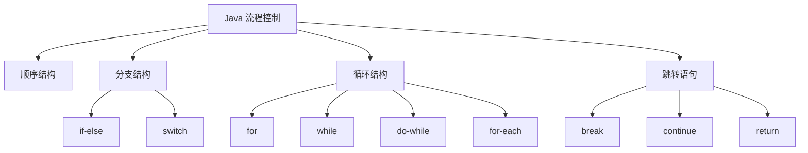
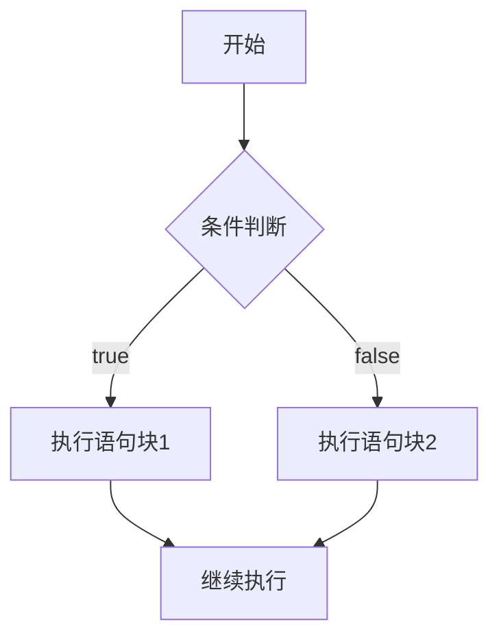
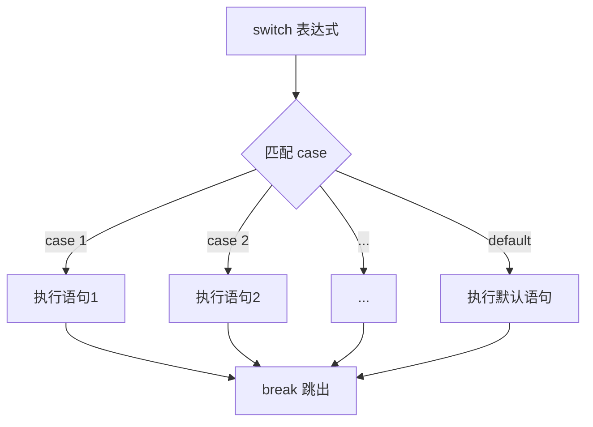
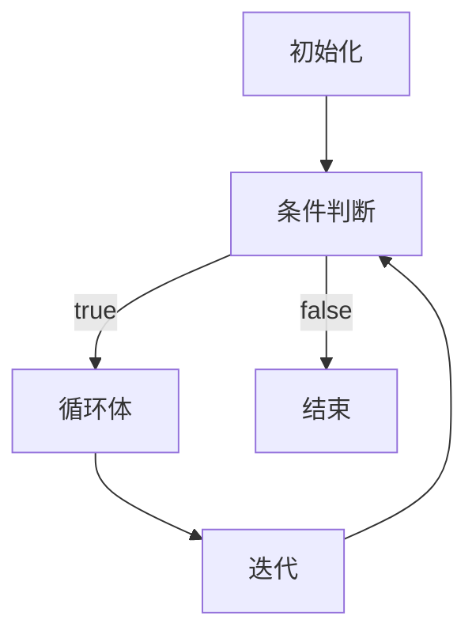
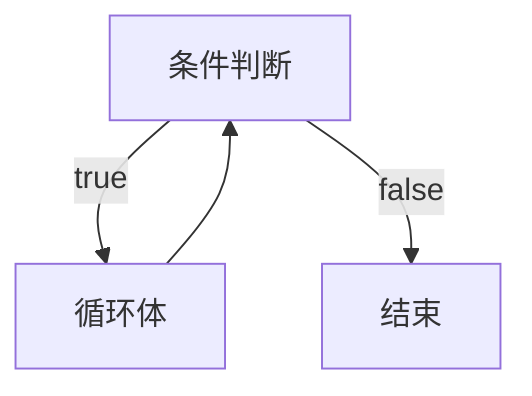
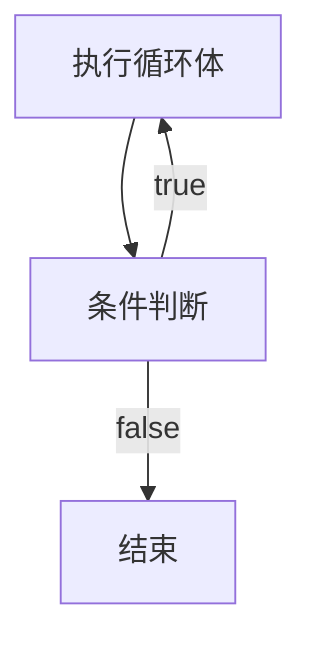
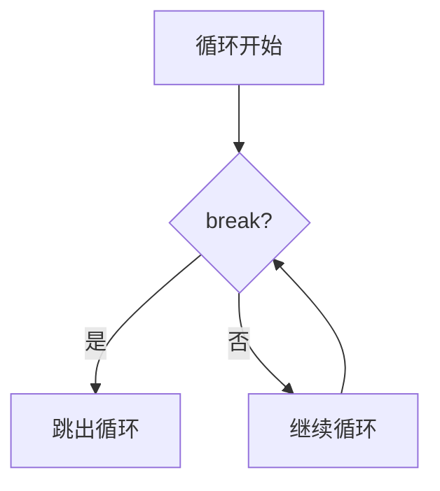
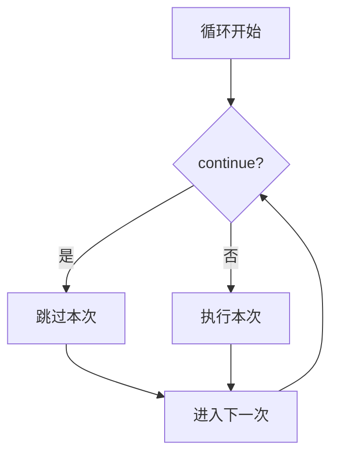

# 流程控制

流程控制语句用于控制程序的执行顺序，Java 提供了多种流程控制结构。

## 流程控制分类



## 顺序结构

顺序结构是程序**默认的执行方式**，从上到下依次执行：

```java
public class SequentialDemo {
    public static void main(String[] args) {
        // 顺序执行
        System.out.println("第一步");
        System.out.println("第二步");
        System.out.println("第三步");
        
        // 变量声明与使用
        int a = 10;
        int b = 20;
        int sum = a + b;
        System.out.println("和：" + sum);
    }
}
```

## 分支结构

### if-else 语句



#### 基本 if 语句

```java
// 单分支 if
if (条件) {
    // 条件为 true 时执行
}

// 双分支 if-else
if (条件) {
    // 条件为 true 时执行
} else {
    // 条件为 false 时执行
}

// 多分支 if-else if-else
if (条件1) {
    // 条件1为 true 时执行
} else if (条件2) {
    // 条件2为 true 时执行
} else {
    // 所有条件都为 false 时执行
}
```

#### 使用示例

```java
public class IfElseDemo {
    public static void main(String[] args) {
        int score = 85;
        
        // 单分支
        if (score >= 60) {
            System.out.println("及格");
        }
        
        // 双分支
        if (score >= 60) {
            System.out.println("及格");
        } else {
            System.out.println("不及格");
        }
        
        // 多分支
        if (score >= 90) {
            System.out.println("优秀");
        } else if (score >= 80) {
            System.out.println("良好");
        } else if (score >= 70) {
            System.out.println("中等");
        } else if (score >= 60) {
            System.out.println("及格");
        } else {
            System.out.println("不及格");
        }
        
        // 嵌套 if
        if (score >= 60) {
            if (score >= 80) {
                System.out.println("及格且优秀");
            } else {
                System.out.println("及格但一般");
            }
        }
    }
}
```

::: tip if 语句注意事项

```java
// 省略大括号（只执行第一条语句）
if (score >= 60)
    System.out.println("及格");
    System.out.println("恭喜");  // ⚠️ 无论条件是否成立都会执行

// 推荐始终使用大括号
if (score >= 60) {
    System.out.println("及格");
    System.out.println("恭喜");
}
```

:::

### switch 语句

switch 语句用于**多值匹配**，Java 14 后支持新语法。



#### 传统语法

```java
switch (表达式) {
    case 值1:
        // 语句
        break;
    case 值2:
        // 语句
        break;
    // ...
    default:
        // 默认语句
        break;
}
```

#### 使用示例

```java
public class SwitchDemo {
    public static void main(String[] args) {
        int day = 3;
        
        // 传统 switch
        switch (day) {
            case 1:
                System.out.println("星期一");
                break;
            case 2:
                System.out.println("星期二");
                break;
            case 3:
                System.out.println("星期三");
                break;
            case 4:
                System.out.println("星期四");
                break;
            case 5:
                System.out.println("星期五");
                break;
            case 6:
                System.out.println("星期六");
                break;
            case 7:
                System.out.println("星期日");
                break;
            default:
                System.out.println("无效的星期");
                break;
        }
        
        // 穿透效果（不加 break）
        int month = 3;
        switch (month) {
            case 1:
            case 2:
            case 3:
                System.out.println("第一季度");
                break;
            case 4:
            case 5:
            case 6:
                System.out.println("第二季度");
                break;
            // ...
        }
    }
}
```

#### 新语法（Java 14+）

```java
// Java 14+ 新语法（箭头语法）
int day = 3;
String result = switch (day) {
    case 1 -> "星期一";
    case 2 -> "星期二";
    case 3 -> "星期三";
    case 4 -> "星期四";
    case 5 -> "星期五";
    case 6 -> "星期六";
    case 7 -> "星期日";
    default -> "无效的星期";
};
System.out.println(result);

// 多语句使用 yield
String result2 = switch (day) {
    case 1, 2, 3 -> {
        System.out.println("工作日");
        yield "第一季度";
    }
    case 4, 5, 6 -> {
        System.out.println("工作日");
        yield "第二季度";
    }
    default -> "无效";
};
```

#### switch 支持的类型

| 类型 | 支持版本 |
|------|----------|
| `byte`, `short`, `char`, `int` | 所有版本 |
| `enum`（枚举） | Java 5+ |
| `String` | Java 7+ |
| 包装类 `Byte`, `Short`, `Character`, `Integer` | Java 5+ |

```java
// String 类型
String season = "春";
switch (season) {
    case "春":
        System.out.println("春暖花开");
        break;
    case "夏":
        System.out.println("夏日炎炎");
        break;
    // ...
}

// enum 类型
enum Day { MONDAY, TUESDAY, WEDNESDAY, THURSDAY, FRIDAY, SATURDAY, SUNDAY }

Day today = Day.MONDAY;
switch (today) {
    case MONDAY:
    case TUESDAY:
        System.out.println("工作日");
        break;
    case SATURDAY:
    case SUNDAY:
        System.out.println("周末");
        break;
}
```

::: tip switch vs if-else

| 场景 | 推荐使用 |
|------|----------|
| 等值判断（离散值） | switch |
| 范围判断 | if-else |
| 复杂条件 | if-else |
| 可读性优先 | switch（新语法）|

:::

## 循环结构

### for 循环



#### 标准 for 循环

```java
for (初始化; 条件; 迭代) {
    // 循环体
}
```

#### 使用示例

```java
public class ForDemo {
    public static void main(String[] args) {
        // 基本循环
        for (int i = 1; i <= 10; i++) {
            System.out.println("第 " + i + " 次循环");
        }
        
        // 嵌套循环（九九乘法表）
        for (int i = 1; i <= 9; i++) {
            for (int j = 1; j <= i; j++) {
                System.out.print(j + "×" + i + "=" + (i*j) + "\t");
            }
            System.out.println();
        }
        
        // 多个变量
        for (int i = 0, j = 10; i < j; i++, j--) {
            System.out.println("i=" + i + ", j=" + j);
        }
        
        // 省略部分表达式（无限循环）
        // for (;;) {  // 相当于 while (true)
        //     System.out.println("无限循环");
        // }
        
        // 增强版 for 循环（for-each）
        int[] arr = {1, 2, 3, 4, 5};
        for (int num : arr) {
            System.out.println(num);
        }
    }
}
```

### while 循环



#### 使用示例

```java
public class WhileDemo {
    public static void main(String[] args) {
        // while 循环
        int i = 1;
        while (i <= 10) {
            System.out.println("第 " + i + " 次循环");
            i++;
        }
        
        // 计算阶乘
        int n = 5;
        int factorial = 1;
        while (n > 0) {
            factorial *= n;
            n--;
        }
        System.out.println("阶乘：" + factorial);
        
        // 读取输入直到满足条件
        // Scanner scanner = new Scanner(System.in);
        // String input;
        // while (!(input = scanner.nextLine()).equals("quit")) {
        //     System.out.println("输入：" + input);
        // }
    }
}
```

### do-while 循环



#### 使用示例

```java
public class DoWhileDemo {
    public static void main(String[] args) {
        // do-while 循环（至少执行一次）
        int i = 1;
        do {
            System.out.println("第 " + i + " 次循环");
            i++;
        } while (i <= 10);
        
        // 典型应用：输入验证
        Scanner scanner = new Scanner(System.in);
        int number;
        do {
            System.out.print("请输入一个正整数：");
            number = scanner.nextInt();
        } while (number <= 0);
        System.out.println("输入的正整数是：" + number);
    }
}
```

::: tip while vs do-while

| 特性 | while | do-while |
|------|-------|----------|
| 执行次数 | 可能 0 次 | 至少 1 次 |
| 条件位置 | 先判断后执行 | 先执行后判断 |
| 使用场景 | 一般情况 | 需要至少执行一次 |

:::

### for-each 循环

for-each 是 Java 5 引入的增强型 for 循环，用于遍历数组和集合。

```java
// 语法
for (元素类型 变量名 : 集合/数组) {
    // 使用变量
}
```

```java
public class ForEachDemo {
    public static void main(String[] args) {
        // 遍历数组
        int[] numbers = {1, 2, 3, 4, 5};
        for (int num : numbers) {
            System.out.println(num);
        }
        
        // 遍历集合
        List<String> names = Arrays.asList("张三", "李四", "王五");
        for (String name : names) {
            System.out.println(name);
        }
        
        // ⚠️ 局限性：无法访问索引
        int[] arr = {10, 20, 30, 40, 50};
        // 需要索引时使用标准 for
        for (int i = 0; i < arr.length; i++) {
            if (i % 2 == 0) {
                System.out.println("偶数索引：" + arr[i]);
            }
        }
    }
}
```

## 跳转语句

### break 语句

break 用于**跳出循环**或 **switch 语句**。



```java
public class BreakDemo {
    public static void main(String[] args) {
        // 跳出单层循环
        for (int i = 1; i <= 10; i++) {
            if (i == 5) {
                break;  // 跳出循环
            }
            System.out.println(i);  // 输出：1 2 3 4
        }
        
        // 跳出嵌套循环（使用标签）
        outer:
        for (int i = 1; i <= 3; i++) {
            for (int j = 1; j <= 3; j++) {
                if (i == 2 && j == 2) {
                    break outer;  // 跳出外层循环
                }
                System.out.println("i=" + i + ", j=" + j);
            }
        }
        // 输出：
        // i=1, j=1
        // i=1, j=2
        // i=1, j=3
        // i=2, j=1
        
        // 查找第一个匹配元素
        int[] arr = {10, 20, 30, 40, 50};
        int target = 30;
        int index = -1;
        for (int i = 0; i < arr.length; i++) {
            if (arr[i] == target) {
                index = i;
                break;  // 找到后立即跳出
            }
        }
        System.out.println("索引：" + index);  // 2
    }
}
```

### continue 语句

continue 用于**跳过本次循环**，继续下一次循环。



```java
public class ContinueDemo {
    public static void main(String[] args) {
        // 跳过偶数，只输出奇数
        for (int i = 1; i <= 10; i++) {
            if (i % 2 == 0) {
                continue;  // 跳过本次循环
            }
            System.out.println(i);  // 输出：1 3 5 7 9
        }
        
        // 过滤数据
        int[] scores = {85, 90, 78, 92, 88, 76};
        for (int score : scores) {
            if (score < 80) {
                continue;  // 跳过低分
            }
            System.out.println("优秀：" + score);
        }
        // 输出：
        // 优秀：85
        // 优秀：90
        // 优秀：92
        // 优秀：88
        
        // 带标签的 continue
        outer:
        for (int i = 1; i <= 3; i++) {
            for (int j = 1; j <= 3; j++) {
                if (j == 2) {
                    continue outer;  // 跳过外层循环的本次
                }
                System.out.println("i=" + i + ", j=" + j);
            }
        }
        // 输出：
        // i=1, j=1
        // i=2, j=1
        // i=3, j=1
    }
}
```

### return 语句

return 用于**退出方法**，并可返回值。

```java
public class ReturnDemo {
    public static void main(String[] args) {
        // 返回值
        int result = add(10, 20);
        System.out.println("结果：" + result);
        
        // 提前返回
        printNumber(5);
        printNumber(-3);
    }
    
    // 带返回值
    public static int add(int a, int b) {
        return a + b;
    }
    
    // void 类型可单独使用 return
    public static void printNumber(int num) {
        if (num < 0) {
            System.out.println("数字不能为负");
            return;  // 提前退出方法
        }
        System.out.println("数字：" + num);
    }
}
```

## 常见循环模式

### 计数器循环

```java
// 正序
for (int i = 0; i < n; i++) { }

// 逆序
for (int i = n - 1; i >= 0; i--) { }

// 步长
for (int i = 0; i < n; i += 2) { }
```

### 累加累乘

```java
// 累加
int sum = 0;
for (int i = 1; i <= 100; i++) {
    sum += i;
}

// 累乘（阶乘）
int factorial = 1;
for (int i = 1; i <= n; i++) {
    factorial *= i;
}
```

### 嵌套循环

```java
// 矩形
for (int i = 0; i < 5; i++) {
    for (int j = 0; j < 10; j++) {
        System.out.print("*");
    }
    System.out.println();
}

// 直角三角形
for (int i = 1; i <= 5; i++) {
    for (int j = 1; j <= i; j++) {
        System.out.print("*");
    }
    System.out.println();
}
```

## 小结

::: tip 核心要点

1. **顺序结构**：默认执行方式，从上到下
2. **分支结构**：if-else（条件判断）、switch（多值匹配）
3. **循环结构**：for（已知次数）、while（不确定次数）、do-while（至少执行一次）
4. **跳转语句**：break（跳出）、continue（跳过本次）、return（返回）

:::

::: info 下一步
- [关键字](/java/base/01-syntax/keywords.md) - 学习 Java 关键字
:::
