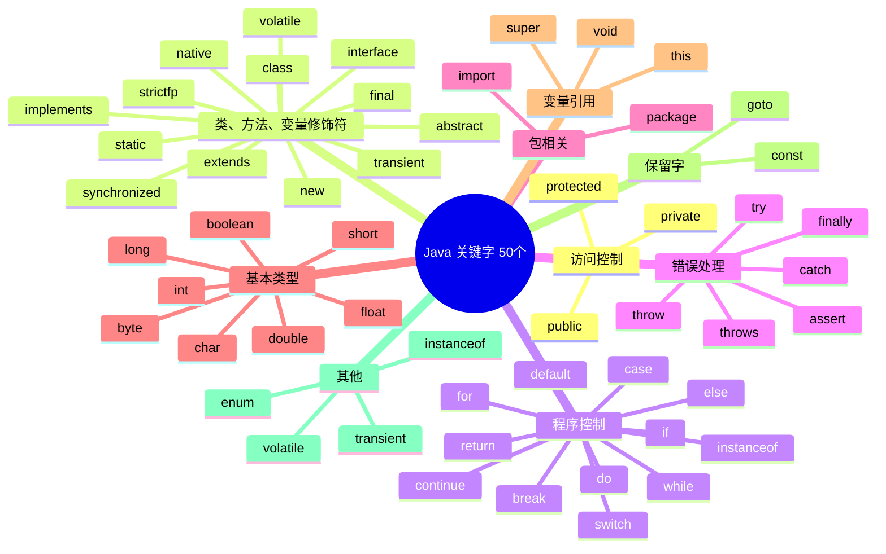
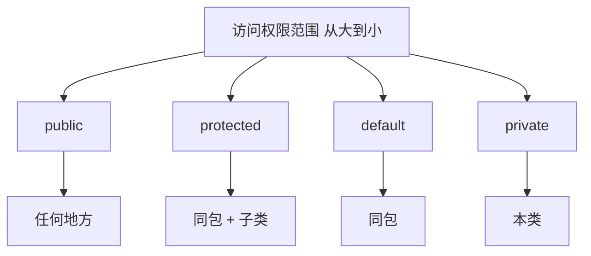
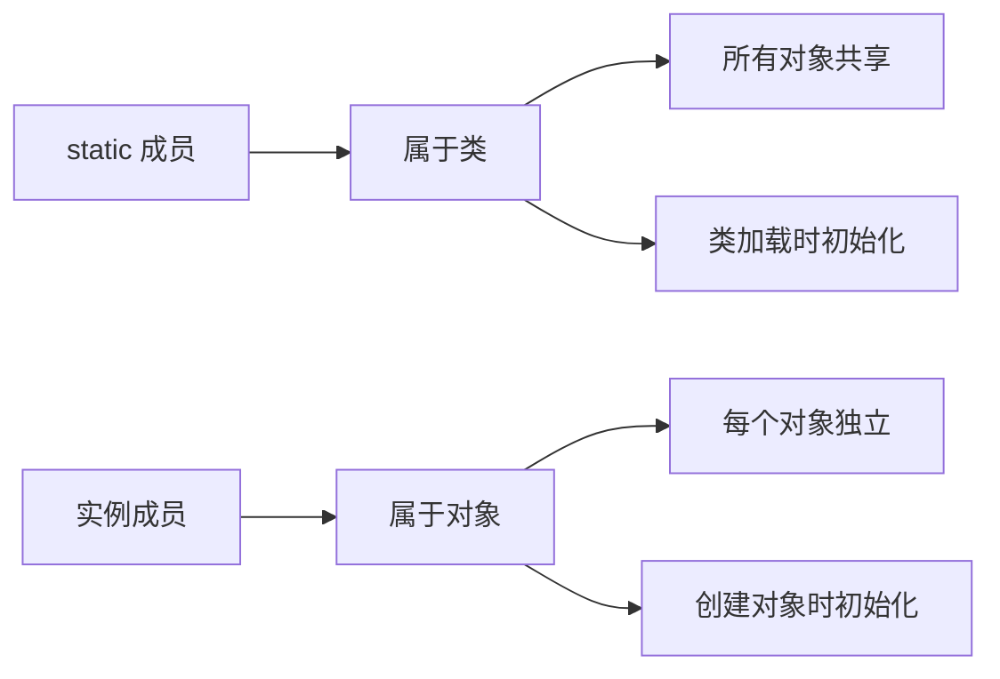
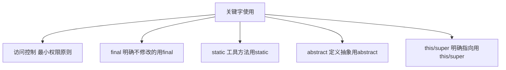

# 关键字

Java 关键字是 Java 语言中**具有特殊含义**的保留单词，不能用作标识符（变量名、方法名、类名等）。

## 关键字概览



## 关键字分类

### 访问控制修饰符

| 关键字 | 含义 | 可修饰 | 使用范围 |
|--------|------|--------|----------|
| **public** | 公开的 | 类、方法、变量 | 所有地方 |
| **protected** | 受保护的 | 方法、变量 | 同包、不同包的子类 |
| **private** | 私有的 | 方法、变量 | 本类内部 |
| **default** | 默认的 | 类、方法、变量 | 同包内 |

```java
public class AccessDemo {
    // private: 只能在本类访问
    private int privateVar = 1;
    
    // default (package-private): 同包内可访问
    int defaultVar = 2;
    
    // protected: 同包或不同包的子类可访问
    protected int protectedVar = 3;
    
    // public: 任何地方都可访问
    public int publicVar = 4;
    
    public void demo() {
        // 本类中都可以访问
        System.out.println(privateVar);
        System.out.println(defaultVar);
        System.out.println(protectedVar);
        System.out.println(publicVar);
    }
}
```



### 类、方法、变量修饰符

| 关键字 | 含义 | 可修饰 |
|--------|------|--------|
| **abstract** | 抽象的 | 类、方法 |
| **class** | 类 | - |
| **extends** | 继承 | 类 |
| **final** | 最终的 | 类、方法、变量 |
| **implements** | 实现 | 类 |
| **interface** | 接口 | - |
| **new** | 创建对象 | - |
| **static** | 静态的 | 方法、变量、代码块 |
| **synchronized** | 同步的 | 方法、代码块 |

#### abstract（抽象）

```java
// 抽象类
public abstract class Animal {
    // 抽象方法（没有方法体）
    public abstract void makeSound();
    
    // 具体方法
    public void sleep() {
        System.out.println("睡觉");
    }
}

// 子类必须实现抽象方法
public class Dog extends Animal {
    @Override
    public void makeSound() {
        System.out.println("汪汪");
    }
}
```

#### final（最终）

```java
// final 类：不能被继承
public final class MathUtil {
    // final 方法：不能被重写
    public final int add(int a, int b) {
        return a + b;
    }
}

// final 变量：值不能改变（常量）
public class FinalDemo {
    final int MAX_VALUE = 100;  // 常量
    
    void method() {
        // MAX_VALUE = 200;  // ❌ 编译错误
    }
}
```

#### static（静态）

```java
public class StaticDemo {
    // 静态变量（类变量）
    public static int count = 0;
    
    // 实例变量
    public int instanceVar = 0;
    
    // 静态代码块（类加载时执行）
    static {
        System.out.println("静态代码块");
    }
    
    // 静态方法
    public static void staticMethod() {
        System.out.println("静态方法");
        // 只能访问静态成员
        System.out.println(count);
        // System.out.println(instanceVar);  // ❌ 错误
    }
    
    // 实例方法
    public void instanceMethod() {
        // 可以访问静态和实例成员
        System.out.println(count);
        System.out.println(instanceVar);
    }
}

// 使用
StaticDemo.count = 10;        // 类名.静态变量
StaticDemo.staticMethod();    // 类名.静态方法
```



### 程序控制关键字

已在 [流程控制](/java/base/01-syntax/control-flow.md) 中详细介绍。

| 关键字 | 用途 |
|--------|------|
| **if**, **else** | 条件判断 |
| **switch**, **case**, **default** | 多路分支 |
| **for**, **while**, **do** | 循环 |
| **break**, **continue** | 跳转控制 |
| **return** | 返回 |

### 数据类型关键字

| 关键字 | 类型 | 说明 |
|--------|------|------|
| **byte** | 整数型 | 1 字节 |
| **short** | 整数型 | 2 字节 |
| **int** | 整数型 | 4 字节 |
| **long** | 整数型 | 8 字节 |
| **float** | 浮点型 | 4 字节 |
| **double** | 浮点型 | 8 字节 |
| **char** | 字符型 | 2 字节 |
| **boolean** | 布尔型 | true/false |
| **void** | 无类型 | 表示无返回值 |

已在 [变量与数据类型](/java/base/01-syntax/variables.md) 中详细介绍。

### 对象相关关键字

#### this

```java
public class ThisDemo {
    private String name;
    private int age;
    
    // this 引用当前对象
    public ThisDemo(String name, int age) {
        this.name = name;   // this.name 是成员变量
        this.age = age;     // age 是参数
    }
    
    // this 调用其他构造方法
    public ThisDemo() {
        this("未知", 0);    // 必须是第一行
    }
    
    // this 返回当前对象
    public ThisDemo setName(String name) {
        this.name = name;
        return this;       // 链式调用
    }
    
    // this 作为参数传递
    public void printInfo() {
        Helper.print(this); // 传递当前对象
    }
}
```

#### super

```java
class Animal {
    String name = "动物";
    
    public void eat() {
        System.out.println("动物进食");
    }
}

class Dog extends Animal {
    String name = "狗";
    
    @Override
    public void eat() {
        System.out.println("狗吃骨头");
    }
    
    public void demo() {
        // super 访问父类成员
        System.out.println(super.name);  // 动物
        super.eat();                      // 动物进食
        
        // this 访问本类成员
        System.out.println(this.name);   // 狗
        this.eat();                       // 狗吃骨头
    }
    
    // super 调用父类构造方法
    public Dog() {
        super();  // 必须是第一行
    }
}
```

#### instanceof

```java
// instanceof 判断对象是否是某个类的实例
Object obj = "Hello";

if (obj instanceof String) {
    String str = (String) obj;  // 安全转换
    System.out.println(str.toUpperCase());
}

// 模式匹配（Java 16+）
if (obj instanceof String str) {
    // str 已经是 String 类型，无需强制转换
    System.out.println(str.toUpperCase());
}
```

#### new

```java
// new 创建对象实例
String str = new String("Hello");
int[] arr = new int[10];
List<String> list = new ArrayList<>();
```

### 异常处理关键字

| 关键字 | 用途 |
|--------|------|
| **try** | 可能发生异常的代码块 |
| **catch** | 捕获并处理异常 |
| **finally** | 无论是否异常都执行 |
| **throw** | 抛出异常 |
| **throws** | 声明可能抛出的异常 |

```java
public class ExceptionDemo {
    // throws 声明可能抛出的异常
    public static void divide(int a, int b) throws ArithmeticException {
        if (b == 0) {
            // throw 手动抛出异常
            throw new ArithmeticException("除数不能为0");
        }
        System.out.println(a / b);
    }
    
    public static void main(String[] args) {
        try {
            divide(10, 0);
        } catch (ArithmeticException e) {
            // catch 捕获并处理异常
            System.out.println("捕获异常：" + e.getMessage());
        } finally {
            // finally 无论如何都会执行
            System.out.println("finally 块");
        }
    }
}
```

### 包相关关键字

```java
// package 声明包
package com.example.demo;

// import 导入类
import java.util.List;
import java.util.ArrayList;

// 导入静态成员
import static java.lang.Math.*;
```

### 其他关键字

#### enum（枚举）

```java
// 定义枚举
enum Day {
    MONDAY, TUESDAY, WEDNESDAY, 
    THURSDAY, FRIDAY, SATURDAY, SUNDAY
}

// 使用
Day today = Day.MONDAY;
System.out.println(today);  // MONDAY

// 带方法的枚举
enum Season {
    SPRING("春"), SUMMER("夏"), 
    AUTUMN("秋"), WINTER("冬");
    
    private String chinese;
    
    Season(String chinese) {
        this.chinese = chinese;
    }
    
    public String getChinese() {
        return chinese;
    }
}
```

#### transient

```java
// transient 标记不需要序列化的字段
public class User implements Serializable {
    private String username;
    private transient String password;  // 密码不序列化
}
```

#### volatile

```java
// volatile 保证变量的可见性和有序性
public class VolatileDemo {
    private volatile boolean flag = false;
    
    public void stop() {
        flag = true;
    }
    
    public void run() {
        while (!flag) {
            // 执行任务
        }
    }
}
```

#### strictfp

```java
// strictfp 确保浮点运算精度一致
public strictfp class StrictfpDemo {
    public float calculate() {
        return 0.1f + 0.2f;
    }
}
```

#### native

```java
// native 声明本地方法（用其他语言实现）
public class NativeDemo {
    // 声明本地方法
    public native void nativeMethod();
    
    static {
        // 加载本地库
        System.loadLibrary("nativeLib");
    }
}
```

#### assert（断言）

```java
// assert 断言（默认禁用，需 -ea 参数启用）
public class AssertDemo {
    public static void main(String[] args) {
        int age = 18;
        
        // 断言 age 大于 0
        assert age > 0 : "年龄必须大于0";
        
        // 如果断言失败，抛出 AssertionError
        System.out.println("年龄：" + age);
    }
}
```

## 保留字

| 保留字 | 说明 |
|--------|------|
| **goto** | 未使用，保留 |
| **const** | 未使用，使用 final 代替 |

::: warning 注意
保留字虽然目前未使用，但也不能作为标识符使用。
:::

## 关键字使用建议



::: tip 最佳实践

1. **访问控制**：优先使用 `private`，最小权限原则
2. **常量**：使用 `final` 定义常量
3. **工具方法**：使用 `static` 定义工具方法
4. **继承**：谨慎使用 `final` 阻止继承
5. **线程安全**：多线程考虑 `volatile` 和 `synchronized`

:::

## 小结

::: tip 核心要点

1. **关键字总数**：50 个关键字 + 2 个保留字
2. **分类**：访问控制、修饰符、程序控制、数据类型、异常处理等
3. **使用原则**：明确语义，合理使用
4. **注意事项**：关键字不能作为标识符

:::

::: info 下一步
- [类与对象](/java/base/02-oop/class-object.md) - 学习面向对象基础
:::
