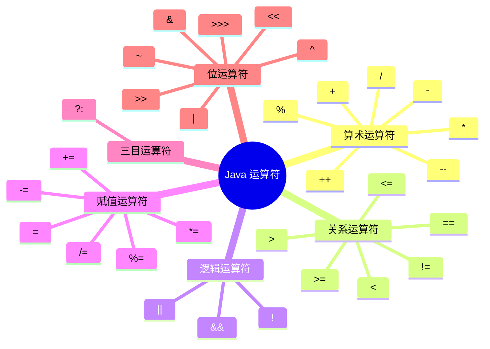
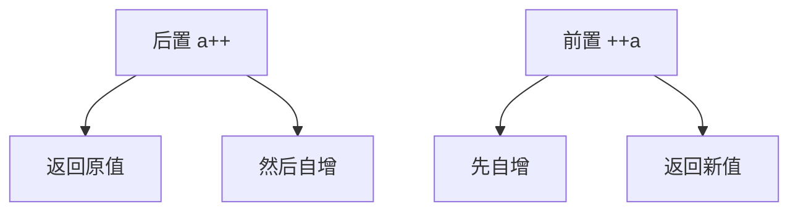
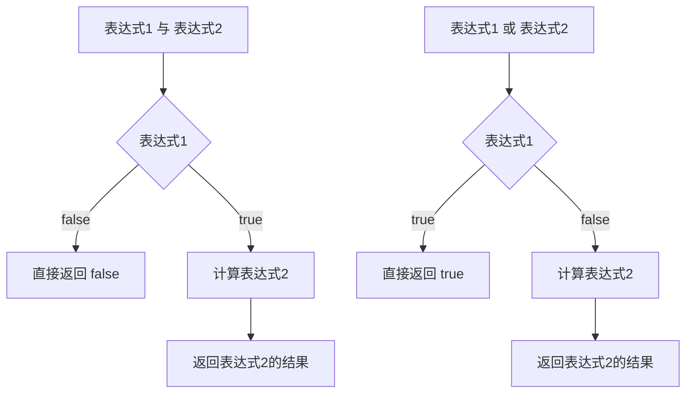
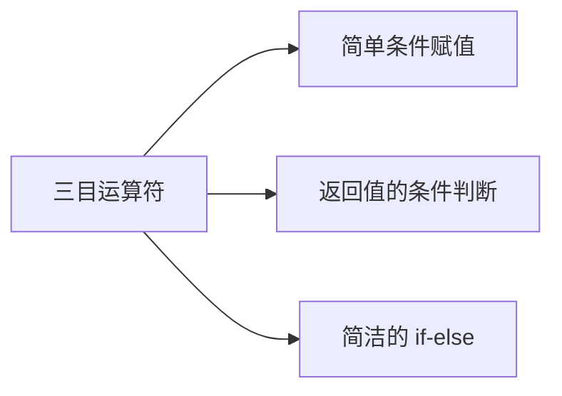
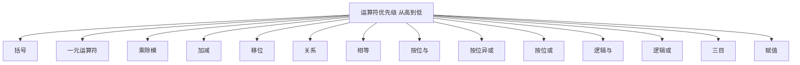

# 运算符

运算符是用于执行特定操作的符号，Java 提供了丰富的运算符。

## 运算符分类



## 算术运算符

### 基本算术运算符

| 运算符 | 描述 | 示例 | 结果 |
|--------|------|------|------|
| `+` | 加法 | `5 + 3` | 8 |
| `-` | 减法 | `5 - 3` | 2 |
| `*` | 乘法 | `5 * 3` | 15 |
| `/` | 除法 | `5 / 2` | 2 |
| `%` | 取余 | `5 % 2` | 1 |

```java
public class ArithmeticDemo {
    public static void main(String[] args) {
        int a = 10, b = 3;
        
        System.out.println(a + b);   // 13：加法
        System.out.println(a - b);   // 7：减法
        System.out.println(a * b);   // 30：乘法
        System.out.println(a / b);   // 3：除法（整数相除，舍去小数）
        System.out.println(a % b);   // 1：取余
        
        // 浮点数除法
        System.out.println(10.0 / 3);    // 3.3333...
        System.out.println(10 / 3.0);    // 3.3333...
        
        // 字符串拼接
        System.out.println("Hello" + "World");  // HelloWorld
        System.out.println("Age: " + 18);       // Age: 18
        System.out.println(1 + 2 + "abc");      // 3abc
        System.out.println("abc" + 1 + 2);      // abc12
    }
}
```

::: tip 除法注意事项

```java
// 整数除法：结果取整
int result1 = 10 / 3;      // 3（舍去小数部分）
int result2 = -10 / 3;     // -3（向零取整）

// 浮点数除法：保留小数
double result3 = 10.0 / 3;  // 3.333...
double result4 = 10 / 3.0;  // 3.333...

// 除数为零
int x = 10 / 0;   // ❌ ArithmeticException: / by zero
double y = 10.0 / 0;  // ✅ Infinity（无穷大）
```

:::

### 自增自减运算符

| 运算符 | 描述 | 示例 | 等价于 |
|--------|------|------|--------|
| `++` | 自增 | `a++` 或 `++a` | `a = a + 1` |
| `--` | 自减 | `a--` 或 `--a` | `a = a - 1` |

```java
public class IncrementDemo {
    public static void main(String[] args) {
        int a = 10;
        
        // 后置：先使用，再自增
        int b = a++;  // b = 10, a = 11
        System.out.println("b = " + b);  // 10
        System.out.println("a = " + a);  // 11
        
        // 前置：先自增，再使用
        int c = ++a;  // a = 12, c = 12
        System.out.println("c = " + c);  // 12
        System.out.println("a = " + a);  // 12
        
        // 自减同理
        int d = 20;
        int e = d--;  // e = 20, d = 19
        int f = --d;  // d = 18, f = 18
    }
}
```



::: tip 前置 vs 后置

```java
int i = 5;
int j = i++;  // 后置：j = 5, i = 6

int x = 5;
int y = ++x;  // 前置：x = 6, y = 6

// 表达式中多次使用
int n = 5;
int result = n++ + ++n;  // result = 12 (5 + 7)
// 步骤：① n++ 返回 5，n 变为 6 ② ++n 使 n 变为 7 并返回 7 ③ 5 + 7 = 12
```

:::

## 关系运算符

关系运算符用于比较两个值，返回 `boolean` 类型。

| 运算符 | 描述 | 示例 | 结果 |
|--------|------|------|------|
| `==` | 等于 | `5 == 3` | `false` |
| `!=` | 不等于 | `5 != 3` | `true` |
| `>` | 大于 | `5 > 3` | `true` |
| `<` | 小于 | `5 < 3` | `false` |
| `>=` | 大于等于 | `5 >= 5` | `true` |
| `<=` | 小于等于 | `3 <= 5` | `true` |

```java
public class RelationalDemo {
    public static void main(String[] args) {
        int a = 10, b = 20;
        
        System.out.println(a == b);  // false
        System.out.println(a != b);  // true
        System.out.println(a > b);   // false
        System.out.println(a < b);   // true
        System.out.println(a >= 10); // true
        System.out.println(b <= 20); // true
        
        // 字符比较（比较 ASCII 码）
        char c1 = 'A', c2 = 'B';
        System.out.println(c1 < c2); // true (65 < 66)
        
        // ⚠️ 字符串比较不能用 ==
        String s1 = "Hello";
        String s2 = "Hello";
        String s3 = new String("Hello");
        
        System.out.println(s1 == s2);   // true（字符串常量池）
        System.out.println(s1 == s3);   // false（不同对象）
        System.out.println(s1.equals(s3)); // true（内容相同）
    }
}
```

::: warning == 与 equals

```java
// 基本类型：比较值
int a = 10, b = 10;
System.out.println(a == b);  // true

// 引用类型：比较地址
String s1 = new String("Hello");
String s2 = new String("Hello");
System.out.println(s1 == s2);          // false（不同对象）
System.out.println(s1.equals(s2));     // true（内容相同）
```

:::

## 逻辑运算符

逻辑运算符用于连接多个条件，返回 `boolean` 类型。

| 运算符 | 描述 | 规则 | 示例 |
|--------|------|------|------|
| `&&` | 短路与 | 两个都为 `true` 才返回 `true` | `true && false` → `false` |
| `\|\|` | 短路或 | 有一个为 `true` 就返回 `true` | `true \|\| false` → `true` |
| `!` | 逻辑非 | 取反 | `!true` → `false` |
| `&` | 逻辑与 | 两个都为 `true` 才返回 `true`（不短路） | `true & false` → `false` |
| `\|` | 逻辑或 | 有一个为 `true` 就返回 `true`（不短路） | `true \|\| false` → `true` |
| `^` | 逻辑异或 | 相同为 `false`，不同为 `true` | `true ^ false` → `true` |

### 短路运算符

```java
public class LogicalDemo {
    public static void main(String[] args) {
        int a = 10, b = 20;
        
        // && 短路与：前为 false，后不执行
        boolean result1 = (a > b) && (++a > 5);
        System.out.println(result1);  // false
        System.out.println(a);        // 10（a 没有自增）
        
        // || 短路或：前为 true，后不执行
        boolean result2 = (a < b) || (++a > 5);
        System.out.println(result2);  // true
        System.out.println(a);        // 10（a 没有自增）
        
        // ! 逻辑非
        boolean flag = true;
        System.out.println(!flag);    // false
        
        // ^ 逻辑异或
        boolean x = true, y = false;
        System.out.println(x ^ y);    // true（不同）
        System.out.println(x ^ x);    // false（相同）
    }
}
```



::: tip 短路 vs 非短路

```java
// 短路运算符（推荐）
boolean result1 = (a > 5) && (b < 10);  // a>5 为 false，b<10 不执行
boolean result2 = (a > 5) || (b < 10);  // a>5 为 true，b<10 不执行

// 非短路运算符
boolean result3 = (a > 5) & (b < 10);   // 两个表达式都会执行
boolean result4 = (a > 5) | (b < 10);   // 两个表达式都会执行

// 使用场景：需要两边都执行
if (validateUser() | logAccess()) {  // 两个方法都会执行
    // ...
}
```

:::

## 赋值运算符

### 基本赋值运算符

| 运算符 | 示例 | 等价于 |
|--------|------|--------|
| `=` | `a = 10` | `a = 10` |
| `+=` | `a += 5` | `a = a + 5` |
| `-=` | `a -= 3` | `a = a - 3` |
| `*=` | `a *= 2` | `a = a * 2` |
| `/=` | `a /= 4` | `a = a / 4` |
| `%=` | `a %= 3` | `a = a % 3` |

```java
public class AssignmentDemo {
    public static void main(String[] args) {
        int a = 10;
        
        a += 5;   // a = a + 5 = 15
        a -= 3;   // a = a - 3 = 12
        a *= 2;   // a = a * 2 = 24
        a /= 4;   // a = a / 4 = 6
        a %= 3;   // a = a % 3 = 0
        
        System.out.println(a);  // 0
        
        // 类型自动转换
        byte b = 10;
        // b = b + 5;   // ❌ 编译错误：int 无法直接赋值给 byte
        b += 5;        // ✅ 相当于 b = (byte)(b + 5)
        
        // 字符串拼接
        String s = "Hello";
        s += " World";  // s = "Hello World"
    }
}
```

::: tip 复合赋值运算符的特性
复合赋值运算符（`+=`、`-=` 等）会自动进行**类型转换**。
:::

## 三目运算符

三目运算符（条件运算符）是 Java 中唯一需要三个操作数的运算符。

### 语法格式

```java
条件表达式 ? 表达式1 : 表达式2
```

- 如果条件为 `true`，返回**表达式1**
- 如果条件为 `false`，返回**表达式2**

```java
public class TernaryDemo {
    public static void main(String[] args) {
        int a = 10, b = 20;
        
        // 基本用法
        int max = (a > b) ? a : b;
        System.out.println("最大值：" + max);  // 20
        
        // 嵌套使用
        int x = 5, y = 10, z = 15;
        int max2 = (x > y) ? ((x > z) ? x : z) : ((y > z) ? y : z);
        System.out.println("最大值：" + max2);  // 15
        
        // 字符串判断
        String result = (a % 2 == 0) ? "偶数" : "奇数";
        System.out.println(result);  // 偶数
        
        // 与 if-else 等价
        int min;
        if (a < b) {
            min = a;
        } else {
            min = b;
        }
        // 等价于：int min = (a < b) ? a : b;
    }
}
```

### 使用场景



```java
// 场景1：简单条件赋值
int age = 20;
String type = (age >= 18) ? "成年" : "未成年";

// 场景2：防止空指针
String name = getName();
String displayName = (name != null) ? name : "Unknown";

// 场景3：计算绝对值
int num = -10;
int abs = (num >= 0) ? num : -num;

// 场景4：求三个数的最大值
int a = 5, b = 10, c = 3;
int max = (a > b) ? ((a > c) ? a : c) : ((b > c) ? b : c);
```

::: tip 三目 vs if-else

| 场景 | 推荐使用 |
|------|----------|
| 简单的条件赋值 | 三目运算符 |
| 需要执行多条语句 | if-else |
| 条件判断较复杂 | if-else（更清晰） |
| 需要返回值 | 三目运算符 |

:::

## 位运算符

位运算符直接对整数的**二进制位**进行操作。

| 运算符 | 描述 | 示例 |
|--------|------|------|
| `&` | 按位与 | `5 & 3` → `1` |
| `\|` | 按位或 | `5 \| 3` → `7` |
| `^` | 按位异或 | `5 ^ 3` → `6` |
| `~` | 按位取反 | `~5` → `-6` |
| `<<` | 左移 | `5 << 2` → `20` |
| `>>` | 右移（带符号） | `5 >> 1` → `2` |
| `>>>` | 无符号右移 | `5 >>> 1` → `2` |

### 按位与、或、异或

```java
public class BitwiseDemo {
    public static void main(String[] args) {
        int a = 5;  // 二进制：101
        int b = 3;  // 二进制：011
        
        // 按位与 &：对应位都为 1 结果为 1
        System.out.println(a & b);  // 1 (001)
        //   101
        // & 011
        //   001
        
        // 按位或 |：对应位有一个为 1 结果为 1
        System.out.println(a | b);  // 7 (111)
        //   101
        // | 011
        //   111
        
        // 按位异或 ^：对应位不同为 1，相同为 0
        System.out.println(a ^ b);  // 6 (110)
        //   101
        // ^ 011
        //   110
        
        // 按位取反 ~：每一位取反
        System.out.println(~a);  // -6
        // ~00000000 00000000 00000000 00000101 (5)
        //  11111111 11111111 11111111 11111010 (-6)
    }
}
```

### 移位运算符

```java
public class ShiftDemo {
    public static void main(String[] args) {
        int a = 5;  // 二进制：101
        
        // 左移 <<：左边丢弃，右边补 0
        System.out.println(a << 2);  // 20
        // 00000000 00000000 00000000 00000101 (5)
        // 00000000 00000000 00000000 00010100 (20)
        // 相当于：5 * 2^2 = 20
        
        // 右移 >>：右边丢弃，左边补符号位（正数补0，负数补1）
        System.out.println(a >> 1);  // 2
        // 00000000 00000000 00000000 00000101 (5)
        // 00000000 00000000 00000000 00000010 (2)
        // 相当于：5 / 2 = 2
        
        // 无符号右移 >>>：右边丢弃，左边补 0
        System.out.println(a >>> 1); // 2
        
        // 负数的右移区别
        int b = -5;
        System.out.println(b >> 1);   // -3（有符号右移）
        System.out.println(b >>> 1);  // 2147483645（无符号右移）
    }
}
```

::: tip 移位运算的应用

```java
// 快速计算 2 的幂
int result = 1 << 10;  // 1024 (2^10)
int result2 = 1 << n;  // 2^n

// 快速乘除 2
int x = 10;
int doubled = x << 1;   // 20 (×2)
int halved = x >> 1;    // 5 (÷2)

// 判断奇偶
int num = 7;
boolean isOdd = (num & 1) == 1;  // true

// 交换两个数（不使用临时变量）
int a = 5, b = 3;
a = a ^ b;
b = a ^ b;
a = a ^ b;
// 结果：a = 3, b = 5
```

:::

## 运算符优先级



### 优先级表

| 优先级 | 运算符 | 结合性 |
|--------|--------|--------|
| 1 | `()` `[]` `.` | 从左到右 |
| 2 | `!` `~` `++` `--` | 从右到左 |
| 3 | `*` `/` `%` | 从左到右 |
| 4 | `+` `-` | 从左到右 |
| 5 | `<<` `>>` `>>>` | 从左到右 |
| 6 | `<` `<=` `>` `>=` | 从左到右 |
| 7 | `==` `!=` | 从左到右 |
| 8 | `&` | 从左到右 |
| 9 | `^` | 从左到右 |
| 10 | `\|` | 从左到右 |
| 11 | `&&` | 从左到右 |
| 12 | `\|\|` | 从左到右 |
| 13 | `?:` | 从右到左 |
| 14 | `=` `+=` `-=` 等 | 从右到左 |

```java
public class PrecedenceDemo {
    public static void main(String[] args) {
        int a = 5, b = 10, c = 15;
        
        // 优先级示例
        int result1 = a + b * c;      // 155（先乘后加）
        int result2 = (a + b) * c;    // 225（括号优先）
        
        boolean flag = true;
        int result3 = a > b ? a : c > b ? c : b;  // 嵌套三目
        
        // 复杂表达式（建议使用括号提高可读性）
        boolean result4 = a > b && c > a || flag;
        // 等价于：((a > b) && (c > a)) || flag
        
        // 自增与赋值
        int x = 5;
        int y = x++;  // y = 5, x = 6
        int z = ++x;  // x = 7, z = 7
    }
}
```

::: tip 最佳实践
**使用括号明确运算顺序**，提高代码可读性，避免依赖运算符优先级。
:::

## 小结

::: tip 核心要点

1. **算术运算符**：`+`、`-`、`*`、`/`、`%`、`++`、`--`
2. **关系运算符**：`==`、`!=`、`>`、`<`、`>=`、`<=`
3. **逻辑运算符**：`&&`、`||`、`!`（短路特性）
4. **赋值运算符**：`=`、`+=`、`-=`、`*=`、`/=`、`%=`
5. **三目运算符**：`条件 ? 表达式1 : 表达式2`
6. **位运算符**：`&`、`|`、`^`、`~`、`<<`、`>>`、`>>>`

:::

::: info 下一步
- [流程控制](/java/base/01-syntax/control-flow.md) - 学习 Java 流程控制
:::
