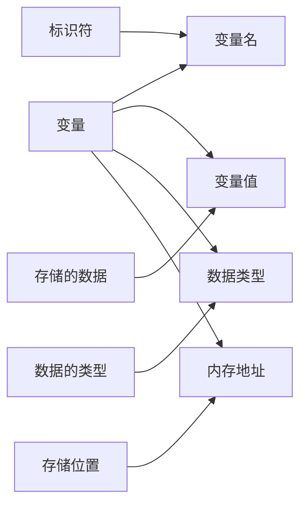
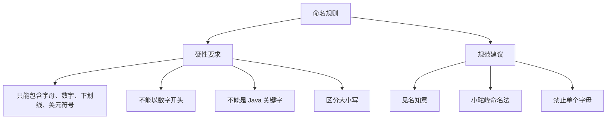
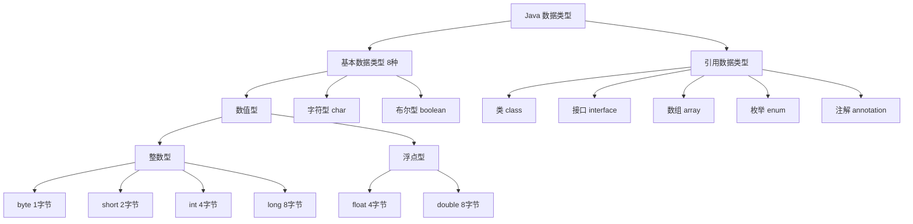
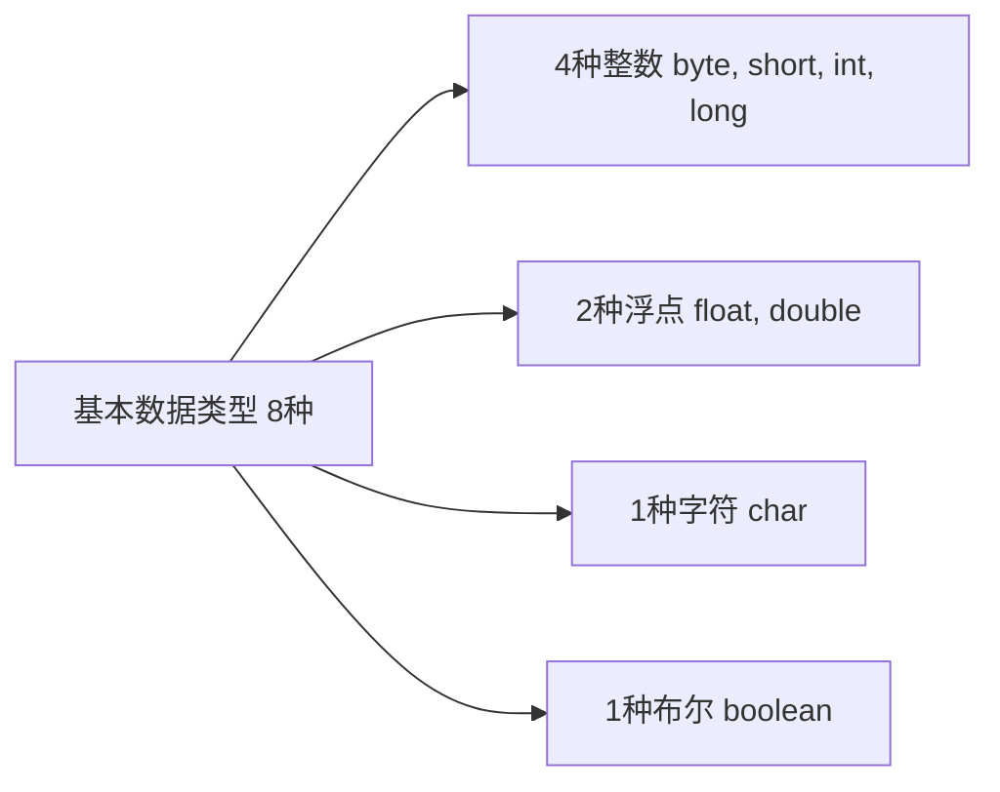
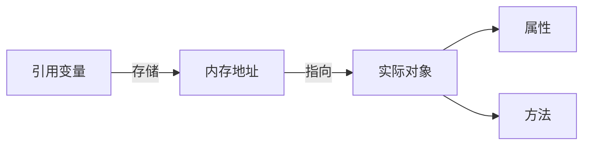
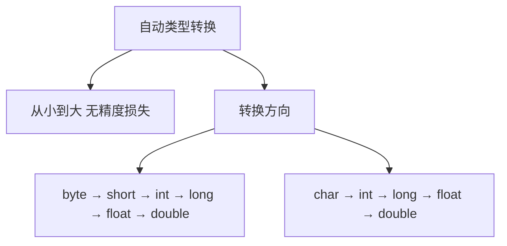
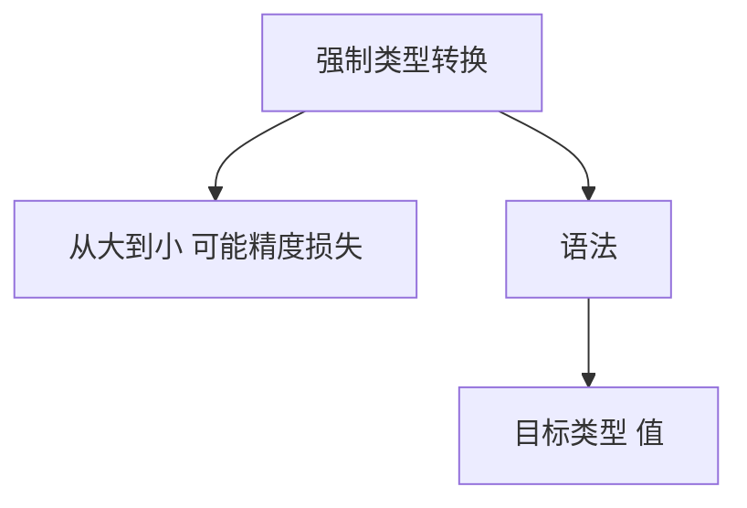
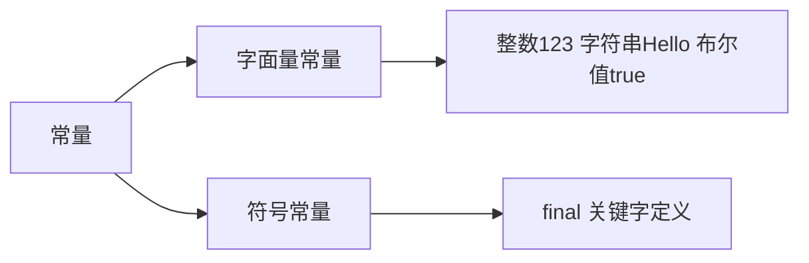
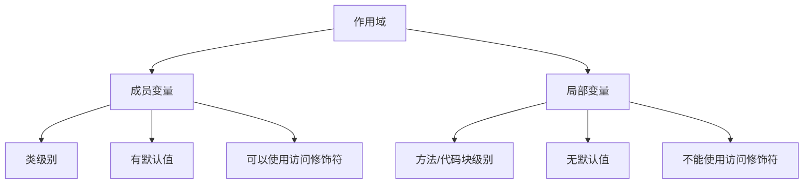

# 变量与数据类型

变量是存储数据的容器，数据类型决定了变量可以存储的数据种类。

## 变量

### 变量概念



**变量三要素**：
- **变量名**：变量的标识符
- **变量值**：存储的数据
- **数据类型**：数据的类型

### 变量声明与初始化

```java
// 声明变量
int age;
String name;

// 声明并初始化
int age = 18;
String name = "张三";

// 同时声明多个变量
int a = 10, b = 20, c = 30;

// 先声明后赋值
int x;
x = 100;
```

### 变量命名规则



::: tabs

@tab 合法命名

```java
int age;           // ✅ 合法
int _count;        // ✅ 合法
int $value;        // ✅ 合法
int user_name;     // ✅ 合法
int userName;      // ✅ 合法
```

@tab 非法命名

```java
int 1num;          // ❌ 不能以数字开头
int class;         // ❌ 不能是关键字
int user-name;     // ❌ 不能包含连字符
int user name;     // ❌ 不能包含空格
int int;           // ❌ 不能是关键字
```

@tab 命名规范

```java
// 好的命名
int studentAge = 18;           // 见名知意
String userName = "alice";     // 小驼峰
boolean isValid = true;        // 布尔类型用 is 开头
int MAX_COUNT = 100;           // 常量全大写

// 不好的命名
int a = 18;                    // ❌ 不知所云
String s = "alice";            // ❌ 太简短
boolean flag = true;           // ❌ 不够具体
```

:::

## 数据类型

### 类型体系



### 基本数据类型（8种）

#### 整数类型

| 类型 | 字节数 | 位数 | 取值范围 | 默认值 | 使用场景 |
|------|--------|------|----------|--------|----------|
| **byte** | 1 | 8 | -128 ~ 127 | 0 | 节省内存、字节数据 |
| **short** | 2 | 16 | -32768 ~ 32767 | 0 | 较少使用 |
| **int** | 4 | 32 | -2³¹ ~ 2³¹-1 | 0 | **默认整数类型** |
| **long** | 8 | 64 | -2⁶³ ~ 2⁶³-1 | 0L | 大整数 |

```java
// byte 类型
byte b = 100;
byte b2 = 127;     // ✅ 最大值
byte b3 = 128;     // ❌ 超出范围，编译错误

// short 类型
short s = 10000;

// int 类型（默认整数类型）
int i = 100;
int i2 = 1_000_000;     // 使用下划线提高可读性（Java 7+）
int i3 = 0b1010;        // 二进制（2进制）= 10
int i4 = 012;           // 八进制（8进制）= 10
int i5 = 0xA;           // 十六进制（16进制）= 10

// long 类型（需要加 L 或 l）
long l = 10000000000L;  // 必须加 L，否则当作 int 处理
long l2 = 123L;
```

::: tip 整数表示法
- **十进制**：默认，如 `123`
- **二进制**：`0b` 前缀，如 `0b1010`
- **八进制**：`0` 前缀，如 `012`
- **十六进制**：`0x` 前缀，如 `0xA`
- **下划线**：Java 7+ 支持，如 `1_000_000`
:::

#### 浮点类型

| 类型 | 字节数 | 位数 | 精度 | 默认值 | 使用场景 |
|------|--------|------|------|--------|----------|
| **float** | 4 | 32 | 单精度 | 0.0f | 较少使用、节省内存 |
| **double** | 8 | 64 | 双精度 | 0.0d | **默认浮点类型** |

```java
// float 类型（需要加 F 或 f）
float f = 3.14f;
float f2 = 3.14F;      // ✅ 必须加 F
float f3 = 3.14;       // ❌ 默认为 double，编译错误

// double 类型（默认浮点类型）
double d = 3.14;
double d2 = 3.14d;     // 可加 d，但通常省略
double d3 = 3.14D;

// 科学计数法
double e1 = 1.2e3;     // 1.2 × 10³ = 1200.0
double e2 = 1.2e-3;    // 1.2 × 10⁻³ = 0.0012

// 特殊值
double infinity = Double.POSITIVE_INFINITY;   // 正无穷
double nan = Double.NaN;                      // 非数字
```

::: warning 浮点数精度问题

```java
double d1 = 0.1 + 0.2;    // 0.30000000000000004
double d2 = 1.0 - 0.9;    // 0.09999999999999998

// 使用 BigDecimal 解决精度问题
BigDecimal bd1 = new BigDecimal("0.1");
BigDecimal bd2 = new BigDecimal("0.2");
BigDecimal sum = bd1.add(bd2);    // 0.3
```

:::

#### 字符类型

| 类型 | 字节数 | 位数 | 取值范围 | 默认值 |
|------|--------|------|----------|--------|
| **char** | 2 | 16 | 0 ~ 65535 | '\u0000' |

```java
// 字符赋值
char c1 = 'A';              // 直接赋值
char c2 = 65;               // 使用 ASCII 码
char c3 = '\u0041';         // 使用 Unicode 编码

// 特殊字符（转义字符）
char newline = '\n';        // 换行
char tab = '\t';            // 制表符
char singleQuote = '\'';    // 单引号
char doubleQuote = '\"';    // 双引号
char backslash = '\\';      // 反斜杠

// 中文字符
char chinese = '中';        // ✅ Java 使用 Unicode，支持中文
```

::: tip 常见 ASCII 码

| 字符 | ASCII 码 | 说明 |
|------|----------|------|
| '0' - '9' | 48 - 57 | 数字字符 |
| 'A' - 'Z' | 65 - 90 | 大写字母 |
| 'a' - 'z' | 97 - 122 | 小写字母 |
| 空格 | 32 | 空格字符 |

:::

#### 布尔类型

| 类型 | 字节数 | 取值 | 默认值 | 使用场景 |
|------|--------|------|--------|----------|
| **boolean** | 1 (JVM 规范未明确) | true, false | false | 逻辑判断 |

```java
boolean isTrue = true;
boolean isFalse = false;
boolean isValid = true;
boolean hasData = false;

// 用于条件判断
if (isValid) {
    // 执行代码
}
```

::: info 注意
Java 的 boolean 类型只能取 `true` 或 `false`，不能像 C/C++ 那样用 0 和非 0 表示。
:::

### 基本数据类型总结



::: tip 选择建议

| 场景 | 推荐类型 | 原因 |
|------|----------|------|
| 普通整数 | `int` | 默认类型，范围够用 |
| 大整数 | `long` | 防止溢出 |
| 节省内存 | `byte` | 数组、网络传输 |
| 普通小数 | `double` | 默认类型，精度高 |
| 字符数据 | `char` | 单个字符 |
| 逻辑判断 | `boolean` | 真假值 |

:::

### 引用数据类型

引用类型指向对象，变量存储的是对象的**内存地址**：



::: tabs

@tab 类（Class）

```java
// String 是最常用的类
String name = "张三";
String message = "Hello, World!";

// 自定义类
class Person {
    String name;
    int age;
}

Person p = new Person();
p.name = "李四";
p.age = 20;
```

@tab 接口（Interface）

```java
// List 接口
List<String> list = new ArrayList<>();

// Runnable 接口
Runnable r = () -> System.out.println("Running");
```

@tab 数组（Array）

```java
// 基本类型数组
int[] numbers = {1, 2, 3, 4, 5};
char[] chars = {'A', 'B', 'C'};

// 引用类型数组
String[] names = {"张三", "李四", "王五"};
```

@tab 枚举（Enum）

```java
enum Day {
    MONDAY, TUESDAY, WEDNESDAY, 
    THURSDAY, FRIDAY, SATURDAY, SUNDAY
}

Day today = Day.MONDAY;
```

@tab 注解（Annotation）

```java
@Override
public String toString() {
    return "Hello";
}
```

:::

## 类型转换

### 自动类型转换（隐式）



**转换规则**：

```java
// byte → short → int → long → float → double
byte b = 10;
short s = b;        // ✅ byte 自动转为 short
int i = s;          // ✅ short 自动转为 int
long l = i;         // ✅ int 自动转为 long
float f = l;        // ✅ long 自动转为 float
double d = f;       // ✅ float 自动转为 double

// char → int
char c = 'A';
int i2 = c;         // ✅ char 自动转为 int，值为 65

// 表达式中的自动提升
int a = 10;
long b = 20L;
// int result = a + b;  // ❌ 错误：int + long = long
long result = a + b;    // ✅ 正确
```

::: tip 类型提升规则
1. **表达式中有 double**：整个表达式提升为 double
2. **表达式中有 float**：整个表达式提升为 float
3. **表达式中有 long**：整个表达式提升为 long
4. **否则**：表达式提升为 int
:::

### 强制类型转换（显式）



**转换规则**：

```java
// double → int（丢失小数部分）
double d = 3.14;
int i = (int) d;     // i = 3，小数部分丢失

// long → int（可能溢出）
long l = 100000L;
int i2 = (int) l;    // ✅ 正常转换

long l2 = 3000000000L;
int i3 = (int) l2;   // ❌ 溢出，结果不是预期值

// float → int
float f = 3.99f;
int i4 = (int) f;    // i4 = 3，直接截断小数

// int → byte
int i5 = 130;
byte b = (byte) i5;  // b = -126，溢出

// char → int（自动）
char c = 'A';
int i6 = c;          // i6 = 65

// int → char（强制）
int i7 = 66;
char c2 = (char) i7; // c2 = 'B'
```

::: warning 精度损失和溢出

```java
// 精度损失
double pi = 3.14159265359;
int intPi = (int) pi;         // 3，丢失小数部分

// 溢出
int maxInt = Integer.MAX_VALUE;  // 2147483647
int overflow = maxInt + 1;       // -2147483648，溢出
```

:::

### 常见类型转换示例

```java
public class TypeConversion {
    public static void main(String[] args) {
        // 字符与数字转换
        char c = 'A';
        int ascii = c;                    // 65
        char c2 = (char) (ascii + 1);     // 'B'
        
        // 字符串与数字转换
        String str = "123";
        int num = Integer.parseInt(str);  // 123
        
        int num2 = 456;
        String str2 = String.valueOf(num2);  // "456"
        String str3 = Integer.toString(num2); // "456"
        
        // 数字运算中的类型转换
        int a = 10;
        double b = 3.5;
        double result = a + b;            // 13.5
        
        // 强制转换为整数
        int intResult = (int) result;     // 13
    }
}
```

## 常量

### 常量概念

**常量**：值不能被改变的量。



### final 关键字

```java
// 声明常量
final int MAX_COUNT = 100;
final double PI = 3.14159265359;
final String GREETING = "Hello";

// 常量命名规范：全大写，多个单词用下划线分隔
final int MAX_SIZE = 100;
final String DEFAULT_NAME = "Unknown";
final boolean IS_DEBUG = false;

// ⚠️ 常量一旦赋值，不能修改
final int VALUE = 10;
// VALUE = 20;  // ❌ 编译错误：无法为最终变量 VALUE 赋值
```

::: tip 常量 vs 变量

| 特性 | 变量 | 常量 |
|------|------|------|
| 值 | 可以改变 | 不可改变 |
| 声明 | `int a = 10;` | `final int A = 10;` |
| 命名 | 小驼峰 `maxCount` | 全大写 `MAX_COUNT` |
| 用途 | 存储可变数据 | 定义固定值 |

:::

### 常量分类

```java
public class Constants {
    // 整数常量
    final int INT_CONSTANT = 100;
    
    // 浮点常量
    final double DOUBLE_CONSTANT = 3.14;
    
    // 字符常量
    final char CHAR_CONSTANT = 'A';
    
    // 字符串常量
    final String STRING_CONSTANT = "Hello";
    
    // 布尔常量
    final boolean BOOLEAN_CONSTANT = true;
    
    // 类常量（static final）
    public static final double PI = 3.14159265359;
    public static final int MAX_SIZE = 100;
}
```

## 变量作用域



### 成员变量（字段）

```java
public class Student {
    // 成员变量（在类中，方法外）
    private String name;     // 默认值：null
    private int age;         // 默认值：0
    private double score;    // 默认值：0.0
    private boolean isPass;  // 默认值：false
    
    // 可以使用访问修饰符
    public String publicVar;
    protected String protectedVar;
    String defaultVar;
    private String privateVar;
    
    // 静态变量（类变量）
    private static int count = 0;
}
```

### 局部变量

```java
public class Example {
    // 成员变量
    int x = 10;
    
    public void method() {
        // 局部变量（在方法中）
        int y = 20;
        
        // 代码块中的局部变量
        {
            int z = 30;
            // ✅ 可以访问
            System.out.println(z);
        }
        // ❌ 超出作用域
        // System.out.println(z);
        
        // ⚠️ 局部变量没有默认值，必须初始化
        int a;
        // System.out.println(a);  // ❌ 编译错误
        a = 10;  // ✅ 必须先赋值
        System.out.println(a);
    }
    
    public void forLoop() {
        // for 循环中的局部变量
        for (int i = 0; i < 10; i++) {
            System.out.println(i);
        }
        // ❌ i 超出作用域
        // System.out.println(i);
    }
}
```

::: tip 成员变量 vs 局部变量

| 特性 | 成员变量 | 局部变量 |
|------|----------|----------|
| 位置 | 类中，方法外 | 方法、代码块、构造器中 |
| 修饰符 | 可以使用 public、private 等 | 不能使用访问修饰符 |
| 默认值 | 有默认值 | 无默认值，必须初始化 |
| 生命周期 | 与对象共存 | 方法调用期间 |
| 作用域 | 整个类（根据修饰符） | 定义它的代码块 |

:::

## 小结

::: tip 核心要点

1. **变量三要素**：变量名、变量值、数据类型
2. **数据类型**：8种基本类型 + 引用类型
3. **基本类型**：byte、short、int、long、float、double、char、boolean
4. **类型转换**：自动转换（从小到大）、强制转换（从大到小）
5. **常量**：使用 `final` 关键字定义
6. **作用域**：成员变量（类级别）、局部变量（方法级别）

:::

::: info 下一步
- [运算符](/java/base/01-syntax/operators.md) - 学习 Java 运算符
:::
