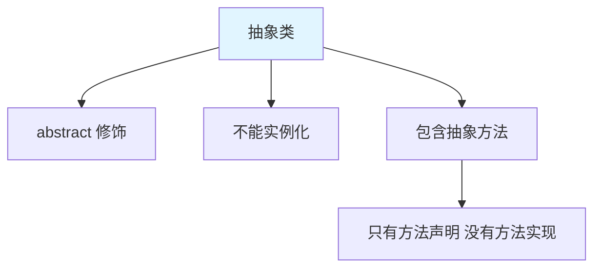
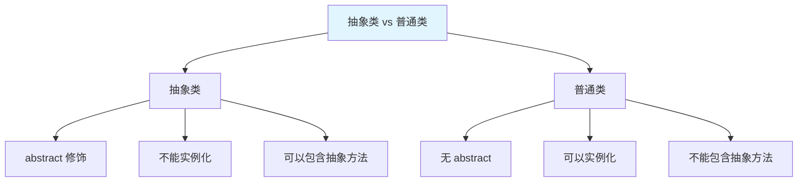
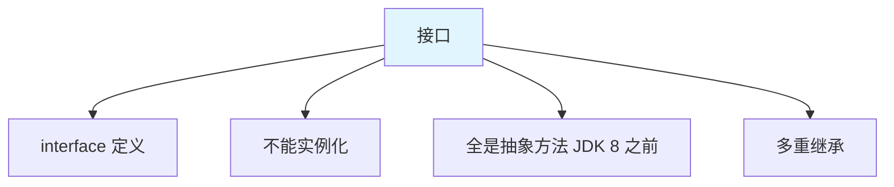
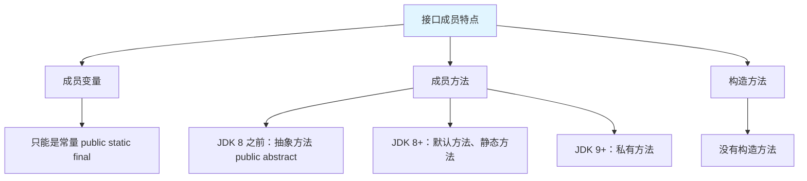
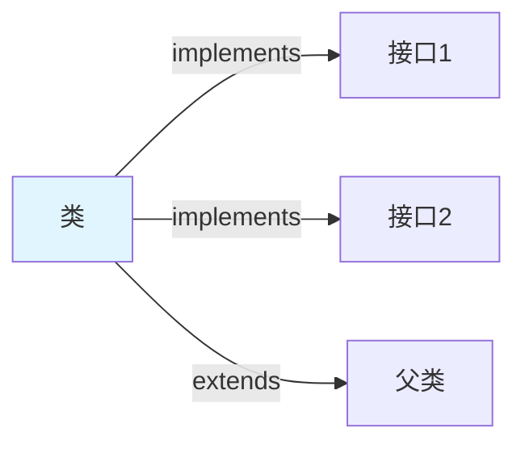
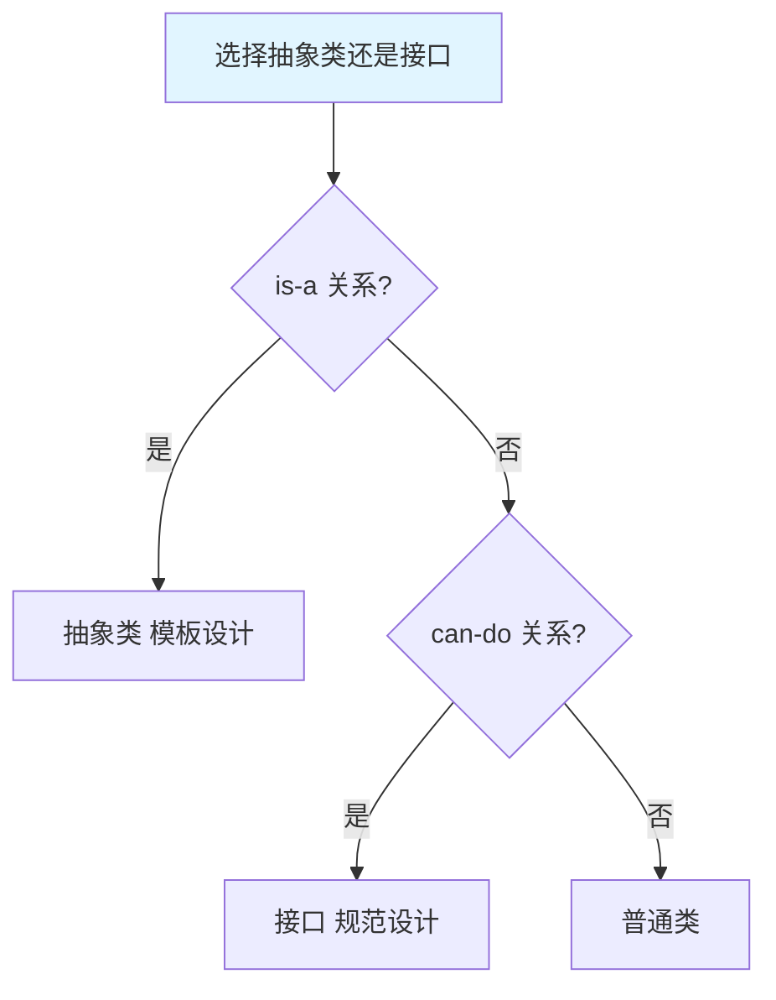

# 抽象类与接口

抽象类(Abstract Class)和接口(Interface)是 Java 中实现抽象的两种方式，用于定义规范和约束。

## 抽象类

### 什么是抽象类



**抽象类的特点**：

1. 使用 `abstract` 关键字修饰
2. **不能实例化**（不能创建对象）
3. 可以包含抽象方法（只有声明，没有实现）
4. 可以包含普通方法、成员变量、构造方法

::: tip 生活中的抽象

| 抽象概念 | 具体实现 |
|---------|---------|
| 图形 | 圆形、矩形、三角形 |
| 动物 | 狗、猫、鸟 |
| 交通工具 | 汽车、飞机、自行车 |

:::

### 抽象方法

**抽象方法**：只有方法声明，没有方法实现。

```java
// 抽象方法语法
public abstract void method();
```

**抽象方法的特点**：

1. 使用 `abstract` 关键字修饰
2. 没有方法体（没有花括号）
3. 必须在抽象类中
4. 子类**必须重写**所有抽象方法

### 抽象类示例

```java
// 抽象类
abstract class Animal {
    private String name;
    private int age;
    
    // 构造方法
    public Animal() {
    }
    
    public Animal(String name, int age) {
        this.name = name;
        this.age = age;
    }
    
    // 抽象方法：没有方法体
    public abstract void eat();
    public abstract void sleep();
    
    // 普通方法：有方法体
    public void show() {
        System.out.println("name: " + name + ", age: " + age);
    }
    
    // getter/setter
    public String getName() {
        return name;
    }
    
    public int getAge() {
        return age;
    }
}

// 子类必须重写所有抽象方法
class Dog extends Animal {
    public Dog(String name, int age) {
        super(name, age);
    }
    
    @Override
    public void eat() {
        System.out.println(getName() + "吃骨头");
    }
    
    @Override
    public void sleep() {
        System.out.println(getName() + "趴着睡觉");
    }
    
    // 子类可以扩展新方法
    public void bark() {
        System.out.println(getName() + "汪汪叫");
    }
}

class Cat extends Animal {
    public Cat(String name, int age) {
        super(name, age);
    }
    
    @Override
    public void eat() {
        System.out.println(getName() + "吃鱼");
    }
    
    @Override
    public void sleep() {
        System.out.println(getName() + "蜷缩睡觉");
    }
    
    public void meow() {
        System.out.println(getName() + "喵喵叫");
    }
}

public class AbstractClassDemo {
    public static void main(String[] args) {
        // Animal a = new Animal();  // ❌ 抽象类不能实例化
        
        // 多态：父类引用指向子类对象
        Animal a1 = new Dog("旺财", 3);
        Animal a2 = new Cat("咪咪", 2);
        
        a1.eat();   // 旺财吃骨头
        a1.sleep(); // 旺财趴着睡觉
        a1.show();  // name: 旺财, age: 3
        
        a2.eat();   // 咪咪吃鱼
        a2.sleep(); // 咪咪蜷缩睡觉
        
        // 向下转型调用子类特有方法
        if (a1 instanceof Dog) {
            Dog dog = (Dog) a1;
            dog.bark();  // 旺财汪汪叫
        }
    }
}
```

### 抽象类 vs 普通类



| 特性 | 抽象类 | 普通类 |
|------|--------|--------|
| 修饰符 | `abstract class` | `class` |
| 实例化 | ❌ 不能 | ✅ 可以 |
| 抽象方法 | ✅ 可以 | ❌ 不能 |
| 构造方法 | ✅ 可以（子类调用） | ✅ 可以 |
| 成员变量 | ✅ 可以 | ✅ 可以 |
| 普通方法 | ✅ 可以 | ✅ 可以 |

## 接口

### 什么是接口



**接口的特点**：

1. 使用 `interface` 关键字定义
2. **不能实例化**
3. 方法默认是 `public abstract`
4. 变量默认是 `public static final`
5. 支持多重继承（一个类可以实现多个接口）

::: tip 生活中的接口

| 接口 | 实现 |
|------|------|
| USB 接口 | 鼠标、键盘、U盘 |
| 3.5mm 耳机接口 | 各种耳机 |
| HDMI 接口 | 显示器、投影仪、电视 |

:::

### 接口的定义

```java
// 接口定义
public interface InterfaceName {
    // 常量：public static final（可省略）
    int CONSTANT = 100;
    
    // 抽象方法：public abstract（可省略）
    void method();
    
    // JDK 8 新特性
    default void defaultMethod() {
        // 默认方法
    }
    
    static void staticMethod() {
        // 静态方法
    }
}
```

### 接口示例

```java
// USB 接口
interface USB {
    // 常量
    int MAX_SPEED = 480;  // public static final
    
    // 抽象方法
    void open();          // public abstract
    void close();
    void transferData();
}

// 鼠标实现 USB 接口
class Mouse implements USB {
    @Override
    public void open() {
        System.out.println("鼠标已连接");
    }
    
    @Override
    public void close() {
        System.out.println("鼠标已断开");
    }
    
    @Override
    public void transferData() {
        System.out.println("鼠标传输数据：移动坐标");
    }
}

// 键盘实现 USB 接口
class Keyboard implements USB {
    @Override
    public void open() {
        System.out.println("键盘已连接");
    }
    
    @Override
    public void close() {
        System.out.println("键盘已断开");
    }
    
    @Override
    public void transferData() {
        System.out.println("键盘传输数据：按键编码");
    }
}

// U盘实现 USB 接口
class FlashDisk implements USB {
    @Override
    public void open() {
        System.out.println("U盘已连接");
    }
    
    @Override
    public void close() {
        System.out.println("U盘已断开");
    }
    
    @Override
    public void transferData() {
        System.out.println("U盘传输数据：读写文件");
    }
}

// 笔记本电脑
class Laptop {
    // 使用 USB 接口
    public void useUSB(USB usb) {
        usb.open();
        usb.transferData();
        usb.close();
    }
    
    public static void main(String[] args) {
        Laptop laptop = new Laptop();
        
        // 使用不同的 USB 设备
        laptop.useUSB(new Mouse());
        System.out.println();
        
        laptop.useUSB(new Keyboard());
        System.out.println();
        
        laptop.useUSB(new FlashDisk());
    }
}
```

### 接口的特点



```java
interface MyInterface {
    // 1. 成员变量：只能是常量
    int NUM = 10;  // 等价于：public static final int NUM = 10;
    
    // 2. 抽象方法：public abstract
    void method1();  // 等价于：public abstract void method1();
    
    // 3. JDK 8：默认方法
    default void method2() {
        System.out.println("默认方法");
    }
    
    // 4. JDK 8：静态方法
    static void method3() {
        System.out.println("静态方法");
    }
    
    // 5. JDK 9：私有方法
    // private void method4() {
    //     System.out.println("私有方法");
    // }
}
```

### 类实现接口



```java
// 多个接口
interface Flyable {
    void fly();
}

interface Swimmable {
    void swim();
}

// 实现多个接口
class Duck implements Flyable, Swimmable {
    @Override
    public void fly() {
        System.out.println("鸭子飞翔");
    }
    
    @Override
    public void swim() {
        System.out.println("鸭子游泳");
    }
    
    public void quack() {
        System.out.println("鸭子嘎嘎叫");
    }
}

// 继承父类 + 实现接口
class Animal {
    public void eat() {
        System.out.println("动物吃东西");
    }
}

class Bird extends Animal implements Flyable {
    @Override
    public void fly() {
        System.out.println("鸟儿飞翔");
    }
}

public class InterfaceImpl {
    public static void main(String[] args) {
        Duck duck = new Duck();
        duck.fly();
        duck.swim();
        duck.quack();
        
        Bird bird = new Bird();
        bird.eat();   // 继承自 Animal
        bird.fly();   // 实现 Flyable
    }
}
```

## 抽象类 vs 接口

### 对比表格

| 特性 | 抽象类 | 接口 |
|------|--------|------|
| 关键字 | `abstract class` | `interface` |
| 继承关系 | 单继承（extends） | 多实现（implements） |
| 成员变量 | 各种类型 | 只有常量 |
| 构造方法 | 有 | 无 |
| 成员方法 | 抽象方法 + 普通方法 | JDK 8 之前全是抽象方法 |
| 设计层面 | 模板设计 | 规范设计 |
| 使用场景 | is-a 关系 | has-a / can-do 关系 |

### 使用场景



::: tabs

@tab 抽象类：模板设计

```java
// 模板设计：定义算法骨架
abstract class BankTemplate {
    // 模板方法
    public final void process() {
        takeNumber();
        transact();  // 钩子方法
        evaluate();
    }
    
    private void takeNumber() {
        System.out.println("取号");
    }
    
    // 抽象方法：子类实现具体业务
    public abstract void transact();
    
    private void evaluate() {
        System.out.println("评分");
    }
}
```

@tab 接口：规范设计

```java
// 规范设计：定义能力标准
interface Flyable {
    void fly();
}

interface Swimmable {
    void swim();
}

class Duck implements Flyable, Swimmable {
    // 实现多个规范
}
```

:::

## JDK 8 新特性

### 默认方法 (default)

**默认方法**：接口中可以有方法实现。

```java
interface MyInterface {
    // 抽象方法
    void abstractMethod();
    
    // 默认方法
    default void defaultMethod() {
        System.out.println("默认方法实现");
    }
}

class MyClass implements MyInterface {
    @Override
    public void abstractMethod() {
        System.out.println("实现抽象方法");
    }
    
    // 可以选择重写默认方法
    // @Override
    // public void defaultMethod() {
    //     System.out.println("重写默认方法");
    // }
}

public class DefaultMethodDemo {
    public static void main(String[] args) {
        MyClass obj = new MyClass();
        obj.abstractMethod();  // 实现抽象方法
        obj.defaultMethod();   // 默认方法实现
    }
}
```

**默认方法的作用**：

1. 接口演进：添加新方法不破坏现有实现
2. 提供默认实现：减少重复代码

### 静态方法 (static)

**静态方法**：通过接口名调用。

```java
interface MyInterface {
    // 静态方法
    static void staticMethod() {
        System.out.println("静态方法");
    }
}

public class StaticMethodDemo {
    public static void main(String[] args) {
        // 通过接口名调用
        MyInterface.staticMethod();
        
        // MyClass.staticMethod();  // ❌ 实现类无法调用
    }
}
```

## JDK 9 新特性

### 私有方法 (private)

**私有方法**：接口中可以定义私有方法，用于代码复用。

```java
interface MyInterface {
    default void method1() {
        commonMethod();  // 调用私有方法
    }
    
    default void method2() {
        commonMethod();  // 调用私有方法
    }
    
    // 私有方法：代码复用
    private void commonMethod() {
        System.out.println("公共逻辑");
    }
    
    // 私有静态方法
    private static void staticCommonMethod() {
        System.out.println("静态公共逻辑");
    }
}
```

## 实战案例

### 图形系统

```java
// 可绘制接口
interface Drawable {
    void draw();
    
    // 默认方法
    default void info() {
        System.out.println("这是一个可绘制的图形");
    }
}

// 可缩放接口
interface Scalable {
    void scale(double factor);
}

// 图形抽象类
abstract class Shape implements Drawable, Scalable {
    private String color;
    
    public Shape(String color) {
        this.color = color;
    }
    
    public String getColor() {
        return color;
    }
    
    // 抽象方法：计算面积
    public abstract double getArea();
}

// 圆形
class Circle extends Shape {
    private double radius;
    
    public Circle(String color, double radius) {
        super(color);
        this.radius = radius;
    }
    
    @Override
    public void draw() {
        System.out.println("绘制" + getColor() + "圆形，半径：" + radius);
    }
    
    @Override
    public void scale(double factor) {
        radius *= factor;
        System.out.println("圆形缩放 " + factor + " 倍");
    }
    
    @Override
    public double getArea() {
        return Math.PI * radius * radius;
    }
}

// 矩形
class Rectangle extends Shape {
    private double width, height;
    
    public Rectangle(String color, double width, double height) {
        super(color);
        this.width = width;
        this.height = height;
    }
    
    @Override
    public void draw() {
        System.out.println("绘制" + getColor() + "矩形，宽：" + width + " 高：" + height);
    }
    
    @Override
    public void scale(double factor) {
        width *= factor;
        height *= factor;
        System.out.println("矩形缩放 " + factor + " 倍");
    }
    
    @Override
    public double getArea() {
        return width * height;
    }
}

public class GraphicsSystem {
    public static void main(String[] args) {
        Shape[] shapes = {
            new Circle("红色", 5),
            new Rectangle("蓝色", 4, 6)
        };
        
        for (Shape shape : shapes) {
            shape.draw();
            shape.info();
            shape.scale(2);
            System.out.println("面积：" + shape.getArea());
            System.out.println();
        }
    }
}
```

## 小结

::: tip 核心要点

1. **抽象类**：abstract 修饰，不能实例化，可以有抽象方法和普通方法
2. **接口**：interface 定义，全是抽象方法（JDK 8 之前），支持多实现
3. **抽象方法**：只有声明，没有实现，子类必须重写
4. **接口成员**：变量是常量，方法是抽象方法
5. **JDK 8**：默认方法、静态方法
6. **JDK 9**：私有方法
7. **选择原则**：is-a 用抽象类，can-do 用接口

:::

::: info 下一步
- [内部类](/java/base/02-oop/inner-class.md) - 学习内部类
:::
