# 类与对象

类(Class)和对象(Object)是面向对象编程的核心概念。

## 面向对象思想

### 编程范式演进

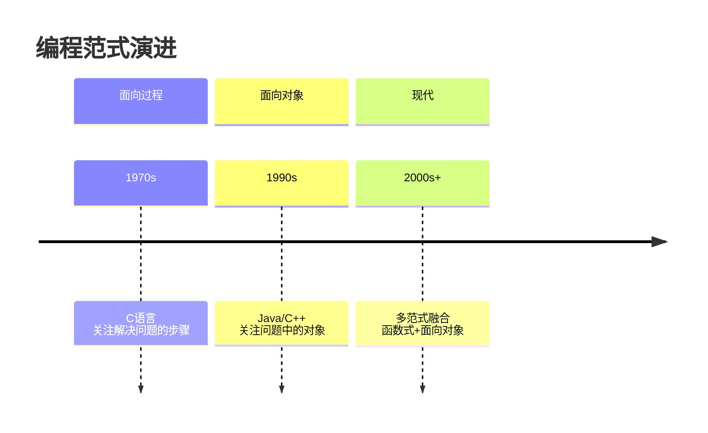

::: tabs

@tab 面向过程

```java
// 面向过程：关注步骤
public class ProcessStyle {
    public static void main(String[] args) {
        // 步骤1：准备数据
        String[] names = {"张三", "李四", "王五"};
        int[] ages = {18, 20, 22};
        
        // 步骤2：处理数据
        for (int i = 0; i < names.length; i++) {
            System.out.println(names[i] + "的年龄是" + ages[i]);
        }
    }
}
```

@tab 面向对象

```java
// 面向对象：关注对象
class Student {
    private String name;
    private int age;
    
    public Student(String name, int age) {
        this.name = name;
        this.age = age;
    }
    
    public void display() {
        System.out.println(name + "的年龄是" + age);
    }
}

public class OOPStyle {
    public static void main(String[] args) {
        Student s1 = new Student("张三", 18);
        Student s2 = new Student("李四", 20);
        Student s3 = new Student("王五", 22);
        
        s1.display();
        s2.display();
        s3.display();
    }
}
```

:::

### 面向对象三大特性

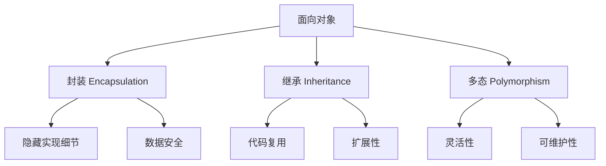

## 类与对象的概念

### 类 (Class)

**类**：对一类事物的抽象描述，是对象的**模板**。

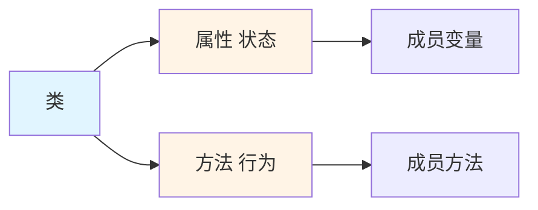

::: tip 类与对象的关系

| 类 (Class) | 对象 (Object) |
|------------|---------------|
| 模板/图纸 | 实例/产品 |
| 抽象 | 具体 |
| 类型 | 实体 |
| 设计图 | 建筑物 |

**例子**：
- 类：汽车设计图
- 对象：具体的每一辆汽车

:::

### 对象 (Object)

**对象**：类的实例化，是类的**具体实现**。

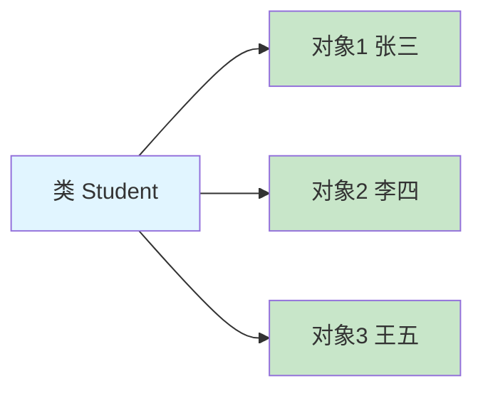

## 类的定义

### 语法格式

```java
public class ClassName {
    // 1. 成员变量（属性）
    private String name;
    private int age;
    
    // 2. 构造方法
    public ClassName() {
        // 无参构造
    }
    
    public ClassName(String name, int age) {
        // 有参构造
        this.name = name;
        this.age = age;
    }
    
    // 3. 成员方法
    public void method() {
        // 方法体
    }
    
    // 4. 代码块
    {
        // 实例代码块
    }
    
    static {
        // 静态代码块
    }
    
    // 5. 内部类
    class InnerClass {
        // 内部类内容
    }
}
```

### 学生类示例

```java
/**
 * 学生类
 * 包含属性、构造方法、成员方法
 */
public class Student {
    
    // ========== 成员变量 ==========
    private String name;    // 姓名
    private int age;        // 年龄
    private double score;   // 分数
    
    // ========== 构造方法 ==========
    // 无参构造
    public Student() {
        System.out.println("创建了一个学生对象");
    }
    
    // 全参构造
    public Student(String name, int age, double score) {
        this.name = name;
        this.age = age;
        this.score = score;
    }
    
    // ========== 成员方法 ==========
    // getter/setter 方法
    public String getName() {
        return name;
    }
    
    public void setName(String name) {
        this.name = name;
    }
    
    public int getAge() {
        return age;
    }
    
    public void setAge(int age) {
        this.age = age;
    }
    
    public double getScore() {
        return score;
    }
    
    public void setScore(double score) {
        this.score = score;
    }
    
    // 业务方法
    public void study() {
        System.out.println(name + "正在学习");
    }
    
    public void exam() {
        System.out.println(name + "正在考试");
    }
    
    public void display() {
        System.out.println("学生信息：姓名=" + name + ", 年龄=" + age + ", 分数=" + score);
    }
}
```

## 对象的创建与使用

### 创建对象

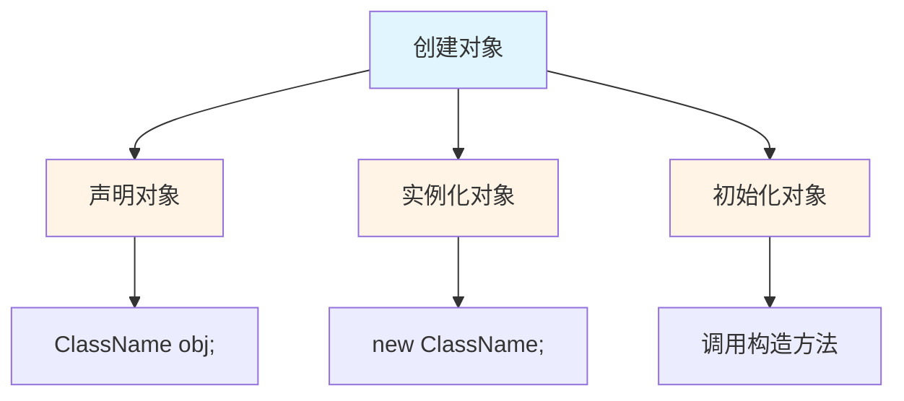

```java
// 格式：类名 对象名 = new 类名(参数);
Student stu1 = new Student();              // 无参构造
Student stu2 = new Student("张三", 18, 95.5); // 有参构造

// 匿名对象：没有名字的对象
new Student("李四", 20, 88.0).study();     // 使用后即被回收
```

### 访问成员

```java
public class StudentDemo {
    public static void main(String[] args) {
        // 1. 创建对象
        Student stu = new Student("张三", 18, 95.5);
        
        // 2. 访问成员变量（通过 getter/setter）
        String name = stu.getName();
        System.out.println("姓名：" + name);  // 张三
        
        stu.setAge(19);                       // 修改年龄
        System.out.println("年龄：" + stu.getAge());  // 19
        
        // 3. 调用成员方法
        stu.study();                          // 张三正在学习
        stu.exam();                           // 张三正在考试
        stu.display();                        // 打印学生信息
        
        // 4. 多个对象
        Student s1 = new Student("张三", 18, 95.5);
        Student s2 = new Student("李四", 20, 88.0);
        Student s3 = new Student("王五", 19, 92.5);
        
        s1.display();  // 每个对象是独立的
        s2.display();
        s3.display();
    }
}
```

### 对象在内存中的存储

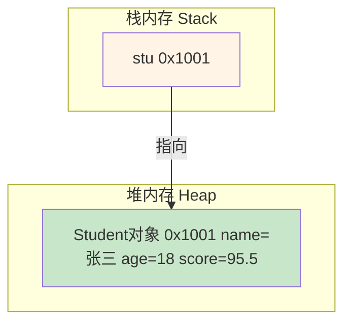

```java
public class MemoryDemo {
    public static void main(String[] args) {
        Student stu1 = new Student("张三", 18, 95.5);
        Student stu2 = stu1;  // stu1 和 stu2 指向同一对象
        
        stu1.setName("李四");
        System.out.println(stu2.getName());  // 李四（同一对象）
        
        stu2 = new Student("王五", 20, 88.0);  // stu2 指向新对象
        System.out.println(stu1.getName());  // 李四
        System.out.println(stu2.getName());  // 王五
    }
}
```

::: tip 对象引用

```java
// 引用传递
Student s1 = new Student("张三", 18);
Student s2 = s1;          // s1 和 s2 指向同一对象
s2.setName("李四");       // 修改的是同一个对象
System.out.println(s1.getName());  // 李四
```

:::

## 成员变量

### 成员变量的分类

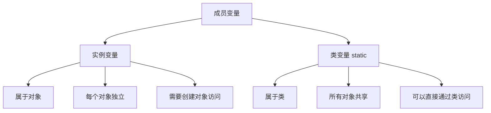

### 实例变量 vs 类变量

```java
public class VariableDemo {
    // 实例变量（无 static）
    private String name;
    private int age;
    
    // 类变量（有 static）
    private static String school = "清华大学";
    private static int count = 0;
    
    public VariableDemo(String name, int age) {
        this.name = name;
        this.age = age;
        count++;  // 每创建一个对象，count + 1
    }
    
    public void display() {
        System.out.println("姓名：" + name + ", 年龄：" + age + ", 学校：" + school);
    }
    
    public static void main(String[] args) {
        // 访问类变量
        System.out.println("学校：" + VariableDemo.school);  // 清华大学
        System.out.println("总数：" + VariableDemo.count);    // 0
        
        // 创建对象
        VariableDemo v1 = new VariableDemo("张三", 18);
        VariableDemo v2 = new VariableDemo("李四", 20);
        
        v1.display();  // 姓名：张三, 年龄：18, 学校：清华大学
        v2.display();  // 姓名：李四, 年龄：20, 学校：清华大学
        
        System.out.println("总数：" + count);  // 2
    }
}
```

### 成员变量的默认值

| 类型 | 默认值 |
|------|--------|
| byte, short, int, long | 0 |
| float, double | 0.0 |
| char | '\u0000' |
| boolean | false |
| 引用类型 | null |

```java
public class DefaultValueDemo {
    private int a;           // 0
    private double b;        // 0.0
    private char c;          // \u0000
    private boolean d;       // false
    private String e;        // null
    
    public void display() {
        System.out.println("int: " + a);       // 0
        System.out.println("double: " + b);    // 0.0
        System.out.println("char: " + c);      // (空字符)
        System.out.println("boolean: " + d);   // false
        System.out.println("String: " + e);    // null
    }
}
```

## 成员方法

### 方法定义

```java
修饰符 返回值类型 方法名(参数列表) {
    // 方法体
    return 返回值;
}
```

### 示例

```java
public class MethodDemo {
    
    // 无参无返回值
    public void sayHello() {
        System.out.println("Hello!");
    }
    
    // 有参无返回值
    public void sayHelloTo(String name) {
        System.out.println("Hello, " + name + "!");
    }
    
    // 无参有返回值
    public String getMessage() {
        return "Hello World";
    }
    
    // 有参有返回值
    public int add(int a, int b) {
        return a + b;
    }
    
    // 可变参数
    public int sum(int... nums) {
        int total = 0;
        for (int num : nums) {
            total += num;
        }
        return total;
    }
    
    public static void main(String[] args) {
        MethodDemo demo = new MethodDemo();
        
        demo.sayHello();              // Hello!
        demo.sayHelloTo("张三");       // Hello, 张三!
        System.out.println(demo.getMessage());  // Hello World
        System.out.println(demo.add(10, 20));   // 30
        System.out.println(demo.sum(1, 2, 3, 4, 5));  // 15
    }
}
```

### 方法重载（Overload）

**方法重载**：同一个类中，方法名相同，参数列表不同。

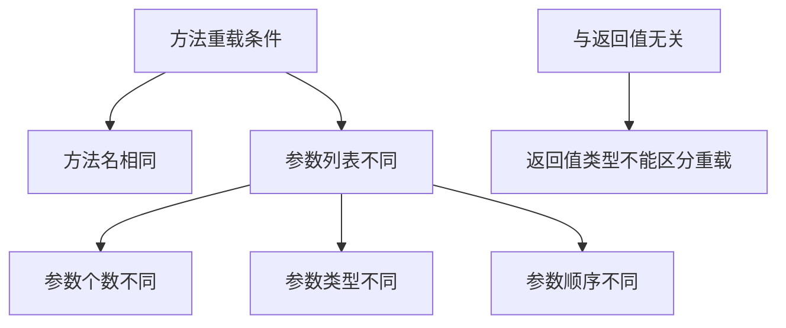

```java
public class OverloadDemo {
    
    // 1. 参数个数不同
    public int add(int a, int b) {
        return a + b;
    }
    
    public int add(int a, int b, int c) {
        return a + b + c;
    }
    
    // 2. 参数类型不同
    public double add(double a, double b) {
        return a + b;
    }
    
    // 3. 参数顺序不同
    public void print(String str, int num) {
        System.out.println("String: " + str + ", int: " + num);
    }
    
    public void print(int num, String str) {
        System.out.println("int: " + num + ", String: " + str);
    }
    
    public static void main(String[] args) {
        OverloadDemo demo = new OverloadDemo();
        
        System.out.println(demo.add(1, 2));           // 3
        System.out.println(demo.add(1, 2, 3));        // 6
        System.out.println(demo.add(1.5, 2.5));       // 4.0
        
        demo.print("Hello", 100);  // String: Hello, int: 100
        demo.print(100, "Hello");  // int: 100, String: Hello
    }
}
```

::: tip 重载与返回值

```java
// ❌ 这不是重载，编译错误
public int getData() {
    return 100;
}

public String getData() {  // 错误：只有返回值不同
    return "Hello";
}
```

:::

## 构造方法

### 构造方法特点

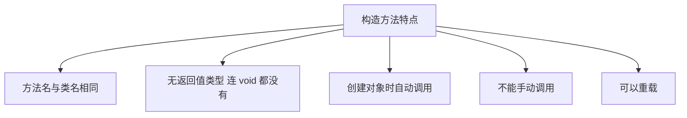

### 构造方法示例

```java
public class ConstructorDemo {
    private String name;
    private int age;
    
    // 无参构造（系统默认提供）
    public ConstructorDemo() {
        System.out.println("调用无参构造");
    }
    
    // 全参构造
    public ConstructorDemo(String name, int age) {
        System.out.println("调用全参构造");
        this.name = name;
        this.age = age;
    }
    
    // 部分参数构造
    public ConstructorDemo(String name) {
        System.out.println("调用部分参数构造");
        this.name = name;
        this.age = 18;  // 默认年龄
    }
    
    // 拷贝构造
    public ConstructorDemo(ConstructorDemo other) {
        System.out.println("调用拷贝构造");
        this.name = other.name;
        this.age = other.age;
    }
    
    public void display() {
        System.out.println("name: " + name + ", age: " + age);
    }
    
    public static void main(String[] args) {
        ConstructorDemo c1 = new ConstructorDemo();  // 无参构造
        ConstructorDemo c2 = new ConstructorDemo("张三", 18);  // 全参构造
        ConstructorDemo c3 = new ConstructorDemo("李四");  // 部分参数构造
        ConstructorDemo c4 = new ConstructorDemo(c2);  // 拷贝构造
        
        c1.display();  // name: null, age: 0
        c2.display();  // name: 张三, age: 18
        c3.display();  // name: 李四, age: 18
        c4.display();  // name: 张三, age: 18
    }
}
```

### 构造方法注意事项

::: warning 注意

1. 如果没有定义构造方法，系统会提供**默认无参构造**
2. 如果定义了构造方法，系统**不再提供**默认无参构造
3. 构造方法可以重载
4. 不能被 `static`、`final`、`abstract` 修饰

:::

```java
public class NoticeDemo {
    private String name;
    
    // 定义了有参构造，系统不再提供无参构造
    public NoticeDemo(String name) {
        this.name = name;
    }
    
    public static void main(String[] args) {
        // NoticeDemo n1 = new NoticeDemo();  // ❌ 编译错误
        NoticeDemo n2 = new NoticeDemo("张三");  // ✅ 正确
    }
}
```

## this 关键字

### this 的三种用法

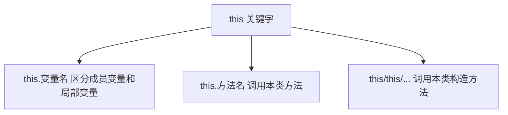

### this 使用示例

```java
public class ThisDemo {
    private String name;
    private int age;
    
    // 1. this.变量名
    public ThisDemo(String name, int age) {
        this.name = name;  // this.name 指成员变量
        this.age = age;    // age 是局部变量
    }
    
    // 2. this.方法名
    public void display() {
        System.out.println("name: " + this.name);
        this.showAge();  // 调用本类方法（this 可省略）
    }
    
    public void showAge() {
        System.out.println("age: " + this.age);
    }
    
    // 3. this(...) 调用本类构造方法
    public ThisDemo() {
        this("默认名字", 18);  // 调用全参构造
        System.out.println("无参构造");
    }
    
    public ThisDemo(String name) {
        this(name, 18);  // 调用全参构造
        System.out.println("单参构造");
    }
    
    public ThisDemo(String name, int age) {
        this.name = name;
        this.age = age;
        System.out.println("全参构造");
    }
    
    public static void main(String[] args) {
        ThisDemo t1 = new ThisDemo();  // 调用链：无参 → 全参
        ThisDemo t2 = new ThisDemo("张三");  // 调用链：单参 → 全参
        ThisDemo t3 = new ThisDemo("李四", 20);  // 直接调用全参
    }
}
```

::: tip this 注意事项

```java
public class ThisNotice {
    public ThisNotice() {
        // this("张三");  // ✅ 必须是第一条语句
        System.out.println("Hello");
        // this("张三");  // ❌ 编译错误
    }
    
    public ThisNotice(String name) {
        // this();  // ✅ 调用无参构造
        // this("张三", 18);  // ❌ 不能递归调用
    }
}
```

:::

## 代码块

### 代码块分类

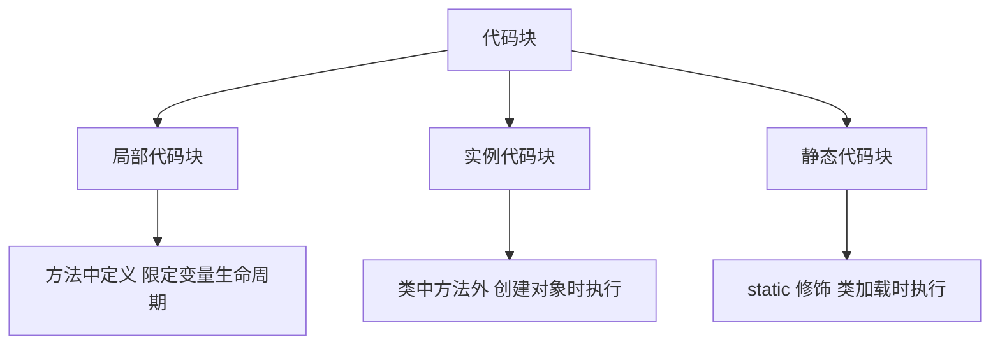

### 代码块示例

```java
public class BlockDemo {
    private String name;
    private static String school;
    
    // 静态代码块：类加载时执行一次
    static {
        System.out.println("静态代码块");
        school = "清华大学";
    }
    
    // 实例代码块：创建对象时执行
    {
        System.out.println("实例代码块");
        name = "默认名字";
    }
    
    // 构造方法
    public BlockDemo() {
        System.out.println("无参构造");
    }
    
    public BlockDemo(String name) {
        System.out.println("有参构造");
        this.name = name;
    }
    
    // 局部代码块
    public void method() {
        {
            int x = 10;  // 局部代码块
            System.out.println("局部代码块：x = " + x);
        }
        // System.out.println(x);  // ❌ 超出作用域
    }
    
    public static void main(String[] args) {
        System.out.println("======== 创建第一个对象 ==========");
        BlockDemo b1 = new BlockDemo();
        System.out.println();
        
        System.out.println("======== 创建第二个对象 ==========");
        BlockDemo b2 = new BlockDemo("张三");
        System.out.println();
        
        System.out.println("======== 调用方法 ==========");
        b2.method();
    }
}
```

**执行顺序**：

```
静态代码块           （类加载时执行一次）
======== 创建第一个对象 ==========
实例代码块           （每次创建对象时执行）
无参构造
======== 创建第二个对象 ==========
实例代码块
有参构造
======== 调用方法 ==========
局部代码块：x = 10
```

### 静态导入

```java
import static java.lang.Math.*;
import static java.util.Arrays.*;

public class StaticImport {
    public static void main(String[] args) {
        // 不需要类名前缀
        System.out.println(PI);          // 3.141592653589793
        System.out.println(abs(-10));    // 10
        System.out.println(max(10, 20)); // 20
        
        int[] arr = {1, 2, 3, 4, 5};
        System.out.println(toString(arr)); // [1, 2, 3, 4, 5]
    }
}
```

## 对象数组

### 对象数组定义

```java
// 格式：类名[] 数组名 = new 类名[长度];
Student[] students = new Student[5];
```

### 对象数组示例

```java
public class ObjectArrayDemo {
    public static void main(String[] args) {
        // 1. 创建对象数组
        Student[] students = new Student[3];
        
        // 2. 初始化数组元素
        students[0] = new Student("张三", 18, 95.5);
        students[1] = new Student("李四", 20, 88.0);
        students[2] = new Student("王五", 19, 92.5);
        
        // 3. 遍历数组
        for (int i = 0; i < students.length; i++) {
            students[i].display();
        }
        
        System.out.println("======== 使用增强 for 循环 ==========");
        for (Student stu : students) {
            stu.display();
        }
        
        // 4. 动态初始化
        Student[] array = {
            new Student("Alice", 18, 90.0),
            new Student("Bob", 19, 85.0),
            new Student("Charlie", 20, 95.0)
        };
        
        // 5. 数组作为方法参数
        printStudents(array);
        
        // 6. 数组作为返回值
        Student[] result = createStudents();
        printStudents(result);
    }
    
    // 数组作为参数
    public static void printStudents(Student[] students) {
        for (Student stu : students) {
            stu.display();
        }
    }
    
    // 数组作为返回值
    public static Student[] createStudents() {
        Student[] students = new Student[2];
        students[0] = new Student("学生1", 18, 90.0);
        students[1] = new Student("学生2", 19, 85.0);
        return students;
    }
}
```

## 实战案例

### 学生管理系统

```java
/**
 * 学生类
 */
class Student {
    private String id;
    private String name;
    private int age;
    private double score;
    
    public Student() {
    }
    
    public Student(String id, String name, int age, double score) {
        this.id = id;
        this.name = name;
        this.age = age;
        this.score = score;
    }
    
    // getter/setter 省略...
    
    public void display() {
        System.out.printf("学号：%s, 姓名：%s, 年龄：%d, 分数：%.1f\n", 
                         id, name, age, score);
    }
}

/**
 * 学生管理类
 */
class StudentManager {
    private Student[] students;
    private int count;
    
    public StudentManager(int capacity) {
        students = new Student[capacity];
        count = 0;
    }
    
    // 添加学生
    public boolean addStudent(Student stu) {
        if (count >= students.length) {
            System.out.println("数组已满，无法添加");
            return false;
        }
        students[count++] = stu;
        return true;
    }
    
    // 查找学生
    public Student findStudent(String id) {
        for (int i = 0; i < count; i++) {
            if (students[i].getId().equals(id)) {
                return students[i];
            }
        }
        return null;
    }
    
    // 删除学生
    public boolean deleteStudent(String id) {
        for (int i = 0; i < count; i++) {
            if (students[i].getId().equals(id)) {
                // 将后面的元素前移
                for (int j = i; j < count - 1; j++) {
                    students[j] = students[j + 1];
                }
                students[--count] = null;
                return true;
            }
        }
        return false;
    }
    
    // 显示所有学生
    public void displayAll() {
        if (count == 0) {
            System.out.println("暂无学生信息");
            return;
        }
        
        System.out.println("======== 学生列表 ==========");
        for (int i = 0; i < count; i++) {
            students[i].display();
        }
    }
    
    // 统计平均分
    public double getAverageScore() {
        if (count == 0) return 0;
        
        double sum = 0;
        for (int i = 0; i < count; i++) {
            sum += students[i].getScore();
        }
        return sum / count;
    }
}

// 测试类
public class StudentSystem {
    public static void main(String[] args) {
        StudentManager manager = new StudentManager(10);
        
        // 添加学生
        manager.addStudent(new Student("001", "张三", 18, 95.5));
        manager.addStudent(new Student("002", "李四", 19, 88.0));
        manager.addStudent(new Student("003", "王五", 20, 92.5));
        
        // 显示所有学生
        manager.displayAll();
        
        // 查找学生
        Student stu = manager.findStudent("002");
        if (stu != null) {
            System.out.print("找到学生：");
            stu.display();
        }
        
        // 删除学生
        manager.deleteStudent("002");
        System.out.println("\n删除后的学生列表：");
        manager.displayAll();
        
        // 统计平均分
        System.out.printf("平均分：%.2f\n", manager.getAverageScore());
    }
}
```

## 小结

::: tip 核心要点

1. **类**：对象的模板，包含属性（成员变量）和行为（方法）
2. **对象**：类的实例，通过 `new` 关键字创建
3. **成员变量**：实例变量（对象）vs 类变量（static）
4. **成员方法**：定义对象的行为，支持重载
5. **构造方法**：创建对象时初始化，支持重载
6. **this 关键字**：引用当前对象，区分同名变量
7. **代码块**：局部代码块、实例代码块、静态代码块

:::

::: info 下一步
- [封装](/java/base/02-oop/encapsulation.md) - 学习 Java 封装特性
- [继承](/java/base/02-oop/inheritance.md) - 学习 Java 继承特性
- [多态](/java/base/02-oop/polymorphism.md) - 学习 Java 多态特性
:::
