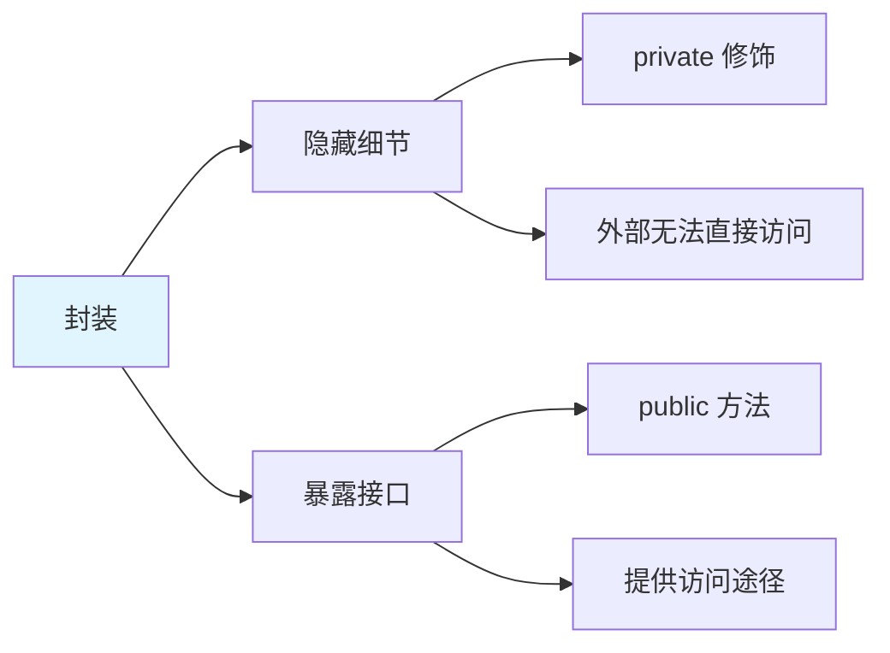
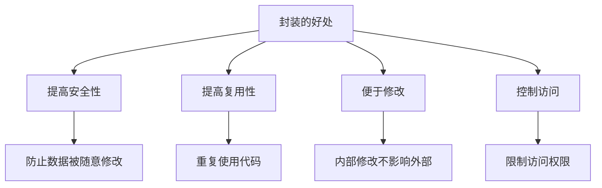
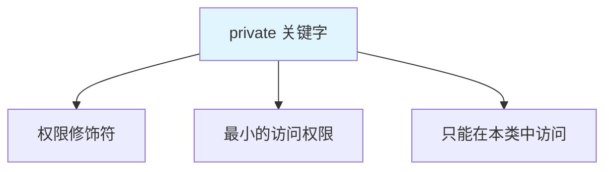
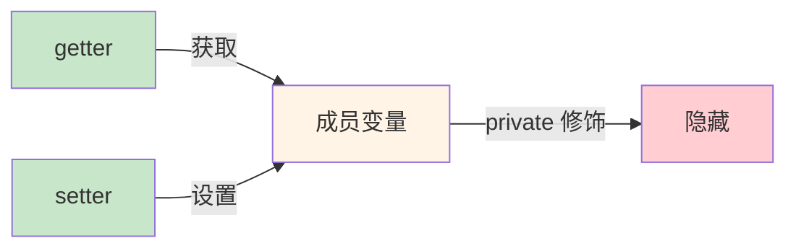
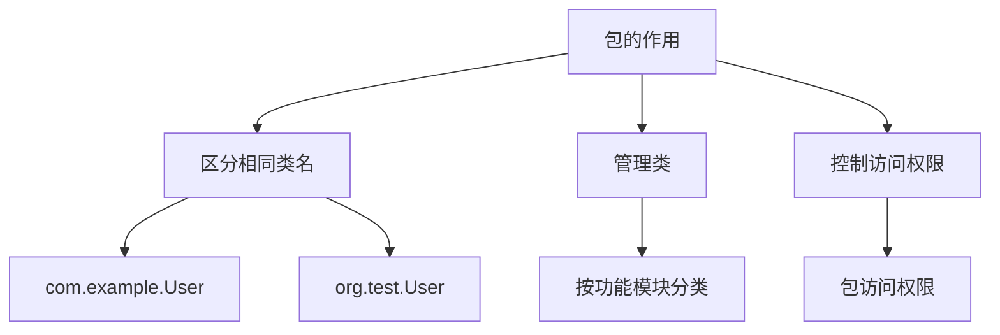
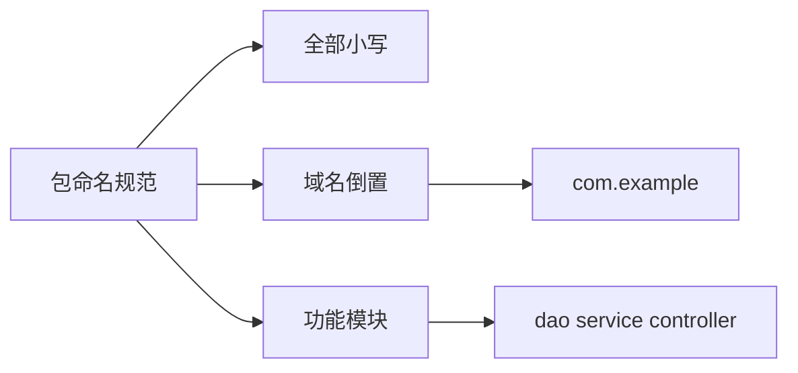
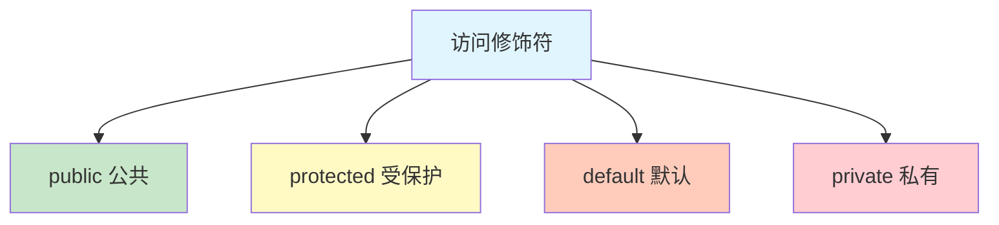
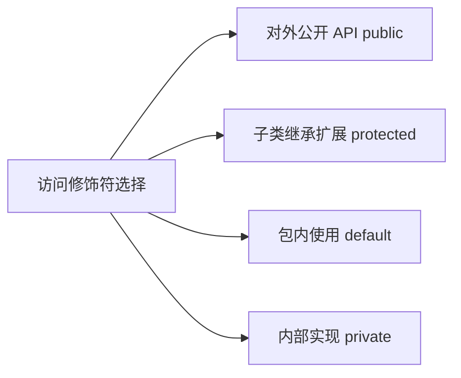

# 封装

封装(Encapsulation)是面向对象三大特性之一，指**隐藏对象的实现细节**，仅对外提供公共访问方式。

## 封装概述

### 什么是封装



**封装的核心思想**：

1. **隐藏实现细节**：使用 `private` 修饰成员变量
2. **提供公共访问**：通过 `public` 方法(getter/setter)访问
3. **提高安全性**：可以在方法中添加逻辑控制

::: tip 生活中的封装

| 生活场景 | 封装体现 |
|---------|---------|
| 电脑 | CPU、主板被外壳封装，只提供 USB、HDMI 等接口 |
| 汽车 | 发动机、变速箱被封装，只提供方向盘、油门、刹车 |
| 手机 | 内部电路被封装，只提供屏幕、按键 |

:::

### 封装的好处



## private 关键字

### private 的特点



### private 示例

```java
public class PrivateDemo {
    // private 成员变量：只能在本类中直接访问
    private String name;
    private int age;
    
    // 公共方法：提供访问途径
    public void setName(String name) {
        this.name = name;
    }
    
    public String getName() {
        return name;
    }
    
    public void setAge(int age) {
        if (age >= 0 && age <= 150) {  // 添加逻辑判断
            this.age = age;
        } else {
            System.out.println("年龄不合法！");
        }
    }
    
    public int getAge() {
        return age;
    }
    
    public void show() {
        System.out.println("姓名：" + name + ", 年龄：" + age);
    }
    
    // 本类中可以直接访问 private 成员
    public void method() {
        System.out.println(name);  // ✅ 可以访问
        System.out.println(age);   // ✅ 可以访问
    }
}

class Test {
    public static void main(String[] args) {
        PrivateDemo p = new PrivateDemo();
        
        // p.name = "张三";    // ❌ 编译错误：private 不能在外类访问
        // p.age = 18;         // ❌ 编译错误
        
        // 通过 public 方法访问
        p.setName("张三");      // ✅ 正确
        p.setAge(18);           // ✅ 正确
        p.setAge(-10);          // ⚠️ 年龄不合法
        p.show();               // 姓名：张三, 年龄：0
    }
}
```

::: tip private 的应用场景

```java
public class BankAccount {
    private double balance;  // 余额：private 防止直接修改
    
    public void deposit(double amount) {  // 存款
        if (amount > 0) {
            balance += amount;
            System.out.println("存款成功，余额：" + balance);
        }
    }
    
    public void withdraw(double amount) {  // 取款
        if (amount > 0 && amount <= balance) {
            balance -= amount;
            System.out.println("取款成功，余额：" + balance);
        } else {
            System.out.println("余额不足！");
        }
    }
    
    public double getBalance() {  // 查询余额（只读）
        return balance;
    }
}
```

:::

## getter/setter 方法

### getter/setter 的作用



**作用**：
- **getter**：获取成员变量的值（只读访问）
- **setter**：设置成员变量的值（写入访问）
- 可以在方法中添加逻辑控制（如数据验证）

### 生成 getter/setter

::: tabs

@tab 手动编写

```java
public class Student {
    private String name;
    private int age;
    
    // getter 方法
    public String getName() {
        return name;
    }
    
    public int getAge() {
        return age;
    }
    
    // setter 方法
    public void setName(String name) {
        this.name = name;
    }
    
    public void setAge(int age) {
        this.age = age;
    }
}
```

@tab IDEA 快捷键

```
Alt + Insert → Getter and Setter → 选择字段 → OK
```

@tab Eclipse 快捷键

```
右键 → Source → Generate Getters and Setters
```

:::

### getter/setter 示例

```java
public class Person {
    private String name;
    private int age;
    private boolean married;  // 布尔类型的 getter 是 isXxx()
    
    // getter
    public String getName() {
        return name;
    }
    
    public int getAge() {
        return age;
    }
    
    public boolean isMarried() {  // ⚠️ boolean 类型用 is 开头
        return married;
    }
    
    // setter
    public void setName(String name) {
        if (name != null && !name.isEmpty()) {  // 数据验证
            this.name = name;
        } else {
            System.out.println("姓名不能为空！");
        }
    }
    
    public void setAge(int age) {
        if (age >= 0 && age <= 150) {
            this.age = age;
        } else {
            System.out.println("年龄不合法！");
        }
    }
    
    public void setMarried(boolean married) {
        this.married = married;
    }
    
    public void display() {
        System.out.println("姓名：" + name + ", 年龄：" + age + ", 婚否：" + married);
    }
}

class PersonDemo {
    public static void main(String[] args) {
        Person p = new Person();
        
        p.setName("张三");
        p.setAge(25);
        p.setMarried(true);
        p.display();  // 姓名：张三, 年龄：25, 婚否：true
        
        System.out.println(p.isMarried());  // true
        System.out.println(p.getName());    // 张三
    }
}
```

### 只读/只写属性

```java
public class ReadOnlyWriteOnly {
    private int readOnly;   // 只读：只提供 getter
    private int writeOnly;  // 只写：只提供 setter
    
    // 只读：只有 getter
    public int getReadOnly() {
        return readOnly;
    }
    
    // 只写：只有 setter
    public void setWriteOnly(int writeOnly) {
        this.writeOnly = writeOnly;
    }
    
    public static void main(String[] args) {
        ReadOnlyWriteOnly obj = new ReadOnlyWriteOnly();
        
        // 只读属性
        System.out.println(obj.getReadOnly());  // ✅ 可以读取
        // obj.setReadOnly(10);  // ❌ 无法修改
        
        // 只写属性
        obj.setWriteOnly(20);   // ✅ 可以设置
        // System.out.println(obj.getWriteOnly());  // ❌ 无法读取
    }
}
```

## 包 (Package)

### 包的作用



**包的作用**：
1. **避免类冲突**：不同包中可以有同名类
2. **便于管理**：按功能模块组织类
3. **控制访问**：提供访问权限控制

### 包的定义

```java
package com.example.demo;  // 必须在第一行

import java.util.List;     // 导入类
import java.util.*;        // 导入包下所有类（不推荐）

public class PackageDemo {
    public static void main(String[] args) {
        List<String> list = new ArrayList<>();
    }
}
```

### 命名规范



**命名规范**：
- 全部**小写字母**
- 使用**域名倒置**作为前缀
- 按功能模块命名

```java
// 标准包结构
com.weilanx.example
├── dao          (数据访问层)
├── service      (业务逻辑层)
├── controller   (控制层)
├── entity       (实体类)
├── util         (工具类)
└── exception    (异常类)
```

### 导入包 (import)

```java
package com.example.test;

// 1. 导入特定类（推荐）
import java.util.ArrayList;
import java.util.HashMap;
import java.util.List;

// 2. 导入整个包（不推荐）
import java.util.*;

// 3. 导入静态成员
import static java.lang.Math.*;
import static java.util.Collections.sort;

public class ImportDemo {
    public static void main(String[] args) {
        // 使用导入的类
        List<String> list = new ArrayList<>();
        HashMap<String, Integer> map = new HashMap<>();
        
        // 使用静态导入
        System.out.println(PI);           // 不需要 Math.PI
        System.out.println(abs(-10));     // 不需要 Math.abs(-10)
    }
}
```

::: tip 导入注意事项

```java
// 不同包中的同名类
import java.util.Date;
import java.sql.Date;  // ❌ 编译错误：重复导入

// 解决方法：使用全名
java.util.Date utilDate = new java.util.Date();
java.sql.Date sqlDate = new java.sql.Date(0);

// 或只导入一个，另一个使用全名
import java.util.Date;
Date utilDate = new Date();
java.sql.Date sqlDate = new java.sql.Date(0);
```

:::

## 访问修饰符

### 四种访问权限



### 访问权限表

| 修饰符 | 同一类 | 同一包 | 不同包的子类 | 不同包的非子类 |
|--------|--------|--------|--------------|----------------|
| **public** | ✅ | ✅ | ✅ | ✅ |
| **protected** | ✅ | ✅ | ✅ | ❌ |
| **default** | ✅ | ✅ | ❌ | ❌ |
| **private** | ✅ | ❌ | ❌ | ❌ |

### 访问权限示例

```java
// 文件：com.example.Parent.java
package com.example;

public class Parent {
    public int pub = 1;        // public：任何地方
    protected int pro = 2;     // protected：同包或子类
    int def = 3;               // default：同包
    private int pri = 4;       // private：本类
    
    // 同类中都可以访问
    public void method() {
        System.out.println(pub);  // ✅
        System.out.println(pro);  // ✅
        System.out.println(def);  // ✅
        System.out.println(pri);  // ✅
    }
}

// 文件：com.example.SamePackage.java
package com.example;

public class SamePackage {
    public static void main(String[] args) {
        Parent p = new Parent();
        System.out.println(p.pub);  // ✅ public
        System.out.println(p.pro);  // ✅ protected
        System.out.println(p.def);  // ✅ default
        // System.out.println(p.pri);  // ❌ private
    }
}

// 文件：com.test.Child.java（不同包的子类）
package com.test;

import com.example.Parent;

class Child extends Parent {
    public void method() {
        // System.out.println(pub);  // ❌ 需要对象访问
        System.out.println(pro);     // ✅ protected：继承可访问
        // System.out.println(def);  // ❌ default：不同包不可访问
        // System.out.println(pri);  // ❌ private
    }
}

// 文件：com.test.DifferentPackage.java（不同包的非子类）
package com.test;

import com.example.Parent;

public class DifferentPackage {
    public static void main(String[] args) {
        Parent p = new Parent();
        System.out.println(p.pub);   // ✅ public
        // System.out.println(p.pro);  // ❌ protected
        // System.out.println(p.def);  // ❌ default
        // System.out.println(p.pri);  // ❌ private
    }
}
```

### 访问修饰符的使用场景



| 修饰符 | 使用场景 | 示例 |
|--------|----------|------|
| **public** | 对外公开的 API | `public void run()` |
| **protected** | 需要被子类访问 | `protected void init()` |
| **default** | 包内辅助方法 | `void helper()` |
| **private** | 内部实现细节 | `private void validate()` |

## 封装的综合应用

### 标准的 JavaBean

```java
/**
 * 标准的 JavaBean
 * 1. 类是 public 的
 * 2. 有无参构造
 * 3. 成员变量 private
 * 4. 提供 public 的 getter/setter
 * 5. 实现 Serializable 接口
 */
public class User implements java.io.Serializable {
    private static final long serialVersionUID = 1L;
    
    // 成员变量：private
    private String username;
    private String password;
    private int age;
    
    // 无参构造：public
    public User() {
    }
    
    // 全参构造
    public User(String username, String password, int age) {
        this.username = username;
        this.password = password;
        this.age = age;
    }
    
    // getter/setter：public
    public String getUsername() {
        return username;
    }
    
    public void setUsername(String username) {
        this.username = username;
    }
    
    public String getPassword() {
        return password;
    }
    
    public void setPassword(String password) {
        if (password != null && password.length() >= 6) {
            this.password = password;
        } else {
            throw new IllegalArgumentException("密码长度不能少于6位");
        }
    }
    
    public int getAge() {
        return age;
    }
    
    public void setAge(int age) {
        if (age >= 0 && age <= 150) {
            this.age = age;
        } else {
            throw new IllegalArgumentException("年龄不合法");
        }
    }
    
    // 业务方法
    public boolean verifyPassword(String inputPassword) {
        return this.password != null && this.password.equals(inputPassword);
    }
    
    @Override
    public String toString() {
        return "User{username='" + username + "', age=" + age + "}";
    }
}
```

### 单例模式的封装

```java
/**
 * 单例模式：饿汉式
 */
public class Singleton {
    // 1. 私有构造：防止外部创建对象
    private Singleton() {
    }
    
    // 2. 私有静态实例
    private static Singleton instance = new Singleton();
    
    // 3. 公共静态方法：获取实例
    public static Singleton getInstance() {
        return instance;
    }
    
    // 业务方法
    public void doSomething() {
        System.out.println("单例对象执行操作");
    }
}

class SingletonDemo {
    public static void main(String[] args) {
        Singleton s1 = Singleton.getInstance();
        Singleton s2 = Singleton.getInstance();
        
        System.out.println(s1 == s2);  // true：同一个对象
    }
}
```

### 工具类的封装

```java
/**
 * 数组工具类
 */
public class ArrayUtils {
    // 私有构造：防止实例化
    private ArrayUtils() {
    }
    
    // 获取最大值
    public static int getMax(int[] arr) {
        int max = arr[0];
        for (int i = 1; i < arr.length; i++) {
            if (arr[i] > max) {
                max = arr[i];
            }
        }
        return max;
    }
    
    // 获取最小值
    public static int getMin(int[] arr) {
        int min = arr[0];
        for (int i = 1; i < arr.length; i++) {
            if (arr[i] < min) {
                min = arr[i];
            }
        }
        return min;
    }
    
    // 数组排序
    public static void sort(int[] arr) {
        for (int i = 0; i < arr.length - 1; i++) {
            for (int j = 0; j < arr.length - 1 - i; j++) {
                if (arr[j] > arr[j + 1]) {
                    int temp = arr[j];
                    arr[j] = arr[j + 1];
                    arr[j + 1] = temp;
                }
            }
        }
    }
    
    // 打印数组
    public static String toString(int[] arr) {
        StringBuilder sb = new StringBuilder("[");
        for (int i = 0; i < arr.length; i++) {
            sb.append(arr[i]);
            if (i < arr.length - 1) {
                sb.append(", ");
            }
        }
        sb.append("]");
        return sb.toString();
    }
}
```

## 实战案例

### 银行账户系统

```java
/**
 * 银行账户类：封装实现
 */
public class BankAccount {
    // 私有成员变量
    private String accountNumber;  // 账号
    private String accountHolder;  // 户主
    private double balance;        // 余额
    private String password;       // 密码
    private boolean isActive;      // 是否激活
    
    // 无参构造
    public BankAccount() {
        this.isActive = true;
    }
    
    // 有参构造
    public BankAccount(String accountNumber, String accountHolder, String password) {
        this.accountNumber = accountNumber;
        this.accountHolder = accountHolder;
        this.password = password;
        this.balance = 0;
        this.isActive = true;
    }
    
    // getter/setter：添加访问控制
    public String getAccountNumber() {
        return accountNumber;
    }
    
    public String getAccountHolder() {
        return accountHolder;
    }
    
    public void setAccountHolder(String accountHolder) {
        this.accountHolder = accountHolder;
    }
    
    // 余额只读：只提供 getter
    public double getBalance() {
        return balance;
    }
    
    // 密码只写：只提供 setter
    public void setPassword(String oldPassword, String newPassword) {
        if (verifyPassword(oldPassword)) {
            this.password = newPassword;
            System.out.println("密码修改成功");
        } else {
            System.out.println("原密码错误");
        }
    }
    
    public boolean isActive() {
        return isActive;
    }
    
    // 业务方法
    // 验证密码（私有方法）
    private boolean verifyPassword(String password) {
        return this.password != null && this.password.equals(password);
    }
    
    // 存款
    public void deposit(double amount) {
        if (!isActive) {
            System.out.println("账户已冻结");
            return;
        }
        
        if (amount > 0) {
            balance += amount;
            System.out.printf("存款 %.2f 元成功，余额：%.2f 元\n", amount, balance);
        } else {
            System.out.println("存款金额必须大于0");
        }
    }
    
    // 取款
    public void withdraw(double amount, String password) {
        if (!isActive) {
            System.out.println("账户已冻结");
            return;
        }
        
        if (!verifyPassword(password)) {
            System.out.println("密码错误");
            return;
        }
        
        if (amount > 0 && amount <= balance) {
            balance -= amount;
            System.out.printf("取款 %.2f 元成功，余额：%.2f 元\n", amount, balance);
        } else if (amount > balance) {
            System.out.println("余额不足");
        } else {
            System.out.println("取款金额必须大于0");
        }
    }
    
    // 转账
    public void transfer(BankAccount target, double amount, String password) {
        if (target == null) {
            System.out.println("目标账户不存在");
            return;
        }
        
        if (!verifyPassword(password)) {
            System.out.println("密码错误");
            return;
        }
        
        if (amount > 0 && amount <= balance) {
            balance -= amount;
            target.balance += amount;
            System.out.printf("转账 %.2f 元成功，余额：%.2f 元\n", amount, balance);
        } else if (amount > balance) {
            System.out.println("余额不足");
        } else {
            System.out.println("转账金额必须大于0");
        }
    }
    
    // 冻结账户
    public void freezeAccount(String adminPassword) {
        if ("admin123".equals(adminPassword)) {
            isActive = false;
            System.out.println("账户已冻结");
        } else {
            System.out.println("管理员密码错误");
        }
    }
    
    // 激活账户
    public void activateAccount(String adminPassword) {
        if ("admin123".equals(adminPassword)) {
            isActive = true;
            System.out.println("账户已激活");
        } else {
            System.out.println("管理员密码错误");
        }
    }
    
    // 显示账户信息
    public void displayInfo() {
        System.out.println("======== 账户信息 ==========");
        System.out.println("账号：" + accountNumber);
        System.out.println("户主：" + accountHolder);
        System.out.println("余额：" + balance + " 元");
        System.out.println("状态：" + (isActive ? "正常" : "冻结"));
    }
}

// 测试类
class BankSystem {
    public static void main(String[] args) {
        // 创建账户
        BankAccount account1 = new BankAccount("6222021234567890", "张三", "123456");
        BankAccount account2 = new BankAccount("6222029876543210", "李四", "654321");
        
        // 存款
        account1.deposit(1000);
        account2.deposit(500);
        
        System.out.println();
        
        // 取款
        account1.withdraw(200, "123456");
        account1.withdraw(200, "wrong");  // 密码错误
        
        System.out.println();
        
        // 转账
        account1.transfer(account2, 300, "123456");
        
        System.out.println();
        
        // 查询余额
        account1.displayInfo();
        account2.displayInfo();
        
        System.out.println();
        
        // 修改密码
        account1.setPassword("123456", "654321");
        
        System.out.println();
        
        // 冻结账户
        account1.freezeAccount("admin123");
        account1.deposit(100);  // 账户已冻结
    }
}
```

## 小结

::: tip 核心要点

1. **封装**：隐藏实现细节，提供公共访问
2. **private**：最小的访问权限，只能在本类中访问
3. **getter/setter**：提供对私有成员的访问方式
4. **包**：组织类，避免冲突，使用域名倒置命名
5. **访问修饰符**：public > protected > default > private
6. **JavaBean**：标准的 Java 类规范

:::

::: info 下一步
- [继承](/java/base/02-oop/inheritance.md) - 学习 Java 继承特性
:::
