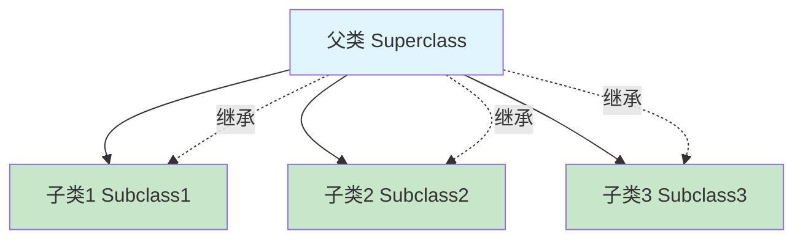
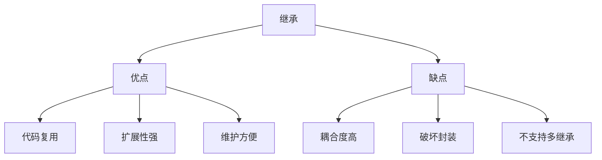
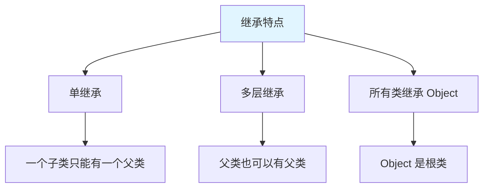
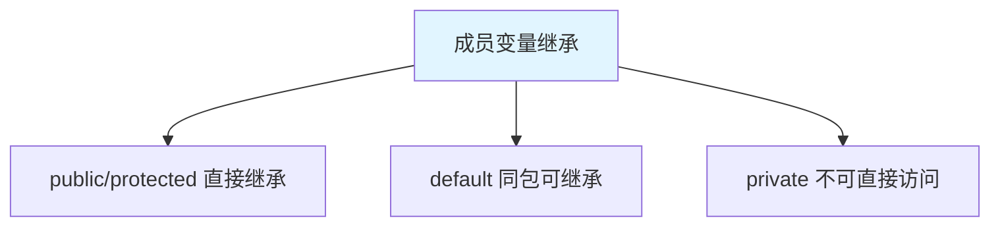
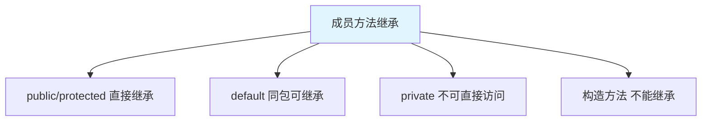
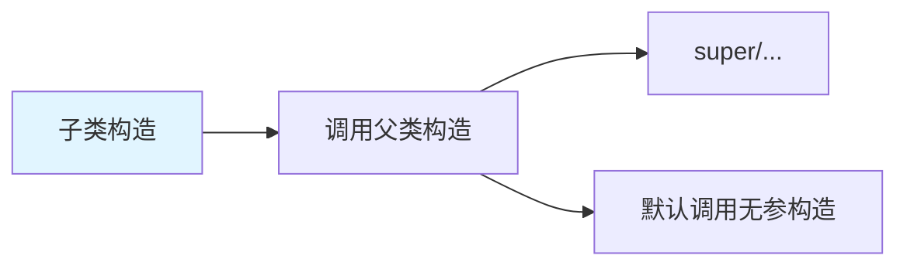
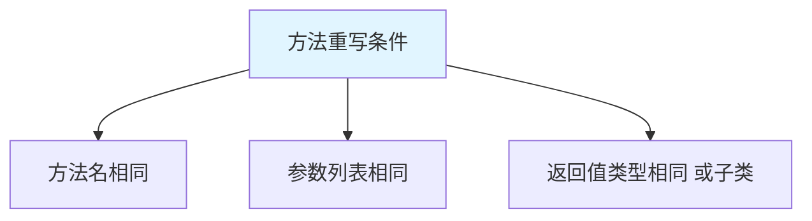
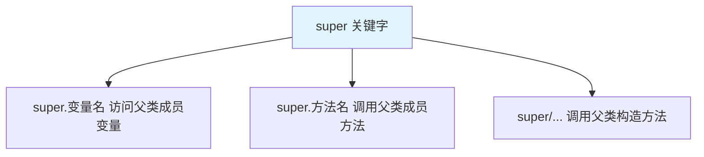
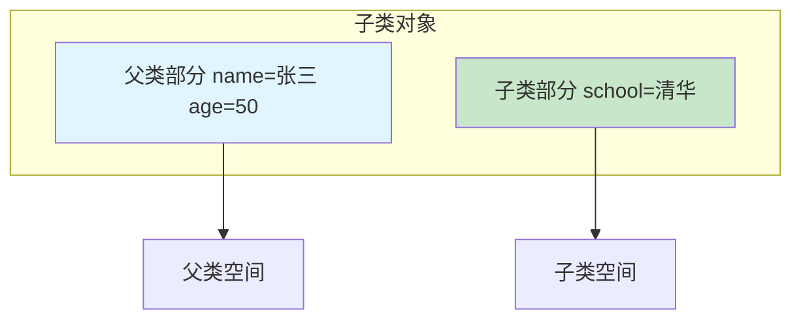
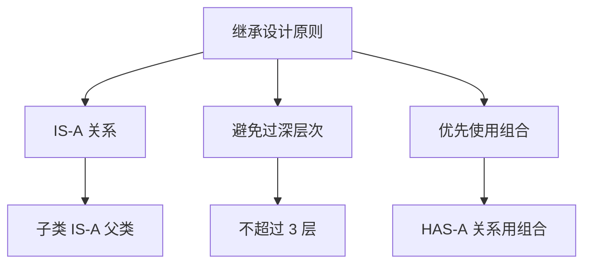

# 继承

继承(Inheritance)是面向对象三大特性之一，指**从已有类创建新类**，新类拥有已有类的属性和方法。

## 继承概述

### 什么是继承



**继承的核心思想**：

1. **代码复用**：子类拥有父类的属性和方法
2. **扩展性**：子类可以添加新属性和方法
3. **维护性**：统一修改父类，所有子类生效

::: tip 生活中的继承

| 生活场景 | 继承体现 |
|---------|---------|
| 生物 | 子女继承父母的部分特征 |
| 产品 | iPhone 15 继承 iPhone 14 的设计 |
| 学科 | Java、Python、C++ 都是编程语言 |

:::

### 继承的优缺点



## extends 关键字

### 继承的语法

```java
修饰符 class 子类名 extends 父类名 {
    // 子类内容
}
```

### 基本示例

```java
// 父类
class Person {
    private String name;
    private int age;
    
    public Person() {
    }
    
    public Person(String name, int age) {
        this.name = name;
        this.age = age;
    }
    
    public void eat() {
        System.out.println("吃饭");
    }
    
    public void sleep() {
        System.out.println("睡觉");
    }
    
    // getter/setter 省略...
}

// 子类继承父类
class Student extends Person {
    private String school;
    
    public Student(String name, int age, String school) {
        super(name, age);  // 调用父类构造
        this.school = school;
    }
    
    public void study() {
        System.out.println("学习");
    }
}

class Teacher extends Person {
    private String subject;
    
    public Teacher(String name, int age, String subject) {
        super(name, age);
        this.subject = subject;
    }
    
    public void teach() {
        System.out.println("教书");
    }
}

public class InheritanceDemo {
    public static void main(String[] args) {
        Student s = new Student("张三", 18, "清华大学");
        s.eat();    // 继承自父类
        s.sleep();  // 继承自父类
        s.study();  // 子类自己的方法
        
        Teacher t = new Teacher("李四", 35, "数学");
        t.eat();    // 继承自父类
        t.teach();  // 子类自己的方法
    }
}
```

### 继承的特点



```java
// 1. 单继承
class A {}
class B extends A {}
// class C extends B, A {}  // ❌ 编译错误：只能继承一个父类

// 2. 多层继承
class GrandParent {}
class Parent extends GrandParent {}
class Child extends Parent {}  // Child 拥有所有父类的成员

// 3. 所有类都继承 Object
class MyClass extends Object {}  // 默认继承 Object
class YourClass {}  // 默认也继承 Object
```

## 成员变量的继承

### 变量继承规则



### 变量继承示例

```java
class Father {
    public int pub = 10;
    protected int pro = 20;
    int def = 30;  // default
    private int pri = 40;
}

class Son extends Father {
    public void show() {
        System.out.println(pub);  // ✅ public
        System.out.println(pro);  // ✅ protected
        System.out.println(def);  // ✅ default（同包）
        // System.out.println(pri);  // ❌ private
    }
}

class DifferentPackage {
    public static void main(String[] args) {
        Son s = new Son();
        System.out.println(s.pub);  // ✅ public
        // System.out.println(s.pro);  // ❌ 不同包
        // System.out.println(s.def);  // ❌ 不同包
    }
}
```

### 变量重名问题

```java
class Father {
    int num = 10;
}

class Son extends Father {
    int num = 20;  // 子类变量与父类重名
    
    public void show() {
        int num = 30;  // 局部变量
        
        System.out.println(num);        // 30（局部变量）
        System.out.println(this.num);    // 20（子类成员变量）
        System.out.println(super.num);   // 10（父类成员变量）
    }
}
```

## 成员方法的继承

### 方法继承规则



### 方法继承示例

```java
class Animal {
    public void eat() {
        System.out.println("动物吃饭");
    }
    
    public void sleep() {
        System.out.println("动物睡觉");
    }
    
    private void secret() {
        System.out.println("私有方法");
    }
}

class Dog extends Animal {
    public void bark() {
        System.out.println("狗叫");
    }
    
    public void test() {
        eat();      // ✅ 继承的方法
        sleep();    // ✅ 继承的方法
        // secret();  // ❌ 私有方法
    }
}

public class MethodInherit {
    public static void main(String[] args) {
        Dog dog = new Dog();
        dog.eat();    // 动物吃饭
        dog.sleep();  // 动物睡觉
        dog.bark();   // 狗叫
    }
}
```

### 构造方法的继承



```java
class Father {
    private String name;
    
    public Father() {
        System.out.println("Father 无参构造");
    }
    
    public Father(String name) {
        this.name = name;
        System.out.println("Father 有参构造");
    }
}

class Son extends Father {
    private int age;
    
    public Son() {
        // super();  // 默认调用父类无参构造
        System.out.println("Son 无参构造");
    }
    
    public Son(String name, int age) {
        super(name);  // 调用父类有参构造
        this.age = age;
        System.out.println("Son 有参构造");
    }
}

public class ConstructorInherit {
    public static void main(String[] args) {
        Son s1 = new Son();
        // 输出：
        // Father 无参构造
        // Son 无参构造
        
        Son s2 = new Son("张三", 18);
        // 输出：
        // Father 有参构造
        // Son 有参构造
    }
}
```

::: warning 构造方法注意事项

```java
class Father {
    public Father(String name) {  // 没有无参构造
        // ...
    }
}

class Son extends Father {
    public Son() {
        // super();  // ❌ 编译错误：父类没有无参构造
        super("默认名字");  // ✅ 必须显式调用父类构造
    }
}
```

:::

## 方法重写 (Override)

### 什么是方法重写

**方法重写**：子类中定义与父类**完全相同**的方法，覆盖父类的实现。



### 方法重写示例

```java
class Animal {
    public void eat() {
        System.out.println("动物吃东西");
    }
    
    public void sleep() {
        System.out.println("动物睡觉");
    }
}

class Dog extends Animal {
    // 重写 eat 方法
    @Override
    public void eat() {
        System.out.println("狗吃骨头");
    }
    
    // 重写 sleep 方法
    @Override
    public void sleep() {
        System.out.println("狗趴着睡觉");
    }
    
    // 新增方法
    public void bark() {
        System.out.println("汪汪叫");
    }
}

class Cat extends Animal {
    @Override
    public void eat() {
        System.out.println("猫吃鱼");
    }
    
    @Override
    public void sleep() {
        System.out.println("猫蜷缩睡觉");
    }
    
    public void meow() {
        System.out.println("喵喵叫");
    }
}

public class OverrideDemo {
    public static void main(String[] args) {
        Dog dog = new Dog();
        dog.eat();    // 狗吃骨头（重写后）
        dog.sleep();  // 狗趴着睡觉（重写后）
        
        Cat cat = new Cat();
        cat.eat();    // 猫吃鱼（重写后）
        cat.sleep();  // 猫蜷缩睡觉（重写后）
        
        // 多态
        Animal a1 = new Dog();
        Animal a2 = new Cat();
        a1.eat();     // 狗吃骨头（动态绑定）
        a2.eat();     // 猫吃鱼（动态绑定）
    }
}
```

### @Override 注解

```java
class Parent {
    public void method() {
        System.out.println("父类方法");
    }
}

class Child extends Parent {
    // @Override 注解：检查是否正确重写
    @Override
    public void method() {
        System.out.println("子类方法");
    }
    
    // 错误示例
    // @Override
    // public void Method() {  // ❌ 编译错误：方法名不匹配
    //     System.out.println("子类方法");
    // }
    
    // @Override
    // public void method(String s) {  // ❌ 编译错误：参数不匹配
    //     System.out.println("子类方法");
    // }
}
```

::: tip 方法重写 vs 方法重载

| 特性 | 方法重写 (Override) | 方法重载 (Overload) |
|------|---------------------|---------------------|
| 发生位置 | 子类和父类之间 | 同一个类中 |
| 方法名 | 必须相同 | 必须相同 |
| 参数列表 | 必须相同 | 必须不同 |
| 返回值 | 相同或子类 | 无关 |
| 访问权限 | 不能更严 | 无关 |

:::

### 重写的注意事项

```java
class Father {
    public void method1() {}
    protected void method2() {}
    public static void method3() {}
    private void method4() {}
    public final void method5() {}
}

class Son extends Father {
    @Override
    public void method1() {}  // ✅ public → public
    
    @Override
    public void method2() {}  // ✅ protected → public（权限可以放宽）
    
    // @Override
    // public static void method3() {}  // ❌ 静态方法不能重写
    
    // @Override
    // private void method4() {}  // ❌ 私有方法不能重写（访问不到）
    
    // @Override
    // public void method5() {}  // ❌ final 方法不能重写
}
```

## super 关键字

### super 的三种用法



### super 使用示例

```java
class Father {
    String name = "父亲";
    int age = 50;
    
    public Father() {
        System.out.println("Father 无参构造");
    }
    
    public Father(String name) {
        this.name = name;
        System.out.println("Father 有参构造");
    }
    
    public void show() {
        System.out.println("Father: name=" + name + ", age=" + age);
    }
    
    public void eat() {
        System.out.println("父亲吃饭");
    }
}

class Son extends Father {
    String name = "儿子";
    int age = 20;
    
    public Son() {
        super();  // 调用父类无参构造
        System.out.println("Son 无参构造");
    }
    
    public Son(String name) {
        super(name);  // 调用父类有参构造
        System.out.println("Son 有参构造");
    }
    
    // 1. super.变量名
    public void showVariable() {
        System.out.println(name);        // 儿子（子类）
        System.out.println(this.name);   // 儿子（子类）
        System.out.println(super.name);  // 父亲（父类）
        
        System.out.println(age);         // 20（子类）
        System.out.println(super.age);   // 50（父类）
    }
    
    // 2. super.方法名
    public void showMethod() {
        eat();           // 子类重写的方法
        super.eat();     // 父类的方法
    }
    
    // 重写方法
    @Override
    public void show() {
        System.out.println("Son: name=" + name + ", age=" + age);
        super.show();  // 调用父类的 show 方法
    }
    
    @Override
    public void eat() {
        System.out.println("儿子吃饭");
    }
}

public class SuperDemo {
    public static void main(String[] args) {
        Son son = new Son();
        son.showVariable();
        System.out.println();
        son.showMethod();
        System.out.println();
        son.show();
    }
}
```

### super 与 this 的区别

| 特性 | this | super |
|------|------|-------|
| 访问成员变量 | 本类成员变量 | 父类成员变量 |
| 调用成员方法 | 本类成员方法 | 父类成员方法 |
| 调用构造方法 | 本类构造方法 | 父类构造方法 |
| 代表 | 当前对象 | 父类对象 |

```java
class Parent {
    int x = 10;
}

class Child extends Parent {
    int x = 20;
    
    public void show() {
        int x = 30;  // 局部变量
        
        System.out.println(x);        // 30（局部变量）
        System.out.println(this.x);   // 20（子类成员变量）
        System.out.println(super.x);  // 10（父类成员变量）
    }
}
```

## 继承中的内存图



```java
class Father {
    String name;
    int age;
    
    public Father(String name, int age) {
        this.name = name;
        this.age = age;
    }
}

class Son extends Father {
    String school;
    
    public Son(String name, int age, String school) {
        super(name, age);  // 初始化父类部分
        this.school = school;  // 初始化子类部分
    }
}

// 子类对象包含两部分：父类部分 + 子类部分
Son son = new Son("张三", 50, "清华");
```

## 继承的应用场景

### 模板方法模式

```java
/**
 * 模板方法模式：定义算法骨架，子类实现具体步骤
 */
abstract class BankTemplate {
    // 模板方法：final 不可重写
    public final void takeNumber() {
        System.out.println("取号");
    }
    
    // 抽象方法：子类必须实现
    public abstract void transact();
    
    public final void evaluate() {
        System.out.println("评分");
    }
    
    // 业务流程
    public final void process() {
        takeNumber();
        transact();  // 钩子方法
        evaluate();
    }
}

class DrawMoney extends BankTemplate {
    @Override
    public void transact() {
        System.out.println("取款");
    }
}

class DepositMoney extends BankTemplate {
    @Override
    public void transact() {
        System.out.println("存款");
    }
}

class TransferMoney extends BankTemplate {
    @Override
    public void transact() {
        System.out.println("转账");
    }
}

public class TemplatePattern {
    public static void main(String[] args) {
        BankTemplate draw = new DrawMoney();
        draw.process();
        System.out.println();
        
        BankTemplate deposit = new DepositMoney();
        deposit.process();
    }
}
```

### 员工管理系统

```java
// 员工基类
abstract class Employee {
    private String name;
    private int id;
    private double salary;
    
    public Employee(String name, int id, double salary) {
        this.name = name;
        this.id = id;
        this.salary = salary;
    }
    
    // 抽象方法：计算工资
    public abstract double calculateSalary();
    
    // 工作方法
    public void work() {
        System.out.println(name + "正在工作");
    }
    
    // getter/setter
    public String getName() {
        return name;
    }
    
    public int getId() {
        return id;
    }
    
    public double getSalary() {
        return salary;
    }
    
    public void setSalary(double salary) {
        this.salary = salary;
    }
    
    @Override
    public String toString() {
        return String.format("工号：%d, 姓名：%s, 工资：%.2f", id, name, salary);
    }
}

// 程序员
class Programmer extends Employee {
    private double overtimePay;  // 加班费
    
    public Programmer(String name, int id, double salary, double overtimePay) {
        super(name, id, salary);
        this.overtimePay = overtimePay;
    }
    
    @Override
    public double calculateSalary() {
        return getSalary() + overtimePay;
    }
    
    @Override
    public void work() {
        System.out.println(getName() + "正在写代码");
    }
}

// 经理
class Manager extends Employee {
    private double bonus;  // 奖金
    
    public Manager(String name, int id, double salary, double bonus) {
        super(name, id, salary);
        this.bonus = bonus;
    }
    
    @Override
    public double calculateSalary() {
        return getSalary() + bonus;
    }
    
    @Override
    public void work() {
        System.out.println(getName() + "正在管理团队");
    }
}

// 测试类
public class EmployeeSystem {
    public static void main(String[] args) {
        Employee[] employees = {
            new Programmer("张三", 1001, 8000, 2000),
            new Programmer("李四", 1002, 9000, 1500),
            new Manager("王五", 2001, 15000, 5000)
        };
        
        System.out.println("======== 员工列表 ==========");
        for (Employee emp : employees) {
            emp.work();
            System.out.println(emp + ", 实发工资：" + emp.calculateSalary());
            System.out.println();
        }
    }
}
```

## 继承的注意事项

### 不支持多继承

```java
class A {}
class B {}
class C {}

// class D extends A, B {}  // ❌ 编译错误：Java 不支持多继承

// 解决方案：多层继承
class A {}
class B extends A {}
class C extends B {}  // ✅ 可以

// 解决方案：使用接口
interface A {}
interface B {}
class C implements A, B {}  // ✅ 接口可以多实现
```

### 继承关系设计原则



```java
// ✅ 好的设计：IS-A 关系
class Animal {}
class Dog extends Animal {}  // Dog IS-A Animal

// ❌ 不好的设计
class Engine {}
class Car extends Engine {}  // Car IS-A Engine? 不合理！

// ✅ 改进：使用组合
class Car {
    private Engine engine;  // Car HAS-A Engine
}
```

## 小结

::: tip 核心要点

1. **继承**：从已有类创建新类，代码复用
2. **extends**：继承关键字，Java 只支持单继承
3. **成员继承**：public/protected 可继承，private 不可直接访问
4. **方法重写**：子类重新定义父类方法，@Override 注解检查
5. **super**：访问父类成员，super(...) 调用父类构造
6. **继承设计**：IS-A 关系用继承，HAS-A 关系用组合

:::

::: info 下一步
- [多态](/java/base/02-oop/polymorphism.md) - 学习 Java 多态特性
:::
