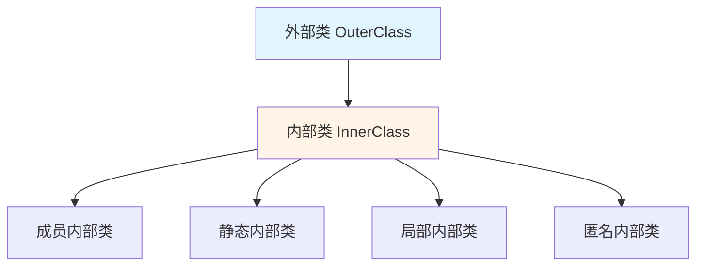
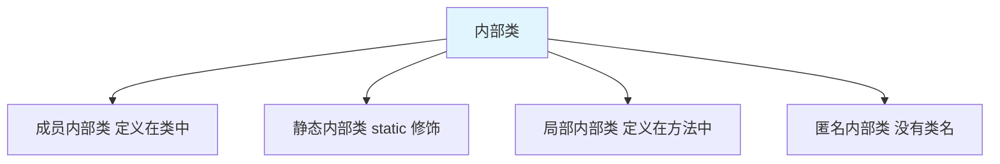
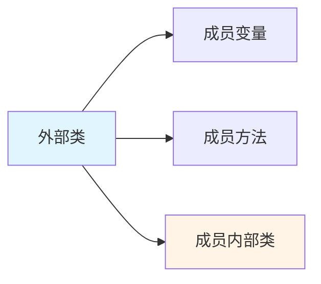
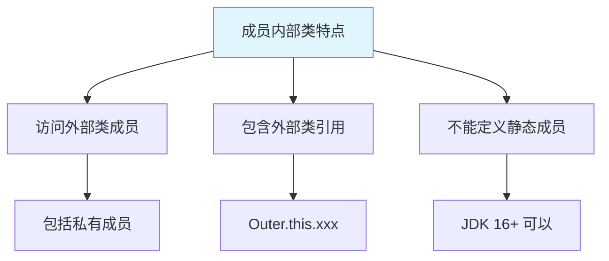
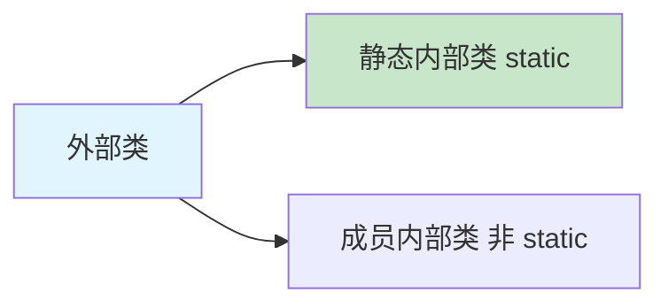
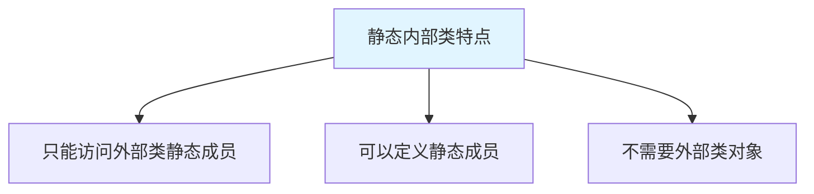
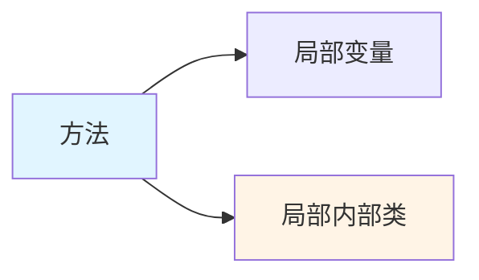
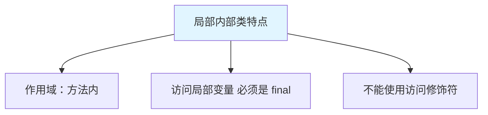
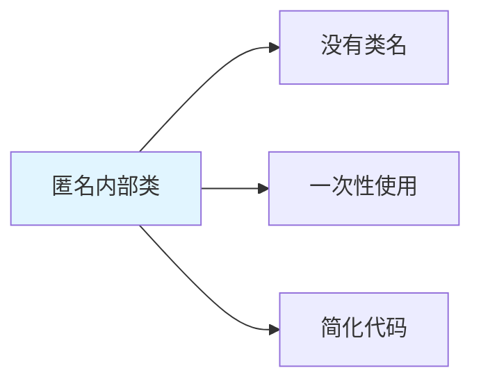
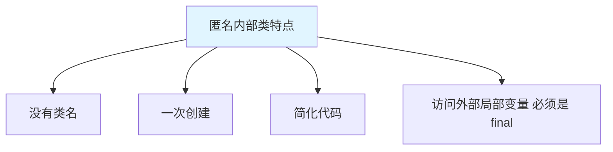

# 内部类

内部类(Inner Class)是定义在另一个类内部的类，提供了更好的封装性和访问控制。

## 内部类概述

### 什么是内部类



**内部类的特点**：

1. 定义在另一个类内部
2. 可以访问外部类的所有成员（包括私有成员）
3. 可以使用 protected、private 修饰
4. 提供了更好的封装性

### 内部类的分类



## 成员内部类

### 什么是成员内部类

**成员内部类**：定义在类中，与方法同级的内部类。



### 成员内部类示例

```java
// 外部类
class Outer {
    private int outerNum = 10;
    private static int outerStaticNum = 20;
    
    // 成员内部类
    class Inner {
        private int innerNum = 100;
        
        public void show() {
            // 访问外部类成员（包括私有成员）
            System.out.println("外部类成员变量：" + outerNum);
            System.out.println("外部类静态变量：" + outerStaticNum);
            System.out.println("内部类成员变量：" + innerNum);
        }
    }
    
    // 外部类方法
    public void method() {
        Inner inner = new Inner();
        inner.show();
    }
}

public class MemberInnerClass {
    public static void main(String[] args) {
        // 1. 在外部类中创建内部类对象
        Outer outer = new Outer();
        outer.method();
        
        // 2. 在其他类中创建内部类对象
        // Inner inner = new Inner();  // ❌ 编译错误
        
        // 格式：外部类.内部类 对象名 = 外部类对象.new 内部类();
        Outer.Inner inner = outer.new Inner();
        inner.show();
        
        // 或一步创建
        Outer.Inner inner2 = new Outer().new Inner();
        inner2.show();
    }
}
```

### 成员内部类的特点



```java
class Outer {
    private int num = 10;
    
    class Inner {
        private int num = 20;
        
        public void show() {
            int num = 30;  // 局部变量
            
            System.out.println(num);           // 30（局部变量）
            System.out.println(this.num);      // 20（内部类成员变量）
            System.out.println(Outer.this.num); // 10（外部类成员变量）
        }
    }
}
```

## 静态内部类

### 什么是静态内部类

**静态内部类**：使用 `static` 修饰的成员内部类。



### 静态内部类示例

```java
class Outer {
    private int num = 10;
    private static int staticNum = 20;
    
    // 静态内部类
    static class StaticInner {
        private int innerNum = 100;
        private static int innerStaticNum = 200;
        
        public void show() {
            // System.out.println(num);  // ❌ 不能访问外部类非静态成员
            System.out.println("外部类静态变量：" + staticNum);
            System.out.println("内部类成员变量：" + innerNum);
            System.out.println("内部类静态变量：" + innerStaticNum);
        }
        
        // 静态方法
        public static void staticShow() {
            System.out.println("静态内部类的静态方法");
        }
    }
}

public class StaticInnerClass {
    public static void main(String[] args) {
        // 创建静态内部类对象（不需要外部类对象）
        Outer.StaticInner inner = new Outer.StaticInner();
        inner.show();
        
        // 调用静态方法
        Outer.StaticInner.staticShow();
    }
}
```

### 静态内部类的特点



| 特性 | 成员内部类 | 静态内部类 |
|------|------------|------------|
| static 修饰 | 无 | 有 |
| 访问外部类成员 | 所有成员 | 只能静态成员 |
| 定义静态成员 | ❌ JDK 16 之前 | ✅ 可以 |
| 创建对象 | 需要外部类对象 | 不需要外部类对象 |

## 局部内部类

### 什么是局部内部类

**局部内部类**：定义在方法中的内部类。



### 局部内部类示例

```java
class Outer {
    private int num = 10;
    
    public void method() {
        // 局部变量
        int localNum = 20;
        
        // 局部内部类
        class LocalInner {
            private int innerNum = 30;
            
            public void show() {
                System.out.println("外部类成员变量：" + num);
                System.out.println("局部变量：" + localNum);
                System.out.println("内部类成员变量：" + innerNum);
            }
        }
        
        // 在方法内创建局部内部类对象
        LocalInner inner = new LocalInner();
        inner.show();
    }
}

public class LocalInnerClass {
    public static void main(String[] args) {
        Outer outer = new Outer();
        outer.method();
    }
}
```

### 局部内部类的特点



```java
class Outer {
    public void method() {
        // 局部变量（实际上是 final）
        int num = 10;
        // num = 20;  // ❌ 不能修改
        
        // 局部内部类
        class LocalInner {
            public void show() {
                // 访问局部变量（JDK 8+ 自动推断为 final）
                System.out.println(num);  // ✅
                // num = 20;  // ❌ 局部内部类访问的局部变量实际上是 final
            }
        }
    }
}
```

::: tip 为什么局部变量必须是 final？

```java
// 为什么局部内部类访问的局部变量必须是 final？

public void method() {
    int num = 10;
    
    class LocalInner {
        public void show() {
            System.out.println(num);
        }
    }
    
    LocalInner inner = new LocalInner();
    // 方法结束后，num 出栈
    // 但 inner 对象可能还在堆中
    // 为了保证数据一致性，num 必须是 final（不可变）
}
```

:::

## 匿名内部类

### 什么是匿名内部类

**匿名内部类**：没有类名的内部类，简化了创建子类对象的代码。



### 匿名内部类语法

```java
// 格式
new 父类/接口() {
    // 类体
};

// 示例
new Thread() {
    @Override
    public void run() {
        // 代码
    }
}.start();
```

### 匿名内部类示例

```java
// 抽象类
abstract class Animal {
    public abstract void eat();
}

// 接口
interface Flyable {
    void fly();
}

public class AnonymousInnerClass {
    public static void main(String[] args) {
        // 1. 匿名内部类：继承抽象类
        Animal dog = new Animal() {
            @Override
            public void eat() {
                System.out.println("狗吃骨头");
            }
        };
        dog.eat();
        
        // 2. 匿名内部类：实现接口
        Flyable bird = new Flyable() {
            @Override
            public void fly() {
                System.out.println("鸟儿飞翔");
            }
        };
        bird.fly();
        
        // 3. 匿名内部类：作为方法参数
        useAnimal(new Animal() {
            @Override
            public void eat() {
                System.out.println("猫吃鱼");
            }
        });
        
        // 4. 匿名内部类：一次性使用
        new Flyable() {
            @Override
            public void fly() {
                System.out.println("飞机飞行");
            }
        }.fly();
    }
    
    public static void useAnimal(Animal animal) {
        animal.eat();
    }
}
```

### 匿名内部类的特点



::: tip 匿名内部类 vs Lambda

```java
// 匿名内部类（旧方式）
new Thread(new Runnable() {
    @Override
    public void run() {
        System.out.println("线程运行");
    }
}).start();

// Lambda 表达式（新方式，JDK 8+）
new Thread(() -> System.out.println("线程运行")).start();
```

:::

## 内部类的应用场景

### 实现多继承

```java
class Father {
    public void strong() {
        System.out.println("父亲很强壮");
    }
}

class Mother {
    public void kind() {
        System.out.println("母亲很善良");
    }
}

class Son {
    // 内部类继承 Father
    class Father_ extends Father {
        public void strong() {
            System.out.println("儿子继承父亲的强壮");
        }
    }
    
    // 内部类继承 Mother
    class Mother_ extends Mother {
        public void kind() {
            System.out.println("儿子继承母亲的善良");
        }
    }
    
    // 提供方法
    public void strong() {
        new Father_().strong();
    }
    
    public void kind() {
        new Mother_().kind();
    }
}

public class MultipleInheritance {
    public static void main(String[] args) {
        Son son = new Son();
        son.strong();
        son.kind();
    }
}
```

### 封装实现

```java
// 链表节点
class LinkedList {
    private Node head;  // 头节点
    private int size;
    
    // 私有内部类：节点
    private static class Node {
        int data;
        Node next;
        
        Node(int data) {
            this.data = data;
        }
    }
    
    // 添加元素
    public void add(int data) {
        Node newNode = new Node(data);
        if (head == null) {
            head = newNode;
        } else {
            Node current = head;
            while (current.next != null) {
                current = current.next;
            }
            current.next = newNode;
        }
        size++;
    }
    
    // 显示元素
    public void display() {
        Node current = head;
        while (current != null) {
            System.out.print(current.data + " ");
            current = current.next;
        }
        System.out.println();
    }
}

public class EncapsulationDemo {
    public static void main(String[] args) {
        LinkedList list = new LinkedList();
        list.add(10);
        list.add(20);
        list.add(30);
        list.display();
    }
}
```

### 事件处理

```java
import javax.swing.*;
import java.awt.*;
import java.awt.event.*;

public class EventDemo {
    public static void main(String[] args) {
        JFrame frame = new JFrame("按钮事件");
        JButton button = new JButton("点击我");
        
        // 匿名内部类：事件监听
        button.addActionListener(new ActionListener() {
            @Override
            public void actionPerformed(ActionEvent e) {
                System.out.println("按钮被点击了");
                JOptionPane.showMessageDialog(frame, "Hello!");
            }
        });
        
        frame.add(button);
        frame.setSize(300, 200);
        frame.setDefaultCloseOperation(JFrame.EXIT_ON_CLOSE);
        frame.setVisible(true);
    }
}
```

## 实战案例

### 迭代器模式

```java
// 自定义容器
class MyContainer {
    private Object[] elements;
    private int size;
    
    public MyContainer(int capacity) {
        elements = new Object[capacity];
        size = 0;
    }
    
    public void add(Object element) {
        if (size < elements.length) {
            elements[size++] = element;
        }
    }
    
    // 返回迭代器（匿名内部类实现）
    public Iterator iterator() {
        return new Iterator() {
            private int index = 0;
            
            @Override
            public boolean hasNext() {
                return index < size;
            }
            
            @Override
            public Object next() {
                return elements[index++];
            }
        };
    }
}

// 迭代器接口
interface Iterator {
    boolean hasNext();
    Object next();
}

public class IteratorDemo {
    public static void main(String[] args) {
        MyContainer container = new MyContainer(5);
        container.add("Hello");
        container.add("World");
        container.add("Java");
        
        // 使用迭代器遍历
        Iterator it = container.iterator();
        while (it.hasNext()) {
            System.out.println(it.next());
        }
    }
}
```

### 链表实现

```java
class MyLinkedList {
    private Node head;
    private int size;
    
    // 私有内部类：节点
    private class Node {
        Object data;
        Node next;
        
        Node(Object data) {
            this.data = data;
        }
    }
    
    public void add(Object data) {
        Node newNode = new Node(data);
        if (head == null) {
            head = newNode;
        } else {
            Node current = head;
            while (current.next != null) {
                current = current.next;
            }
            current.next = newNode;
        }
        size++;
    }
    
    public Object get(int index) {
        if (index < 0 || index >= size) {
            throw new IndexOutOfBoundsException();
        }
        
        Node current = head;
        for (int i = 0; i < index; i++) {
            current = current.next;
        }
        return current.data;
    }
    
    public int size() {
        return size;
    }
}

public class LinkedListDemo {
    public static void main(String[] args) {
        MyLinkedList list = new MyLinkedList();
        list.add("Java");
        list.add("Python");
        list.add("C++");
        
        for (int i = 0; i < list.size(); i++) {
            System.out.println(list.get(i));
        }
    }
}
```

## 小结

::: tip 核心要点

1. **成员内部类**：定义在类中，可访问外部类所有成员
2. **静态内部类**：static 修饰，只能访问外部类静态成员
3. **局部内部类**：定义在方法中，访问的局部变量必须是 final
4. **匿名内部类**：没有类名，简化代码，一次性使用
5. **应用场景**：实现多继承、封装实现、事件处理

:::

::: info 下一步
- [数组](/java/base/03-array-string/array.md) - 学习数组
:::
