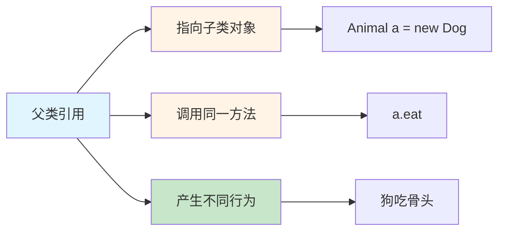
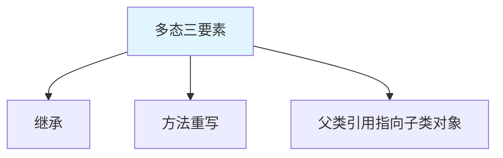
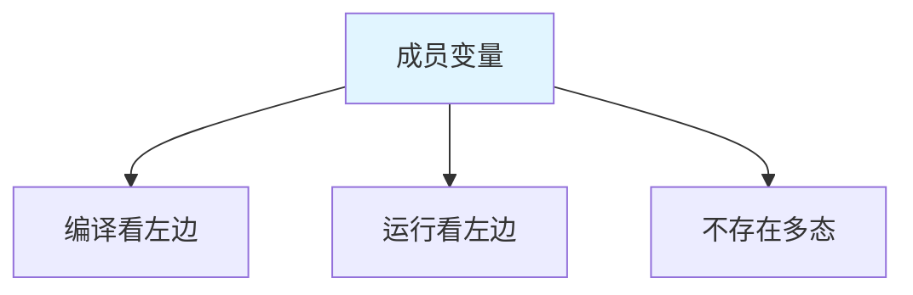
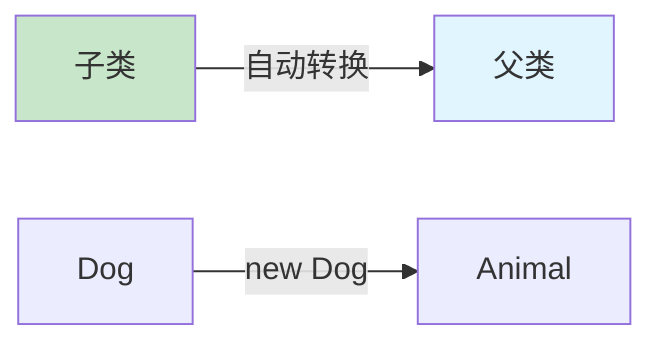
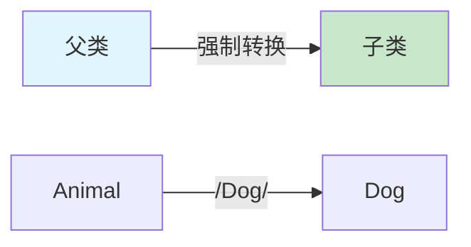
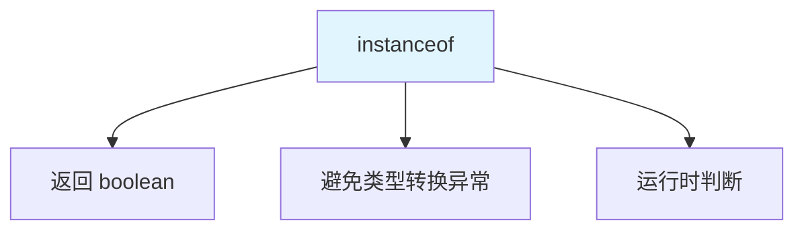
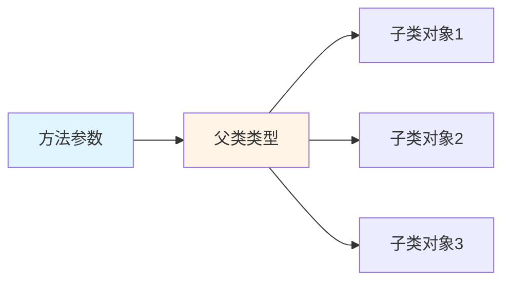
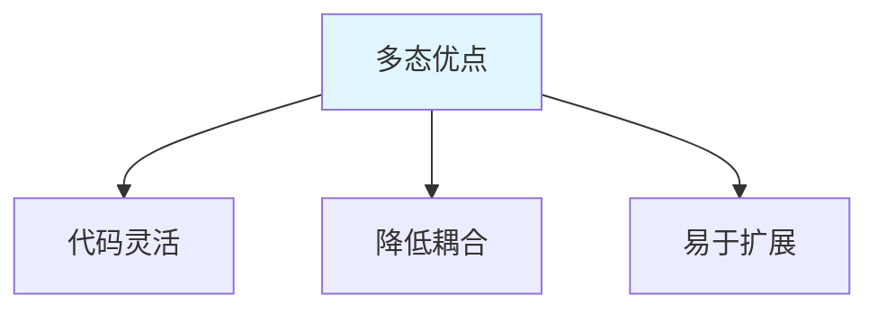
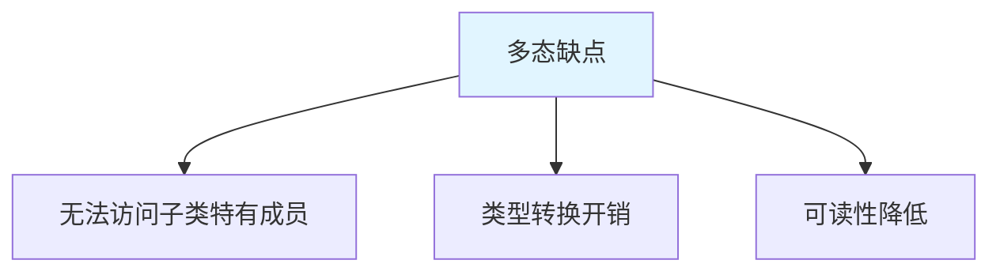

# 多态

多态(Polymorphism)是面向对象三大特性中最重要最复杂的一个，指**同一个行为具有多个不同表现形式**。

## 多态概述

### 什么是多态



**多态的核心思想**：

1. **同一行为，不同表现**：同一个方法调用，产生不同的执行结果
2. **编译看左边，运行看右边**：编译时看父类类型，运行时执行子类方法
3. **动态绑定**：运行时根据实际对象类型调用方法

::: tip 生活中的多态

| 生活场景 | 多态体现 |
|---------|---------|
| 按 F1 键 | Word 中弹出帮助，浏览器中打开网页 |
| 打印 | 连接打印机打印纸质，连接 PDF 打印成文件 |
| 切换用户 | 切换到管理员，切换到普通用户 |

:::

### 多态的前提条件



1. **继承关系**：必须有父类和子类
2. **方法重写**：子类重写父类方法
3. **向上转型**：父类引用指向子类对象

```java
// 多态的前提
class Animal {  // 1. 父类
    public void eat() {
        System.out.println("动物吃东西");
    }
}

class Dog extends Animal {  // 继承关系
    @Override
    public void eat() {  // 2. 方法重写
        System.out.println("狗吃骨头");
    }
}

class Cat extends Animal {
    @Override
    public void eat() {  // 2. 方法重写
        System.out.println("猫吃鱼");
    }
}

public class PolymorphismDemo {
    public static void main(String[] args) {
        // 3. 父类引用指向子类对象
        Animal a1 = new Dog();  // 多态
        Animal a2 = new Cat();  // 多态
        
        a1.eat();  // 狗吃骨头（动态绑定）
        a2.eat();  // 猫吃鱼（动态绑定）
    }
}
```

## 多态的实现

### 成员方法的多态

```java
class Animal {
    public void eat() {
        System.out.println("动物吃东西");
    }
    
    public void sleep() {
        System.out.println("动物睡觉");
    }
}

class Dog extends Animal {
    @Override
    public void eat() {  // 重写
        System.out.println("狗吃骨头");
    }
    
    @Override
    public void sleep() {  // 重写
        System.out.println("狗趴着睡觉");
    }
    
    public void bark() {  // 子类特有方法
        System.out.println("汪汪叫");
    }
}

public class MethodPolymorphism {
    public static void main(String[] args) {
        Animal a = new Dog();  // 多态
        
        a.eat();    // 狗吃骨头（编译看 Animal，运行看 Dog）
        a.sleep();  // 狗趴着睡觉（编译看 Animal，运行看 Dog）
        // a.bark();  // ❌ 编译错误：父类引用无法调用子类特有方法
    }
}
```

### 成员变量的多态



```java
class Father {
    int num = 10;
    
    public void show() {
        System.out.println("Father: " + num);
    }
}

class Son extends Father {
    int num = 20;  // 变量重名
    
    @Override
    public void show() {
        System.out.println("Son: " + num);
    }
}

public class FieldPolymorphism {
    public static void main(String[] args) {
        Father f = new Son();  // 多态
        
        System.out.println(f.num);  // 10（编译和运行都看 Father）
        f.show();  // Son: 20（编译看 Father，运行看 Son）
    }
}
```

::: warning 重要区别

| 成员 | 编译时 | 运行时 | 是否多态 |
|------|--------|--------|----------|
| 成员变量 | 看左边 | 看左边 | ❌ 不存在多态 |
| 成员方法 | 看左边 | 看右边 | ✅ 存在多态 |
| 静态方法 | 看左边 | 看左边 | ❌ 不存在多态 |

:::

### 静态方法的多态

```java
class Parent {
    public static void method() {
        System.out.println("Parent 静态方法");
    }
}

class Child extends Parent {
    public static void method() {  // 静态方法不存在重写
        System.out.println("Child 静态方法");
    }
}

public class StaticPolymorphism {
    public static void main(String[] args) {
        Parent p = new Child();
        p.method();  // Parent 静态方法（编译和运行都看 Parent）
        
        Child c = new Child();
        c.method();  // Child 静态方法
    }
}
```

## 向上转型与向下转型

### 向上转型（自动类型转换）



**向上转型**：子类类型转换为父类类型，自动进行。

```java
class Animal {
    public void eat() {
        System.out.println("动物吃东西");
    }
}

class Dog extends Animal {
    @Override
    public void eat() {
        System.out.println("狗吃骨头");
    }
    
    public void bark() {
        System.out.println("汪汪叫");
    }
}

public class UpcastingDemo {
    public static void main(String[] args) {
        // 向上转型（自动）
        Animal a = new Dog();  // Dog → Animal
        
        a.eat();  // 狗吃骨头（多态调用）
        // a.bark();  // ❌ 编译错误：父类引用无法调用子类特有方法
        
        // 向上转型丢失子类特有功能
    }
}
```

### 向下转型（强制类型转换）



**向下转型**：父类类型转换为子类类型，必须强制转换。

```java
public class DowncastingDemo {
    public static void main(String[] args) {
        Animal a = new Dog();  // 向上转型
        
        // 向下转型（强制）
        Dog d = (Dog) a;  // Animal → Dog
        
        d.eat();   // 狗吃骨头
        d.bark();  // 汪汪叫（可以调用子类特有方法）
    }
}
```

::: danger 类型转换异常

```java
Animal a = new Cat();  // 实际是 Cat
Dog d = (Dog) a;  // ❌ 运行时异常：ClassCastException
```

:::

## instanceof 关键字

### instanceof 作用

**instanceof**：判断对象是否是某个类（或其子类）的实例。



### instanceof 使用

```java
class Animal {}
class Dog extends Animal {}
class Cat extends Animal {}

public class InstanceofDemo {
    public static void main(String[] args) {
        Animal a = new Dog();
        
        System.out.println(a instanceof Animal);  // true
        System.out.println(a instanceof Dog);     // true
        System.out.println(a instanceof Cat);     // false
        
        // 安全的类型转换
        if (a instanceof Dog) {
            Dog d = (Dog) a;  // ✅ 安全
            System.out.println("转换为 Dog");
        }
        
        if (a instanceof Cat) {
            Cat c = (Cat) a;  // 不会执行
        }
    }
}
```

### 类型转换最佳实践

```java
public class SafeCasting {
    public static void main(String[] args) {
        Animal[] animals = {
            new Dog(),
            new Cat(),
            new Dog()
        };
        
        for (Animal a : animals) {
            // 使用 instanceof 判断
            if (a instanceof Dog) {
                Dog dog = (Dog) a;
                dog.bark();
            } else if (a instanceof Cat) {
                Cat cat = (Cat) a;
                cat.meow();
            }
        }
    }
}
```

::: tip Java 14+ 模式匹配

```java
// Java 14+
if (a instanceof Dog dog) {  // 自动转换
    dog.bark();  // 直接使用
}
```

:::

## 多态的应用

### 多态作为方法参数



```java
class Animal {
    public void eat() {
        System.out.println("动物吃东西");
    }
}

class Dog extends Animal {
    @Override
    public void eat() {
        System.out.println("狗吃骨头");
    }
}

class Cat extends Animal {
    @Override
    public void eat() {
        System.out.println("猫吃鱼");
    }
}

public class PolymorphismParameter {
    // 父类类型作为参数
    public static void feed(Animal a) {
        a.eat();  // 多态调用
    }
    
    public static void main(String[] args) {
        feed(new Dog());  // 狗吃骨头
        feed(new Cat());  // 猫吃鱼
        feed(new Animal());  // 动物吃东西
    }
}
```

### 多态作为返回值

```java
public class PolymorphismReturn {
    // 返回值类型为父类
    public static Animal getAnimal(String type) {
        if ("dog".equals(type)) {
            return new Dog();
        } else if ("cat".equals(type)) {
            return new Cat();
        } else {
            return new Animal();
        }
    }
    
    public static void main(String[] args) {
        Animal a1 = getAnimal("dog");
        Animal a2 = getAnimal("cat");
        
        a1.eat();  // 狗吃骨头
        a2.eat();  // 猫吃鱼
    }
}
```

### 多态数组

```java
public class PolymorphismArray {
    public static void main(String[] args) {
        // 多态数组：父类类型数组存储子类对象
        Animal[] animals = {
            new Dog(),
            new Cat(),
            new Dog(),
            new Cat()
        };
        
        // 遍历数组
        for (Animal a : animals) {
            a.eat();  // 多态调用
        }
    }
}
```

## 多态的优缺点

### 多态的优点



```java
// 不使用多态：代码冗余
class Dog {
    public void eat() {
        System.out.println("狗吃骨头");
    }
}

class Cat {
    public void eat() {
        System.out.println("猫吃鱼");
    }
}

class Feeder {
    public void feedDog(Dog d) {
        d.eat();
    }
    
    public void feedCat(Cat c) {
        c.eat();
    }
    // 每增加一个动物，都需要添加新方法
}

// 使用多态：代码简洁
class Animal {
    public void eat() {
        System.out.println("动物吃东西");
    }
}

class Dog extends Animal {
    @Override
    public void eat() {
        System.out.println("狗吃骨头");
    }
}

class Cat extends Animal {
    @Override
    public void eat() {
        System.out.println("猫吃鱼");
    }
}

class Feeder {
    // 统一方法处理所有动物
    public void feed(Animal a) {
        a.eat();
    }
    // 增加新动物不需要修改此方法
}
```

### 多态的缺点



```java
class Animal {
    public void eat() {
        System.out.println("动物吃东西");
    }
}

class Dog extends Animal {
    @Override
    public void eat() {
        System.out.println("狗吃骨头");
    }
    
    public void bark() {
        System.out.println("汪汪叫");
    }
}

public class DisadvantageDemo {
    public static void main(String[] args) {
        Animal a = new Dog();
        a.eat();  // ✅ 可以调用
        
        // a.bark();  // ❌ 无法调用子类特有方法
        
        // 解决：向下转型
        if (a instanceof Dog) {
            Dog d = (Dog) a;
            d.bark();  // ✅ 可以调用
        }
    }
}
```

## 实战案例

### 图形计算器

```java
// 图形基类
abstract class Shape {
    private String color;
    
    public Shape(String color) {
        this.color = color;
    }
    
    // 抽象方法：计算面积
    public abstract double getArea();
    
    // 抽象方法：计算周长
    public abstract double getPerimeter();
    
    public String getColor() {
        return color;
    }
    
    public void display() {
        System.out.printf("颜色：%s, 面积：%.2f, 周长：%.2f\n",
                         color, getArea(), getPerimeter());
    }
}

// 圆形
class Circle extends Shape {
    private double radius;
    
    public Circle(String color, double radius) {
        super(color);
        this.radius = radius;
    }
    
    @Override
    public double getArea() {
        return Math.PI * radius * radius;
    }
    
    @Override
    public double getPerimeter() {
        return 2 * Math.PI * radius;
    }
}

// 矩形
class Rectangle extends Shape {
    private double width;
    private double height;
    
    public Rectangle(String color, double width, double height) {
        super(color);
        this.width = width;
        this.height = height;
    }
    
    @Override
    public double getArea() {
        return width * height;
    }
    
    @Override
    public double getPerimeter() {
        return 2 * (width + height);
    }
}

// 三角形
class Triangle extends Shape {
    private double a, b, c;  // 三条边
    
    public Triangle(String color, double a, double b, double c) {
        super(color);
        this.a = a;
        this.b = b;
        this.c = c;
    }
    
    @Override
    public double getArea() {
        // 海伦公式
        double p = (a + b + c) / 2;
        return Math.sqrt(p * (p - a) * (p - b) * (p - c));
    }
    
    @Override
    public double getPerimeter() {
        return a + b + c;
    }
}

// 图形管理器
public class ShapeManager {
    private Shape[] shapes;
    private int count;
    
    public ShapeManager(int capacity) {
        shapes = new Shape[capacity];
        count = 0;
    }
    
    // 添加图形（多态参数）
    public void addShape(Shape shape) {
        if (count < shapes.length) {
            shapes[count++] = shape;
            System.out.println("添加图形成功");
        } else {
            System.out.println("数组已满");
        }
    }
    
    // 显示所有图形（多态调用）
    public void displayAll() {
        System.out.println("======== 图形列表 ==========");
        for (int i = 0; i < count; i++) {
            shapes[i].display();
        }
    }
    
    // 计算总面积
    public double getTotalArea() {
        double total = 0;
        for (int i = 0; i < count; i++) {
            total += shapes[i].getArea();
        }
        return total;
    }
    
    public static void main(String[] args) {
        ShapeManager manager = new ShapeManager(10);
        
        // 添加不同类型的图形
        manager.addShape(new Circle("红色", 5));
        manager.addShape(new Rectangle("蓝色", 4, 6));
        manager.addShape(new Triangle("绿色", 3, 4, 5));
        
        // 显示所有图形
        manager.displayAll();
        
        // 计算总面积
        System.out.printf("总面积：%.2f\n", manager.getTotalArea());
    }
}
```

### USB 设备驱动

```java
// USB 接口
interface USB {
    void open();  // 开启设备
    void close(); // 关闭设备
    void work();  // 工作
}

// 鼠标
class Mouse implements USB {
    @Override
    public void open() {
        System.out.println("鼠标已连接");
    }
    
    @Override
    public void close() {
        System.out.println("鼠标已断开");
    }
    
    @Override
    public void work() {
        System.out.println("鼠标正在工作：点击");
    }
}

// 键盘
class Keyboard implements USB {
    @Override
    public void open() {
        System.out.println("键盘已连接");
    }
    
    @Override
    public void close() {
        System.out.println("键盘已断开");
    }
    
    @Override
    public void work() {
        System.out.println("键盘正在工作：打字");
    }
}

// U盘
class FlashDisk implements USB {
    @Override
    public void open() {
        System.out.println("U盘已连接");
    }
    
    @Override
    public void close() {
        System.out.println("U盘已断开");
    }
    
    @Override
    public void work() {
        System.out.println("U盘正在工作：读写数据");
    }
}

// 笔记本电脑
class Laptop {
    // 使用 USB 设备（多态参数）
    public void useUSB(USB usb) {
        usb.open();
        usb.work();
        usb.close();
    }
    
    public static void main(String[] args) {
        Laptop laptop = new Laptop();
        
        // 使用不同的 USB 设备
        laptop.useUSB(new Mouse());
        System.out.println();
        
        laptop.useUSB(new Keyboard());
        System.out.println();
        
        laptop.useUSB(new FlashDisk());
    }
}
```

## 小结

::: tip 核心要点

1. **多态**：同一行为，不同表现
2. **前提条件**：继承、方法重写、向上转型
3. **实现特点**：编译看左边，运行看右边
4. **类型转换**：向上转型（自动）、向下转型（强制）
5. **instanceof**：判断对象类型，避免 ClassCastException
6. **应用场景**：方法参数、返回值、数组

:::

::: info 下一步
- [抽象类与接口](/java/base/02-oop/abstract-interface.md) - 学习抽象类与接口
:::
