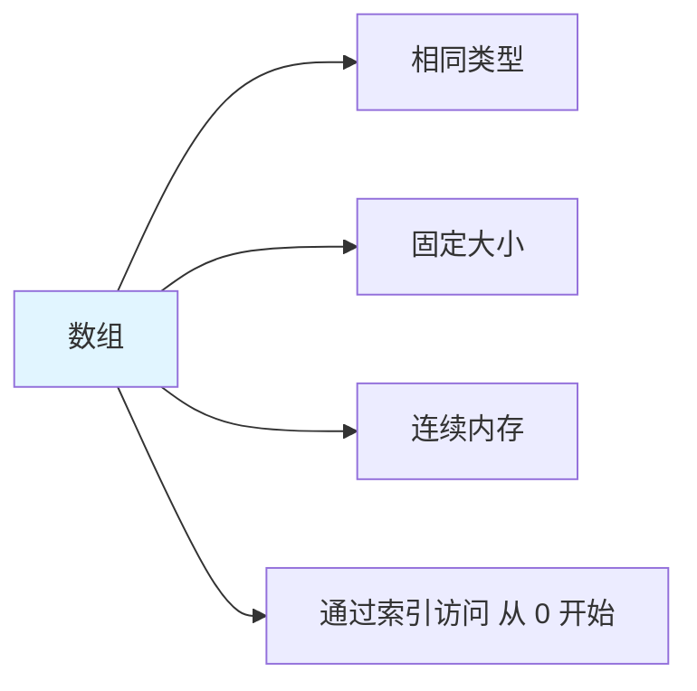
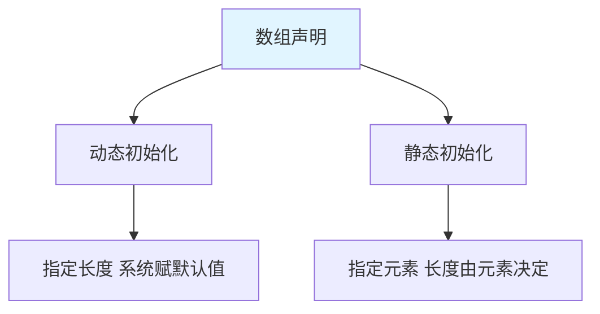
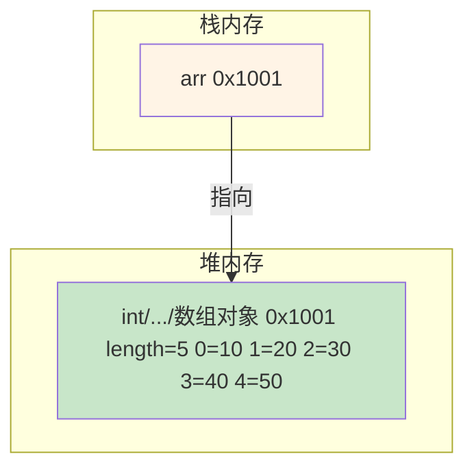
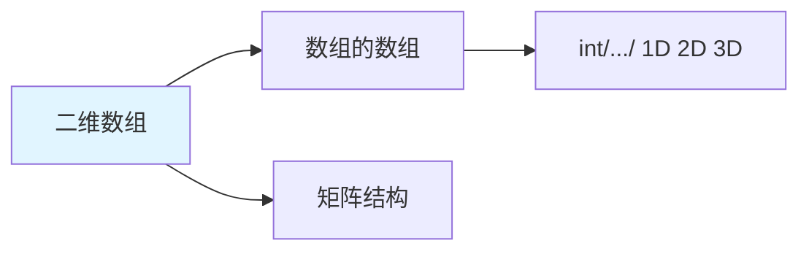
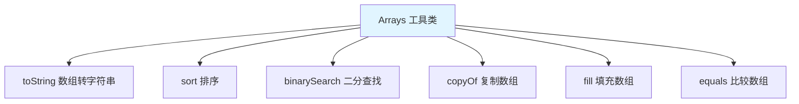

# 数组

数组(Array)是Java中最基本的数据结构，用于存储**固定大小的同类型元素**。

## 数组概述

### 什么是数组



**数组的特点**：

1. **相同类型**：所有元素类型必须相同
2. **固定大小**：创建后长度不可变
3. **连续内存**：元素在内存中连续存储
4. **索引访问**：通过下标访问，从 0 开始

::: tip 数组的特点

| 特性 | 说明 |
|------|------|
| 引用类型 | 数组是对象，存储在堆中 |
| 长度固定 | `length` 属性表示长度 |
| 默认值 | 整数默认 0，浮点数默认 0.0，布尔默认 false，引用默认 null |
| 索引范围 | 0 到 length-1 |

:::

## 一维数组

### 数组的声明



```java
// 格式1：数据类型[] 数组名
int[] arr1;

// 格式2：数据类型 数组名[]
int arr2[];

// 推荐：格式1
int[] arr3;
```

### 数组的初始化

::: tabs

@tab 动态初始化

```java
// 动态初始化：指定长度，系统赋默认值
int[] arr = new int[5];  // 创建长度为 5 的数组

// 默认值
// int: 0
// double: 0.0
// boolean: false
// char: '\u0000'
// 引用类型: null

// 其他类型
double[] doubles = new double[3];      // [0.0, 0.0, 0.0]
boolean[] bools = new boolean[2];      // [false, false]
String[] strs = new String[4];         // [null, null, null, null]
char[] chars = new char[3];            // ['\u0000', '\u0000', '\u0000']
```

@tab 静态初始化

```java
// 静态初始化：指定元素值
// 格式1：标准格式
int[] arr1 = new int[]{1, 2, 3, 4, 5};

// 格式2：简化格式（推荐）
int[] arr2 = {1, 2, 3, 4, 5};

// 其他类型
double[] doubles = {1.1, 2.2, 3.3};
String[] names = {"张三", "李四", "王五"};
boolean[] flags = {true, false, true};
char[] chars = {'A', 'B', 'C'};
```

:::

### 数组的使用

```java
public class ArrayUsage {
    public static void main(String[] args) {
        // 创建数组
        int[] arr = {10, 20, 30, 40, 50};
        
        // 1. 访问数组元素
        System.out.println(arr[0]);  // 10（第一个元素）
        System.out.println(arr[4]);  // 50（最后一个元素）
        // System.out.println(arr[5]);  // ❌ ArrayIndexOutOfBoundsException
        
        // 2. 修改数组元素
        arr[1] = 200;
        System.out.println(arr[1]);  // 200
        
        // 3. 数组长度
        System.out.println(arr.length);  // 5
        
        // 4. 遍历数组
        // for 循环
        for (int i = 0; i < arr.length; i++) {
            System.out.println(arr[i]);
        }
        
        // 增强 for 循环（for-each）
        for (int num : arr) {
            System.out.println(num);
        }
    }
}
```

### 数组的内存图



```java
// 数组是引用类型
int[] arr1 = {1, 2, 3};
int[] arr2 = arr1;  // arr1 和 arr2 指向同一个数组

arr2[0] = 100;
System.out.println(arr1[0]);  // 100（同一数组）

arr2 = new int[3];  // arr2 指向新数组
System.out.println(arr1[0]);  // 100
System.out.println(arr2[0]);  // 0
```

## 二维数组

### 二维数组的概念



**二维数组**：元素是一维数组的数组。

### 二维数组的初始化

::: tabs

@tab 动态初始化

```java
// 格式1：指定行数和列数
int[][] arr = new int[3][4];  // 3行4列

// 格式2：指定行数，列数后续指定
int[][] arr2 = new int[3][];  // 3行
arr2[0] = new int[2];
arr2[1] = new int[3];
arr2[2] = new int[4];

// 其他类型
double[][] doubles = new double[2][3];
String[][] strs = new String[3][4];
```

@tab 静态初始化

```java
// 格式1：标准格式
int[][] arr1 = new int[][]{
    {1, 2, 3},
    {4, 5, 6},
    {7, 8, 9}
};

// 格式2：简化格式（推荐）
int[][] arr2 = {
    {1, 2, 3},
    {4, 5, 6},
    {7, 8, 9}
};

// 不规则二维数组
int[][] arr3 = {
    {1, 2},
    {3, 4, 5},
    {6}
};
```

:::

### 二维数组的使用

```java
public class TwoDArray {
    public static void main(String[] args) {
        // 创建二维数组
        int[][] arr = {
            {1, 2, 3},
            {4, 5, 6},
            {7, 8, 9}
        };
        
        // 1. 访问元素
        System.out.println(arr[0][0]);  // 1（第一行第一列）
        System.out.println(arr[2][2]);  // 9（第三行第三列）
        
        // 2. 数组长度
        System.out.println(arr.length);        // 3（行数）
        System.out.println(arr[0].length);     // 3（第一行的列数）
        
        // 3. 遍历二维数组
        // 双重 for 循环
        for (int i = 0; i < arr.length; i++) {
            for (int j = 0; j < arr[i].length; j++) {
                System.out.print(arr[i][j] + " ");
            }
            System.out.println();
        }
        
        // 增强 for 循环
        for (int[] row : arr) {
            for (int num : row) {
                System.out.print(num + " ");
            }
            System.out.println();
        }
    }
}
```

## 数组的常见操作

### 遍历数组

```java
public class ArrayTraversal {
    public static void main(String[] args) {
        int[] arr = {1, 2, 3, 4, 5};
        
        // 1. 普通 for 循环
        for (int i = 0; i < arr.length; i++) {
            System.out.println(arr[i]);
        }
        
        // 2. 增强 for 循环（for-each）
        for (int num : arr) {
            System.out.println(num);
        }
        
        // 3. while 循环
        int i = 0;
        while (i < arr.length) {
            System.out.println(arr[i]);
            i++;
        }
        
        // 4. Arrays.toString()
        System.out.println(java.util.Arrays.toString(arr));
    }
}
```

### 获取最值

```java
public class ArrayMaxMin {
    public static void main(String[] args) {
        int[] arr = {5, 2, 8, 1, 9, 3};
        
        // 获取最大值
        int max = arr[0];
        for (int i = 1; i < arr.length; i++) {
            if (arr[i] > max) {
                max = arr[i];
            }
        }
        System.out.println("最大值：" + max);  // 9
        
        // 获取最小值
        int min = arr[0];
        for (int i = 1; i < arr.length; i++) {
            if (arr[i] < min) {
                min = arr[i];
            }
        }
        System.out.println("最小值：" + min);  // 1
        
        // 获取最大值和最小值的索引
        int maxIndex = 0, minIndex = 0;
        for (int i = 1; i < arr.length; i++) {
            if (arr[i] > arr[maxIndex]) {
                maxIndex = i;
            }
            if (arr[i] < arr[minIndex]) {
                minIndex = i;
            }
        }
        System.out.println("最大值索引：" + maxIndex);  // 4
        System.out.println("最小值索引：" + minIndex);  // 3
    }
}
```

### 数组反转

```java
public class ArrayReverse {
    public static void main(String[] args) {
        int[] arr = {1, 2, 3, 4, 5};
        
        // 方法1：使用新数组
        int[] newArr = new int[arr.length];
        for (int i = 0; i < arr.length; i++) {
            newArr[i] = arr[arr.length - 1 - i];
        }
        System.out.println(java.util.Arrays.toString(newArr));  // [5, 4, 3, 2, 1]
        
        // 方法2：原数组反转
        for (int i = 0; i < arr.length / 2; i++) {
            int temp = arr[i];
            arr[i] = arr[arr.length - 1 - i];
            arr[arr.length - 1 - i] = temp;
        }
        System.out.println(java.util.Arrays.toString(arr));  // [5, 4, 3, 2, 1]
    }
}
```

### 数组排序

```java
import java.util.Arrays;

public class ArraySort {
    public static void main(String[] args) {
        int[] arr = {5, 2, 8, 1, 9, 3};
        
        // 1. 冒泡排序
        bubbleSort(arr);
        System.out.println(Arrays.toString(arr));  // [1, 2, 3, 5, 8, 9]
        
        // 2. 选择排序
        selectionSort(arr);
        System.out.println(Arrays.toString(arr));
        
        // 3. Arrays.sort()
        Arrays.sort(arr);
        System.out.println(Arrays.toString(arr));
    }
    
    // 冒泡排序
    public static void bubbleSort(int[] arr) {
        for (int i = 0; i < arr.length - 1; i++) {
            for (int j = 0; j < arr.length - 1 - i; j++) {
                if (arr[j] > arr[j + 1]) {
                    int temp = arr[j];
                    arr[j] = arr[j + 1];
                    arr[j + 1] = temp;
                }
            }
        }
    }
    
    // 选择排序
    public static void selectionSort(int[] arr) {
        for (int i = 0; i < arr.length - 1; i++) {
            int minIndex = i;
            for (int j = i + 1; j < arr.length; j++) {
                if (arr[j] < arr[minIndex]) {
                    minIndex = j;
                }
            }
            if (minIndex != i) {
                int temp = arr[i];
                arr[i] = arr[minIndex];
                arr[minIndex] = temp;
            }
        }
    }
}
```

### 数组查找

```java
import java.util.Arrays;

public class ArraySearch {
    public static void main(String[] args) {
        int[] arr = {1, 3, 5, 7, 9, 11, 13};
        
        // 1. 线性查找
        int index1 = linearSearch(arr, 7);
        System.out.println("线性查找：" + index1);  // 3
        
        // 2. 二分查找（要求数组有序）
        int index2 = Arrays.binarySearch(arr, 7);
        System.out.println("二分查找：" + index2);  // 3
        
        // 3. 自定义二分查找
        int index3 = binarySearch(arr, 7);
        System.out.println("自定义二分查找：" + index3);  // 3
    }
    
    // 线性查找
    public static int linearSearch(int[] arr, int target) {
        for (int i = 0; i < arr.length; i++) {
            if (arr[i] == target) {
                return i;
            }
        }
        return -1;
    }
    
    // 二分查找
    public static int binarySearch(int[] arr, int target) {
        int left = 0;
        int right = arr.length - 1;
        
        while (left <= right) {
            int mid = (left + right) / 2;
            if (arr[mid] == target) {
                return mid;
            } else if (arr[mid] < target) {
                left = mid + 1;
            } else {
                right = mid - 1;
            }
        }
        
        return -1;
    }
}
```

## Arrays 工具类

### Arrays 常用方法



```java
import java.util.Arrays;

public class ArraysDemo {
    public static void main(String[] args) {
        int[] arr = {5, 2, 8, 1, 9, 3};
        int[] arr2 = {1, 2, 3, 4, 5};
        
        // 1. toString()：数组转字符串
        System.out.println(Arrays.toString(arr));  // [5, 2, 8, 1, 9, 3]
        
        // 2. sort()：排序
        Arrays.sort(arr);
        System.out.println(Arrays.toString(arr));  // [1, 2, 3, 5, 8, 9]
        
        // 3. binarySearch()：二分查找（要求数组有序）
        int index = Arrays.binarySearch(arr, 5);
        System.out.println("查找 5 的索引：" + index);  // 3
        
        // 4. copyOf()：复制数组
        int[] newArr = Arrays.copyOf(arr, 10);  // 复制到新数组，长度为 10
        System.out.println(Arrays.toString(newArr));  // [1, 2, 3, 5, 8, 9, 0, 0, 0, 0]
        
        // 5. copyOfRange()：复制指定范围
        int[] rangeArr = Arrays.copyOfRange(arr, 1, 4);  // [1, 4) 不包含 4
        System.out.println(Arrays.toString(rangeArr));  // [2, 3, 5]
        
        // 6. fill()：填充数组
        int[] fillArr = new int[5];
        Arrays.fill(fillArr, 10);
        System.out.println(Arrays.toString(fillArr));  // [10, 10, 10, 10, 10]
        
        // 7. equals()：比较数组
        int[] arr3 = {1, 2, 3, 4, 5};
        System.out.println(Arrays.equals(arr2, arr3));  // true
    }
}
```

## 数组的常见异常

### 数组越界异常

```java
public class ArrayException {
    public static void main(String[] args) {
        int[] arr = {1, 2, 3};
        
        // 正常访问
        System.out.println(arr[0]);  // 1
        System.out.println(arr[2]);  // 3
        
        // 越界访问
        // System.out.println(arr[3]);  // ❌ ArrayIndexOutOfBoundsException
        // System.out.println(arr[-1]);  // ❌ ArrayIndexOutOfBoundsException
        
        // 避免越界
        for (int i = 0; i < arr.length; i++) {
            System.out.println(arr[i]);  // 安全
        }
    }
}
```

### 空指针异常

```java
public class NullPointerException {
    public static void main(String[] args) {
        int[] arr = null;
        
        // arr[0] = 10;  // ❌ NullPointerException
        
        // 避免空指针
        if (arr != null) {
            arr[0] = 10;  // 安全
        }
    }
}
```

## 实战案例

### 学生成绩统计

```java
import java.util.Arrays;

public class StudentScores {
    public static void main(String[] args) {
        // 学生成绩数组
        int[] scores = {85, 92, 78, 90, 88, 95, 82, 87, 93, 80};
        
        // 1. 总分
        int sum = 0;
        for (int score : scores) {
            sum += score;
        }
        System.out.println("总分：" + sum);  // 870
        
        // 2. 平均分
        double avg = (double) sum / scores.length;
        System.out.println("平均分：" + avg);  // 87.0
        
        // 3. 最高分和最低分
        int max = scores[0];
        int min = scores[0];
        for (int score : scores) {
            if (score > max) max = score;
            if (score < min) min = score;
        }
        System.out.println("最高分：" + max);  // 95
        System.out.println("最低分：" + min);  // 78
        
        // 4. 排序
        Arrays.sort(scores);
        System.out.println("排序后：" + Arrays.toString(scores));
        
        // 5. 及格人数（>= 60）
        int passCount = 0;
        for (int score : scores) {
            if (score >= 60) {
                passCount++;
            }
        }
        System.out.println("及格人数：" + passCount);  // 10
        System.out.println("及格率：" + (passCount * 100.0 / scores.length) + "%");
    }
}
```

### 矩阵运算

```java
public class MatrixOperation {
    public static void main(String[] args) {
        int[][] matrix1 = {
            {1, 2, 3},
            {4, 5, 6}
        };
        
        int[][] matrix2 = {
            {7, 8, 9},
            {10, 11, 12}
        };
        
        // 矩阵加法
        int[][] sum = addMatrix(matrix1, matrix2);
        printMatrix("矩阵相加：", sum);
        
        // 矩阵转置
        int[][] transpose = transposeMatrix(matrix1);
        printMatrix("矩阵转置：", transpose);
    }
    
    // 矩阵加法
    public static int[][] addMatrix(int[][] a, int[][] b) {
        int rows = a.length;
        int cols = a[0].length;
        int[][] result = new int[rows][cols];
        
        for (int i = 0; i < rows; i++) {
            for (int j = 0; j < cols; j++) {
                result[i][j] = a[i][j] + b[i][j];
            }
        }
        
        return result;
    }
    
    // 矩阵转置
    public static int[][] transposeMatrix(int[][] matrix) {
        int rows = matrix.length;
        int cols = matrix[0].length;
        int[][] result = new int[cols][rows];
        
        for (int i = 0; i < rows; i++) {
            for (int j = 0; j < cols; j++) {
                result[j][i] = matrix[i][j];
            }
        }
        
        return result;
    }
    
    // 打印矩阵
    public static void printMatrix(String title, int[][] matrix) {
        System.out.println(title);
        for (int[] row : matrix) {
            for (int num : row) {
                System.out.print(num + " ");
            }
            System.out.println();
        }
        System.out.println();
    }
}
```

## 小结

::: tip 核心要点

1. **数组特点**：相同类型、固定大小、连续内存、索引访问
2. **一维数组**：`int[] arr = new int[5];` 或 `int[] arr = {1, 2, 3};`
3. **二维数组**：`int[][] arr = new int[3][4];` 或 `int[][] arr = {{1, 2}, {3, 4}};`
4. **数组操作**：遍历、获取最值、反转、排序、查找
5. **Arrays 工具类**：toString、sort、binarySearch、copyOf、fill、equals
6. **常见异常**：ArrayIndexOutOfBoundsException、NullPointerException

:::

::: info 下一步
- [String 类](/java/base/03-array-string/string.md) - 学习 String 类
- [StringBuilder/StringBuffer](/java/base/03-array-string/string-builder.md) - 学习字符串缓冲区
:::
