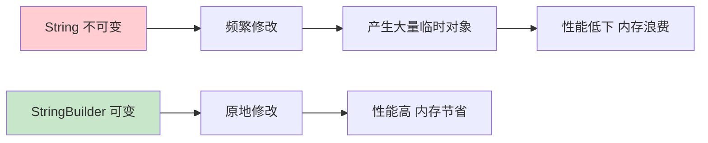
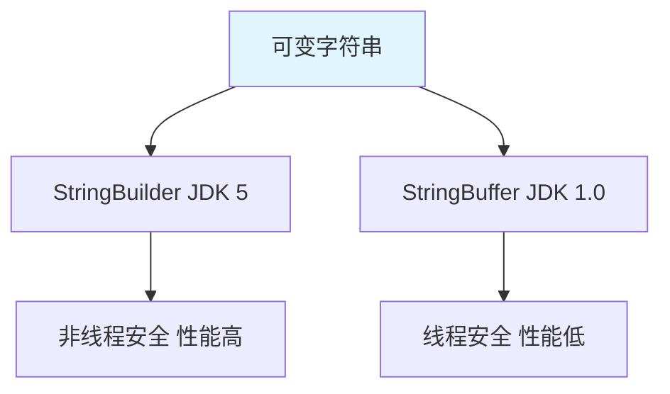
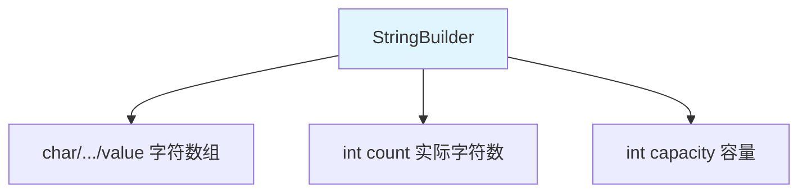
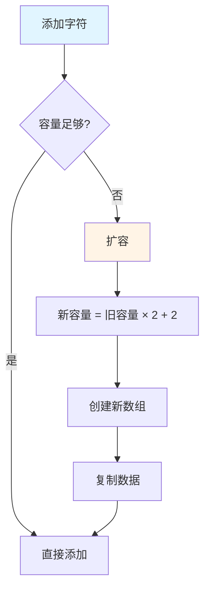

# StringBuilder 与 StringBuffer

StringBuilder 和 StringBuffer 是**可变字符串**类，用于高效的字符串操作。

## 可变字符串概述

### 为什么需要可变字符串



**String 的问题**：

```java
// String 拼接：每次都创建新对象
String str = "";
for (int i = 0; i < 1000; i++) {
    str += i;  // 产生 1000 个临时对象
}

// StringBuilder：原地修改
StringBuilder sb = new StringBuilder();
for (int i = 0; i < 1000; i++) {
    sb.append(i);  // 只创建一个对象
}
```

### StringBuilder vs StringBuffer



| 特性 | StringBuilder | StringBuffer |
|------|---------------|--------------|
| **版本** | JDK 5 | JDK 1.0 |
| **线程安全** | ❌ 不安全 | ✅ 安全 |
| **性能** | 高（无锁） | 低（有锁） |
| **使用场景** | 单线程 | 多线程 |
| **API** | 相同 | 相同 |

::: tip 选择建议

- **单线程**：优先使用 `StringBuilder`（性能更高）
- **多线程**：使用 `StringBuffer`（线程安全）

:::

## StringBuilder 的使用

### 构造方法

```java
public class StringBuilderConstructor {
    public static void main(String[] args) {
        // 1. 无参构造：初始容量 16
        StringBuilder sb1 = new StringBuilder();
        System.out.println(sb1.capacity());  // 16
        System.out.println(sb1.length());     // 0
        
        // 2. 指定初始容量
        StringBuilder sb2 = new StringBuilder(100);
        System.out.println(sb2.capacity());  // 100
        
        // 3. 指定初始内容
        StringBuilder sb3 = new StringBuilder("Hello");
        System.out.println(sb3.capacity());  // 21（16 + 5）
        System.out.println(sb3.length());    // 5
    }
}
```

### 常用方法

#### append()：追加

```java
public class StringBuilderAppend {
    public static void main(String[] args) {
        StringBuilder sb = new StringBuilder();
        
        // 追加各种类型
        sb.append("Hello");
        sb.append(' ');
        sb.append("World");
        sb.append(123);
        sb.append(3.14);
        sb.append(true);
        sb.append(new char[]{'J', 'a', 'v', 'a'});
        
        System.out.println(sb);  // HelloWorld1233.14trueJava
        
        // 链式调用
        sb.append(" ").append("Programming").append("!!!")
          .append(' ').append(2024);
        System.out.println(sb);
    }
}
```

#### insert()：插入

```java
public class StringBuilderInsert {
    public static void main(String[] args) {
        StringBuilder sb = new StringBuilder("Hello World");
        
        // 在指定位置插入
        sb.insert(5, " Beautiful");
        System.out.println(sb);  // Hello Beautiful World
        
        // 插入各种类型
        sb.insert(0, ">>> ");
        sb.insert(sb.length(), " <<<");
        System.out.println(sb);  // >>> Hello Beautiful World <<<
        
        // 在开头插入
        sb.insert(0, "Start: ");
        System.out.println(sb);
    }
}
```

#### delete()：删除

```java
public class StringBuilderDelete {
    public static void main(String[] args) {
        StringBuilder sb = new StringBuilder("Hello Beautiful World");
        
        // 删除指定范围 [start, end)
        sb.delete(5, 15);  // 删除索引 5 到 14
        System.out.println(sb);  // Hello World
        
        // 删除指定位置字符
        sb.deleteCharAt(5);
        System.out.println(sb);  // HelloWorld
        
        // 删除所有
        sb.delete(0, sb.length());
        System.out.println(sb.length());  // 0
    }
}
```

#### replace()：替换

```java
public class StringBuilderReplace {
    public static void main(String[] args) {
        StringBuilder sb = new StringBuilder("Hello World");
        
        // 替换指定范围
        sb.replace(6, 11, "Java");
        System.out.println(sb);  // Hello Java
        
        // 替换整个字符串
        sb.replace(0, sb.length(), "Hello");
        System.out.println(sb);  // Hello
    }
}
```

#### reverse()：反转

```java
public class StringBuilderReverse {
    public static void main(String[] args) {
        StringBuilder sb = new StringBuilder("Hello World");
        
        // 反转字符串
        sb.reverse();
        System.out.println(sb);  // dlroW olleH
        
        // 再次反转恢复
        sb.reverse();
        System.out.println(sb);  // Hello World
    }
}
```

#### 其他方法

```java
public class StringBuilderOther {
    public static void main(String[] args) {
        StringBuilder sb = new StringBuilder("Hello World");
        
        // 1. capacity()：容量
        System.out.println(sb.capacity());  // 27
        
        // 2. length()：实际长度
        System.out.println(sb.length());    // 11
        
        // 3. setLength()：设置长度
        sb.setLength(5);
        System.out.println(sb);  // Hello
        
        // 4. charAt()：获取指定位置字符
        sb.setLength(11);
        System.out.println(sb.charAt(0));  // H
        
        // 5. setCharAt()：设置指定位置字符
        sb.setCharAt(0, 'h');
        System.out.println(sb);  // hello World
        
        // 6. substring()：截取子串
        String sub = sb.substring(6);
        System.out.println(sub);  // World
        
        // 7. indexOf() / lastIndexOf()
        System.out.println(sb.indexOf("o"));      // 4
        System.out.println(sb.lastIndexOf("o"));  // 7
        
        // 8. toString()：转换为 String
        String str = sb.toString();
        System.out.println(str);  // hello World
    }
}
```

## StringBuilder 的原理

### 内部结构



```java
// StringBuilder 内部实现（简化版）
public final class StringBuilder extends AbstractStringBuilder {
    // 继承自 AbstractStringBuilder
    // char[] value;
    // int count;
}
```

### 扩容机制



```java
public class StringBuilderExpansion {
    public static void main(String[] args) {
        StringBuilder sb = new StringBuilder(10);  // 初始容量 10
        
        System.out.println("初始容量：" + sb.capacity());  // 10
        
        // 添加 11 个字符（超过容量）
        for (int i = 0; i < 11; i++) {
            sb.append(i);
        }
        
        System.out.println("扩容后容量：" + sb.capacity());  // 22（10 × 2 + 2）
        
        // 继续扩容
        for (int i = 0; i < 50; i++) {
            sb.append(i);
        }
        
        System.out.println("再次扩容：" + sb.capacity());  // 46（22 × 2 + 2）
    }
}
```

::: tip 扩容公式

```
新容量 = 旧容量 × 2 + 2
```

:::

## 性能对比

### String vs StringBuilder

```java
public class PerformanceComparison {
    public static void main(String[] args) {
        int count = 100000;
        
        // 1. String 拼接
        long start1 = System.currentTimeMillis();
        String str = "";
        for (int i = 0; i < count; i++) {
            str += i;
        }
        long end1 = System.currentTimeMillis();
        System.out.println("String: " + (end1 - start1) + "ms");  // 很慢
        
        // 2. StringBuilder 拼接
        long start2 = System.currentTimeMillis();
        StringBuilder sb = new StringBuilder();
        for (int i = 0; i < count; i++) {
            sb.append(i);
        }
        long end2 = System.currentTimeMillis();
        System.out.println("StringBuilder: " + (end2 - start2) + "ms");  // 很快
    }
}
```

**性能对比**（100000 次拼接）：

| 方式 | 时间 | 说明 |
|------|------|------|
| String | ~5000ms | 产生大量临时对象 |
| StringBuilder | ~10ms | 原地修改 |

### 编译器优化

```java
public class CompilerOptimization {
    public static void main(String[] args) {
        // 编译期优化：自动使用 StringBuilder
        String str1 = "Hello" + " " + "World";
        // 等价于：String str1 = "Hello World";
        
        // 编译期无法优化：运行期拼接
        String str2 = "Hello";
        String str3 = str2 + " World";
        // 编译器自动优化为：
        // String str3 = new StringBuilder().append(str2).append(" World").toString();
    }
}
```

::: tip 字符串拼接建议

```java
// 1. 少量拼接：直接用 +
String str = "Hello" + " " + "World";  // 编译期优化

// 2. 循环拼接：使用 StringBuilder
StringBuilder sb = new StringBuilder();
for (int i = 0; i < 1000; i++) {
    sb.append(i);
}

// 3. 大量拼接：使用 StringBuilder
StringBuilder sb = new StringBuilder();
sb.append("Hello").append(" ").append("World");
```

:::

## StringBuffer 的使用

### 与 StringBuilder 的区别

```java
public class StringBufferDemo {
    public static void main(String[] args) {
        // StringBuffer 的使用与 StringBuilder 完全相同
        StringBuffer sb = new StringBuffer();
        sb.append("Hello");
        sb.append(" ");
        sb.append("World");
        System.out.println(sb);  // Hello World
        
        // 其他方法也相同
        sb.insert(5, "Beautiful ");
        sb.reverse();
        System.out.println(sb);  // dlroW lutitaeuB olleH
    }
}
```

::: tip 何时使用 StringBuffer

```java
// 多线程环境：使用 StringBuffer
public class MultiThreadString {
    private static StringBuffer sb = new StringBuffer();
    
    public static void main(String[] args) throws InterruptedException {
        // 多个线程同时修改
        Thread t1 = new Thread(() -> {
            for (int i = 0; i < 1000; i++) {
                sb.append("A");
            }
        });
        
        Thread t2 = new Thread(() -> {
            for (int i = 0; i < 1000; i++) {
                sb.append("B");
            }
        });
        
        t1.start();
        t2.start();
        t1.join();
        t2.join();
        
        System.out.println(sb.length());  // 2000
    }
}
```

:::

## 实战案例

### JSON 构建

```java
public class JsonBuilder {
    private StringBuilder sb;
    
    public JsonBuilder() {
        sb = new StringBuilder();
        sb.append("{");
    }
    
    public JsonBuilder add(String key, String value) {
        if (sb.length() > 1) {
            sb.append(",");
        }
        sb.append("\"").append(key).append("\":\"").append(value).append("\"");
        return this;
    }
    
    public JsonBuilder add(String key, int value) {
        return add(key, String.valueOf(value));
    }
    
    public JsonBuilder add(String key, double value) {
        return add(key, String.valueOf(value));
    }
    
    public String build() {
        sb.append("}");
        return sb.toString();
    }
    
    public static void main(String[] args) {
        JsonBuilder builder = new JsonBuilder();
        String json = builder
            .add("name", "张三")
            .add("age", 18)
            .add("score", 95.5)
            .build();
        
        System.out.println(json);  // {"name":"张三","age":"18","score":"95.5"}
    }
}
```

### SQL 构建

```java
public class SqlBuilder {
    private StringBuilder sb;
    
    public SqlBuilder() {
        sb = new StringBuilder();
    }
    
    public SqlBuilder select(String... columns) {
        sb.append("SELECT ");
        sb.append(String.join(", ", columns));
        return this;
    }
    
    public SqlBuilder from(String table) {
        sb.append(" FROM ").append(table);
        return this;
    }
    
    public SqlBuilder where(String condition) {
        sb.append(" WHERE ").append(condition);
        return this;
    }
    
    public SqlBuilder and(String condition) {
        sb.append(" AND ").append(condition);
        return this;
    }
    
    public SqlBuilder orderBy(String column) {
        sb.append(" ORDER BY ").append(column);
        return this;
    }
    
    public String build() {
        return sb.toString();
    }
    
    public static void main(String[] args) {
        String sql = new SqlBuilder()
            .select("id", "name", "age")
            .from("users")
            .where("age > 18")
            .and("status = 1")
            .orderBy("id")
            .build();
        
        System.out.println(sql);
        // SELECT id, name, age FROM users WHERE age > 18 AND status = 1 ORDER BY id
    }
}
```

## 小结

::: tip 核心要点

1. **可变字符串**：StringBuilder（非线程安全）、StringBuffer（线程安全）
2. **构造方法**：无参、指定容量、指定初始内容
3. **常用方法**：append、insert、delete、replace、reverse
4. **扩容机制**：新容量 = 旧容量 × 2 + 2
5. **性能优势**：比 String 拼接快很多
6. **选择建议**：单线程用 StringBuilder，多线程用 StringBuffer

:::

::: info 下一步
- [集合概述](/java/base/04-collections/overview.md) - 学习集合框架
:::
