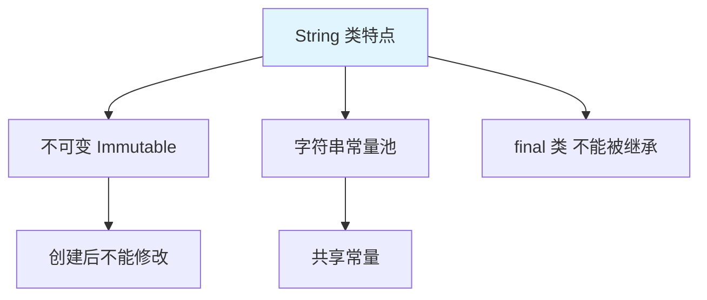
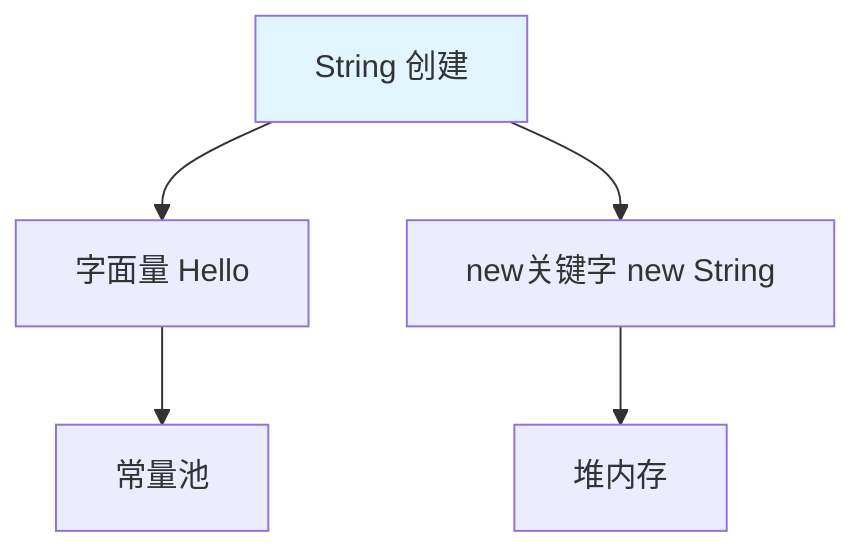
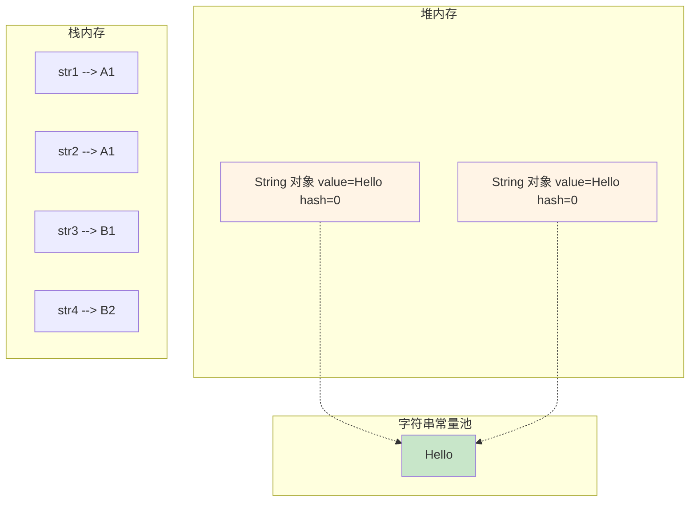
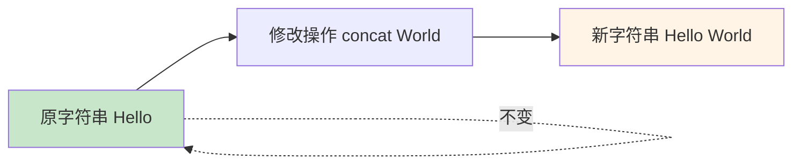
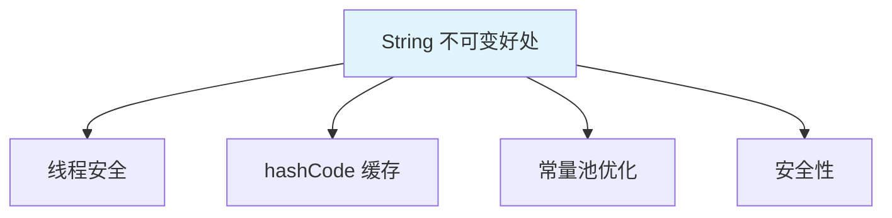
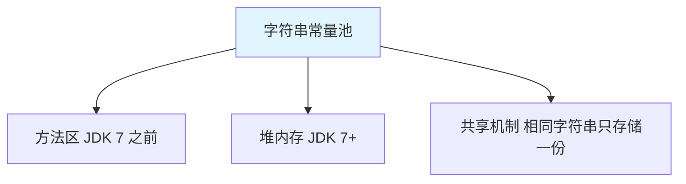
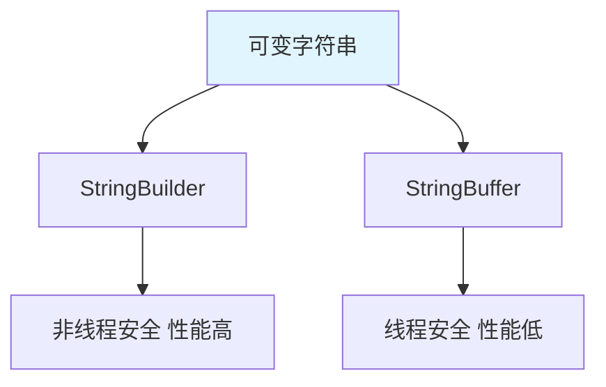

# String 类

String 类是 Java 中最常用的类，用于表示**字符串**，是不可变对象。

## String 概述

### String 的特点



**String 的特点**：

1. **不可变性**：字符串创建后不能修改
2. **字符串常量池**：Java 使用字符串常量池优化内存
3. **final 类**：不能被继承
4. **实现 Serializable/Comparable/CharSequence**：支持序列化和比较

::: tip 为什么 String 不可变？

```java
String str = "Hello";
str = str + " World";  // 看起来修改了，实际上是创建新对象

// 内存过程：
// 1. 创建 "Hello"（常量池）
// 2. 创建 " World"（常量池）
// 3. 创建 "Hello World"（常量池）
// 4. str 指向新对象
```

:::

## String 的创建方式

### 两种创建方式



```java
public class StringCreation {
    public static void main(String[] args) {
        // 方式1：字面量（推荐）
        String str1 = "Hello";
        String str2 = "Hello";
        
        // 方式2：new 关键字
        String str3 = new String("Hello");
        String str4 = new String("Hello");
        
        // 比较地址
        System.out.println(str1 == str2);  // true（同一常量池对象）
        System.out.println(str1 == str3);  // false（不同对象）
        System.out.println(str3 == str4);  // false（不同对象）
        
        // 比较内容
        System.out.println(str1.equals(str3));  // true
        System.out.println(str3.equals(str4));  // true
    }
}
```

### 内存分析



```java
// 字面量创建
String s1 = "Hello";  // 常量池中查找，没有则创建

// new 创建
String s2 = new String("Hello");  // 堆中创建对象，value 指向常量池
```

## String 的常用方法

### 字符串判断

```java
public class StringJudge {
    public static void main(String[] args) {
        String str = "HelloWorld";
        
        // 1. equals()：比较内容
        System.out.println(str.equals("HelloWorld"));  // true
        System.out.println(str.equals("helloworld"));  // false（区分大小写）
        
        // 2. equalsIgnoreCase()：忽略大小写比较
        System.out.println(str.equalsIgnoreCase("helloworld"));  // true
        
        // 3. contains()：是否包含子串
        System.out.println(str.contains("Hello"));  // true
        System.out.println(str.contains("Java"));   // false
        
        // 4. isEmpty()：是否为空字符串
        System.out.println("".isEmpty());        // true
        System.out.println(str.isEmpty());       // false
        
        // 5. startsWith() / endsWith()：前缀/后缀
        System.out.println(str.startsWith("Hello"));  // true
        System.out.println(str.endsWith("World"));    // true
    }
}
```

### 字符串获取

```java
public class StringGet {
    public static void main(String[] args) {
        String str = "HelloWorld";
        
        // 1. length()：字符串长度
        System.out.println(str.length());  // 10
        
        // 2. charAt()：获取指定位置字符
        System.out.println(str.charAt(0));  // 'H'
        System.out.println(str.charAt(9));  // 'd'
        // System.out.println(str.charAt(10));  // StringIndexOutOfBoundsException
        
        // 3. indexOf()：首次出现位置
        System.out.println(str.indexOf("o"));     // 4
        System.out.println(str.indexOf("o", 5));  // 6（从索引 5 开始）
        System.out.println(str.indexOf("Java"));  // -1（不存在）
        
        // 4. lastIndexOf()：最后出现位置
        System.out.println(str.lastIndexOf("o"));  // 6
        
        // 5. substring()：截取子串
        System.out.println(str.substring(5));      // "World"（从 5 到末尾）
        System.out.println(str.substring(0, 5));   // "Hello"（[0, 5)）
        
        // 6. split()：分割字符串
        String str2 = "Java,Python,C++";
        String[] langs = str2.split(",");
        for (String lang : langs) {
            System.out.println(lang);  // Java, Python, C++
        }
    }
}
```

### 字符串转换

```java
public class StringConvert {
    public static void main(String[] args) {
        String str = "HelloWorld";
        
        // 1. toCharArray()：转字符数组
        char[] chars = str.toCharArray();
        System.out.println(Arrays.toString(chars));  // [H, e, l, l, o, W, o, r, l, d]
        
        // 2. getBytes()：转字节数组
        byte[] bytes = str.getBytes();
        System.out.println(Arrays.toString(bytes));
        
        // 3. toLowerCase() / toUpperCase()：大小写转换
        System.out.println(str.toLowerCase());  // "helloworld"
        System.out.println(str.toUpperCase());  // "HELLOWORLD"
        
        // 4. replace()：替换
        String str2 = "Hello World";
        System.out.println(str2.replace("o", "O"));  // "HellO WOrld"
        System.out.println(str2.replace("World", "Java"));  // "Hello Java"
        
        // 5. trim()：去除首尾空格
        String str3 = "  Hello World  ";
        System.out.println(str3.trim());  // "Hello World"
        
        // 6. valueOf()：其他类型转字符串
        int num = 100;
        String strNum = String.valueOf(num);
        System.out.println(strNum);  // "100"
        
        double pi = 3.14;
        String strPi = String.valueOf(pi);
        System.out.println(strPi);  // "3.14"
    }
}
```

### 其他常用方法

```java
public class StringOther {
    public static void main(String[] args) {
        // 1. concat()：连接字符串
        String str1 = "Hello".concat(" ").concat("World");
        System.out.println(str1);  // "Hello World"
        
        // 2. compareTo()：比较字符串（字典序）
        String str2 = "Apple";
        String str3 = "Banana";
        System.out.println(str2.compareTo(str3));  // -1（小于）
        System.out.println(str3.compareTo(str2));  // 1（大于）
        System.out.println(str2.compareTo("Apple"));  // 0（等于）
        
        // 3. repeat()：重复字符串（JDK 11+）
        String str4 = "Hi".repeat(3);
        System.out.println(str4);  // "HiHiHi"
        
        // 4. strip() / stripLeading() / stripTrailing()（JDK 11+）
        String str5 = "  Hello  ";
        System.out.println(str5.strip());  // "Hello"
        System.out.println(str5.stripLeading());  // "Hello  "
        System.out.println(str5.stripTrailing());  // "  Hello"
        
        // 5. isBlank()：是否为空白（JDK 11+）
        System.out.println("".isBlank());      // true
        System.out.println("   ".isBlank());   // true
        System.out.println("Hi".isBlank());    // false
    }
}
```

## String 的不可变性

### 不可变性的体现



```java
public class StringImmutable {
    public static void main(String[] args) {
        String str = "Hello";
        System.out.println(str);  // Hello
        System.out.println(str.hashCode());  // 69609650
        
        // 看似修改，实际创建新对象
        str = str.concat(" World");
        System.out.println(str);  // Hello World
        System.out.println(str.hashCode());  // -495707299（不同对象）
    }
}
```

### 不可变性的好处



| 好处 | 说明 |
|------|------|
| **线程安全** | 多线程环境下无需同步 |
| **hashCode 缓存** | hashCode 计算一次即可缓存 |
| **常量池优化** | 相同字符串共享内存 |
| **安全性** | 用作参数安全可靠 |

## 字符串常量池

### 常量池机制



```java
public class StringConstantPool {
    public static void main(String[] args) {
        // 1. 字面量直接放入常量池
        String s1 = "Hello";
        String s2 = "Hello";
        System.out.println(s1 == s2);  // true（同一对象）
        
        // 2. 编译期优化
        String s3 = "Hello" + "World";  // 编译期合并为 "HelloWorld"
        String s4 = "HelloWorld";
        System.out.println(s3 == s4);  // true
        
        // 3. 运行期拼接
        String s5 = "Hello";
        String s6 = s5 + "World";  // 运行期创建新对象
        String s7 = "HelloWorld";
        System.out.println(s6 == s7);  // false
        
        // 4. intern()：手动入池
        String s8 = new String("Hello");
        String s9 = s8.intern();  // 入池
        String s10 = "Hello";
        System.out.println(s9 == s10);  // true
    }
}
```

::: tip 字符串拼接规则

```java
// 1. 常量拼接：编译期确定
String s1 = "Hello" + "World";  // 等价于 "HelloWorld"

// 2. 变量拼接：运行期确定
String s2 = "Hello";
String s3 = s2 + "World";  // 使用 StringBuilder

// 3. final 变量拼接：编译期确定
final String s4 = "Hello";
String s5 = s4 + "World";  // 等价于 "HelloWorld"
```

:::

## StringBuilder 和 StringBuffer

### 对比



| 特性 | String | StringBuilder | StringBuffer |
|------|--------|---------------|--------------|
| 可变性 | 不可变 | 可变 | 可变 |
| 线程安全 | 安全 | 不安全 | 安全 |
| 性能 | 低 | 高 | 中 |
| 使用场景 | 少量修改 | 单线程大量修改 | 多线程大量修改 |

### 使用示例

```java
public class StringBuilderDemo {
    public static void main(String[] args) {
        // 创建 StringBuilder
        StringBuilder sb = new StringBuilder();
        sb.append("Hello");
        sb.append(" ");
        sb.append("World");
        System.out.println(sb.toString());  // "Hello World"
        
        // 链式调用
        sb.append(" ").append("Java").append(" Programming");
        System.out.println(sb);  // "Hello World Java Programming"
        
        // 插入
        sb.insert(5, "Beautiful ");
        System.out.println(sb);  // "Hello Beautiful World Java Programming"
        
        // 删除
        sb.delete(5, 15);
        System.out.println(sb);  // "Hello World Java Programming"
        
        // 反转
        sb.reverse();
        System.out.println(sb);  // "gnimmargorP avaJ dlroW olleH"
        
        // 容量
        System.out.println(sb.capacity());  // 当前容量
        System.out.println(sb.length());    // 实际长度
    }
}
```

## 实战案例

### 字符串工具类

```java
public class StringUtils {
    
    // 判断字符串是否为空
    public static boolean isEmpty(String str) {
        return str == null || str.isEmpty();
    }
    
    // 判断字符串是否不为空
    public static boolean isNotEmpty(String str) {
        return !isEmpty(str);
    }
    
    // 反转字符串
    public static String reverse(String str) {
        if (isEmpty(str)) {
            return str;
        }
        return new StringBuilder(str).reverse().toString();
    }
    
    // 首字母大写
    public static String capitalize(String str) {
        if (isEmpty(str)) {
            return str;
        }
        return str.substring(0, 1).toUpperCase() + str.substring(1);
    }
    
    // 统计子串出现次数
    public static int countOccurrences(String str, String sub) {
        if (isEmpty(str) || isEmpty(sub)) {
            return 0;
        }
        
        int count = 0;
        int index = 0;
        while ((index = str.indexOf(sub, index)) != -1) {
            count++;
            index += sub.length();
        }
        return count;
    }
    
    public static void main(String[] args) {
        System.out.println(isEmpty(""));  // true
        System.out.println(isEmpty(null));  // true
        System.out.println(reverse("Hello"));  // "olleH"
        System.out.println(capitalize("hello"));  // "Hello"
        System.out.println(countOccurrences("ababab", "ab"));  // 3
    }
}
```

## 小结

::: tip 核心要点

1. **String 特点**：不可变、字符串常量池、final 类
2. **创建方式**：字面量（常量池）、new（堆内存）
3. **常用方法**：equals、length、charAt、substring、split、replace
4. **不可变性**：修改操作创建新对象
5. **字符串常量池**：相同字符串共享内存
6. **StringBuilder**：可变字符串，性能高，非线程安全

:::

::: info 下一步
- [StringBuilder/StringBuffer](/java/base/03-array-string/string-builder.md) - 学习字符串缓冲区
- [集合概述](/java/base/04-collections/overview.md) - 学习集合框架
:::
