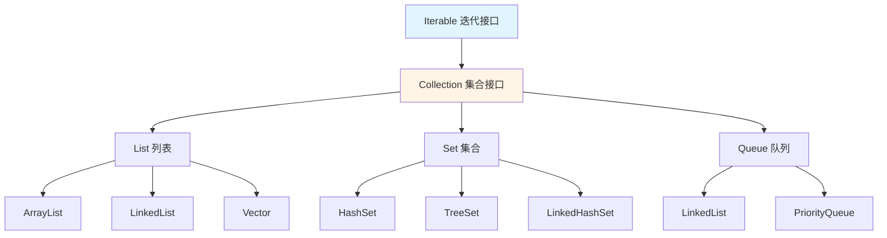
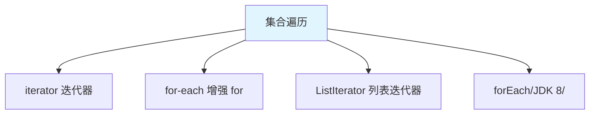

# Collection 接口

Collection 是单列集合的**根接口**，用于存储一组对象。

## Collection 接口体系

### 接口继承关系



## Collection 的常用方法

### 添加方法

```java
import java.util.ArrayList;
import java.util.Collection;

public class CollectionAdd {
    public static void main(String[] args) {
        Collection<String> coll = new ArrayList<>();
        
        // 1. add(E e)：添加单个元素
        coll.add("Hello");
        coll.add("World");
        System.out.println(coll);  // [Hello, World]
        
        // 2. addAll(Collection<? extends E> c)：添加多个元素
        Collection<String> other = new ArrayList<>();
        other.add("Java");
        other.add("Python");
        coll.addAll(other);
        System.out.println(coll);  // [Hello, World, Java, Python]
    }
}
```

### 删除方法

```java
public class CollectionRemove {
    public static void main(String[] args) {
        Collection<String> coll = new ArrayList<>();
        coll.add("Hello");
        coll.add("World");
        coll.add("Java");
        
        // 1. remove(Object o)：删除指定元素
        coll.remove("World");
        System.out.println(coll);  // [Hello, Java]
        
        // 2. removeAll(Collection<?> c)：删除包含在 c 中的元素
        Collection<String> other = new ArrayList<>();
        other.add("Hello");
        coll.removeAll(other);
        System.out.println(coll);  // [Java]
        
        // 3. removeIf(Predicate<? super E> filter)：条件删除（JDK 8）
        Collection<Integer> nums = new ArrayList<>();
        nums.add(1);
        nums.add(2);
        nums.add(3);
        nums.add(4);
        nums.removeIf(n -> n % 2 == 0);  // 删除偶数
        System.out.println(nums);  // [1, 3]
        
        // 4. clear()：清空集合
        coll.clear();
        System.out.println(coll.isEmpty());  // true
    }
}
```

### 判断方法

```java
public class CollectionJudge {
    public static void main(String[] args) {
        Collection<String> coll = new ArrayList<>();
        coll.add("Hello");
        coll.add("World");
        
        // 1. contains(Object o)：是否包含指定元素
        System.out.println(coll.contains("Hello"));  // true
        System.out.println(coll.contains("Java"));   // false
        
        // 2. containsAll(Collection<?> c)：是否包含 c 中的所有元素
        Collection<String> other = new ArrayList<>();
        other.add("Hello");
        other.add("World");
        System.out.println(coll.containsAll(other));  // true
        
        // 3. isEmpty()：是否为空
        System.out.println(coll.isEmpty());  // false
        
        // 4. size()：元素个数
        System.out.println(coll.size());  // 2
    }
}
```

### 获取方法

```java
public class CollectionGet {
    public static void main(String[] args) {
        Collection<String> coll = new ArrayList<>();
        coll.add("Hello");
        coll.add("World");
        coll.add("Java");
        
        // 1. toArray()：转数组
        Object[] arr1 = coll.toArray();
        System.out.println(Arrays.toString(arr1));  // [Hello, World, Java]
        
        // 2. toArray(T[] a)：转指定类型数组
        String[] arr2 = coll.toArray(new String[0]);
        System.out.println(Arrays.toString(arr2));  // [Hello, World, Java]
        
        // 3. iterator()：获取迭代器
        Iterator<String> it = coll.iterator();
        while (it.hasNext()) {
            System.out.println(it.next());
        }
        
        // 4. stream()：获取流（JDK 8）
        coll.stream().forEach(System.out::println);
    }
}
```

## 集合的遍历

### 遍历方式



### 1. Iterator 迭代器

```java
import java.util.ArrayList;
import java.util.Iterator;
import java.util.List;

public class IteratorDemo {
    public static void main(String[] args) {
        List<String> list = new ArrayList<>();
        list.add("Hello");
        list.add("World");
        list.add("Java");
        
        // 获取迭代器
        Iterator<String> it = list.iterator();
        
        // 遍历
        while (it.hasNext()) {
            String str = it.next();
            System.out.println(str);
        }
        
        // 迭代器删除
        it = list.iterator();
        while (it.hasNext()) {
            String str = it.next();
            if ("World".equals(str)) {
                it.remove();  // 删除当前元素
            }
        }
        System.out.println(list);  // [Hello, Java]
    }
}
```

### 2. 增强 for 循环

```java
public class ForEachDemo {
    public static void main(String[] args) {
        Collection<String> coll = new ArrayList<>();
        coll.add("Hello");
        coll.add("World");
        coll.add("Java");
        
        // 增强 for 循环（底层使用迭代器）
        for (String str : coll) {
            System.out.println(str);
        }
    }
}
```

::: tip 增强 for 的注意事项

```java
// 增强 for 不能修改集合
Collection<Integer> coll = new ArrayList<>();
coll.add(1);
coll.add(2);
coll.add(3);

for (Integer num : coll) {
    if (num == 2) {
        // coll.remove(num);  // ❌ ConcurrentModificationException
    }
}

// 使用迭代器删除
Iterator<Integer> it = coll.iterator();
while (it.hasNext()) {
    if (it.next() == 2) {
        it.remove();  // ✅ 正确
    }
}
```

:::

### 3. forEach 方法（JDK 8）

```java
import java.util.ArrayList;
import java.util.Collection;

public class ForEachMethod {
    public static void main(String[] args) {
        Collection<String> coll = new ArrayList<>();
        coll.add("Hello");
        coll.add("World");
        coll.add("Java");
        
        // forEach 方法（Lambda 表达式）
        coll.forEach(str -> System.out.println(str));
        
        // 方法引用
        coll.forEach(System.out::println);
    }
}
```

## 集合的并发修改异常

### ConcurrentModificationException

```java
public class ConcurrentModification {
    public static void main(String[] args) {
        List<String> list = new ArrayList<>();
        list.add("Hello");
        list.add("World");
        list.add("Java");
        
        // 使用增强 for 遍历时修改集合
        for (String str : list) {
            if ("World".equals(str)) {
                list.remove(str);  // ❌ ConcurrentModificationException
            }
        }
        
        // 正确做法：使用迭代器
        Iterator<String> it = list.iterator();
        while (it.hasNext()) {
            String str = it.next();
            if ("World".equals(str)) {
                it.remove();  // ✅ 正确
            }
        }
    }
}
```

::: tip 解决并发修改异常

1. 使用迭代器的 `remove()` 方法
2. 使用 `removeIf()` 方法（JDK 8+）
3. 使用并发集合（如 `CopyOnWriteArrayList`）

:::

## 集合的工具方法

### 可变参数

```java
public class VarargsDemo {
    public static void main(String[] args) {
        // 可变参数方法
        Collection<String> coll = Collection.of("Hello", "World", "Java");
        System.out.println(coll);  // [Hello, World, Java]
        
        // 空集合
        Collection<String> empty = Collection.of();
        System.out.println(empty.isEmpty());  // true
    }
}
```

### 集合转数组

```java
public class CollectionToArray {
    public static void main(String[] args) {
        Collection<String> coll = new ArrayList<>();
        coll.add("Hello");
        coll.add("World");
        coll.add("Java");
        
        // 方式1：转 Object 数组
        Object[] arr1 = coll.toArray();
        System.out.println(Arrays.toString(arr1));
        
        // 方式2：转指定类型数组（推荐）
        String[] arr2 = coll.toArray(new String[0]);
        System.out.println(Arrays.toString(arr2));
        
        // 方式3：指定大小数组
        String[] arr3 = coll.toArray(new String[coll.size()]);
        System.out.println(Arrays.toString(arr3));
    }
}
```

### 数组转集合

```java
import java.util.Arrays;
import java.util.List;
import java.util.Set;

public class ArrayToCollection {
    public static void main(String[] args) {
        // 数组转 List
        String[] arr = {"Hello", "World", "Java"};
        List<String> list = Arrays.asList(arr);
        System.out.println(list);  // [Hello, World, Java]
        
        // 数组转 Set
        Set<String> set = new HashSet<>(Arrays.asList(arr));
        System.out.println(set);  // [Java, World, Hello]
        
        // 注意：asList() 返回的列表是固定大小的
        // list.add("Python");  // ❌ UnsupportedOperationException
    }
}
```

## 实战案例

### 集合工具类

```java
import java.util.ArrayList;
import java.util.Collection;

public class CollectionUtils {
    
    // 判断集合是否为空
    public static boolean isEmpty(Collection<?> coll) {
        return coll == null || coll.isEmpty();
    }
    
    // 判断集合是否不为空
    public static boolean isNotEmpty(Collection<?> coll) {
        return !isEmpty(coll);
    }
    
    // 获取第一个元素
    public static <T> T getFirst(Collection<T> coll) {
        if (isEmpty(coll)) {
            return null;
        }
        return coll.iterator().next();
    }
    
    // 获取最后一个元素
    public static <T> T getLast(Collection<T> coll) {
        if (isEmpty(coll)) {
            return null;
        }
        T last = null;
        for (T item : coll) {
            last = item;
        }
        return last;
    }
    
    // 集合合并
    @SafeVarargs
    public static <T> Collection<T> union(Collection<T>... colls) {
        Collection<T> result = new ArrayList<>();
        for (Collection<T> coll : colls) {
            if (coll != null) {
                result.addAll(coll);
            }
        }
        return result;
    }
    
    public static void main(String[] args) {
        Collection<String> coll1 = List.of("A", "B", "C");
        Collection<String> coll2 = List.of("D", "E");
        
        System.out.println(getFirst(coll1));  // A
        System.out.println(getLast(coll1));   // C
        System.out.println(union(coll1, coll2));  // [A, B, C, D, E]
    }
}
```

## 小结

::: tip 核心要点

1. **Collection 接口**：单列集合根接口，包含 List、Set、Queue
2. **常用方法**：add、remove、contains、isEmpty、size、clear
3. **遍历方式**：Iterator、增强 for、forEach（JDK 8）
4. **并发修改异常**：遍历时不能修改集合，用迭代器删除
5. **数组转换**：toArray()、Arrays.asList()

:::

::: info 下一步
- [List 集合](/java/base/04-collections/list.md) - 学习 List 集合详解
- [Set 集合](/java/base/04-collections/set.md) - 学习 Set 集合详解
:::
