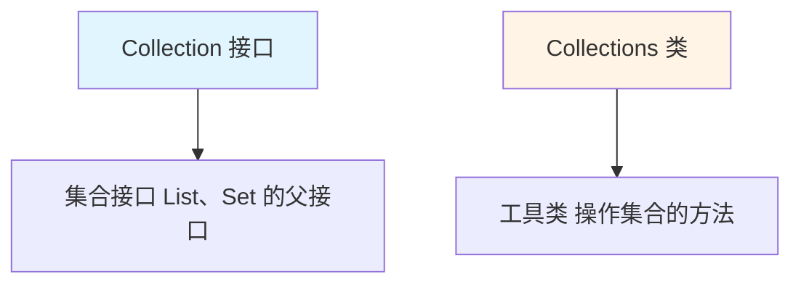

# Collections 工具类

Collections 是 Java 提供的**集合工具类**，用于对集合进行排序、查找、打乱等操作。

## Collections 概述

### Collections vs Collection



**区别**：

| 类名/接口 | 类型 | 作用 |
|-----------|------|------|
| **Collection** | 接口 | 集合的根接口，定义集合的基本方法 |
| **Collections** | 类 | 集合的工具类，提供静态方法操作集合 |

## 排序方法

### sort()：排序

```java
import java.util.ArrayList;
import java.util.Collections;
import java.util.List;

public class CollectionsSort {
    public static void main(String[] args) {
        List<Integer> list = new ArrayList<>();
        list.add(5);
        list.add(2);
        list.add(8);
        list.add(1);
        list.add(9);
        
        // 1. 自然排序（升序）
        Collections.sort(list);
        System.out.println(list);  // [1, 2, 5, 8, 9]
        
        // 2. 降序排序
        Collections.sort(list, (o1, o2) -> o2 - o1);
        System.out.println(list);  // [9, 8, 5, 2, 1]
        
        // 3. 自定义排序
        List<Student> students = new ArrayList<>();
        students.add(new Student("张三", 18));
        students.add(new Student("李四", 20));
        students.add(new Student("王五", 19));
        
        // 按年龄排序
        Collections.sort(students, (s1, s2) -> s1.getAge() - s2.getAge());
        System.out.println(students);  // [张三:18, 王五:19, 李四:20]
    }
    
    static class Student {
        private String name;
        private int age;
        
        public Student(String name, int age) {
            this.name = name;
            this.age = age;
        }
        
        public int getAge() {
            return age;
        }
        
        @Override
        public String toString() {
            return name + ":" + age;
        }
    }
}
```

### reverse()：反转

```java
public class CollectionsReverse {
    public static void main(String[] args) {
        List<Integer> list = new ArrayList<>();
        list.add(1);
        list.add(2);
        list.add(3);
        
        // 反转列表
        Collections.reverse(list);
        System.out.println(list);  // [3, 2, 1]
    }
}
```

### shuffle()：打乱

```java
public class CollectionsShuffle {
    public static void main(String[] args) {
        List<Integer> list = new ArrayList<>();
        for (int i = 1; i <= 10; i++) {
            list.add(i);
        }
        
        System.out.println("打乱前：" + list);  // [1, 2, 3, 4, 5, 6, 7, 8, 9, 10]
        
        // 打乱顺序
        Collections.shuffle(list);
        System.out.println("打乱后：" + list);  // 随机顺序
        
        // 指定随机源
        Collections.shuffle(list, new java.util.Random(42));
        System.out.println("固定随机：" + list);
    }
}
```

### swap()：交换

```java
public class CollectionsSwap {
    public static void main(String[] args) {
        List<Integer> list = new ArrayList<>();
        list.add(1);
        list.add(2);
        list.add(3);
        list.add(4);
        
        // 交换位置
        Collections.swap(list, 0, 3);
        System.out.println(list);  // [4, 2, 3, 1]
    }
}
```

## 查找方法

### binarySearch()：二分查找

```java
import java.util.ArrayList;
import java.util.Collections;
import java.util.List;

public class CollectionsBinarySearch {
    public static void main(String[] args) {
        List<Integer> list = new ArrayList<>();
        list.add(1);
        list.add(3);
        list.add(5);
        list.add(7);
        list.add(9);
        
        // 二分查找（要求数组有序）
        int index = Collections.binarySearch(list, 5);
        System.out.println("查找 5 的索引：" + index);  // 2
        
        // 查找不存在的元素
        int index2 = Collections.binarySearch(list, 6);
        System.out.println("查找 6 的索引：" + index2);  // -4（插入点）
        
        // 自定义比较器查找
        List<Integer> descList = new ArrayList<>(list);
        Collections.sort(descList, (o1, o2) -> o2 - o1);
        System.out.println("降序列表：" + descList);  // [9, 7, 5, 3, 1]
        
        int index3 = Collections.binarySearch(descList, 5, (o1, o2) -> o2 - o1);
        System.out.println("在降序列表中查找 5：" + index3);  // 2
    }
}
```

### max() / min()：最值

```java
public class CollectionsMaxMin {
    public static void main(String[] args) {
        List<Integer> list = new ArrayList<>();
        list.add(5);
        list.add(2);
        list.add(8);
        list.add(1);
        list.add(9);
        
        // 最大值
        Integer max = Collections.max(list);
        System.out.println("最大值：" + max);  // 9
        
        // 最小值
        Integer min = Collections.min(list);
        System.out.println("最小值：" + min);  // 1
        
        // 自定义比较器
        Integer max2 = Collections.max(list, (o1, o2) -> o2 - o1);
        System.out.println("自定义最大值：" + max2);  // 1（降序的最大值即最小值）
    }
}
```

## 修改方法

### fill()：填充

```java
public class CollectionsFill {
    public static void main(String[] args) {
        List<Integer> list = new ArrayList<>();
        for (int i = 0; i < 5; i++) {
            list.add(i);
        }
        
        System.out.println("填充前：" + list);  // [0, 1, 2, 3, 4]
        
        // 填充所有元素
        Collections.fill(list, 10);
        System.out.println("填充后：" + list);  // [10, 10, 10, 10, 10]
    }
}
```

### nCopies()：创建不可变重复列表

```java
public class CollectionsNCopies {
    public static void main(String[] args) {
        // 创建包含 5 个 "Hello" 的不可变列表
        List<String> list = Collections.nCopies(5, "Hello");
        System.out.println(list);  // [Hello, Hello, Hello, Hello, Hello]
        
        // list.add("World");  // ❌ UnsupportedOperationException
        
        // 转为可变列表
        List<String> mutableList = new ArrayList<>(list);
        mutableList.add("World");
        System.out.println(mutableList);  // [Hello, Hello, Hello, Hello, Hello, World]
    }
}
```

### replaceAll()：替换

```java
import java.util.ArrayList;
import java.util.Collections;
import java.util.List;

public class CollectionsReplaceAll {
    public static void main(String[] args) {
        List<Integer> list = new ArrayList<>();
        for (int i = 0; i < 5; i++) {
            list.add(i);
        }
        
        System.out.println("替换前：" + list);  // [0, 1, 2, 3, 4]
        
        // 替换所有元素
        Collections.replaceAll(list, 2, 20);
        System.out.println("替换后：" + list);  // [0, 1, 20, 3, 4]
        
        // 使用 UnaryOperator（JDK 8）
        Collections.replaceAll(list, e -> e * 10);
        System.out.println("乘10后：" + list);  // [0, 10, 200, 30, 40]
    }
}
```

## 同步方法

### synchronizedXxx()：同步集合

```java
import java.util.ArrayList;
import java.util.Collections;
import java.util.List;

public class CollectionsSynchronized {
    public static void main(String[] args) {
        // 非线程安全的 ArrayList
        List<Integer> list = new ArrayList<>();
        list.add(1);
        list.add(2);
        list.add(3);
        
        // 转为线程安全的 List
        List<Integer> synchronizedList = Collections.synchronizedList(list);
        System.out.println(synchronizedList);  // [1, 2, 3]
        
        // 多线程环境下使用
        Runnable task = () -> {
            synchronizedList.add(4);
        };
        
        new Thread(task).start();
        new Thread(task).start();
    }
}
```

**同步方法**：

- `synchronizedList(List<T> list)`：返回线程安全的 List
- `synchronizedSet(Set<T> s)`：返回线程安全的 Set
- `synchronizedMap(Map<K,V> m)`：返回线程安全的 Map

::: tip 注意

Collections.synchronizedXxx() 返回的是**包装类**，在迭代时仍需手动同步：

```java
List<Integer> list = Collections.synchronizedList(new ArrayList<>());

// 迭代时需要同步
synchronized (list) {
    for (Integer i : list) {
        System.out.println(i);
    }
}
```

:::

## 不可变集合

### unmodifiableXxx()：不可变集合

```java
import java.util.ArrayList;
import java.util.Collections;
import java.util.List;

public class CollectionsUnmodifiable {
    public static void main(String[] args) {
        List<String> list = new ArrayList<>();
        list.add("Hello");
        list.add("World");
        
        // 创建不可变集合
        List<String> unmodifiableList = Collections.unmodifiableList(list);
        System.out.println(unmodifiableList);  // [Hello, World]
        
        // unmodifiableList.add("Java");  // ❌ UnsupportedOperationException
        
        // 修改原集合会影响不可变集合
        list.add("Java");
        System.out.println(unmodifiableList);  // [Hello, World, Java]
        
        // 创建真正不可变的集合（JDK 10+）
        List<String> immutableList = List.copyOf(list);
        // immutableList.add("Python");  // ❌ UnsupportedOperationException
    }
}
```

**不可变方法**：

- `unmodifiableList(List<? extends T> list)`：返回不可变 List
- `unmodifiableSet(Set<? extends T> s)`：返回不可变 Set
- `unmodifiableMap(Map<? extends K,? extends V> m)`：返回不可变 Map

::: tip 创建不可变集合的几种方式

```java
// 方式1：Collections.unmodifiableXxx()
List<String> list1 = Collections.unmodifiableList(new ArrayList<>(Arrays.asList("A", "B")));

// 方式2：Arrays.asList()（返回固定大小列表）
List<String> list2 = Arrays.asList("A", "B");

// 方式3：List.of()（JDK 9+）
List<String> list3 = List.of("A", "B");

// 方式4：List.copyOf()（JDK 10+）
List<String> list4 = List.copyOf(Arrays.asList("A", "B"));
```

:::

## 单例集合

### emptyXxx()：空集合

```java
import java.util.Collections;
import java.util.List;
import java.util.Set;

public class CollectionsEmpty {
    public static void main(String[] args) {
        // 空的 List
        List<String> emptyList = Collections.emptyList();
        System.out.println(emptyList);  // []
        System.out.println(emptyList.isEmpty());  // true
        
        // 空的 Set
        Set<String> emptySet = Collections.emptySet();
        System.out.println(emptySet);  // []
        
        // 空的 Map
        Map<String, Integer> emptyMap = Collections.emptyMap();
        System.out.println(emptyMap);  // {}
    }
}
```

### singleton() / singletonList()：单元素集合

```java
public class CollectionsSingleton {
    public static void main(String[] args) {
        // 单元素 Set
        Set<String> singletonSet = Collections.singleton("Hello");
        System.out.println(singletonSet);  // [Hello]
        
        // 单元素 List
        List<String> singletonList = Collections.singletonList("World");
        System.out.println(singletonList);  // [World]
    }
}
```

## 实战案例

### 扑克牌洗牌

```java
import java.util.ArrayList;
import java.util.Collections;
import java.util.List;

public class PokerGame {
    public static void main(String[] args) {
        // 1. 创建扑克牌
        List<String> poker = new ArrayList<>();
        String[] colors = {"♠", "♥", "♣", "♦"};
        String[] numbers = {"A", "2", "3", "4", "5", "6", "7", "8", "9", "10", "J", "Q", "K"};
        
        for (String color : colors) {
            for (String number : numbers) {
                poker.add(color + number);
            }
        }
        
        System.out.println("原始牌序：" + poker);
        
        // 2. 洗牌
        Collections.shuffle(poker);
        System.out.println("洗牌后：" + poker);
        
        // 3. 发牌（3人，每人5张）
        List<List<String>> players = new ArrayList<>();
        players.add(new ArrayList<>());
        players.add(new ArrayList<>());
        players.add(new ArrayList<>());
        
        for (int i = 0; i < 5; i++) {
            for (int j = 0; j < 3; j++) {
                players.get(j).add(poker.remove(0));
            }
        }
        
        // 4. 显示手牌
        for (int i = 0; i < players.size(); i++) {
            System.out.println("玩家" + (i + 1) + "的手牌：" + players.get(i));
        }
        
        System.out.println("剩余牌：" + poker);
    }
}
```

## 小结

::: tip 核心要点

1. **Collections**：集合工具类，提供静态方法操作集合
2. **排序方法**：sort、reverse、shuffle、swap
3. **查找方法**：binarySearch、max、min
4. **修改方法**：fill、replaceAll
5. **同步方法**：synchronizedXxx()，返回线程安全集合
6. **不可变集合**：unmodifiableXxx()、emptyXxx()、singleton()

:::

::: info 下一步
- [异常概述](/java/base/05-exception/exception-overview.md) - 学习异常处理
:::
