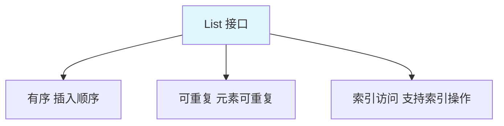
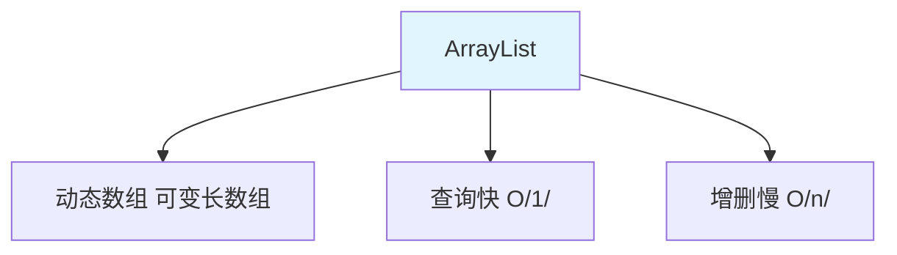
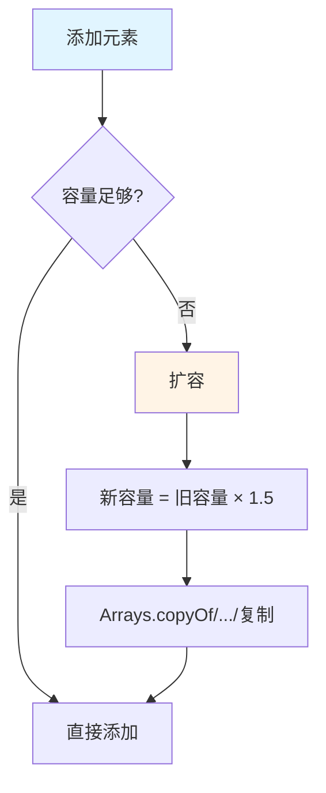
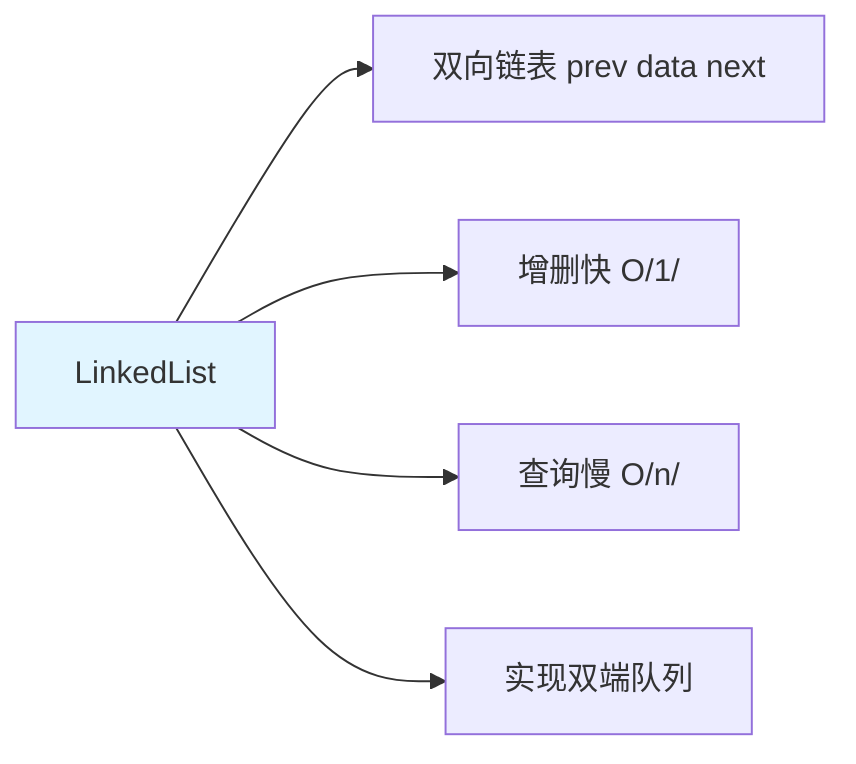
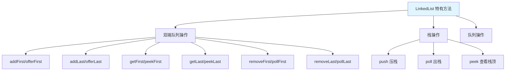
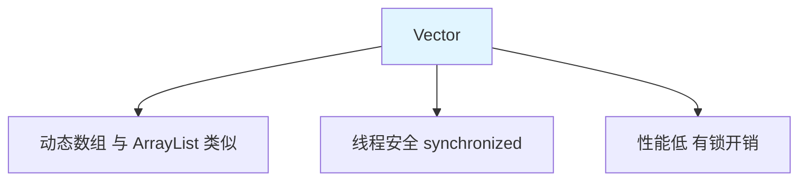

# List 集合

List 是**有序、可重复**的集合，支持**索引访问**。

## List 接口特点



**List 的特点**：

1. **有序**：元素按插入顺序存储
2. **可重复**：允许存储重复元素
3. **索引访问**：支持通过索引访问和操作元素

## List 的特有方法

### 索引相关方法

```java
import java.util.ArrayList;
import java.util.List;

public class ListIndexMethods {
    public static void main(String[] args) {
        List<String> list = new ArrayList<>();
        list.add("A");
        list.add("B");
        list.add("C");
        list.add("D");
        
        // 1. add(int index, E e)：在指定位置插入
        list.add(2, "X");
        System.out.println(list);  // [A, B, X, C, D]
        
        // 2. get(int index)：获取指定位置元素
        System.out.println(list.get(0));  // A
        System.out.println(list.get(2));  // X
        
        // 3. set(int index, E e)：修改指定位置元素
        list.set(2, "Y");
        System.out.println(list);  // [A, B, Y, C, D]
        
        // 4. remove(int index)：删除指定位置元素
        list.remove(2);
        System.out.println(list);  // [A, B, C, D]
        
        // 5. indexOf(Object o)：首次出现位置
        System.out.println(list.indexOf("C"));  // 2
        
        // 6. lastIndexOf(Object o)：最后出现位置
        list.add("C");
        System.out.println(list.lastIndexOf("C"));  // 4
        
        // 7. subList(int from, int to)：截取子列表
        List<String> subList = list.subList(1, 4);
        System.out.println(subList);  // [B, C, D]
    }
}
```

## ArrayList

### ArrayList 概述



**ArrayList 的特点**：

1. **动态数组**：底层是数组，支持动态扩容
2. **查询快**：通过索引直接访问，时间复杂度 O(1)
3. **增删慢**：需要移动元素，时间复杂度 O(n)
4. **非线程安全**：多线程环境下需要同步

### ArrayList 的使用

```java
import java.util.ArrayList;

public class ArrayListDemo {
    public static void main(String[] args) {
        // 1. 创建 ArrayList
        ArrayList<String> list = new ArrayList<>();
        
        // 2. 添加元素
        list.add("Hello");
        list.add("World");
        list.add("Java");
        System.out.println(list);  // [Hello, World, Java]
        
        // 3. 指定位置插入
        list.add(1, "Beautiful");
        System.out.println(list);  // [Hello, Beautiful, World, Java]
        
        // 4. 获取元素
        System.out.println(list.get(0));  // Hello
        
        // 5. 修改元素
        list.set(0, "Hi");
        System.out.println(list);  // [Hi, Beautiful, World, Java]
        
        // 6. 删除元素
        list.remove(1);
        list.remove("World");
        System.out.println(list);  // [Hi, Java]
        
        // 7. 获取大小
        System.out.println(list.size());  // 2
        
        // 8. 遍历
        for (int i = 0; i < list.size(); i++) {
            System.out.println(list.get(i));
        }
        
        for (String str : list) {
            System.out.println(str);
        }
    }
}
```

### ArrayList 的扩容机制



```java
public class ArrayListExpansion {
    public static void main(String[] args) {
        // 创建初始容量为 10 的 ArrayList
        ArrayList<Integer> list = new ArrayList<>(10);
        
        System.out.println("初始容量：" + getCapacity(list));
        
        // 添加 11 个元素（超过初始容量）
        for (int i = 0; i < 11; i++) {
            list.add(i);
        }
        
        System.out.println("扩容后容量：" + getCapacity(list));  // 15
    }
    
    // 反射获取容量
    public static int getCapacity(ArrayList<?> list) {
        try {
            java.lang.reflect.Field field = ArrayList.class.getDeclaredField("elementData");
            field.setAccessible(true);
            Object[] elementData = (Object[]) field.get(list);
            return elementData.length;
        } catch (Exception e) {
            return -1;
        }
    }
}
```

::: tip 扩容公式

```
新容量 = 旧容量 + (旧容量 >> 1) = 旧容量 × 1.5
```

:::

## LinkedList

### LinkedList 概述



**LinkedList 的特点**：

1. **双向链表**：每个节点包含前驱和后继指针
2. **增删快**：只需修改指针，时间复杂度 O(1)
3. **查询慢**：需要遍历，时间复杂度 O(n)
4. **双端队列**：实现了 Queue 和 Deque 接口

### LinkedList 的使用

```java
import java.util.LinkedList;

public class LinkedListDemo {
    public static void main(String[] args) {
        LinkedList<String> list = new LinkedList<>();
        
        // 1. 添加元素
        list.add("A");
        list.add("B");
        list.add("C");
        System.out.println(list);  // [A, B, C]
        
        // 2. 在头部添加
        list.addFirst("X");
        list.push("Y");  // 等价于 addFirst
        System.out.println(list);  // [Y, X, A, B, C]
        
        // 3. 在尾部添加
        list.addLast("Z");
        list.offer("W");  // 等价于 addLast
        System.out.println(list);  // [Y, X, A, B, C, Z, W]
        
        // 4. 获取头部元素
        System.out.println(list.getFirst());  // Y
        System.out.println(list.peek());       // Y
        
        // 5. 获取尾部元素
        System.out.println(list.getLast());  // W
        System.out.println(list.peekLast());  // W
        
        // 6. 删除头部元素
        list.removeFirst();
        list.pop();  // 等价于 removeFirst
        System.out.println(list);  // [A, B, C, Z, W]
        
        // 7. 删除尾部元素
        list.removeLast();
        System.out.println(list);  // [A, B, C, Z]
        
        // 8. 栈操作
        list.push("D");  // 压栈
        System.out.println(list.pop());  // 出栈：D
    }
}
```

### LinkedList 的特有方法



## Vector

### Vector 概述



**Vector 的特点**：

1. **动态数组**：与 ArrayList 类似
2. **线程安全**：所有方法都使用 synchronized 修饰
3. **性能低**：同步锁导致性能下降
4. **已过时**：推荐使用 ArrayList 或 Collections.synchronizedList()

### Vector 的使用

```java
import java.util.Vector;

public class VectorDemo {
    public static void main(String[] args) {
        Vector<String> vector = new Vector<>();
        
        // 添加元素
        vector.add("Hello");
        vector.add("World");
        System.out.println(vector);  // [Hello, World]
        
        // 获取元素
        System.out.println(vector.get(0));  // Hello
        
        // 删除元素
        vector.remove(0);
        System.out.println(vector);  // [World]
        
        // Vector 特有方法
        System.out.println(vector.capacity());  // 容量
    }
}
```

## ArrayList vs LinkedList vs Vector

| 特性 | ArrayList | LinkedList | Vector |
|------|-----------|------------|--------|
| **数据结构** | 动态数组 | 双向链表 | 动态数组 |
| **查询效率** | O(1) 快 | O(n) 慢 | O(1) 快 |
| **增删效率** | O(n) 慢 | O(1) 快 | O(n) 慢 |
| **线程安全** | ❌ 不安全 | ❌ 不安全 | ✅ 安全 |
| **使用场景** | 查询多 | 增删多 | 多线程（旧） |

## 实战案例

### 学生管理系统

```java
import java.util.ArrayList;
import java.util.List;

class Student {
    private String id;
    private String name;
    private int age;
    
    public Student(String id, String name, int age) {
        this.id = id;
        this.name = name;
        this.age = age;
    }
    
    // getter/setter 省略...
    
    @Override
    public String toString() {
        return "Student{id='" + id + "', name='" + name + "', age=" + age + "}";
    }
}

public class StudentManager {
    private List<Student> students;
    
    public StudentManager() {
        students = new ArrayList<>();
    }
    
    // 添加学生
    public boolean addStudent(Student student) {
        return students.add(student);
    }
    
    // 删除学生
    public boolean deleteStudent(String id) {
        for (int i = 0; i < students.size(); i++) {
            if (students.get(i).getId().equals(id)) {
                students.remove(i);
                return true;
            }
        }
        return false;
    }
    
    // 查找学生
    public Student findStudent(String id) {
        for (Student student : students) {
            if (student.getId().equals(id)) {
                return student;
            }
        }
        return null;
    }
    
    // 显示所有学生
    public void showAllStudents() {
        for (Student student : students) {
            System.out.println(student);
        }
    }
    
    public static void main(String[] args) {
        StudentManager manager = new StudentManager();
        
        manager.addStudent(new Student("001", "张三", 18));
        manager.addStudent(new Student("002", "李四", 19));
        manager.addStudent(new Student("003", "王五", 20));
        
        manager.showAllStudents();
        
        Student student = manager.findStudent("002");
        System.out.println("查找结果：" + student);
        
        manager.deleteStudent("002");
        System.out.println("删除后：");
        manager.showAllStudents();
    }
}
```

## 小结

::: tip 核心要点

1. **List 特点**：有序、可重复、支持索引
2. **ArrayList**：动态数组，查询快，增删慢
3. **LinkedList**：双向链表，增删快，查询慢，支持双端队列
4. **Vector**：线程安全的 ArrayList，性能低，已过时
5. **选择原则**：查询多用 ArrayList，增删多用 LinkedList

:::

::: info 下一步
- [Set 集合](/java/base/04-collections/set.md) - 学习 Set 集合详解
:::
