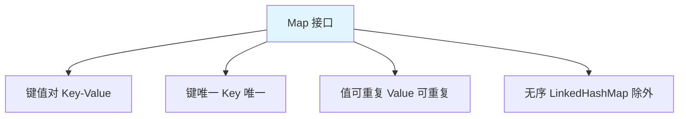
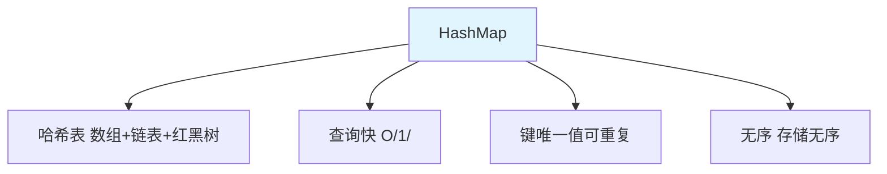
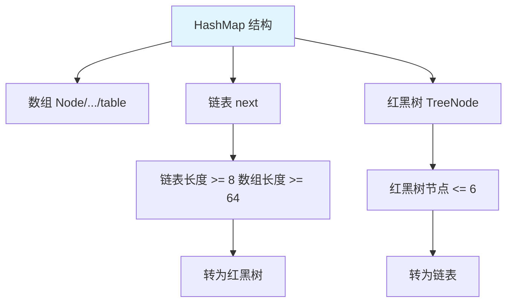
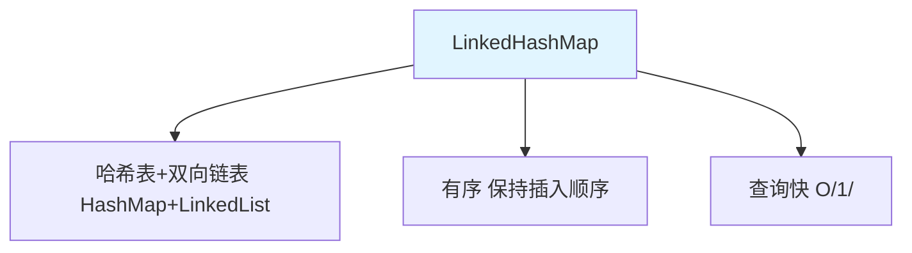
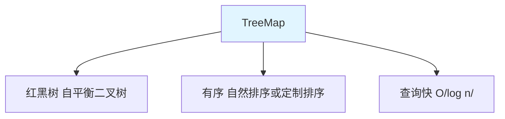

# Map 集合

Map 是**键值对**集合，存储**键-值映射**关系。

## Map 接口特点



**Map 的特点**：

1. **键值对**：存储键值对映射关系
2. **键唯一**：键不能重复，值可以重复
3. **无序**：存储无序（LinkedHashMap 除外）
4. **双列**：一次存储一对数据

## Map 的常用方法

### 基本操作

```java
import java.util.HashMap;
import java.util.Map;

public class MapBasicMethods {
    public static void main(String[] args) {
        Map<String, Integer> map = new HashMap<>();
        
        // 1. put(K key, V value)：添加键值对
        map.put("张三", 18);
        map.put("李四", 20);
        map.put("王五", 22);
        System.out.println(map);  // {张三=18, 李四=20, 王五=22}
        
        // 2. get(Object key)：根据键获取值
        System.out.println(map.get("张三"));  // 18
        System.out.println(map.get("赵六"));  // null
        
        // 3. getOrDefault(Object key, V defaultValue)：获取值（带默认值）
        System.out.println(map.getOrDefault("赵六", 0));  // 0
        
        // 4. remove(Object key)：删除键值对
        map.remove("李四");
        System.out.println(map);  // {张三=18, 王五=22}
        
        // 5. containsKey(Object key)：是否包含键
        System.out.println(map.containsKey("张三"));  // true
        
        // 6. containsValue(Object value)：是否包含值
        System.out.println(map.containsValue(18));    // true
        
        // 7. isEmpty()：是否为空
        System.out.println(map.isEmpty());  // false
        
        // 8. size()：键值对个数
        System.out.println(map.size());  // 2
        
        // 9. clear()：清空
        map.clear();
        System.out.println(map.isEmpty());  // true
    }
}
```

### 遍历方法

```java
import java.util.HashMap;
import java.util.Map;
import java.util.Set;

public class MapTraversal {
    public static void main(String[] args) {
        Map<String, Integer> map = new HashMap<>();
        map.put("张三", 18);
        map.put("李四", 20);
        map.put("王五", 22);
        
        // 方式1：键遍历
        System.out.println("===== 键遍历 =====");
        Set<String> keys = map.keySet();
        for (String key : keys) {
            System.out.println(key + " = " + map.get(key));
        }
        
        // 方式2：键值对遍历（推荐）
        System.out.println("===== 键值对遍历 =====");
        Set<Map.Entry<String, Integer>> entries = map.entrySet();
        for (Map.Entry<String, Integer> entry : entries) {
            System.out.println(entry.getKey() + " = " + entry.getValue());
        }
        
        // 方式3：值遍历
        System.out.println("===== 值遍历 =====");
        for (Integer value : map.values()) {
            System.out.println(value);
        }
        
        // 方式4：forEach（JDK 8）
        System.out.println("===== forEach =====");
        map.forEach((key, value) -> System.out.println(key + " = " + value));
    }
}
```

## HashMap

### HashMap 概述



**HashMap 的特点**：

1. **哈希表**：JDK 8 后是数组+链表+红黑树
2. **查询快**：添加、删除、查询都是 O(1)
3. **键唯一**：键不能重复，值可以重复
4. **无序**：存储顺序和插入顺序可能不一致
5. **允许 null**：键和值都允许 null

### HashMap 的使用

```java
import java.util.HashMap;
import java.util.Map;

public class HashMapDemo {
    public static void main(String[] args) {
        // 1. 创建 HashMap
        Map<String, Integer> map = new HashMap<>();
        
        // 2. 添加元素
        map.put("张三", 18);
        map.put("李四", 20);
        map.put("王五", 22);
        map.put("张三", 19);  // 键重复，覆盖旧值
        map.put(null, 0);     // 允许 null 键和值
        System.out.println(map);  // {null=0, 张三=19, 李四=20, 王五=22}
        
        // 3. 获取元素
        System.out.println(map.get("张三"));  // 19
        System.out.println(map.get(null));   // 0
        
        // 4. 判断
        System.out.println(map.containsKey("张三"));  // true
        System.out.println(map.containsValue(20));    // true
        
        // 5. 删除
        map.remove("李四");
        System.out.println(map);  // {null=0, 张三=19, 王五=22}
        
        // 6. 遍历
        for (Map.Entry<String, Integer> entry : map.entrySet()) {
            System.out.println(entry.getKey() + " = " + entry.getValue());
        }
    }
}
```

### HashMap 的底层原理



**JDK 8 的 HashMap 结构**：

1. **数组**：存储数据的主体
2. **链表**：处理哈希冲突
3. **红黑树**：链表长度 ≥ 8 且数组长度 ≥ 64 时转为红黑树

## LinkedHashMap

### LinkedHashMap 概述



**LinkedHashMap 的特点**：

1. **哈希表 + 双向链表**：在 HashMap 基础上增加链表维护顺序
2. **有序**：保持元素的插入顺序
3. **查询快**：继承 HashMap，查询效率高

### LinkedHashMap 的使用

```java
import java.util.LinkedHashMap;
import java.util.Map;

public class LinkedHashMapDemo {
    public static void main(String[] args) {
        // 1. 创建 LinkedHashMap
        Map<String, Integer> map = new LinkedHashMap<>();
        
        // 2. 添加元素（保持插入顺序）
        map.put("张三", 18);
        map.put("李四", 20);
        map.put("王五", 22);
        System.out.println(map);  // {张三=18, 李四=20, 王五=22}（有序）
        
        // 3. 遍历（插入顺序）
        for (Map.Entry<String, Integer> entry : map.entrySet()) {
            System.out.println(entry.getKey() + " = " + entry.getValue());
        }
    }
}
```

## TreeMap

### TreeMap 概述



**TreeMap 的特点**：

1. **红黑树**：底层是红黑树结构
2. **有序**：键自动排序（自然排序或定制排序）
3. **唯一**：键不能重复
4. **不含 null**：键不能为 null

### TreeMap 的使用

```java
import java.util.TreeMap;

public class TreeMapDemo {
    public static void main(String[] args) {
        TreeMap<Integer, String> map = new TreeMap<>();
        
        // 添加元素（按键排序）
        map.put(3, "C");
        map.put(1, "A");
        map.put(4, "D");
        map.put(2, "B");
        System.out.println(map);  // {1=A, 2=B, 3=C, 4=D}（升序）
        
        // 特有方法
        System.out.println(map.firstKey());    // 1（最小键）
        System.out.println(map.lastKey());     // 4（最大键）
        System.out.println(map.lowerKey(3));  // 2（小于 3 的最大键）
        System.out.println(map.higherKey(3)); // 4（大于 3 的最小键）
        
        // 子 Map
        System.out.println(map.headMap(3));  // {1=A, 2=B}（小于 3）
        System.out.println(map.tailMap(3));  // {3=C, 4=D}（大于等于 3）
    }
}
```

## Map 的实现类对比

| 类名 | 数据结构 | 有序性 | 线程安全 | null 键 | 排序 | 使用场景 |
|------|----------|--------|----------|---------|------|----------|
| **HashMap** | 哈希表 | ❌ 无序 | ❌ 不安全 | ✅ 允许 | ❌ 不排序 | 最常用、快速查找 |
| **LinkedHashMap** | 哈希表+链表 | ✅ 有序 | ❌ 不安全 | ✅ 允许 | ❌ 不排序 | 保持插入顺序 |
| **TreeMap** | 红黑树 | ✅ 有序 | ❌ 不安全 | ❌ 不允许 | ✅ 排序 | 需要排序 |
| **Hashtable** | 哈希表 | ❌ 无序 | ✅ 安全 | ❌ 不允许 | ❌ 不排序 | 多线程（旧） |
| **ConcurrentHashMap** | 哈希表+分段锁 | ❌ 无序 | ✅ 安全 | ❌ 不允许 | ❌ 不排序 | 多线程（新） |

## 实战案例

### 统计字符出现次数

```java
import java.util.HashMap;
import java.util.Map;
import java.util.Scanner;

public class CharCount {
    public static void main(String[] args) {
        Scanner scanner = new Scanner(System.in);
        System.out.println("请输入一个字符串：");
        String str = scanner.nextLine();
        
        // 统计每个字符出现的次数
        Map<Character, Integer> map = new HashMap<>();
        for (char c : str.toCharArray()) {
            map.put(c, map.getOrDefault(c, 0) + 1);
        }
        
        // 输出结果
        for (Map.Entry<Character, Integer> entry : map.entrySet()) {
            System.out.println(entry.getKey() + " : " + entry.getValue());
        }
    }
}
```

### 缓存实现

```java
import java.util.HashMap;
import java.util.Map;

public class Cache<K, V> {
    private Map<K, V> cache;
    private int maxSize;
    
    public Cache(int maxSize) {
        this.maxSize = maxSize;
        this.cache = new HashMap<>();
    }
    
    // 添加缓存
    public void put(K key, V value) {
        if (cache.size() >= maxSize && !cache.containsKey(key)) {
            // 缓存已满，移除第一个元素
            K firstKey = cache.keySet().iterator().next();
            cache.remove(firstKey);
        }
        cache.put(key, value);
    }
    
    // 获取缓存
    public V get(K key) {
        return cache.get(key);
    }
    
    // 移除缓存
    public V remove(K key) {
        return cache.remove(key);
    }
    
    // 清空缓存
    public void clear() {
        cache.clear();
    }
    
    // 缓存大小
    public int size() {
        return cache.size();
    }
    
    public static void main(String[] args) {
        Cache<String, Integer> cache = new Cache<>(3);
        
        cache.put("A", 1);
        cache.put("B", 2);
        cache.put("C", 3);
        cache.put("D", 4);  // A 被移除
        
        System.out.println(cache.get("A"));  // null
        System.out.println(cache.get("B"));  // 2
        System.out.println(cache.get("D"));  // 4
    }
}
```

## 小结

::: tip 核心要点

1. **Map 特点**：键值对、键唯一、值可重复
2. **HashMap**：哈希表，查询快，无序，最常用
3. **LinkedHashMap**：哈希表+链表，保持插入顺序
4. **TreeMap**：红黑树，自动排序
5. **遍历方式**：keySet、entrySet、values、forEach
6. **选择原则**：快速查找用 HashMap，保持顺序用 LinkedHashMap，需要排序用 TreeMap

:::

::: info 下一步
- [Collections 工具类](/java/base/04-collections/collections-util.md) - 学习 Collections 工具类
:::
