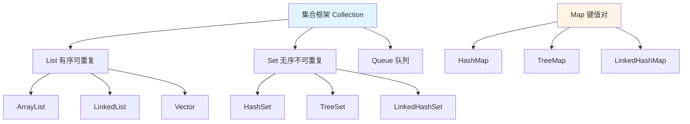
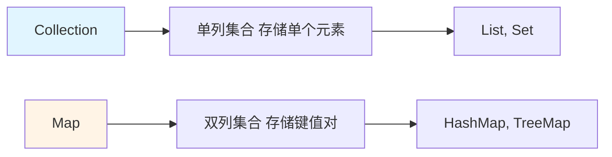
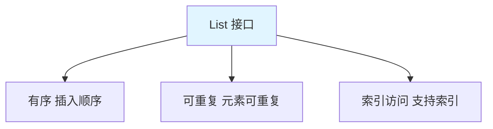
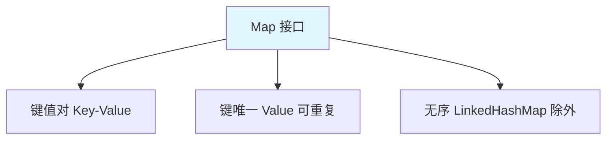
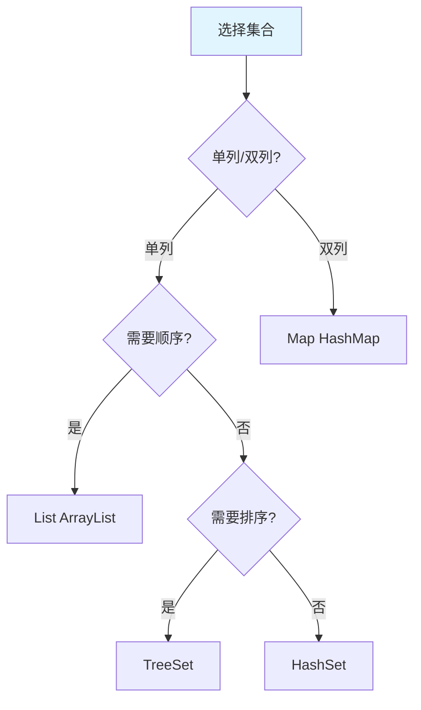
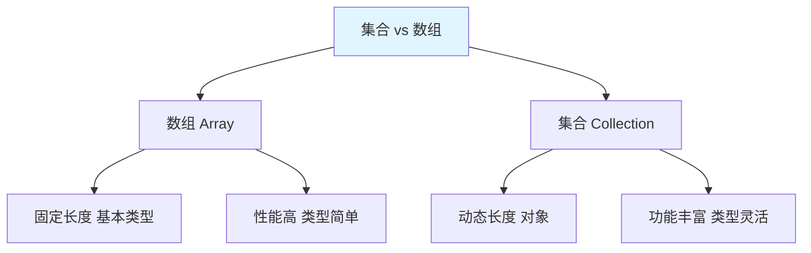

# 集合概述

Java 集合框架提供了一套性能优良、使用方便的接口和类，用于存储和操作对象组。

## 集合框架体系

### 集合框架架构



### Collection vs Map



| 接口 | 特点 | 实现类 |
|------|------|--------|
| **Collection** | 单列集合，存储元素 | List、Set、Queue |
| **Map** | 双列集合，存储键值对 | HashMap、TreeMap |

## Collection 接口

### Collection 的常用方法

```java
import java.util.ArrayList;
import java.util.Collection;

public class CollectionDemo {
    public static void main(String[] args) {
        Collection<String> coll = new ArrayList<>();
        
        // 1. 添加元素
        coll.add("Hello");
        coll.add("World");
        coll.add("Java");
        System.out.println(coll);  // [Hello, World, Java]
        
        // 2. 获取元素个数
        System.out.println(coll.size());  // 3
        
        // 3. 删除元素
        coll.remove("World");
        System.out.println(coll);  // [Hello, Java]
        
        // 4. 判断是否包含
        System.out.println(coll.contains("Hello"));  // true
        System.out.println(coll.contains("Python"));  // false
        
        // 5. 判断是否为空
        System.out.println(coll.isEmpty());  // false
        
        // 6. 清空集合
        coll.clear();
        System.out.println(coll.isEmpty());  // true
        
        // 7. 添加多个元素
        coll.addAll(Collection.of("A", "B", "C"));
        System.out.println(coll);  // [A, B, C]
        
        // 8. 转数组
        Object[] arr = coll.toArray();
        System.out.println(Arrays.toString(arr));  // [A, B, C]
        
        // 9. 遍历
        // 增强 for
        for (String s : coll) {
            System.out.println(s);
        }
        
        // 迭代器
        Iterator<String> it = coll.iterator();
        while (it.hasNext()) {
            System.out.println(it.next());
        }
    }
}
```

## List 集合

### List 的特点



**List 的特点**：

1. **有序**：元素按插入顺序存储
2. **可重复**：可以存储重复元素
3. **索引访问**：支持通过索引访问元素

### List 的常用方法

```java
import java.util.ArrayList;
import java.util.List;

public class ListDemo {
    public static void main(String[] args) {
        List<String> list = new ArrayList<>();
        
        // 1. 添加元素
        list.add("Hello");
        list.add("World");
        list.add("Java");
        list.add("Java");  // 可重复
        System.out.println(list);  // [Hello, World, Java, Java]
        
        // 2. 在指定位置插入
        list.add(1, "Beautiful");
        System.out.println(list);  // [Hello, Beautiful, World, Java, Java]
        
        // 3. 获取元素
        System.out.println(list.get(0));  // Hello
        
        // 4. 修改元素
        list.set(0, "Hi");
        System.out.println(list);  // [Hi, Beautiful, World, Java, Java]
        
        // 5. 删除元素
        list.remove(1);  // 删除索引 1
        list.remove("Java");  // 删除第一个 "Java"
        System.out.println(list);  // [Hi, World, Java]
        
        // 6. 获取索引
        System.out.println(list.indexOf("World"));  // 1
        System.out.println(list.lastIndexOf("Java"));  // 2
        
        // 7. 截取子列表
        List<String> subList = list.subList(0, 2);
        System.out.println(subList);  // [Hi, World]
        
        // 8. List 转数组
        String[] arr = list.toArray(new String[0]);
        System.out.println(Arrays.toString(arr));  // [Hi, World, Java]
    }
}
```

### List 的实现类对比

| 类名 | 数据结构 | 线程安全 | 查询效率 | 增删效率 | 使用场景 |
|------|----------|----------|----------|----------|----------|
| **ArrayList** | 动态数组 | ❌ 不安全 | O(1) | O(n) | 查询多 |
| **LinkedList** | 双向链表 | ❌ 不安全 | O(n) | O(1) | 增删多 |
| **Vector** | 动态数组 | ✅ 安全 | O(1) | O(n) | 多线程 |

## Set 集合

### Set 的特点


**Set 的特点**：

1. **无序**：元素存储无序（LinkedHashSet 除外）
2. **不可重复**：不能存储重复元素
3. **无索引**：不支持通过索引访问

### Set 的常用方法

```java
import java.util.HashSet;
import java.util.Set;

public class SetDemo {
    public static void main(String[] args) {
        Set<String> set = new HashSet<>();
        
        // 1. 添加元素
        set.add("Hello");
        set.add("World");
        set.add("Java");
        set.add("Java");  // 重复元素不会被添加
        System.out.println(set);  // [Java, World, Hello]（无序）
        
        // 2. 判断是否包含
        System.out.println(set.contains("Java"));  // true
        
        // 3. 删除元素
        set.remove("World");
        System.out.println(set);  // [Java, Hello]
        
        // 4. 集合大小
        System.out.println(set.size());  // 2
        
        // 5. 遍历
        for (String s : set) {
            System.out.println(s);
        }
    }
}
```

### Set 的实现类对比

| 类名 | 数据结构 | 有序性 | 线程安全 | 排序 | 使用场景 |
|------|----------|--------|----------|------|----------|
| **HashSet** | 哈希表 | ❌ 无序 | ❌ 不安全 | ❌ 不排序 | 快速查找 |
| **LinkedHashSet** | 哈希表+链表 | ✅ 有序 | ❌ 不安全 | ❌ 不排序 | 保持插入顺序 |
| **TreeSet** | 红黑树 | ✅ 有序 | ❌ 不安全 | ✅ 自然排序 | 需要排序 |

## Map 集合

### Map 的特点



**Map 的特点**：

1. **键值对**：存储键值对映射
2. **键唯一**：键不能重复，值可以重复
3. **无序**：存储无序（LinkedHashMap 除外）

### Map 的常用方法

```java
import java.util.HashMap;
import java.util.Map;

public class MapDemo {
    public static void main(String[] args) {
        Map<String, Integer> map = new HashMap<>();
        
        // 1. 添加键值对
        map.put("张三", 18);
        map.put("李四", 20);
        map.put("王五", 22);
        map.put("张三", 19);  // 键重复，覆盖旧值
        System.out.println(map);  // {张三=19, 李四=20, 王五=22}
        
        // 2. 获取值
        System.out.println(map.get("张三"));  // 19
        System.out.println(map.get("赵六"));  // null
        
        // 3. 获取值（带默认值）
        System.out.println(map.getOrDefault("赵六", 0));  // 0
        
        // 4. 判断是否包含键/值
        System.out.println(map.containsKey("张三"));  // true
        System.out.println(map.containsValue(20));    // true
        
        // 5. 删除键值对
        map.remove("李四");
        System.out.println(map);  // {张三=19, 王五=22}
        
        // 6. 获取大小
        System.out.println(map.size());  // 2
        
        // 7. 判断是否为空
        System.out.println(map.isEmpty());  // false
        
        // 8. 获取所有键
        System.out.println(map.keySet());  // [张三, 王五]
        
        // 9. 获取所有值
        System.out.println(map.values());  // [19, 22]
        
        // 10. 获取所有键值对
        System.out.println(map.entrySet());  // [张三=19, 王五=22]
        
        // 11. 遍历
        // 方式1：键遍历
        for (String key : map.keySet()) {
            System.out.println(key + " = " + map.get(key));
        }
        
        // 方式2：键值对遍历（推荐）
        for (Map.Entry<String, Integer> entry : map.entrySet()) {
            System.out.println(entry.getKey() + " = " + entry.getValue());
        }
        
        // 方式3：forEach（JDK 8+）
        map.forEach((key, value) -> System.out.println(key + " = " + value));
    }
}
```

### Map 的实现类对比

| 类名 | 数据结构 | 有序性 | 线程安全 | null 键/值 | 使用场景 |
|------|----------|--------|----------|-----------|----------|
| **HashMap** | 哈希表 | ❌ 无序 | ❌ 不安全 | ✅ 允许 | 最常用 |
| **LinkedHashMap** | 哈希表+链表 | ✅ 有序 | ❌ 不安全 | ✅ 允许 | 保持顺序 |
| **TreeMap** | 红黑树 | ✅ 有序 | ❌ 不安全 | ❌ 不允许 | 需要排序 |
| **Hashtable** | 哈希表 | ❌ 无序 | ✅ 安全 | ❌ 不允许 | 多线程（旧） |
| **ConcurrentHashMap** | 哈希表+分段锁 | ❌ 无序 | ✅ 安全 | ❌ 不允许 | 多线程（新） |

## 集合的选择

### 如何选择集合



### 选择建议

::: tabs

@tab List 的选择

| 场景 | 推荐 | 原因 |
|------|------|------|
| 查询多，增删少 | `ArrayList` | 数组查询快 O(1) |
| 增删多，查询少 | `LinkedList` | 链表增删快 O(1) |
| 多线程 | `Vector` 或 `Collections.synchronizedList()` | 线程安全 |

@tab Set 的选择

| 场景 | 推荐 | 原因 |
|------|------|------|
| 快速查找，不排序 | `HashSet` | 哈希表 O(1) |
| 保持插入顺序 | `LinkedHashSet` | 链表维护顺序 |
| 需要排序 | `TreeSet` | 红黑树自动排序 |

@tab Map 的选择

| 场景 | 推荐 | 原因 |
|------|------|------|
| 最常用 | `HashMap` | 高性能哈希表 |
| 保持插入顺序 | `LinkedHashMap` | 链表维护顺序 |
| 需要排序 | `TreeMap` | 红黑树排序 |
| 多线程（旧） | `Hashtable` | 线程安全（慢） |
| 多线程（新） | `ConcurrentHashMap` | 线程安全（快） |

:::

## 集合与数组的区别



| 特性 | 数组 | 集合 |
|------|------|------|
| 长度 | 固定 | 动态 |
| 内容 | 基本类型、引用类型 | 只能引用类型 |
| 功能 | 简单 | 丰富（增删改查） |
| 性能 | 高 | 稍低 |
| 泛型 | 不支持 | 支持 |
| 工具方法 | Arrays | Collections |

## 小结

::: tip 核心要点

1. **Collection**：单列集合接口，包含 List、Set、Queue
2. **List**：有序可重复，支持索引，ArrayList 查询快
3. **Set**：无序不可重复，HashSet 查找快
4. **Map**：键值对，键唯一，HashMap 最常用
5. **选择原则**：查询用 ArrayList，增删用 LinkedList，去重用 HashSet，排序用 TreeSet，映射用 HashMap

:::

::: info 下一步
- [Collection 接口](/java/base/04-collections/collection.md) - 学习 Collection 接口详解
- [List 集合](/java/base/04-collections/list.md) - 学习 List 集合详解
:::
