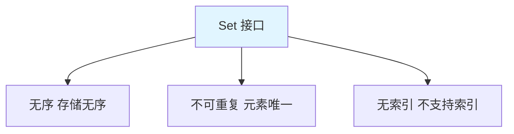
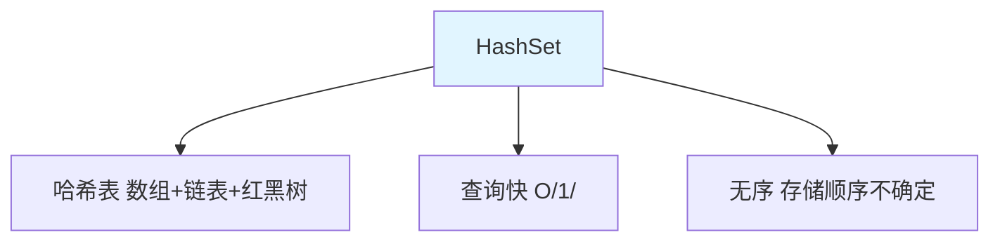
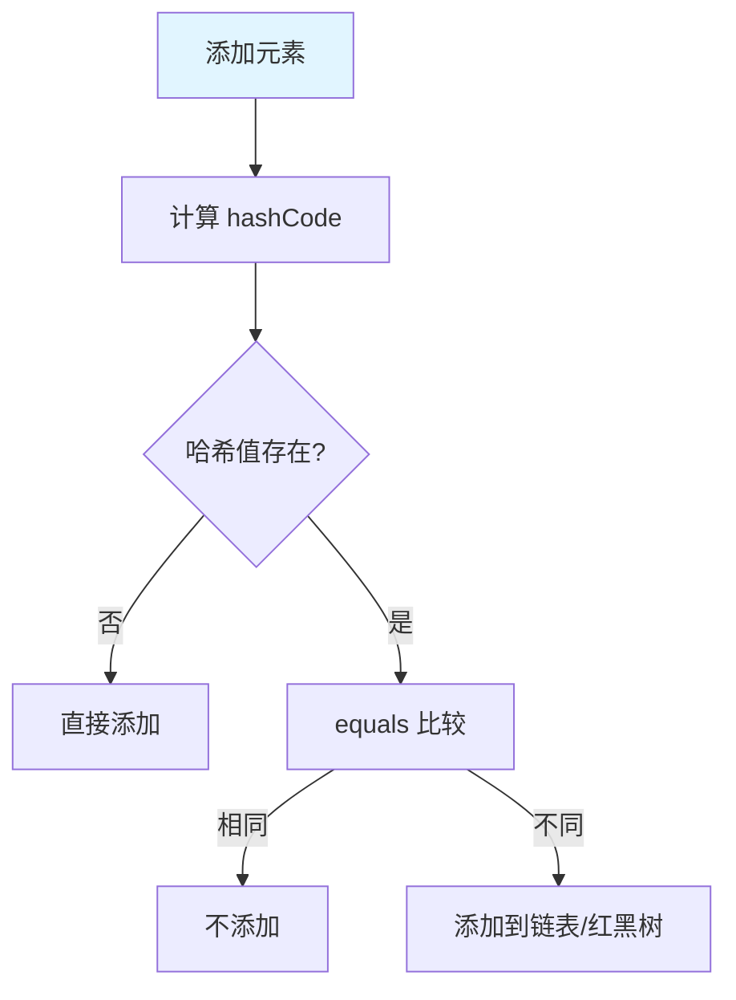
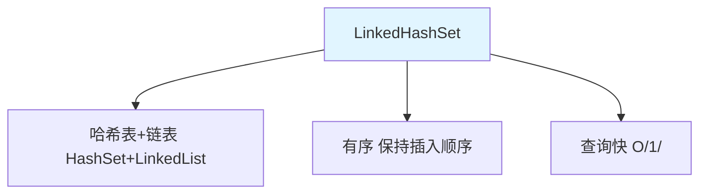
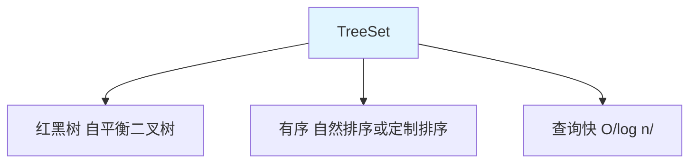

# Set 集合

Set 是**无序、不可重复**的集合，不包含重复元素。

## Set 接口特点



**Set 的特点**：

1. **无序**：元素存储无序（LinkedHashSet 除外）
2. **不可重复**：不能存储重复元素
3. **无索引**：不支持通过索引访问

## HashSet

### HashSet 概述



**HashSet 的特点**：

1. **哈希表**：底层是 HashMap，通过哈希值存储
2. **查询快**：添加、删除、查询都是 O(1)
3. **无序**：存储顺序和插入顺序可能不一致
4. **允许 null**：可以存储一个 null 元素

### HashSet 的使用

```java
import java.util.HashSet;
import java.util.Set;

public class HashSetDemo {
    public static void main(String[] args) {
        // 1. 创建 HashSet
        Set<String> set = new HashSet<>();
        
        // 2. 添加元素
        set.add("Hello");
        set.add("World");
        set.add("Java");
        set.add("Java");  // 重复元素不会被添加
        set.add(null);
        System.out.println(set);  // [null, Java, World, Hello]（无序）
        
        // 3. 判断是否包含
        System.out.println(set.contains("Java"));  // true
        System.out.println(set.contains("Python"));  // false
        
        // 4. 删除元素
        set.remove("World");
        System.out.println(set);  // [null, Java, Hello]
        
        // 5. 获取大小
        System.out.println(set.size());  // 3
        
        // 6. 遍历
        for (String str : set) {
            System.out.println(str);
        }
    }
}
```

### HashSet 去重原理



**去重步骤**：

1. 计算元素的 `hashCode()`
2. 判断哈希值是否存在
3. 如果哈希值相同，调用 `equals()` 比较
4. `equals()` 返回 true，不添加；返回 false，添加

::: tip 自定义对象去重

```java
class Person {
    private String name;
    private int age;
    
    public Person(String name, int age) {
        this.name = name;
        this.age = age;
    }
    
    // 必须重写 hashCode 和 equals
    @Override
    public int hashCode() {
        return Objects.hash(name, age);
    }
    
    @Override
    public boolean equals(Object obj) {
        if (this == obj) return true;
        if (obj == null || getClass() != obj.getClass()) return false;
        Person person = (Person) obj;
        return age == person.age && Objects.equals(name, person.name);
    }
}

public class CustomHashSet {
    public static void main(String[] args) {
        Set<Person> set = new HashSet<>();
        set.add(new Person("张三", 18));
        set.add(new Person("张三", 18));  // 重复，不会添加
        set.add(new Person("李四", 20));
        System.out.println(set.size());  // 2
    }
}
```

:::

## LinkedHashSet

### LinkedHashSet 概述



**LinkedHashSet 的特点**：

1. **哈希表 + 链表**：结合 HashSet 和 LinkedList 的特点
2. **有序**：保持元素的插入顺序
3. **查询快**：继承 HashSet，查询效率高

### LinkedHashSet 的使用

```java
import java.util.LinkedHashSet;
import java.util.Set;

public class LinkedHashSetDemo {
    public static void main(String[] args) {
        Set<String> set = new LinkedHashSet<>();
        
        // 添加元素（保持插入顺序）
        set.add("Hello");
        set.add("World");
        set.add("Java");
        set.add("Java");  // 重复元素不会被添加
        System.out.println(set);  // [Hello, World, Java]（有序）
        
        // 遍历（插入顺序）
        for (String str : set) {
            System.out.println(str);  // Hello, World, Java
        }
    }
}
```

## TreeSet

### TreeSet 概述



**TreeSet 的特点**：

1. **红黑树**：底层是 TreeMap，红黑树结构
2. **有序**：元素自动排序（自然排序或定制排序）
3. **唯一**：不能存储重复元素
4. **不含 null**：不能存储 null 元素

### TreeSet 的使用

```java
import java.util.TreeSet;

public class TreeSetDemo {
    public static void main(String[] args) {
        TreeSet<Integer> set = new TreeSet<>();
        
        // 添加元素（自动排序）
        set.add(5);
        set.add(2);
        set.add(8);
        set.add(1);
        set.add(2);  // 重复元素不会被添加
        System.out.println(set);  // [1, 2, 5, 8]（升序）
        
        // 特有方法
        System.out.println(set.first());    // 1（最小值）
        System.out.println(set.last());     // 8（最大值）
        System.out.println(set.lower(5));  // 2（小于 5 的最大值）
        System.out.println(set.higher(5)); // 8（大于 5 的最小值）
        System.out.println(set.floor(5));  // 5（小于等于 5 的最大值）
        System.out.println(set.ceiling(5)); // 5（大于等于 5 的最小值）
        
        // 子集
        System.out.println(set.headSet(5));  // [1, 2]（小于 5）
        System.out.println(set.tailSet(5));  // [5, 8]（大于等于 5）
        System.out.println(set.subSet(2, 8)); // [2, 5]（[2, 8)）
    }
}
```

### 自然排序与定制排序

::: tabs

@tab 自然排序

```java
// 实现 Comparable 接口
class Student implements Comparable<Student> {
    private String name;
    private int age;
    
    public Student(String name, int age) {
        this.name = name;
        this.age = age;
    }
    
    @Override
    public int compareTo(Student other) {
        return this.age - other.age;  // 按年龄升序
    }
    
    @Override
    public String toString() {
        return name + ":" + age;
    }
}

public class NaturalOrdering {
    public static void main(String[] args) {
        TreeSet<Student> set = new TreeSet<>();
        set.add(new Student("张三", 18));
        set.add(new Student("李四", 20));
        set.add(new Student("王五", 19));
        System.out.println(set);  // [张三:18, 王五:19, 李四:20]
    }
}
```

@tab 定制排序

```java
import java.util.Comparator;
import java.util.TreeSet;

public class CustomOrdering {
    public static void main(String[] args) {
        // 使用 Comparator 定制排序
        TreeSet<Integer> set = new TreeSet<>(new Comparator<Integer>() {
            @Override
            public int compare(Integer o1, Integer o2) {
                return o2 - o1;  // 降序
            }
        });
        
        set.add(5);
        set.add(2);
        set.add(8);
        set.add(1);
        System.out.println(set);  // [8, 5, 2, 1]（降序）
        
        // Lambda 写法（JDK 8+）
        TreeSet<Integer> set2 = new TreeSet<>((o1, o2) -> o2 - o1);
        set2.addAll(set);
        System.out.println(set2);
    }
}
```

:::

## Set 的实现类对比

| 类名 | 数据结构 | 有序性 | 线程安全 | null | 排序 | 使用场景 |
|------|----------|--------|----------|------|------|----------|
| **HashSet** | 哈希表 | ❌ 无序 | ❌ 不安全 | ✅ 允许 | ❌ 不排序 | 快速查找、去重 |
| **LinkedHashSet** | 哈希表+链表 | ✅ 有序 | ❌ 不安全 | ✅ 允许 | ❌ 不排序 | 保持插入顺序、去重 |
| **TreeSet** | 红黑树 | ✅ 有序 | ❌ 不安全 | ❌ 不允许 | ✅ 排序 | 需要排序、去重 |

## 实战案例

### 随机去重

```java
import java.util.ArrayList;
import java.util.HashSet;
import java.util.List;
import java.util.Random;
import java.util.Set;

public class RandomUnique {
    public static void main(String[] args) {
        // 生成 10 个 1-20 之间的随机数（不重复）
        Set<Integer> set = new HashSet<>();
        Random random = new Random();
        
        while (set.size() < 10) {
            int num = random.nextInt(20) + 1;  // 1-20
            set.add(num);  // 自动去重
        }
        
        System.out.println("随机数（不重复）：" + set);
        
        // 转为 List
        List<Integer> list = new ArrayList<>(set);
        System.out.println("转换为 List：" + list);
    }
}
```

### 集合运算

```java
import java.util.HashSet;
import java.util.Set;

public class SetOperations {
    public static void main(String[] args) {
        Set<Integer> set1 = new HashSet<>();
        set1.add(1);
        set1.add(2);
        set1.add(3);
        set1.add(4);
        
        Set<Integer> set2 = new HashSet<>();
        set2.add(3);
        set2.add(4);
        set2.add(5);
        set2.add(6);
        
        // 1. 交集（retainAll）
        Set<Integer> intersection = new HashSet<>(set1);
        intersection.retainAll(set2);
        System.out.println("交集：" + intersection);  // [3, 4]
        
        // 2. 并集（addAll）
        Set<Integer> union = new HashSet<>(set1);
        union.addAll(set2);
        System.out.println("并集：" + union);  // [1, 2, 3, 4, 5, 6]
        
        // 3. 差集（removeAll）
        Set<Integer> difference = new HashSet<>(set1);
        difference.removeAll(set2);
        System.out.println("差集：" + difference);  // [1, 2]
    }
}
```

## 小结

::: tip 核心要点

1. **Set 特点**：无序、不可重复、无索引
2. **HashSet**：哈希表，查询快，无序
3. **LinkedHashSet**：哈希表+链表，保持插入顺序
4. **TreeSet**：红黑树，自动排序
5. **去重原理**：hashCode() + equals()
6. **选择原则**：去重用 HashSet，保持顺序用 LinkedHashSet，需要排序用 TreeSet

:::

::: info 下一步
- [Map 集合](/java/base/04-collections/map.md) - 学习 Map 集合详解
:::
