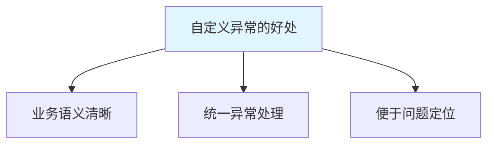
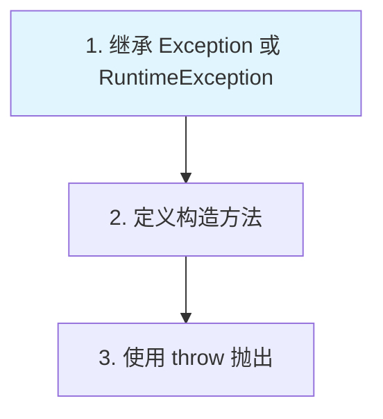

# 自定义异常

自定义异常是**根据业务需求定义的异常类**，继承 Exception 或 RuntimeException。

## 为什么需要自定义异常



**自定义异常的用途**：

1. **业务语义**：更清晰地表示业务错误
2. **统一处理**：同类异常统一处理
3. **问题定位**：快速定位问题所在

## 自定义异常的步骤

### 定义异常类



**步骤**：

1. 继承 `Exception`（受检异常）或 `RuntimeException`（非受检异常）
2. 提供无参构造和带消息构造
3. 可选：提供带原因的构造

### 示例

```java
// 自定义受检异常
public class BusinessException extends Exception {
    public BusinessException() {
        super();
    }
    
    public BusinessException(String message) {
        super(message);
    }
    
    public BusinessException(String message, Throwable cause) {
        super(message, cause);
    }
}

// 自定义非受检异常
public class BaseException extends RuntimeException {
    public BaseException() {
        super();
    }
    
    public BaseException(String message) {
        super(message);
    }
    
    public BaseException(String message, Throwable cause) {
        super(message, cause);
    }
}
```

## 自定义异常的使用

### 受检异常

```java
public class CheckedUsage {
    public static void main(String[] args) {
        try {
            withdraw(1000);
        } catch (BusinessException e) {
            System.out.println("业务异常：" + e.getMessage());
        }
    }
    
    public static void withdraw(double amount) throws BusinessException {
        if (amount <= 0) {
            throw new BusinessException("取款金额必须大于0");
        }
        if (amount > 10000) {
            throw new BusinessException("单笔取款不能超过10000");
        }
    }
}
```

### 非受检异常

```java
public class UncheckedUsage {
    public static void main(String[] args) {
        try {
            register("user123", "123");
        } catch (BaseException e) {
            System.out.println("注册失败：" + e.getMessage());
        }
    }
    
    public static void register(String username, String password) {
        if (username == null || username.isEmpty()) {
            throw new BaseException("用户名不能为空");
        }
        if (password == null || password.length() < 6) {
            throw new BaseException("密码长度不能少于6位");
        }
    }
}
```

## 异常链

### 什么是异常链

**异常链**：在抛出新异常时，保留原始异常信息。

```java
public class ExceptionChain {
    public static void main(String[] args) {
        try {
            method1();
        } catch (BaseException e) {
            e.printStackTrace();
        }
    }
    
    public static void method1() {
        try {
            method2();
        } catch (IOException e) {
            throw new BaseException("业务处理失败", e);  // 异常链
        }
    }
    
    public static void method2() throws IOException {
        throw new IOException("文件读取失败");
    }
}
```

**异常链的好处**：

1. **保留原始信息**：不丢失底层异常
2. **问题定位**：快速定位根本原因
3. **调试友好**：完整的异常栈

## 实战案例

### 业务异常体系

```java
// 基础异常
public class AppException extends RuntimeException {
    private String code;
    
    public AppException(String code, String message) {
        super(message);
        this.code = code;
    }
    
    public String getCode() {
        return code;
    }
}

// 用户异常
public class UserException extends AppException {
    public UserException(String code, String message) {
        super(code, message);
    }
}

// 订单异常
public class OrderException extends AppException {
    public OrderException(String code, String message) {
        super(code, message);
    }
}

// 使用
public class UserService {
    public void login(String username, String password) {
        if (username == null || username.isEmpty()) {
            throw new UserException("USER_001", "用户名不能为空");
        }
        if (password == null || password.length() < 6) {
            throw new UserException("USER_002", "密码长度不能少于6位");
        }
    }
}
```

## 小结

::: tip 核心要点

1. **定义异常**：继承 Exception 或 RuntimeException
2. **构造方法**：提供无参、带消息、带原因的构造
3. **受检异常**：继承 Exception，必须处理
4. **非受检异常**：继承 RuntimeException，可选择处理
5. **异常链**：保留原始异常，便于问题定位
6. **业务异常**：统一业务异常处理

:::

::: info 下一步
- [File 类](/java/base/06-io/file-class.md) - 学习 IO 流
:::
