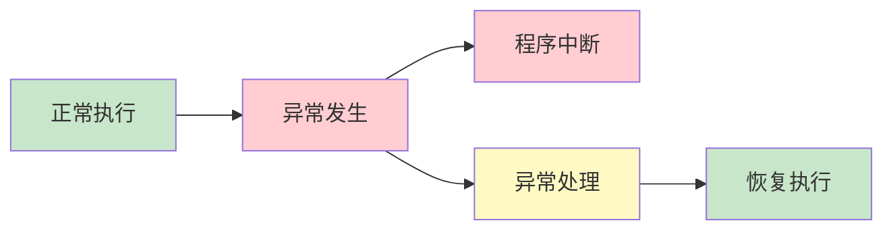
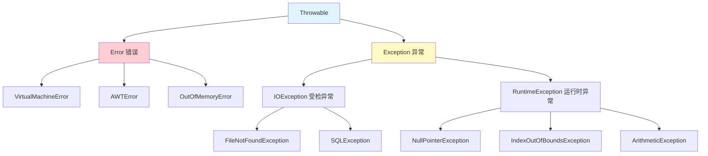
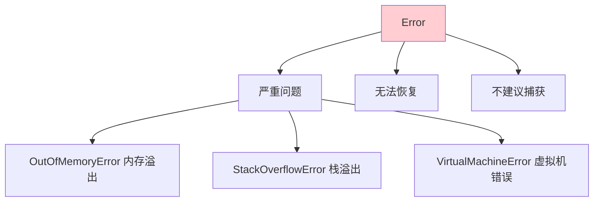
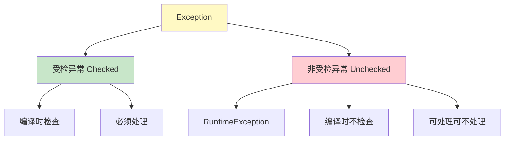
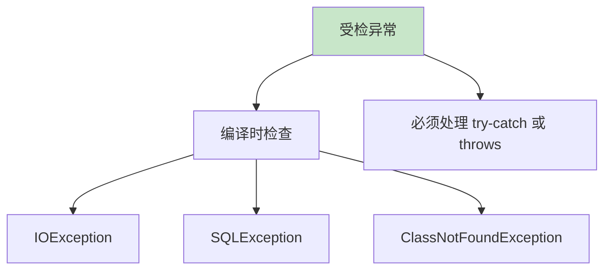
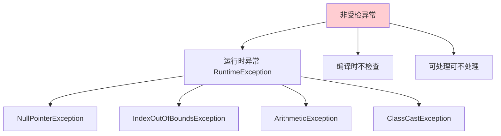
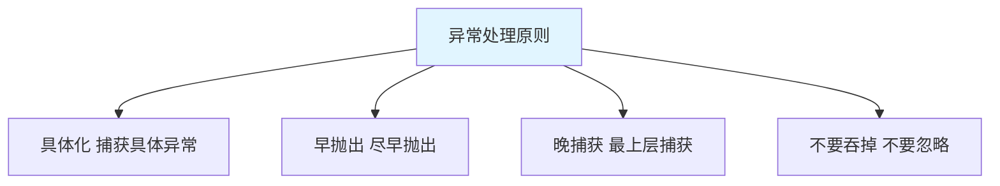

# 异常概述

异常(Exception)是程序在**执行过程中发生的事件**，中断了程序的正常执行。

## 异常的概念

### 什么是异常



**异常的作用**：

1. **中断程序**：遇到错误时中断当前执行流程
2. **传递信息**：携带错误信息到调用处
3. **恢复执行**：通过异常处理机制恢复程序

### 异常的体系结构



## Throwable 类

### Throwable 的方法

```java
public class ThrowableMethods {
    public static void main(String[] args) {
        try {
            int[] arr = new int[5];
            System.out.println(arr[10]);  // ArrayIndexOutOfBoundsException
        } catch (Exception e) {
            // 1. getMessage()：异常信息
            System.out.println("getMessage: " + e.getMessage());
            // Index 10 out of bounds for length 5
            
            // 2. toString()：异常类型 + 信息
            System.out.println("toString: " + e.toString());
            // java.lang.ArrayIndexOutOfBoundsException: Index 10 out of bounds for length 5
            
            // 3. printStackTrace()：打印堆栈跟踪
            System.out.println("printStackTrace:");
            e.printStackTrace();
        }
    }
}
```

## Error 与 Exception

### Error（错误）



**Error 的特点**：

1. **严重问题**：JVM 内部错误或资源耗尽
2. **无法恢复**：程序无法继续执行
3. **不建议捕获**：应该让程序终止

**常见 Error**：

```java
public class ErrorDemo {
    public static void main(String[] args) {
        // 1. StackOverflowError：栈溢出
        // method();  // 递归太深
        
        // 2. OutOfMemoryError：内存溢出
        // int[] arr = new int[Integer.MAX_VALUE];
    }
    
    public static void method() {
        method();  // 无限递归
    }
}
```

### Exception（异常）



## 受检异常与非受检异常

### 受检异常（Checked Exception）



**受检异常的特点**：

1. **编译时检查**：编译器强制要求处理
2. **必须处理**：要么捕获，要么声明抛出
3. **可恢复**：程序可以继续执行

**常见受检异常**：

```java
import java.io.FileInputStream;
import java.io.IOException;
import java.sql.SQLException;
import java.text.ParseException;

public class Checked Exception {
    public static void main(String[] args) {
        try {
            // 1. IOException：IO 异常
            FileInputStream fis = new FileInputStream("test.txt");
            
            // 2. SQLException：SQL 异常
            // throw new SQLException();
            
            // 3. ParseException：解析异常
            // java.text.SimpleDateFormat sdf = new java.text.SimpleDateFormat();
            // sdf.parse("2024-13-01");  // ❌ 无效日期
        } catch (IOException | ParseException | SQLException e) {
            e.printStackTrace();
        }
    }
}
```

### 非受检异常（Unchecked Exception）



**非受检异常的特点**：

1. **运行时异常**：编译时不检查
2. **可处理可不处理**：可以选择捕获
3. **编程错误**：通常由于代码逻辑错误引起

**常见非受检异常**：

```java
public class UncheckedException {
    public static void main(String[] args) {
        // 1. NullPointerException：空指针异常
        String str = null;
        // System.out.println(str.length());  // ❌ NullPointerException
        
        // 2. IndexOutOfBoundsException：索引越界
        int[] arr = new int[5];
        // System.out.println(arr[10]);  // ❌ ArrayIndexOutOfBoundsException
        
        // 3. ArithmeticException：算术异常
        // int result = 10 / 0;  // ❌ ArithmeticException: / by zero
        
        // 4. ClassCastException：类型转换异常
        Object obj = "Hello";
        // Integer num = (Integer) obj;  // ❌ ClassCastException
        
        // 5. NumberFormatException：数字格式异常
        // int num = Integer.parseInt("abc");  // ❌ NumberFormatException
    }
}
```

## 常见异常

### NullPointerException（空指针异常）

```java
public class NullPointerDemo {
    public static void main(String[] args) {
        String str = null;
        
        // ❌ 直接调用方法
        // System.out.println(str.length());  // NullPointerException
        
        // ✅ 先判断再使用
        if (str != null) {
            System.out.println(str.length());
        }
        
        // ✅ 使用 Optional（JDK 8+）
        java.util.Optional<String> optional = java.util.Optional.ofNullable(str);
        optional.ifPresent(s -> System.out.println(s.length()));
    }
}
```

::: tip 避免 NullPointerException

```java
// 1. 字符串比较
if ("Hello".equals(str)) {  // ✅ 推荐
    // ...
}

// if (str.equals("Hello")) {  // ❌ 可能 NPE
// }

// 2. 使用 valueOf
Integer.valueOf(100);  // ✅ 推荐
// new Integer(100);   // ❌ 不推荐

// 3. 空集合
List<String> list = Collections.emptyList();  // ✅ 返回空集合而不是 null
```

:::

### IndexOutOfBoundsException（索引越界）

```java
public class IndexOutOfBoundsDemo {
    public static void main(String[] args) {
        // 1. 数组越界
        int[] arr = new int[5];
        // System.out.println(arr[5]);  // ❌ ArrayIndexOutOfBoundsException
        
        // ✅ 先检查索引
        if (arr.length > 5) {
            System.out.println(arr[5]);
        }
        
        // 2. 字符串越界
        String str = "Hello";
        // char c = str.charAt(10);  // ❌ StringIndexOutOfBoundsException
        
        // ✅ 先检查长度
        if (str.length() > 10) {
            char c = str.charAt(10);
        }
        
        // 3. 集合越界
        List<String> list = new ArrayList<>();
        list.add("Hello");
        // String s = list.get(1);  // ❌ IndexOutOfBoundsException
        
        // ✅ 先检查索引
        if (list.size() > 1) {
            String s = list.get(1);
        }
    }
}
```

### ArithmeticException（算术异常）

```java
public class ArithmeticExceptionDemo {
    public static void main(String[] args) {
        // 1. 除以零
        // int result = 10 / 0;  // ❌ ArithmeticException: / by zero
        
        // ✅ 先检查除数
        int divisor = 0;
        if (divisor != 0) {
            int result = 10 / divisor;
        } else {
            System.out.println("除数不能为零");
        }
        
        // 2. 取模零
        // int remainder = 10 % 0;  // ❌ ArithmeticException
        
        // 3. BigDecimal 更安全的计算
        java.math.BigDecimal a = new java.math.BigDecimal("10");
        java.math.BigDecimal b = new java.math.BigDecimal("0");
        // java.math.BigDecimal result = a.divide(b);  // ❌ ArithmeticException
        java.math.BigDecimal result = a.divide(b, 2, java.math.RoundingMode.HALF_UP);  // ✅
    }
}
```

### ClassCastException（类型转换异常）

```java
public class ClassCastDemo {
    public static void main(String[] args) {
        Object obj = "Hello";
        
        // ❌ 直接转换
        // Integer num = (Integer) obj;  // ClassCastException
        
        // ✅ 先判断类型
        if (obj instanceof String) {
            String str = (String) obj;
            System.out.println(str);
        }
        
        // ✅ 使用 instanceof 模式匹配（JDK 14+）
        if (obj instanceof String str) {
            System.out.println(str.toUpperCase());
        }
    }
}
```

### NumberFormatException（数字格式异常）

```java
public class NumberFormatDemo {
    public static void main(String[] args) {
        // ❌ 直接解析
        // int num = Integer.parseInt("abc");  // NumberFormatException
        
        // ✅ 先验证格式
        String str = "abc";
        if (str.matches("\\d+")) {  // 正则验证
            int num = Integer.parseInt(str);
        } else {
            System.out.println("不是有效的数字格式");
        }
        
        // ✅ 使用 try-catch
        try {
            int num = Integer.parseInt("123");
            System.out.println(num);  // 123
        } catch (NumberFormatException e) {
            System.out.println("数字格式错误");
        }
    }
}
```

## 异常的处理原则

### 异常处理最佳实践



**最佳实践**：

1. **具体化**：捕获具体异常，而非 Exception
2. **早抛出**：发现问题立即抛出
3. **晚捕获**：在最外层统一处理
4. **不要吞掉**：不要捕获后什么都不做
5. **提供信息**：异常信息要有意义

::: tip 好的做法 vs 不好的做法

```java
// ❌ 不好的做法
try {
    // ...
} catch (Exception e) {
    // 什么都不做
}

// ✅ 好的做法
try {
    // ...
} catch (IOException e) {
    logger.error("文件读取失败：" + file.getPath(), e);
    throw new BusinessException("文件处理失败", e);
}
```

:::

## 小结

::: tip 核心要点

1. **异常体系**：Throwable → Error/Exception → Checked/Unchecked
2. **Error**：严重问题，无法恢复，不建议捕获
3. **受检异常**：编译时检查，必须处理
4. **非受检异常**：运行时异常，可处理可不处理
5. **常见异常**：NullPointerException、IndexOutOfBoundsException、ArithmeticException、ClassCastException
6. **处理原则**：具体化、早抛出、晚捕获、不要吞掉

:::

::: info 下一步
- [try-catch-finally](/java/base/05-exception/try-catch.md) - 学习异常捕获与处理
- [抛出异常](/java/base/05-exception/throw-throws.md) - 学习抛出异常
:::
