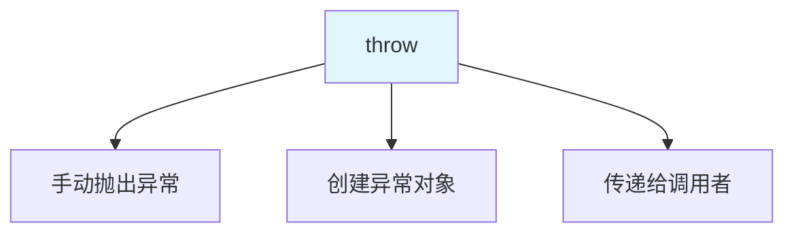
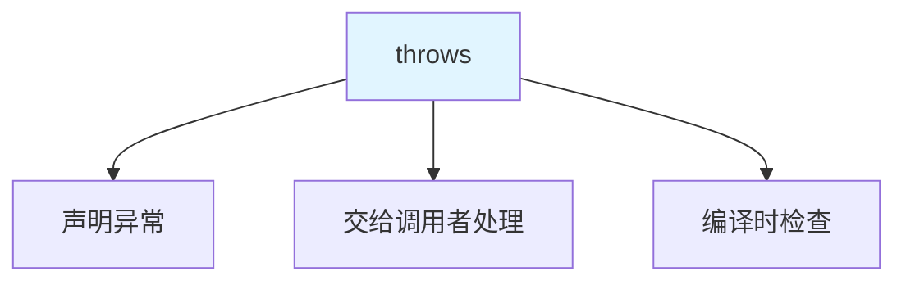
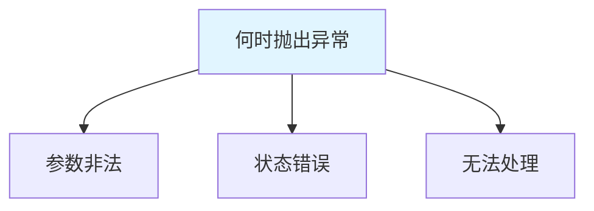

# 抛出异常

抛出异常是指在**方法中创建并抛出异常对象**，交由调用者处理。

## throw 关键字

### throw 的作用



**throw 的语法**：

```java
throw new 异常类名("异常信息");
```

### throw 使用示例

```java
public class ThrowDemo {
    public static void main(String[] args) {
        int age = -10;
        
        if (age < 0) {
            throw new IllegalArgumentException("年龄不能为负数");
        }
    }
}
```

**throw vs throws**：

| 关键字 | 作用 | 位置 | 例子 |
|--------|------|------|------|
| **throw** | 手动抛出异常对象 | 方法体中 | `throw new Exception();` |
| **throws** | 声明方法可能抛出异常 | 方法声明上 | `void method() throws Exception` |

## throws 关键字

### throws 的作用



**throws 的语法**：

```java
修饰符 返回值类型 方法名(参数) throws 异常类名1, 异常类名2 {
    // 方法体
}
```

### throws 使用示例

```java
import java.io.IOException;

public class ThrowsDemo {
    public static void main(String[] args) {
        try {
            method1();
        } catch (IOException e) {
            e.printStackTrace();
        }
    }
    
    // 声明抛出受检异常
    public static void method1() throws IOException {
        throw new IOException("IO 异常");
    }
    
    // 声明抛出多个异常
    public static void method2() throws IOException, ClassNotFoundException {
        // ...
    }
    
    // 声明抛出异常及其子类
    public static void method3() throws Exception {
        // ...
    }
}
```

## 两个关键字的使用场景

### throw 的使用场景

```java
public class ThrowScenario {
    // 1. 参数校验
    public void setAge(int age) {
        if (age < 0 || age > 150) {
            throw new IllegalArgumentException("年龄不合法：" + age);
        }
        this.age = age;
    }
    
    // 2. 状态检查
    public void process() {
        if (!initialized) {
            throw new IllegalStateException("对象未初始化");
        }
        // 处理逻辑
    }
    
    // 3. 空指针保护
    public String getName(String str) {
        if (str == null) {
            throw new NullPointerException("字符串不能为 null");
        }
        return str;
    }
}
```

### throws 的使用场景

```java
public class ThrowsScenario {
    // 1. 受检异常：必须声明
    public void readFile(String path) throws IOException {
        // 文件读取可能抛出 IOException
    }
    
    // 2. 多个异常：用逗号分隔
    public void process() throws IOException, SQLException {
        // 可能抛出多种异常
    }
    
    // 3. 异常链：保留原始异常
    public void handle() throws IOException {
        try {
            // ...
        } catch (IOException e) {
            throw new IOException("处理失败", e);  // 异常链
        }
    }
}
```

## 异常抛出的最佳实践

### 何时抛出异常



**抛出异常的原则**：

1. **参数非法**：`IllegalArgumentException`
2. **状态错误**：`IllegalStateException`
3. **空指针**：`NullPointerException`
4. **索引越界**：`IndexOutOfBoundsException`
5. **无法处理**：向上抛出

### 示例

```java
public class BestPractice {
    // ✅ 好的做法
    public void method1(String str) {
        if (str == null) {
            throw new IllegalArgumentException("参数不能为 null");
        }
        // 处理逻辑
    }
    
    // ❌ 不好的做法
    public void method2(String str) {
        // 不做任何检查，直接使用
        // str.length();  // 可能抛出 NullPointerException
    }
}
```

## 小结

::: tip 核心要点

1. **throw**：手动抛出异常对象，在方法体中使用
2. **throws**：声明方法可能抛出的异常，在方法声明上使用
3. **throw vs throws**：throw 创建并抛出，throws 声明并传递
4. **使用场景**：参数校验用 throw，受检异常用 throws
5. **最佳实践**：早抛出、晚捕获、提供有意义的信息

:::

::: info 下一步
- [自定义异常](/java/base/05-exception/custom-exception.md) - 学习自定义异常
:::
