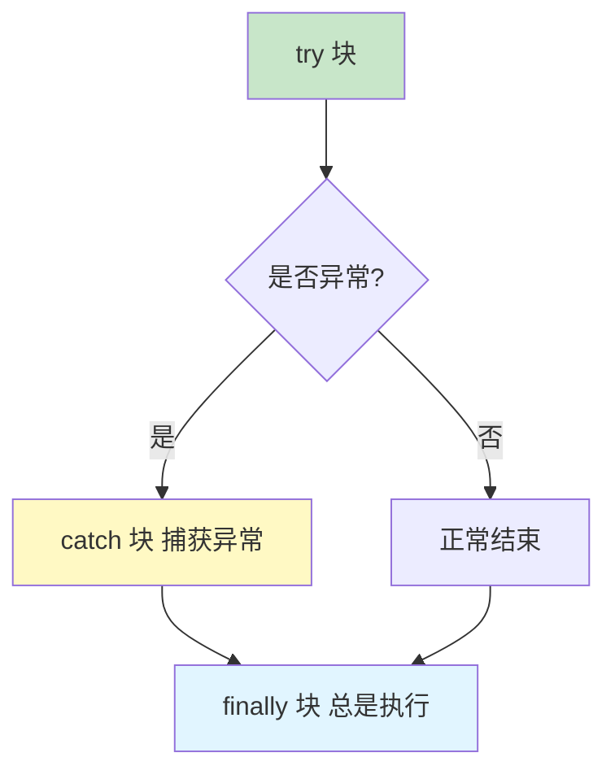
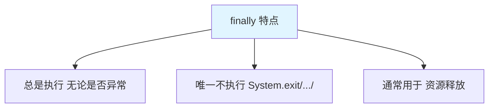
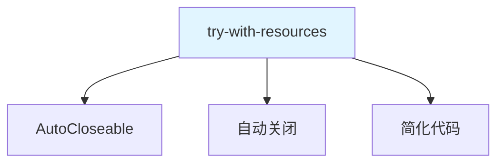
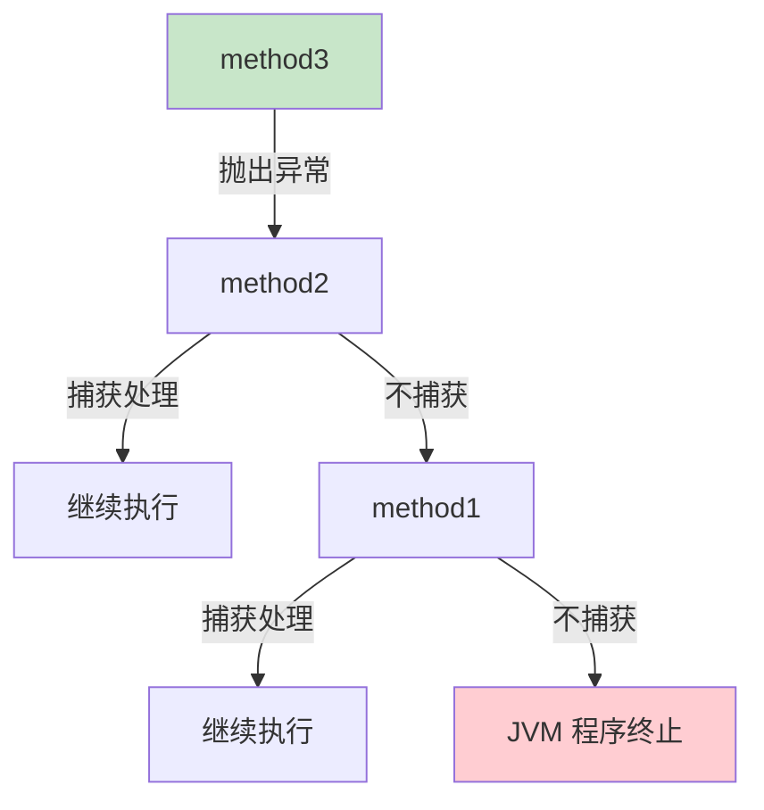

# try-catch-finally

try-catch-finally 是 Java 的**异常捕获与处理机制**。

## try-catch 语法

### 基本语法



```java
try {
    // 可能出现异常的代码
} catch (异常类型 变量名) {
    // 异常处理代码
} finally {
    // 无论是否异常都会执行的代码
}
```

### 基本使用

```java
public class TryCatchBasic {
    public static void main(String[] args) {
        try {
            int[] arr = new int[5];
            System.out.println(arr[10]);  // ArrayIndexOutOfBoundsException
        } catch (ArrayIndexOutOfBoundsException e) {
            System.out.println("捕获到数组越界异常");
            System.out.println("异常信息：" + e.getMessage());
        } finally {
            System.out.println("finally 块总是执行");
        }
    }
}
```

## try-catch 的使用

### 单个 catch

```java
public class SingleCatch {
    public static void main(String[] args) {
        try {
            int result = 10 / 0;  // ArithmeticException
        } catch (ArithmeticException e) {
            System.out.println("算术异常：" + e.getMessage());
        }
    }
}
```

### 多个 catch

```java
public class MultipleCatch {
    public static void main(String[] args) {
        try {
            String str = null;
            System.out.println(str.length());  // NullPointerException
        } catch (NullPointerException e) {
            System.out.println("空指针异常");
        } catch (ArrayIndexOutOfBoundsException e) {
            System.out.println("数组越界异常");
        } catch (Exception e) {  // 父类异常放最后
            System.out.println("其他异常");
        }
    }
}
```

**多 catch 注意事项**：

1. **先子后父**：子类异常在前，父类异常在后
2. **精确匹配**：优先捕获具体的异常类型
3. **不可达代码**：前面的 catch 捕获了后面无法执行

::: warning 错误示例

```java
try {
    // ...
} catch (Exception e) {  // 父类异常在前
    // ...
} catch (NullPointerException e) {  // ❌ 编译错误：不可达代码
    // ...
}
```

:::

### JDK 7 多 catch

```java
public class MultiCatch {
    public static void main(String[] args) {
        try {
            // 可能抛出多种异常
        } catch (NullPointerException | ArrayIndexOutOfBoundsException e) {
            System.out.println("捕获到异常：" + e.getClass().getSimpleName());
        }
    }
}
```

## finally 块

### finally 的特点



**finally 的执行时机**：

1. **try 正常执行完**：finally 执行
2. **catch 捕获异常**：finally 执行
3. **catch 未捕获异常**：finally 执行，然后异常向上抛出
4. **finally 中有 return**：finally 的 return 覆盖 try/catch 的 return

### finally 示例

```java
public class FinallyDemo {
    public static void main(String[] args) {
        System.out.println(test1());  // 30
        System.out.println(test2());  // 30
        System.out.println(test3());  // finally
    }
    
    // 1. try 正常执行
    public static int test1() {
        try {
            return 10;
        } finally {
            return 20;  // 覆盖 try 的 return
        }
        // 结果：20
    }
    
    // 2. catch 捕获异常
    public static int test2() {
        try {
            return 10;
        } catch (Exception e) {
            return 20;
        } finally {
            return 30;  // 覆盖 try/catch 的 return
        }
    }
    
    // 3. finally 中抛出异常
    public static String test3() {
        try {
            return "try";
        } finally {
            throw new RuntimeException("finally");
        }
    }
}
```

::: warning finally 与 return

```java
// finally 中的 return 会覆盖 try/catch 中的 return
public static int method() {
    try {
        return 1;
    } catch (Exception e) {
        return 2;
    } finally {
        return 3;  // 最终返回 3
    }
}
```

:::

### finally 的应用场景

```java
import java.io.FileInputStream;
import java.io.IOException;

public class FinallyUsage {
    public static void main(String[] args) {
        FileInputStream fis = null;
        try {
            fis = new FileInputStream("test.txt");
            // 读取文件
        } catch (IOException e) {
            e.printStackTrace();
        } finally {
            // 无论如何都要关闭资源
            if (fis != null) {
                try {
                    fis.close();
                } catch (IOException e) {
                    e.printStackTrace();
                }
            }
        }
    }
}
```

## try-with-resources（JDK 7）

### 自动资源管理



**语法格式**：

```java
try (资源声明) {
    // 使用资源
} catch (异常类型 变量名) {
    // 异常处理
}
// 资源自动关闭
```

### try-with-resources 示例

```java
import java.io.FileInputStream;
import java.io.IOException;

public class TryWithResources {
    public static void main(String[] args) {
        // JDK 7：单个资源
        try (FileInputStream fis = new FileInputStream("test.txt")) {
            // 读取文件
        } catch (IOException e) {
            e.printStackTrace();
        }
        // fis 自动关闭
        
        // JDK 9：多个资源（简化写法）
        FileInputStream fis1 = new FileInputStream("test1.txt");
        FileInputStream fis2 = new FileInputStream("test2.txt");
        
        try (fis1; fis2) {  // 分号分隔
            // 读取文件
        } catch (IOException e) {
            e.printStackTrace();
        }
        // fis1 和 fis2 自动关闭
    }
}
```

::: tip 实现 AutoCloseable

```java
class MyResource implements AutoCloseable {
    @Override
    public void close() throws Exception {
        System.out.println("资源已关闭");
    }
    
    public void doSomething() {
        System.out.println("使用资源");
    }
}

public class CustomResource {
    public static void main(String[] args) {
        try (MyResource resource = new MyResource()) {
            resource.doSomething();
        } catch (Exception e) {
            e.printStackTrace();
        }
        // 输出：
        // 使用资源
        // 资源已关闭
    }
}
```

:::

## 异常的传播

### 异常向上传播



```java
public class ExceptionPropagation {
    public static void main(String[] args) {
        try {
            method1();
        } catch (Exception e) {
            System.out.println("main 捕获到异常");
            e.printStackTrace();
        }
    }
    
    public static void method1() throws Exception {
        method2();  // 不捕获，向上抛出
    }
    
    public static void method2() throws Exception {
        method3();  // 不捕获，向上抛出
    }
    
    public static void method3() throws Exception {
        throw new Exception("method3 发生异常");
    }
}
```

## 实战案例

### 文件读取

```java
import java.io.BufferedReader;
import java.io.FileReader;
import java.io.IOException;

public class FileReadDemo {
    public static void main(String[] args) {
        // 传统方式
        BufferedReader reader = null;
        try {
            reader = new BufferedReader(new FileReader("test.txt"));
            String line;
            while ((line = reader.readLine()) != null) {
                System.out.println(line);
            }
        } catch (IOException e) {
            System.out.println("文件读取失败：" + e.getMessage());
        } finally {
            if (reader != null) {
                try {
                    reader.close();
                } catch (IOException e) {
                    e.printStackTrace();
                }
            }
        }
        
        // try-with-resources（推荐）
        try (BufferedReader br = new BufferedReader(new FileReader("test.txt"))) {
            String line;
            while ((line = br.readLine()) != null) {
                System.out.println(line);
            }
        } catch (IOException e) {
            System.out.println("文件读取失败：" + e.getMessage());
        }
    }
}
```

## 小结

::: tip 核心要点

1. **try-catch**：捕获和处理异常
2. **多重 catch**：捕获多种异常，先子后父
3. **finally**：总是执行，用于资源释放
4. **try-with-resources**：自动关闭资源（JDK 7+）
5. **异常传播**：异常向上传播，直到被捕获或程序终止

:::

::: info 下一步
- [抛出异常](/java/base/05-exception/throw-throws.md) - 学习抛出异常
- [自定义异常](/java/base/05-exception/custom-exception.md) - 学习自定义异常
:::
