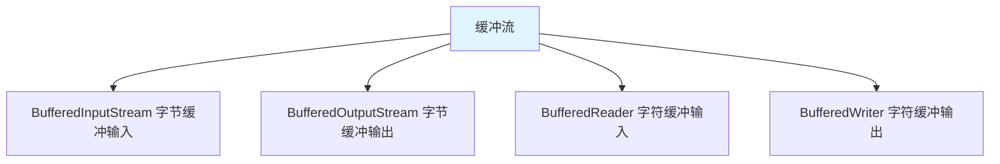

# 缓冲流

缓冲流是**带有缓冲区**的 IO 流，通过**减少实际的 IO 操作次数**提高性能。

## 缓冲流概述

### 缓冲流体系



**缓冲流的特点**：

1. **内部缓冲区**：默认 8KB 缓冲区
2. **减少 IO 次数**：批量读写，提高性能
3. **包装流**：包装基本流，提供缓冲功能

## BufferedReader

### 读取文本

```java
import java.io.BufferedReader;
import java.io.FileReader;
import java.io.IOException;

public class BufferedReaderDemo {
    public static void main(String[] args) {
        try (BufferedReader br = new BufferedReader(new FileReader("test.txt"))) {
            // 1. readLine()：读取一行
            String line;
            while ((line = br.readLine()) != null) {
                System.out.println(line);
            }
        } catch (IOException e) {
            e.printStackTrace();
        }
    }
}
```

### readLine() 方法

```java
import java.io.BufferedReader;
import java.io.FileReader;
import java.io.IOException;

public class ReadLineDemo {
    public static void main(String[] args) {
        try (BufferedReader br = new BufferedReader(new FileReader("test.txt"))) {
            String line;
            int lineNumber = 1;
            while ((line = br.readLine()) != null) {
                System.out.println(lineNumber + ": " + line);
                lineNumber++;
            }
        } catch (IOException e) {
            e.printStackTrace();
        }
    }
}
```

## BufferedWriter

### 写入文本

```java
import java.io.BufferedWriter;
import java.io.FileWriter;
import java.io.IOException;

public class BufferedWriterDemo {
    public static void main(String[] args) {
        try (BufferedWriter bw = new BufferedWriter(new FileWriter("output.txt"))) {
            // 1. write()：写入内容
            bw.write("Hello");
            bw.write(" ");
            bw.write("World");
            
            // 2. newLine()：写入换行符
            bw.newLine();
            bw.write("Java");
            
            // 3. flush()：刷新缓冲区
            bw.flush();
        } catch (IOException e) {
            e.printStackTrace();
        }
    }
}
```

## 字节缓冲流

### BufferedInputStream

```java
import java.io.BufferedInputStream;
import java.io.FileInputStream;
import java.io.IOException;

public class BufferedInputStreamDemo {
    public static void main(String[] args) {
        try (BufferedInputStream bis = new BufferedInputStream(new FileInputStream("input.txt"))) {
            byte[] buffer = new byte[1024];
            int len;
            while ((len = bis.read(buffer)) != -1) {
                System.out.println(new String(buffer, 0, len));
            }
        } catch (IOException e) {
            e.printStackTrace();
        }
    }
}
```

### BufferedOutputStream

```java
import java.io.BufferedOutputStream;
import java.io.FileOutputStream;
import java.io.IOException;

public class BufferedOutputStreamDemo {
    public static void main(String[] args) {
        try (BufferedOutputStream bos = new BufferedOutputStream(new FileOutputStream("output.txt"))) {
            byte[] bytes = "Hello World".getBytes();
            bos.write(bytes);
        } catch (IOException e) {
            e.printStackTrace();
        }
    }
}
```

## 性能对比

### 缓冲流 vs 基本流

```java
import java.io.*;

public class PerformanceCompare {
    public static void main(String[] args) {
        // 基本流复制
        long start1 = System.currentTimeMillis();
        copyWithBasicStream("input.txt", "output1.txt");
        long end1 = System.currentTimeMillis();
        System.out.println("基本流耗时：" + (end1 - start1) + "ms");
        
        // 缓冲流复制
        long start2 = System.currentTimeMillis();
        copyWithBufferedStream("input.txt", "output2.txt");
        long end2 = System.currentTimeMillis();
        System.out.println("缓冲流耗时：" + (end2 - start2) + "ms");
    }
    
    // 基本流复制
    public static void copyWithBasicStream(String src, String dest) {
        try (FileInputStream fis = new FileInputStream(src);
             FileOutputStream fos = new FileOutputStream(dest)) {
            int b;
            while ((b = fis.read()) != -1) {
                fos.write(b);
            }
        } catch (IOException e) {
            e.printStackTrace();
        }
    }
    
    // 缓冲流复制
    public static void copyWithBufferedStream(String src, String dest) {
        try (BufferedInputStream bis = new BufferedInputStream(new FileInputStream(src));
             BufferedOutputStream bos = new BufferedOutputStream(new FileOutputStream(dest))) {
            int b;
            while ((b = bis.read()) != -1) {
                bos.write(b);
            }
        } catch (IOException e) {
            e.printStackTrace();
        }
    }
}
```

## 小结

::: tip 核心要点

1. **缓冲流**：带缓冲区的 IO 流，提高性能
2. **BufferedReader**：字符缓冲输入，readLine() 读取一行
3. **BufferedWriter**：字符缓冲输出，newLine() 写入换行
4. **字节缓冲流**：BufferedInputStream、BufferedOutputStream
5. **性能提升**：减少实际 IO 次数，提高效率

:::

::: info 下一步
- [对象流](/java/base/06-io/object-stream.md) - 学习对象流
:::
