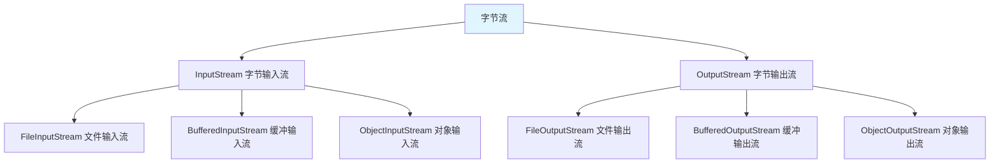

# 字节流

字节流是**以字节为单位**进行读写的 IO 流，用于处理二进制数据。

## 字节流概述

### 字节流体系



**字节流的特点**：

1. **以字节为单位**：每次读写一个字节
2. **处理二进制数据**：图片、音频、视频等
3. **通用性强**：可以处理任何类型的文件

## FileInputStream

### 读取文件

```java
import java.io.FileInputStream;
import java.io.IOException;

public class FileInputStreamDemo {
    public static void main(String[] args) {
        try (FileInputStream fis = new FileInputStream("test.txt")) {
            // 1. 读取单个字节
            int data = fis.read();
            System.out.println((char) data);
            
            // 2. 读取所有字节
            int b;
            while ((b = fis.read()) != -1) {
                System.out.print((char) b);
            }
        } catch (IOException e) {
            e.printStackTrace();
        }
    }
}
```

### 读取到字节数组

```java
import java.io.FileInputStream;
import java.io.IOException;

public class FileInputStreamArray {
    public static void main(String[] args) {
        try (FileInputStream fis = new FileInputStream("test.txt")) {
            // 1. 读取到字节数组
            byte[] buffer = new byte[1024];
            int len;
            while ((len = fis.read(buffer)) != -1) {
                System.out.println(new String(buffer, 0, len));
            }
            
            // 2. 读取全部字节
            // byte[] allBytes = fis.readAllBytes();  // JDK 9+
            // System.out.println(new String(allBytes));
        } catch (IOException e) {
            e.printStackTrace();
        }
    }
}
```

## FileOutputStream

### 写入文件

```java
import java.io.FileOutputStream;
import java.io.IOException;

public class FileOutputStreamDemo {
    public static void main(String[] args) {
        try (FileOutputStream fos = new FileOutputStream("output.txt")) {
            // 1. 写入单个字节
            fos.write(65);  // 'A'
            fos.write(66);  // 'B'
            
            // 2. 写入字节数组
            byte[] bytes = "Hello World".getBytes();
            fos.write(bytes);
            
            // 3. 写入字节数组的一部分
            fos.write(bytes, 0, 5);  // "Hello"
        } catch (IOException e) {
            e.printStackTrace();
        }
    }
}
```

### 追加写入

```java
import java.io.FileOutputStream;
import java.io.IOException;

public class FileOutputStreamAppend {
    public static void main(String[] args) {
        // 创建 FileOutputStream，追加模式
        try (FileOutputStream fos = new FileOutputStream("output.txt", true)) {
            String content = "\n追加内容";
            fos.write(content.getBytes());
        } catch (IOException e) {
            e.printStackTrace();
        }
    }
}
```

## 字节流复制文件

### 基本复制

```java
import java.io.FileInputStream;
import java.io.FileOutputStream;
import java.io.IOException;

public class FileCopy {
    public static void main(String[] args) {
        try (FileInputStream fis = new FileInputStream("input.txt");
             FileOutputStream fos = new FileOutputStream("output.txt")) {
            
            int b;
            while ((b = fis.read()) != -1) {
                fos.write(b);
            }
            
            System.out.println("文件复制成功");
        } catch (IOException e) {
            e.printStackTrace();
        }
    }
}
```

### 缓冲复制

```java
import java.io.FileInputStream;
import java.io.FileOutputStream;
import java.io.IOException;

public class BufferedFileCopy {
    public static void main(String[] args) {
        try (FileInputStream fis = new FileInputStream("input.txt");
             FileOutputStream fos = new FileOutputStream("output.txt")) {
            
            byte[] buffer = new byte[1024];
            int len;
            while ((len = fis.read(buffer)) != -1) {
                fos.write(buffer, 0, len);
            }
            
            System.out.println("文件复制成功（缓冲）");
        } catch (IOException e) {
            e.printStackTrace();
        }
    }
}
```

## 图片复制

```java
import java.io.FileInputStream;
import java.io.FileOutputStream;
import java.io.IOException;

public class ImageCopy {
    public static void main(String[] args) {
        try (FileInputStream fis = new FileInputStream("input.jpg");
             FileOutputStream fos = new FileOutputStream("output.jpg")) {
            
            byte[] buffer = new byte[1024];
            int len;
            while ((len = fis.read(buffer)) != -1) {
                fos.write(buffer, 0, len);
            }
            
            System.out.println("图片复制成功");
        } catch (IOException e) {
            e.printStackTrace();
        }
    }
}
```

## 小结

::: tip 核心要点

1. **字节流**：以字节为单位读写，处理二进制数据
2. **FileInputStream**：文件输入流，read()、read(byte[])
3. **FileOutputStream**：文件输出流，write(int)、write(byte[])
4. **文件复制**：使用缓冲数组提高效率
5. **try-with-resources**：自动关闭流

:::

::: info 下一步
- [字符流](/java/base/06-io/char-stream.md) - 学习字符流
:::
