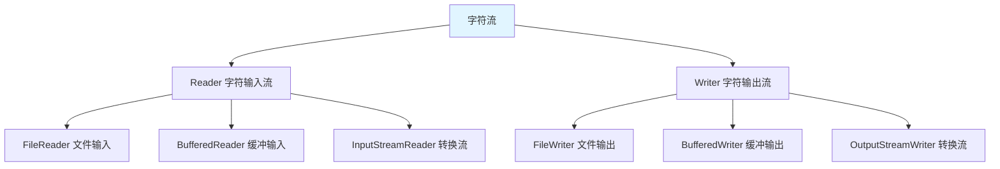

# 字符流

字符流是**以字符为单位**进行读写的 IO 流，专门用于处理文本数据。

## 字符流概述

### 字符流体系



**字符流的特点**：

1. **以字符为单位**：每次读写一个字符
2. **处理文本**：专门用于文本文件
3. **编码支持**：自动处理字符编码

## FileReader

### 读取文本文件

```java
import java.io.FileReader;
import java.io.IOException;

public class FileReaderDemo {
    public static void main(String[] args) {
        try (FileReader fr = new FileReader("test.txt")) {
            // 1. 读取单个字符
            int ch;
            while ((ch = fr.read()) != -1) {
                System.out.print((char) ch);
            }
        } catch (IOException e) {
            e.printStackTrace();
        }
    }
}
```

### 读取到字符数组

```java
import java.io.FileReader;
import java.io.IOException;

public class FileReaderArray {
    public static void main(String[] args) {
        try (FileReader fr = new FileReader("test.txt")) {
            // 读取到字符数组
            char[] buffer = new char[1024];
            int len;
            while ((len = fr.read(buffer)) != -1) {
                System.out.println(new String(buffer, 0, len));
            }
        } catch (IOException e) {
            e.printStackTrace();
        }
    }
}
```

## FileWriter

### 写入文本文件

```java
import java.io.FileWriter;
import java.io.IOException;

public class FileWriterDemo {
    public static void main(String[] args) {
        try (FileWriter fw = new FileWriter("output.txt")) {
            // 1. 写入单个字符
            fw.write('A');
            fw.write('B');
            
            // 2. 写入字符数组
            char[] chars = {'H', 'e', 'l', 'l', 'o'};
            fw.write(chars);
            
            // 3. 写入字符串
            fw.write("World");
            
            // 4. 写入字符串的一部分
            fw.write("Java", 0, 2);  // "Ja"
        } catch (IOException e) {
            e.printStackTrace();
        }
    }
}
```

### 追加写入

```java
import java.io.FileWriter;
import java.io.IOException;

public class FileWriterAppend {
    public static void main(String[] args) {
        // 追加模式
        try (FileWriter fw = new FileWriter("output.txt", true)) {
            fw.write("\n追加内容");
        } catch (IOException e) {
            e.printStackTrace();
        }
    }
}
```

## 文本文件复制

### 基本复制

```java
import java.io.FileReader;
import java.io.FileWriter;
import java.io.IOException;

public class TextFileCopy {
    public static void main(String[] args) {
        try (FileReader fr = new FileReader("input.txt");
             FileWriter fw = new FileWriter("output.txt")) {
            
            int ch;
            while ((ch = fr.read()) != -1) {
                fw.write(ch);
            }
            
            System.out.println("文本文件复制成功");
        } catch (IOException e) {
            e.printStackTrace();
        }
    }
}
```

### 缓冲复制

```java
import java.io.FileReader;
import java.io.FileWriter;
import java.io.IOException;

public class BufferedTextCopy {
    public static void main(String[] args) {
        try (FileReader fr = new FileReader("input.txt");
             FileWriter fw = new FileWriter("output.txt")) {
            
            char[] buffer = new char[1024];
            int len;
            while ((len = fr.read(buffer)) != -1) {
                fw.write(buffer, 0, len);
            }
            
            System.out.println("文本文件复制成功（缓冲）");
        } catch (IOException e) {
            e.printStackTrace();
        }
    }
}
```

## 字符流与字节流的区别

| 特性 | 字节流 | 字符流 |
|------|--------|--------|
| **读写单位** | 字节 | 字符 |
| **处理数据** | 二进制数据（图片、音频等） | 文本数据 |
| **效率** | 高 | 稍低 |
| **类名** | InputStream/OutputStream | Reader/Writer |
| **使用场景** | 复制文件、二进制数据 | 读取文本、处理文本 |

## 小结

::: tip 核心要点

1. **字符流**：以字符为单位读写，处理文本数据
2. **FileReader**：文件字符输入流
3. **FileWriter**：文件字符输出流
4. **文本复制**：使用字符数组缓冲
5. **选择原则**：文本用字符流，二进制用字节流

:::

::: info 下一步
- [缓冲流](/java/base/06-io/buffered-stream.md) - 学习缓冲流
:::
