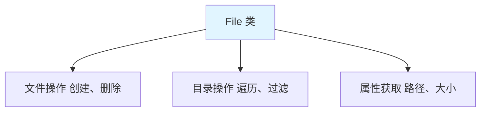

# File 类

File 类是 Java 中**文件和目录路径名的抽象表示**，用于文件和目录的操作。

## File 概述

### File 的作用



**File 的特点**：

1. **路径抽象**：表示文件和目录的路径
2. **平台无关**：跨平台的路径表示
3. **不涉及内容**：只操作文件本身，不涉及文件内容

## File 的构造方法

```java
import java.io.File;

public class FileConstructor {
    public static void main(String[] args) {
        // 1. File(String pathname)：路径字符串
        File file1 = new File("/Users/lytton/test.txt");
        
        // 2. File(String parent, String child)：父路径 + 子路径
        File file2 = new File("/Users/lytton", "test.txt");
        
        // 3. File(File parent, String child)：父 File 对象 + 子路径
        File parent = new File("/Users/lytton");
        File file3 = new File(parent, "test.txt");
        
        // 4. 路径分隔符
        File file4 = new File("/Users" + File.separator + "lytton" + File.separator + "test.txt");
        
        System.out.println(file1);
        System.out.println(file2);
        System.out.println(file3);
        System.out.println(file4);
    }
}
```

## File 的常用方法

### 判断功能

```java
public class FileJudge {
    public static void main(String[] args) {
        File file = new File("/Users/lytton/test.txt");
        
        // 1. exists()：是否存在
        System.out.println("是否存在：" + file.exists());  // true/false
        
        // 2. isFile()：是否是文件
        System.out.println("是否是文件：" + file.isFile());  // true/false
        
        // 3. isDirectory()：是否是目录
        System.out.println("是否是目录：" + file.isDirectory());  // true/false
        
        // 4. isAbsolute()：是否是绝对路径
        System.out.println("是否是绝对路径：" + file.isAbsolute());  // true/false
        
        // 5. canRead()：是否可读
        System.out.println("是否可读：" + file.canRead());  // true/false
        
        // 6. canWrite()：是否可写
        System.out.println("是否可写：" + file.canWrite());  // true/false
        
        // 7. isHidden()：是否是隐藏文件
        System.out.println("是否隐藏：" + file.isHidden());  // true/false
    }
}
```

### 创建与删除功能

```java
public class FileCreateDelete {
    public static void main(String[] args) {
        // 1. createNewFile()：创建新文件
        File file = new File("/Users/lytton/new.txt");
        try {
            boolean created = file.createNewFile();
            System.out.println("文件是否创建成功：" + created);
        } catch (IOException e) {
            e.printStackTrace();
        }
        
        // 2. mkdir()：创建单级目录
        File dir1 = new File("/Users/lytton/newdir");
        boolean dirCreated = dir1.mkdir();
        System.out.println("目录是否创建成功：" + dirCreated);
        
        // 3. mkdirs()：创建多级目录
        File dir2 = new File("/Users/lytton/dir1/dir2/dir3");
        boolean dirsCreated = dir2.mkdirs();
        System.out.println("多级目录是否创建成功：" + dirsCreated);
        
        // 4. delete()：删除文件或目录
        boolean deleted = file.delete();
        System.out.println("文件是否删除成功：" + deleted);
    }
}
```

### 获取功能

```java
public class FileGet {
    public static void main(String[] args) {
        File file = new File("/Users/lytton/test.txt");
        
        // 1. getAbsolutePath()：获取绝对路径
        System.out.println("绝对路径：" + file.getAbsolutePath());
        
        // 2. getPath()：获取路径
        System.out.println("路径：" + file.getPath());
        
        // 3. getName()：获取文件名
        System.out.println("文件名：" + file.getName());  // test.txt
        
        // 4. getParent()：获取父路径
        System.out.println("父路径：" + file.getParent());  // /Users/lytton
        
        // 5. length()：获取文件大小（字节）
        System.out.println("文件大小：" + file.length() + " 字节");
        
        // 6. lastModified()：获取最后修改时间
        long time = file.lastModified();
        Date date = new Date(time);
        System.out.println("最后修改时间：" + date);
    }
}
```

### 目录遍历功能

```java
import java.io.File;

public class FileList {
    public static void main(String[] args) {
        File dir = new File("/Users/lytton/code");
        
        // 1. list()：获取目录下的文件和目录名称
        String[] names = dir.list();
        if (names != null) {
            for (String name : names) {
                System.out.println(name);
            }
        }
        
        // 2. listFiles()：获取目录下的 File 对象
        File[] files = dir.listFiles();
        if (files != null) {
            for (File file : files) {
                System.out.println(file.getName() + " : " + (file.isDirectory() ? "目录" : "文件"));
            }
        }
        
        // 3. listFiles(FilenameFilter)：过滤文件
        File[] txtFiles = dir.listFiles((dir, name) -> name.endsWith(".java"));
        if (txtFiles != null) {
            for (File file : txtFiles) {
                System.out.println(file.getName());
            }
        }
        
        // 4. listFiles(FileFilter)：过滤 File 对象
        File[] dirs = dir.listFiles(File::isDirectory);
        if (dirs != null) {
            for (File dir2 : dirs) {
                System.out.println(dir2.getName());
            }
        }
    }
}
```

## 路径分隔符

### 路径分隔符

```java
public class PathSeparator {
    public static void main(String[] args) {
        // 1. File.separator：路径分隔符
        // Windows: \  Unix/Mac: /
        String path1 = "Users" + File.separator + "lytton" + File.separator + "test.txt";
        System.out.println(path1);
        
        // 2. File.pathSeparator：路径列表分隔符
        // Windows: ;  Unix/Mac: :
        String paths = "/Users/lytton" + File.pathSeparator + "/Users/admin";
        System.out.println(paths);
    }
}
```

## 实战案例

### 递归遍历目录

```java
import java.io.File;

public class RecursiveDirectory {
    public static void main(String[] args) {
        File dir = new File("/Users/lytton/code");
        listAllFiles(dir);
    }
    
    // 递归遍历目录
    public static void listAllFiles(File dir) {
        // 获取目录下的所有文件和子目录
        File[] files = dir.listFiles();
        if (files != null) {
            for (File file : files) {
                if (file.isFile()) {
                    // 文件：直接输出
                    System.out.println("文件：" + file.getAbsolutePath());
                } else if (file.isDirectory()) {
                    // 目录：递归遍历
                    System.out.println("目录：" + file.getAbsolutePath());
                    listAllFiles(file);
                }
            }
        }
    }
}
```

### 递归删除目录

```java
import java.io.File;

public class RecursiveDelete {
    public static void main(String[] args) {
        File dir = new File("/Users/lytton/testdir");
        deleteDirectory(dir);
    }
    
    // 递归删除目录
    public static void deleteDirectory(File dir) {
        if (dir.exists()) {
            File[] files = dir.listFiles();
            if (files != null) {
                for (File file : files) {
                    if (file.isDirectory()) {
                        deleteDirectory(file);  // 递归删除子目录
                    } else {
                        file.delete();  // 删除文件
                    }
                }
            }
            dir.delete();  // 删除目录本身
            System.out.println("目录删除成功：" + dir.getAbsolutePath());
        }
    }
}
```

## 小结

::: tip 核心要点

1. **File 类**：文件和目录的抽象表示
2. **构造方法**：路径字符串、父路径+子路径
3. **判断方法**：exists、isFile、isDirectory、canRead、canWrite
4. **创建删除**：createNewFile、mkdir、mkdirs、delete
5. **获取方法**：getAbsolutePath、getName、length、lastModified
6. **遍历方法**：list、listFiles、递归遍历

:::

::: info 下一步
- [字节流](/java/base/06-io/byte-stream.md) - 学习字节流
:::
