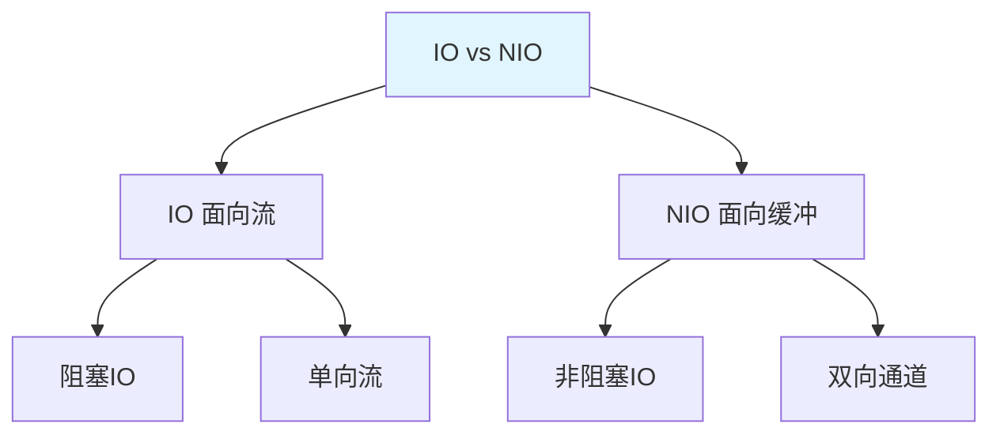

# NIO 入门

NIO（New IO）是 JDK 4 引入的**新 IO API**，提供了**非阻塞 IO**操作。

## NIO 概述

### NIO 与 IO 的区别



| 特性 | IO | NIO |
|------|-----|-----|
| **IO 模型** | 面向流 | 面向缓冲 |
| **阻塞** | 阻塞 | 非阻塞 |
| **方向** | 单向 | 双向 |
| **性能** | 一般 | 高 |

## NIO 核心组件

### Buffer（缓冲区）

```java
import java.nio.ByteBuffer;

public class BufferDemo {
    public static void main(String[] args) {
        // 1. 创建缓冲区
        ByteBuffer buffer = ByteBuffer.allocate(1024);
        
        // 2. 存储数据
        String data = "Hello NIO";
        buffer.put(data.getBytes());
        
        // 3. 切换为读模式
        buffer.flip();
        
        // 4. 读取数据
        byte[] dst = new byte[buffer.limit()];
        buffer.get(dst);
        System.out.println(new String(dst));
        
        // 5. 清空缓冲区
        buffer.clear();
    }
}
```

**Buffer 的核心属性**：

- **capacity**：容量，固定不变
- **position**：位置，当前读写位置
- **limit**：限制，可读写范围
- **mark**：标记，记录位置

### Channel（通道）

```java
import java.io.FileInputStream;
import java.io.FileOutputStream;
import java.io.IOException;
import java.nio.ByteBuffer;
import java.nio.channels.FileChannel;

public class ChannelDemo {
    public static void main(String[] args) {
        try (FileInputStream fis = new FileInputStream("input.txt");
             FileOutputStream fos = new FileOutputStream("output.txt");
             FileChannel inChannel = fis.getChannel();
             FileChannel outChannel = fos.getChannel()) {
            
            // 1. 创建缓冲区
            ByteBuffer buffer = ByteBuffer.allocate(1024);
            
            // 2. 从通道读取到缓冲区
            while (inChannel.read(buffer) != -1) {
                // 切换为读模式
                buffer.flip();
                
                // 从缓冲区写入通道
                while (buffer.hasRemaining()) {
                    outChannel.write(buffer);
                }
                
                // 清空缓冲区
                buffer.clear();
            }
            
            System.out.println("文件复制成功");
        } catch (IOException e) {
            e.printStackTrace();
        }
    }
}
```

### Path 与 Files

#### Path 接口

```java
import java.nio.file.Path;
import java.nio.file.Paths;

public class PathDemo {
    public static void main(String[] args) {
        // 1. 创建 Path
        Path path = Paths.get("/Users/lytton/test.txt");
        
        // 2. 获取信息
        System.out.println("文件名：" + path.getFileName());
        System.out.println("父目录：" + path.getParent());
        System.out.println("根目录：" + path.getRoot());
        System.out.println("绝对路径：" + path.toAbsolutePath());
    }
}
```

#### Files 工具类

```java
import java.io.IOException;
import java.nio.file.Files;
import java.nio.file.Path;
import java.nio.file.Paths;
import java.util.List;

public class FilesDemo {
    public static void main(String[] args) throws IOException {
        Path path = Paths.get("test.txt");
        
        // 1. 判断是否存在
        System.out.println("是否存在：" + Files.exists(path));
        
        // 2. 创建文件
        if (!Files.exists(path)) {
            Files.createFile(path);
        }
        
        // 3. 写入文件
        List<String> lines = List.of("Hello", "World", "Java");
        Files.write(path, lines);
        
        // 4. 读取文件
        List<String> readLines = Files.readAllLines(path);
        System.out.println(readLines);
        
        // 5. 复制文件
        Path dest = Paths.get("test_copy.txt");
        Files.copy(path, dest);
        
        // 6. 删除文件
        Files.deleteIfExists(dest);
    }
}
```

## NIO 文件复制

### 使用 Channel 复制

```java
import java.io.FileInputStream;
import java.io.FileOutputStream;
import java.io.IOException;
import java.nio.channels.FileChannel;

public class NIOFileCopy {
    public static void main(String[] args) {
        try (FileInputStream fis = new FileInputStream("input.txt");
             FileOutputStream fos = new FileOutputStream("output.txt");
             FileChannel inChannel = fis.getChannel();
             FileChannel outChannel = fos.getChannel()) {
            
            // 直接使用 transferFrom
            outChannel.transferFrom(inChannel, 0, inChannel.size());
            
            System.out.println("文件复制成功");
        } catch (IOException e) {
            e.printStackTrace();
        }
    }
}
```

## 小结

::: tip 核心要点

1. **NIO**：新 IO API，面向缓冲、非阻塞
2. **Buffer**：缓冲区，capacity、position、limit
3. **Channel**：通道，双向数据传输
4. **Path**：路径接口，替代 File
5. **Files**：工具类，简化文件操作
6. **性能**：NIO 性能高于传统 IO

:::

::: info 下一步
- [线程概述](/java/base/07-thread/thread-overview.md) - 学习多线程基础
:::
