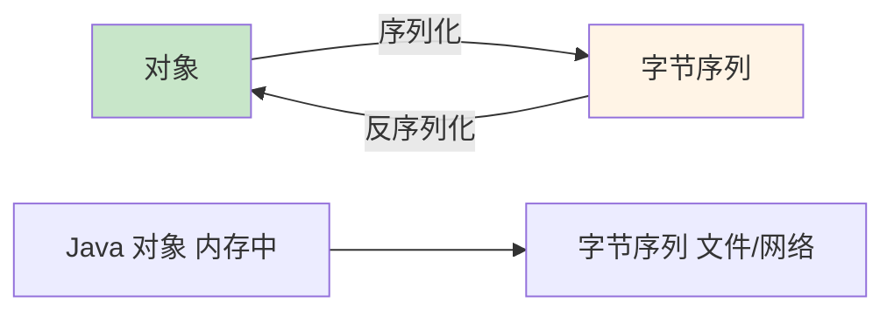

# 对象流

对象流是**用于读写对象**的 IO 流，实现对象的**序列化与反序列化**。

## 对象流概述

### 序列化概念



**序列化的作用**：

1. **持久化**：将对象保存到文件或数据库
2. **网络传输**：在网络中传输对象
3. **深拷贝**：通过序列化实现对象的深拷贝

## Serializable 接口

### 标记接口

```java
import java.io.Serializable;

// 实现 Serializable 接口
public class Student implements Serializable {
    private static final long serialVersionUID = 1L;
    
    private String name;
    private int age;
    
    public Student(String name, int age) {
        this.name = name;
        this.age = age;
    }
    
    @Override
    public String toString() {
        return "Student{name='" + name + "', age=" + age + "}";
    }
}
```

**serialVersionUID**：

- **版本号**：用于验证序列化版本的兼容性
- **建议**：显式声明 serialVersionUID
- **生成**：IDE 可自动生成

## ObjectOutputStream

### 序列化对象

```java
import java.io.*;

public class ObjectOutputStreamDemo {
    public static void main(String[] args) {
        Student stu = new Student("张三", 18);
        
        try (ObjectOutputStream oos = new ObjectOutputStream(new FileOutputStream("student.dat"))) {
            // 序列化对象
            oos.writeObject(stu);
            System.out.println("对象序列化成功");
        } catch (IOException e) {
            e.printStackTrace();
        }
    }
}
```

### 序列化多个对象

```java
import java.io.*;

public class MultiObjectSerialization {
    public static void main(String[] args) {
        Student stu1 = new Student("张三", 18);
        Student stu2 = new Student("李四", 20);
        Student stu3 = new Student("王五", 22);
        
        try (ObjectOutputStream oos = new ObjectOutputStream(new FileOutputStream("students.dat"))) {
            // 序列化多个对象
            oos.writeObject(stu1);
            oos.writeObject(stu2);
            oos.writeObject(stu3);
            
            // 或使用 List
            // List<Student> list = Arrays.asList(stu1, stu2, stu3);
            // oos.writeObject(list);
        } catch (IOException e) {
            e.printStackTrace();
        }
    }
}
```

## ObjectInputStream

### 反序列化对象

```java
import java.io.*;

public class ObjectInputStreamDemo {
    public static void main(String[] args) {
        try (ObjectInputStream ois = new ObjectInputStream(new FileInputStream("student.dat"))) {
            // 反序列化对象
            Student stu = (Student) ois.readObject();
            System.out.println("对象反序列化成功：" + stu);
        } catch (IOException | ClassNotFoundException e) {
            e.printStackTrace();
        }
    }
}
```

### 反序列化多个对象

```java
import java.io.*;

public class MultiObjectDeserialization {
    public static void main(String[] args) {
        try (ObjectInputStream ois = new ObjectInputStream(new FileInputStream("students.dat"))) {
            // 反序列化多个对象
            while (true) {
                try {
                    Student stu = (Student) ois.readObject();
                    System.out.println(stu);
                } catch (EOFException e) {
                    // 读取结束
                    break;
                }
            }
        } catch (IOException | ClassNotFoundException e) {
            e.printStackTrace();
        }
    }
}
```

## transient 关键字

### 忽略序列化

```java
import java.io.*;

public class TransientDemo implements Serializable {
    private static final long serialVersionUID = 1L;
    
    private String name;
    private transient String password;  // 不序列化
    private int age;
    
    public TransientDemo(String name, String password, int age) {
        this.name = name;
        this.password = password;
        this.age = age;
    }
    
    @Override
    public String toString() {
        return "User{name='" + name + "', password='" + password + "', age=" + age + "}";
    }
    
    public static void main(String[] args) {
        TransientDemo user = new TransientDemo("admin", "123456", 20);
        
        // 序列化
        try (ObjectOutputStream oos = new ObjectOutputStream(new FileOutputStream("user.dat"))) {
            oos.writeObject(user);
        } catch (IOException e) {
            e.printStackTrace();
        }
        
        // 反序列化
        try (ObjectInputStream ois = new ObjectInputStream(new FileInputStream("user.dat"))) {
            TransientDemo loadedUser = (TransientDemo) ois.readObject();
            System.out.println(loadedUser);
            // password 为 null，因为被 transient 修饰
        } catch (IOException | ClassNotFoundException e) {
            e.printStackTrace();
        }
    }
}
```

## 小结

::: tip 核心要点

1. **对象流**：读写对象的 IO 流
2. **序列化**：对象转为字节序列，ObjectOutputStream
3. **反序列化**：字节序列转为对象，ObjectInputStream
4. **Serializable**：标记接口，实现序列化
5. **serialVersionUID**：版本号，建议显式声明
6. **transient**：修饰不需要序列化的字段

:::

::: info 下一步
- [NIO 入门](/java/base/06-io/nio.md) - 学习 NIO
:::
