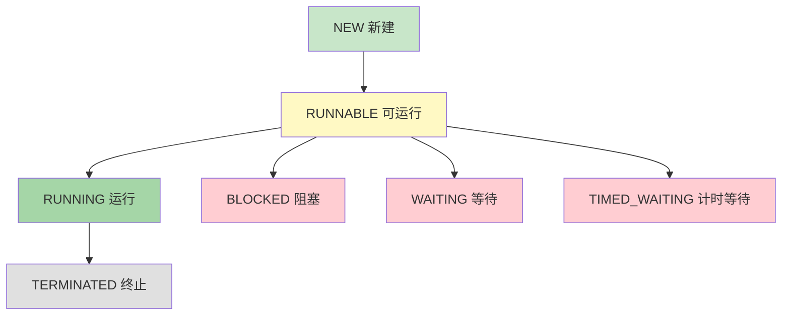

# 线程生命周期

线程有**不同的生命周期状态**，理解这些状态对于多线程编程很重要。

## 线程状态

### JDK 6 线程状态



**线程状态**：

1. **NEW**：新建，创建了线程对象但未启动
2. **RUNNABLE**：可运行，可能正在运行或等待 CPU
3. **RUNNING**：运行，正在 CPU 上执行
4. **BLOCKED**：阻塞，等待监视器锁
5. **WAITING**：等待，无限期等待其他线程唤醒
6. **TIMED_WAITING**：计时等待，有限期等待
7. **TERMINATED**：终止，线程执行完毕

### 线程状态转换

```java
public class ThreadStateDemo {
    public static void main(String[] args) {
        Thread t = new Thread(() -> {
            try {
                Thread.sleep(1000);  // TIMED_WAITING
            } catch (InterruptedException e) {
                e.printStackTrace();
            }
        });
        
        System.out.println("启动前：" + t.getState());  // NEW
        t.start();
        System.out.println("启动后：" + t.getState());  // RUNNABLE
    }
}
```

## 线程控制方法

### sleep()：睡眠

```java
public class SleepDemo {
    public static void main(String[] args) {
        Thread t = new Thread(() -> {
            for (int i = 0; i < 5; i++) {
                System.out.println("线程执行：" + i);
                try {
                    Thread.sleep(1000);  // 睡眠1秒
                } catch (InterruptedException e) {
                    e.printStackTrace();
                }
            }
        });
        
        t.start();
    }
}
```

### join()：等待线程结束

```java
public class JoinDemo {
    public static void main(String[] args) {
        Thread t = new Thread(() -> {
            for (int i = 0; i < 5; i++) {
                System.out.println("子线程：" + i);
            }
        });
        
        t.start();
        
        try {
            t.join();  // 等待 t 线程结束
        } catch (InterruptedException e) {
            e.printStackTrace();
        }
        
        System.out.println("主线程继续执行");
    }
}
```

### yield()：让出 CPU

```java
public class YieldDemo {
    public static void main(String[] args) {
        new Thread(() -> {
            for (int i = 0; i < 5; i++) {
                System.out.println("线程A：" + i);
                Thread.yield();  // 让出 CPU
            }
        }, "线程A").start();
        
        new Thread(() -> {
            for (int i = 0; i < 5; i++) {
                System.out.println("线程B：" + i);
            }
        }, "线程B").start();
    }
}
```

### interrupt()：中断线程

```java
public class InterruptDemo {
    public static void main(String[] args) {
        Thread t = new Thread(() -> {
            while (!Thread.currentThread().isInterrupted()) {
                System.out.println("线程运行中...");
                try {
                    Thread.sleep(1000);
                } catch (InterruptedException e) {
                    break;
                }
            }
        });
        
        t.start();
        
        try {
            Thread.sleep(3000);
        } catch (InterruptedException e) {
            e.printStackTrace();
        }
        
        t.interrupt();  // 中断线程
    }
}
```

## 小结

::: tip 核心要点

1. **线程状态**：NEW、RUNNABLE、BLOCKED、WAITING、TIMED_WAITING、TERMINATED
2. **sleep()**：线程睡眠，不释放锁
3. **join()**：等待线程结束
4. **yield()**：让出 CPU 机会
5. **interrupt()**：中断线程

:::

::: info 下一步
- [线程同步](/java/base/07-thread/thread-sync.md) - 学习线程同步
:::
