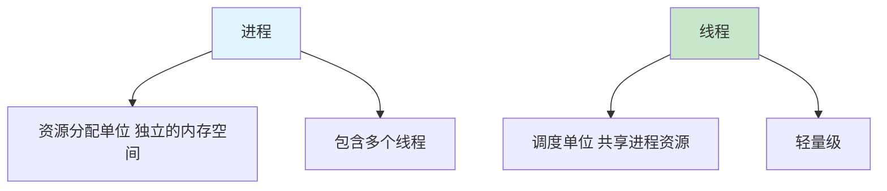
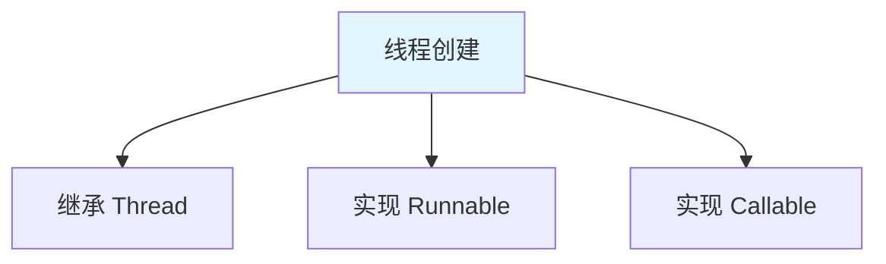

# 线程概述

线程(Thread)是**程序执行的最小单位**，一个进程可以包含多个线程。

## 进程与线程

### 基本概念



**进程 vs 线程**：

| 特性 | 进程 | 线程 |
|------|------|------|
| **定义** | 正在运行的程序 | 进程中的执行路径 |
| **资源** | 独立的内存空间 | 共享进程资源 |
| **通信** | 复杂（IPC） | 简单（共享内存） |
| **开销** | 大 | 小 |
| **数量** | 少 | 多 |

## 线程的创建方式

### 三种创建方式



### 方式1：继承 Thread

```java
// 1. 继承 Thread 类
class MyThread extends Thread {
    @Override
    public void run() {
        for (int i = 0; i < 10; i++) {
            System.out.println(getName() + ": " + i);
        }
    }
}

// 2. 使用线程
public class ThreadDemo1 {
    public static void main(String[] args) {
        MyThread t1 = new MyThread();
        MyThread t2 = new MyThread();
        
        t1.start();  // 启动线程
        t2.start();
    }
}
```

### 方式2：实现 Runnable

```java
// 1. 实现 Runnable 接口
class MyRunnable implements Runnable {
    @Override
    public void run() {
        for (int i = 0; i < 10; i++) {
            System.out.println(Thread.currentThread().getName() + ": " + i);
        }
    }
}

// 2. 使用线程
public class ThreadDemo2 {
    public static void main(String[] args) {
        MyRunnable mr = new MyRunnable();
        
        Thread t1 = new Thread(mr, "线程1");
        Thread t2 = new Thread(mr, "线程2");
        
        t1.start();
        t2.start();
    }
}
```

### 方式3：实现 Callable（JDK 5）

```java
import java.util.concurrent.Callable;
import java.util.concurrent.FutureTask;

// 1. 实现 Callable 接口
class MyCallable implements Callable<Integer> {
    @Override
    public Integer call() throws Exception {
        int sum = 0;
        for (int i = 1; i <= 100; i++) {
            sum += i;
        }
        return sum;
    }
}

// 2. 使用线程
public class ThreadDemo3 {
    public static void main(String[] args) throws Exception {
        MyCallable mc = new MyCallable();
        FutureTask<Integer> ft = new FutureTask<>(mc);
        
        Thread t = new Thread(ft);
        t.start();
        
        Integer result = ft.get();  // 获取返回值
        System.out.println("1-100的和：" + result);
    }
}
```

## Thread 类的常用方法

### 基本方法

```java
public class ThreadMethods {
    public static void main(String[] args) throws Exception {
        Thread t = new Thread(() -> {
            for (int i = 0; i < 5; i++) {
                System.out.println(Thread.currentThread().getName() + ": " + i);
            }
        }, "我的线程");
        
        // 1. getName()：获取线程名
        // 2. setName()：设置线程名
        System.out.println("线程名：" + t.getName());
        
        // 3. start()：启动线程
        t.start();
        
        // 4. sleep(long millis)：睡眠（毫秒）
        Thread.sleep(1000);
        
        // 5. getId()：获取线程ID
        System.out.println("线程ID：" + t.getId());
        
        // 6. getPriority()：获取优先级（1-10）
        System.out.println("优先级：" + t.getPriority());
        
        // 7. setPriority()：设置优先级
        t.setPriority(Thread.MAX_PRIORITY);
        
        // 8. isAlive()：是否存活
        System.out.println("是否存活：" + t.isAlive());
        
        // 9. currentThread()：当前线程
        System.out.println("当前线程：" + Thread.currentThread().getName());
    }
}
```

## 守护线程

### 守护线程示例

```java
public class DaemonThread {
    public static void main(String[] args) {
        Thread t = new Thread(() -> {
            while (true) {
                System.out.println("守护线程运行中...");
                try {
                    Thread.sleep(1000);
                } catch (InterruptedException e) {
                    break;
                }
            }
        }, "守护线程");
        
        // 设置为守护线程（当所有用户线程结束时，守护线程自动结束）
        t.setDaemon(true);
        t.start();
        
        try {
            Thread.sleep(3000);
        } catch (InterruptedException e) {
            e.printStackTrace();
        }
        
        System.out.println("主线程结束");
    }
}
```

## 小结

::: tip 核心要点

1. **进程与线程**：进程是资源单位，线程是调度单位
2. **创建方式**：继承 Thread、实现 Runnable、实现 Callable
3. **Thread 方法**：start、sleep、getName、setName、getPriority
4. **守护线程**：setDaemon(true)，为用户线程服务
5. **线程安全**：多线程共享资源时需同步

:::

::: info 下一步
- [线程创建](/java/base/07-thread/thread-create.md) - 学习线程创建详解
:::
