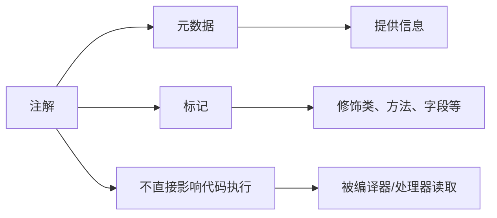
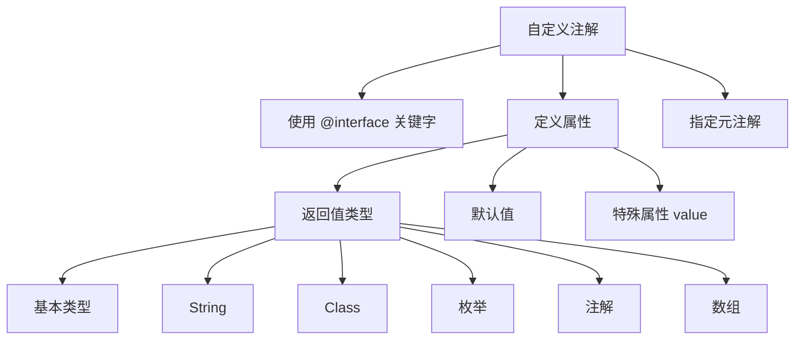

# 注解

注解（Annotation）是 Java 5 引入的一种元数据机制，用于在代码中添加标记信息。注解不会直接影响代码执行，但可以被编译器、注解处理器或运行时通过反射读取。

## 注解概述

### 什么是注解



**注解作用**：
- **编译检查**：让编译器检查错误（如 @Override）
- **代码生成**：根据注解生成代码或配置文件
- **运行时处理**：通过反射读取注解信息

::: tip 注解 vs 注释

| 特性 | 注解 (@Override) | 注释 (//) |
|------|------------------|-----------|
| 格式 | `@AnnotationName` | `// text` |
| 作用 | 提供结构化元数据 | 说明性文字 |
| 可被读取 | 可以（编译时/运行时） | 不能 |
| 影响程序 | 可能（通过处理器） | 不会 |

:::

## 内置注解

### Java 内置注解

```mermaid
graph TD
    A[内置注解] --> B[java.lang 包]
    A --> C[java.lang.annotation 包]
    
    B --> B1[@Override 覆盖父类方法]
    B --> B2[@Deprecated 已过时]
    B --> B3[@SuppressWarnings 抑制警告]
    B --> B4[@SafeVarargs 堆污染警告]
    B --> B5[@FunctionalInterface 函数式接口]
    
    C --> C1[@Retention 保留策略]
    C --> C2[@Target 使用目标]
    C --> C3[@Documented 生成文档]
    C --> C4[@Inherited 继承性]
    C --> C5[@Repeatable 可重复]
```

### @Override

```java
public class Animal {
    public void eat() {
        System.out.println("动物吃东西");
    }
}

public class Dog extends Animal {
    @Override  // ✅ 编译器检查是否真的覆盖了父类方法
    public void eat() {
        System.out.println("狗吃骨头");
    }
    
    // 下面这个会编译错误，因为父类没有 sleep() 方法
    // @Override
    // public void sleep() { }
}
```

::: tip @Override 的作用
- **编译检查**：确保方法确实覆盖了父类方法
- **防止拼写错误**：如果方法名拼写错误，编译失败
- **提高可读性**：明确表示这是覆盖方法
:::

### @Deprecated

```java
public class Calculator {
    /**
     * @deprecated 使用 {@link #calculate(int, int)} 代替
     */
    @Deprecated
    public void oldCalculate() {
        System.out.println("旧的计算方法");
    }
    
    public void calculate(int a, int b) {
        System.out.println("新的计算方法: " + (a + b));
    }
}

// 使用
public class Main {
    public static void main(String[] args) {
        Calculator calc = new Calculator();
        calc.oldCalculate();  // ⚠️ 编译警告：已过时
        calc.calculate(10, 20);
    }
}
```

### @SuppressWarnings

```java
import java.util.ArrayList;
import java.util.List;

public class SuppressDemo {
    @SuppressWarnings("unused")
    private int unusedField;  // 抑制未使用字段的警告
    
    @SuppressWarnings({"unchecked", "rawtypes"})
    public void demo() {
        List list = new ArrayList();  // 抑制原始类型和未检查转换的警告
        list.add("Hello");
    }
    
    // 常用的警告值
    @SuppressWarnings("all")           // 抑制所有警告
    @SuppressWarnings("unchecked")     // 抑制未检查转换
    @SuppressWarnings("rawtypes")      // 抑制原始类型
    @SuppressWarnings("unused")        // 抑制未使用
    @SuppressWarnings("deprecation")   // 抑制过时警告
}
```

### @FunctionalInterface

```java
@FunctionalInterface  // 标记函数式接口（只有一个抽象方法）
interface Runnable {
    void run();
}

@FunctionalInterface
interface Calculator {
    int calculate(int a, int b);
    
    // 允许默认方法
    default void print() {
        System.out.println("Calculator");
    }
    
    // 允许静态方法
    static void info() {
        System.out.println("This is a calculator");
    }
    
    // 允许 Object 的方法
    boolean equals(Object obj);
}

// 使用 Lambda 表达式
public class FunctionalDemo {
    public static void main(String[] args) {
        Calculator calc = (a, b) -> a + b;
        System.out.println(calc.calculate(10, 20));  // 30
    }
}
```

## 元注解

元注解是用于定义注解的注解。

### @Retention - 保留策略

```mermaid
graph LR
    A[@Retention] --> B[RetentionPolicy.SOURCE 源码级别]
    A --> C[RetentionPolicy.CLASS 字节码级别 默认]
    A --> D[RetentionPolicy.RUNTIME 运行时级别]
    
    B --> B1[编译后丢弃 如 @Override]
    C --> C1[编译到 class JVM 不读取 如 @Deprecated]
    D --> D1[JVM 运行时保留 可用反射读取]
```

```java
import java.lang.annotation.Retention;
import java.lang.annotation.RetentionPolicy;

// 源码级别：编译后丢弃
@Retention(RetentionPolicy.SOURCE)
@interface SourceAnnotation {
}

// 字节码级别：默认，编译到 class，运行时不可见
@Retention(RetentionPolicy.CLASS)
@interface ClassAnnotation {
}

// 运行时级别：运行时可通过反射读取
@Retention(RetentionPolicy.RUNTIME)
@interface RuntimeAnnotation {
    String value();
}
```

### @Target - 使用目标

```java
import java.lang.annotation.ElementType;
import java.lang.annotation.Target;

// 用于类型（类、接口、枚举）
@Target(ElementType.TYPE)
@interface TypeAnnotation {
}

// 用于字段
@Target(ElementType.FIELD)
@interface FieldAnnotation {
}

// 用于方法
@Target(ElementType.METHOD)
@interface MethodAnnotation {
}

// 用于参数
@Target(ElementType.PARAMETER)
@interface ParamAnnotation {
}

// 用于构造器
@Target(ElementType.CONSTRUCTOR)
@interface ConstructorAnnotation {
}

// 用于局部变量
@Target(ElementType.LOCAL_VARIABLE)
@interface LocalVariableAnnotation {
}

// 用于注解类型
@Target(ElementType.ANNOTATION_TYPE)
@interface MetaAnnotation {
}

// 用于包
@Target(ElementType.PACKAGE)
@interface PackageAnnotation {
}

// 用于类型参数
@Target(ElementType.TYPE_PARAMETER)
@interface TypeParameterAnnotation {
}

// 用于类型使用
@Target(ElementType.TYPE_USE)
@interface TypeUseAnnotation {
}

// 多个目标
@Target({ElementType.TYPE, ElementType.METHOD})
@interface TypeOrMethodAnnotation {
}
```

### @Documented - 生成文档

```java
import java.lang.annotation.Documented;

@Documented  // 该注解会出现在 Javadoc 中
@Retention(RetentionPolicy.RUNTIME)
@Target(ElementType.TYPE)
public @interface Version {
    String value();
}

/**
 * 这是一个测试类
 * @author John
 * @version 1.0
 */
@Version("1.0")
public class DocumentedDemo {
    // Javadoc 会显示 @Version 注解
}
```

### @Inherited - 继承性

```java
import java.lang.annotation.Inherited;

@Inherited  // 允许子类继承父类的注解
@Retention(RetentionPolicy.RUNTIME)
@Target(ElementType.TYPE)
@interface InheritedAnnotation {
    String value();
}

@InheritedAnnotation("父类")
public class Parent {
}

// 子类自动继承 @InheritedAnnotation
public class Child extends Parent {
}

public class InheritedDemo {
    public static void main(String[] args) {
        // 父类有注解
        InheritedAnnotation parentAnno = 
            Parent.class.getAnnotation(InheritedAnnotation.class);
        System.out.println(parentAnno.value());  // 父类
        
        // 子类也有注解（继承）
        InheritedAnnotation childAnno = 
            Child.class.getAnnotation(InheritedAnnotation.class);
        System.out.println(childAnno.value());   // 父类
    }
}
```

### @Repeatable - 可重复注解

```java
import java.lang.annotation.Repeatable;

// 容器注解
@interface Authors {
    Author[] value();
}

// 可重复的注解
@Repeatable(Authors.class)
@Retention(RetentionPolicy.RUNTIME)
@Target(ElementType.TYPE)
@interface Author {
    String name();
}

// 使用
@Author(name = "张三")
@Author(name = "李四")
@Author(name = "王五")
public class Book {
    public static void main(String[] args) {
        // 读取注解
        Authors authors = Book.class.getAnnotation(Authors.class);
        for (Author author : authors.value()) {
            System.out.println("作者: " + author.name());
        }
        // 输出：
        // 作者: 张三
        // 作者: 李四
        // 作者: 王五
    }
}
```

## 自定义注解

### 定义注解



### 基本注解定义

```java
import java.lang.annotation.ElementType;
import java.lang.annotation.Retention;
import java.lang.annotation.RetentionPolicy;
import java.lang.annotation.Target;

// 定义注解
@Retention(RetentionPolicy.RUNTIME)
@Target({ElementType.TYPE, ElementType.METHOD})
public @interface MyAnnotation {
    // 属性：name，默认值 "default"
    String name() default "default";
    
    // 属性：age，无默认值（使用时必须提供）
    int age();
    
    // 属性：数组
    String[] hobbies() default {};
    
    // 属性：枚举
    Gender gender() default Gender.MALE;
    
    // 枚举定义
    enum Gender {
        MALE, FEMALE
    }
}

// 使用注解
@MyAnnotation(
    age = 18,
    hobbies = {"读书", "运动"},
    gender = MyAnnotation.Gender.FEMALE
)
public class Person {
    @MyAnnotation(age = 20, name = "方法注解")
    public void method() {
    }
}
```

### value 属性

```java
// 如果注解只有一个属性，且名为 value，使用时可以省略属性名
@Retention(RetentionPolicy.RUNTIME)
@Target(ElementType.TYPE)
@interface SimpleAnnotation {
    String value();
}

// 使用
@SimpleAnnotation("简单值")
public class Demo1 {
}

// 多个属性时，value 不能省略其他属性名
@Retention(RetentionPolicy.RUNTIME)
@Target(ElementType.TYPE)
@interface MultiAnnotation {
    String value();
    int version() default 1;
}

// 使用
@MultiAnnotation(value = "测试", version = 2)
public class Demo2 {
}
```

## 注解处理器

### 反射读取注解

```java
import java.lang.annotation.Annotation;
import java.lang.reflect.Method;

// 定义注解
@Retention(RetentionPolicy.RUNTIME)
@Target(ElementType.TYPE)
@interface ClassInfo {
    String author();
    String date();
    String version() default "1.0";
}

@Retention(RetentionPolicy.RUNTIME)
@Target(ElementType.METHOD)
@interface MethodInfo {
    String name();
    String desc();
}

// 使用注解
@ClassInfo(author = "张三", date = "2024-01-01", version = "2.0")
public class UserService {
    @MethodInfo(name = "login", desc = "用户登录")
    public void login(String username, String password) {
        System.out.println("登录: " + username);
    }
    
    @MethodInfo(name = "logout", desc = "用户登出")
    public void logout() {
        System.out.println("登出");
    }
}

// 注解处理器
public class AnnotationProcessor {
    public static void main(String[] args) {
        // 处理类注解
        processClassAnnotation();
        
        // 处理方法注解
        processMethodAnnotation();
    }
    
    private static void processClassAnnotation() {
        Class<UserService> clazz = UserService.class;
        
        // 检查是否有注解
        if (clazz.isAnnotationPresent(ClassInfo.class)) {
            ClassInfo classInfo = clazz.getAnnotation(ClassInfo.class);
            
            System.out.println("=== 类信息 ===");
            System.out.println("作者: " + classInfo.author());
            System.out.println("日期: " + classInfo.date());
            System.out.println("版本: " + classInfo.version());
        }
    }
    
    private static void processMethodAnnotation() {
        Class<UserService> clazz = UserService.class;
        
        System.out.println("\n=== 方法信息 ===");
        
        for (Method method : clazz.getDeclaredMethods()) {
            if (method.isAnnotationPresent(MethodInfo.class)) {
                MethodInfo methodInfo = method.getAnnotation(MethodInfo.class);
                
                System.out.println("方法名: " + methodInfo.name());
                System.out.println("描述: " + methodInfo.desc());
                System.out.println("实际方法: " + method.getName());
                System.out.println("---");
            }
        }
    }
}
```

### 动态代理 + 注解

```java
import java.lang.annotation.*;
import java.lang.reflect.InvocationHandler;
import java.lang.reflect.Method;
import java.lang.reflect.Proxy;

// 定义注解
@Retention(RetentionPolicy.RUNTIME)
@Target(ElementType.METHOD)
@interface Log {
    String value() default "";
}

@Retention(RetentionPolicy.RUNTIME)
@Target(ElementType.METHOD)
@interface Cache {
    int seconds() default 60;
}

// 服务接口
interface UserService {
    @Log("查询用户")
    @Cache(seconds = 30)
    String getUserById(String id);
    
    @Log("保存用户")
    void saveUser(String name);
}

// 实现类
class UserServiceImpl implements UserService {
    @Override
    public String getUserById(String id) {
        System.out.println("执行：查询用户 " + id);
        return "User-" + id;
    }
    
    @Override
    public void saveUser(String name) {
        System.out.println("执行：保存用户 " + name);
    }
}

// 代理处理器
class LogInvocationHandler implements InvocationHandler {
    private Object target;
    
    public LogInvocationHandler(Object target) {
        this.target = target;
    }
    
    @Override
    public Object invoke(Object proxy, Method method, Object[] args) throws Throwable {
        // 处理 @Log 注解
        if (method.isAnnotationPresent(Log.class)) {
            Log log = method.getAnnotation(Log.class);
            System.out.println("[LOG] " + log.value());
        }
        
        // 处理 @Cache 注解
        if (method.isAnnotationPresent(Cache.class)) {
            Cache cache = method.getAnnotation(Cache.class);
            System.out.println("[CACHE] 缓存 " + cache.seconds() + " 秒");
        }
        
        // 执行原方法
        return method.invoke(target, args);
    }
}

// 使用
public class AnnotationProxyDemo {
    public static void main(String[] args) {
        UserService service = new UserServiceImpl();
        
        // 创建代理
        UserService proxy = (UserService) Proxy.newProxyInstance(
            service.getClass().getClassLoader(),
            service.getClass().getInterfaces(),
            new LogInvocationHandler(service)
        );
        
        // 通过代理调用
        proxy.getUserById("001");
        System.out.println("---");
        proxy.saveUser("张三");
    }
}
```

## 实际应用场景

### 1. JUnit 测试框架

```java
// @Test 标记测试方法
@Test
public void testAdd() {
    assertEquals(5, calculator.add(2, 3));
}

// @Before 在每个测试方法前执行
@Before
public void setUp() {
    calculator = new Calculator();
}

// @After 在每个测试方法后执行
@After
public void tearDown() {
    calculator = null;
}

// @Ignore 忽略测试
@Ignore("尚未实现")
@Test
public void testSubtract() {
}
```

### 2. Spring 框架

```java
// @Component 标记为 Spring Bean
@Component
public class UserService {
}

// @Autowired 自动注入
@Service
public class OrderService {
    @Autowired
    private UserService userService;
}

// @RequestMapping 请求映射
@Controller
@RequestMapping("/user")
public class UserController {
    @GetMapping("/list")
    public String list() {
        return "user/list";
    }
}

// @Transactional 事务管理
@Transactional
public void createUser(User user) {
    userDao.save(user);
}
```

### 3. JSON 序列化

```java
import com.fasterxml.jackson.annotation.*;

public class User {
    @JsonProperty("user_name")  // 指定 JSON 字段名
    private String userName;
    
    @JsonIgnore  // 忽略该字段
    private String password;
    
    @JsonFormat(pattern = "yyyy-MM-dd")  // 日期格式
    private Date birthday;
    
    @JsonInclude(JsonInclude.Include.NON_NULL)  // null 不序列化
    private String nickname;
}
```

### 4. 数据验证

```java
import javax.validation.constraints.*;

public class UserForm {
    @NotNull(message = "用户名不能为空")
    @Size(min = 3, max = 20, message = "用户名长度3-20")
    private String username;
    
    @NotEmpty(message = "密码不能为空")
    @Size(min = 6, message = "密码至少6位")
    private String password;
    
    @Email(message = "邮箱格式不正确")
    private String email;
    
    @Min(value = 18, message = "年龄必须满18岁")
    @Max(value = 100, message = "年龄不能超过100")
    private Integer age;
    
    @Pattern(regexp = "^1[3-9]\\d{9}$", message = "手机号格式不正确")
    private String phone;
}
```

## 小结

::: tip 核心要点

1. **注解作用**：提供元数据，不直接影响代码执行
2. **内置注解**：@Override、@Deprecated、@SuppressWarnings、@FunctionalInterface
3. **元注解**：@Retention、@Target、@Documented、@Inherited、@Repeatable
4. **自定义注解**：使用 @interface 关键字，定义属性和默认值
5. **注解处理器**：通过反射读取注解信息，实现代码生成或运行时处理
6. **应用场景**：框架配置、代码生成、编译检查、运行时处理

:::

::: warning 注意事项

1. 注解属性**必须有返回值**，不能有参数
2. 注解属性**可以有默认值**，使用时如果不提供则使用默认值
3. **@Retention(RetentionPolicy.RUNTIME)** 才能在运行时通过反射读取
4. **@Target** 限制注解的使用位置
5. **@Repeatable** 需要配合容器注解使用

:::

::: info 下一步
- [泛型概述](/java/base/09-generic-reflection/generic-overview.md) - 学习 Java 泛型
:::
