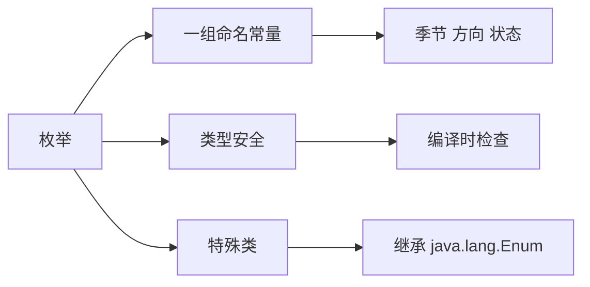
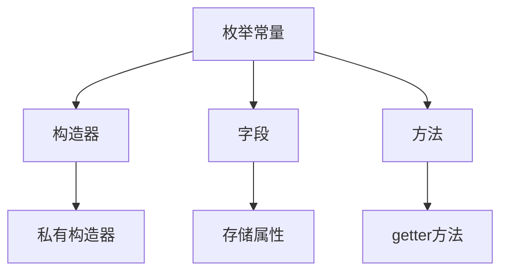
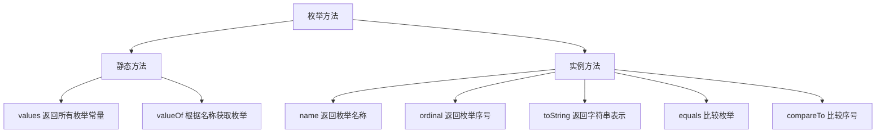
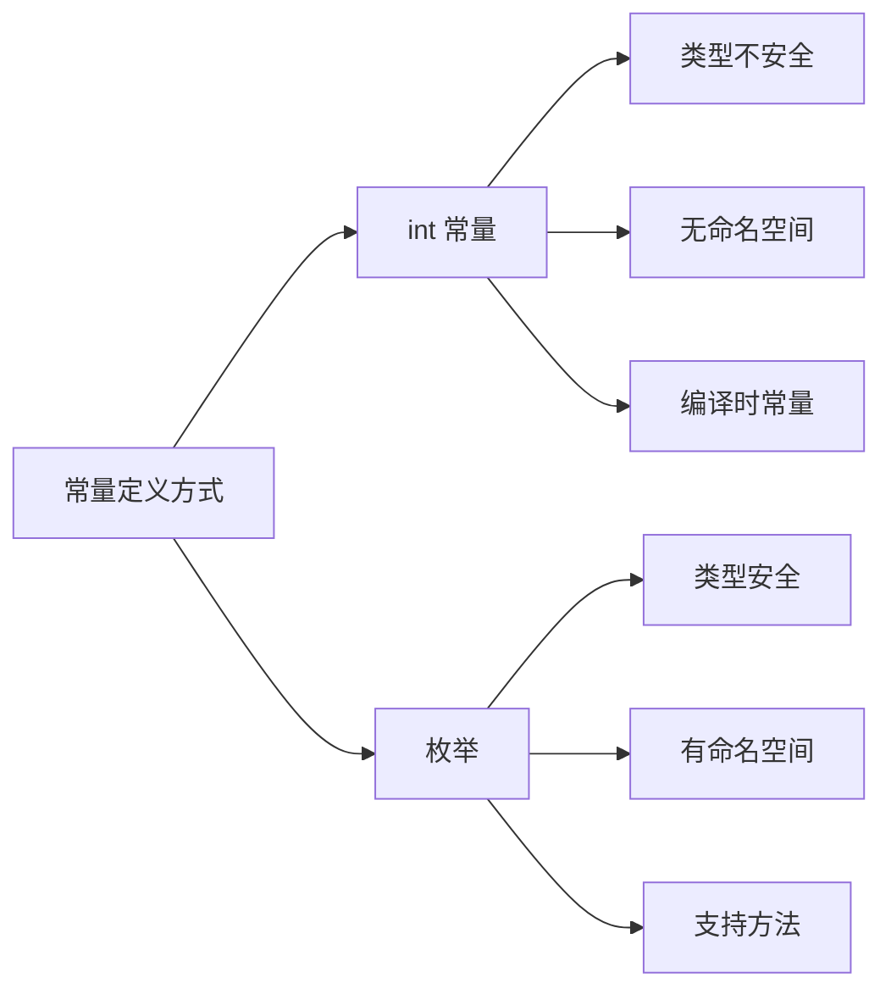

# 枚举

枚举（Enum）是 Java 5 引入的一种特殊类型，用于定义一组常量。枚举提供了类型安全的常量表示方式。

## 枚举概述

### 什么是枚举



**枚举特点**：
- **类型安全**：编译时检查，防止无效值
- **单例模式**：每个枚举常量都是单例
- **支持方法**：可以定义抽象方法、构造器、字段
- **支持接口**：枚举可以实现接口
- **内置方法**：values()、name()、ordinal() 等

::: tip 什么时候使用枚举

- 需要一组**固定数量**的常量
- 需要**类型安全**的常量
- 常量需要**关联行为**或**属性**

:::

## 基本枚举

### 定义枚举

```java
// 定义枚举
public enum Season {
    SPRING,    // 春天
    SUMMER,    // 夏天
    AUTUMN,    // 秋天
    WINTER     // 冬天
}

// 使用枚举
public class EnumDemo {
    public static void main(String[] args) {
        // 获取枚举常量
        Season s1 = Season.SPRING;
        Season s2 = Season.SUMMER;
        
        System.out.println(s1);           // SPRING
        System.out.println(s2.name());    // SUMMER（返回名称）
        System.out.println(s1.ordinal()); // 0（返回序号）
        
        // 比较
        System.out.println(s1 == Season.SPRING);  // true
        System.out.println(s1.equals(Season.SPRING)); // true
        
        // 遍历所有枚举值
        Season[] seasons = Season.values();
        for (Season season : seasons) {
            System.out.println(season + " : " + season.ordinal());
        }
        // 输出：
        // SPRING : 0
        // SUMMER : 1
        // AUTUMN : 2
        // WINTER : 3
    }
}
```

### 在 switch 中使用枚举

```java
public enum Day {
    MONDAY, TUESDAY, WEDNESDAY, 
    THURSDAY, FRIDAY, SATURDAY, SUNDAY
}

public class SwitchDemo {
    public static void main(String[] args) {
        Day day = Day.MONDAY;
        
        switch (day) {
            case MONDAY:
                System.out.println("周一，努力工作！");
                break;
            case FRIDAY:
                System.out.println("周五，周末将至！");
                break;
            case SATURDAY:
            case SUNDAY:
                System.out.println("周末，好好休息！");
                break;
            default:
                System.out.println("普通工作日");
        }
    }
}
```

## 枚举高级用法

### 带构造器的枚举



```java
public enum LogLevel {
    DEBUG(1, "调试"),
    INFO(2, "信息"),
    WARNING(3, "警告"),
    ERROR(4, "错误"),
    FATAL(5, "致命");
    
    // 字段
    private final int level;
    private final String desc;
    
    // 构造器（必须是 private）
    LogLevel(int level, String desc) {
        this.level = level;
        this.desc = desc;
    }
    
    // 方法
    public int getLevel() {
        return level;
    }
    
    public String getDesc() {
        return desc;
    }
    
    // 根据级别获取枚举
    public static LogLevel fromLevel(int level) {
        for (LogLevel log : values()) {
            if (log.getLevel() == level) {
                return log;
            }
        }
        return null;
    }
}

// 使用
public class LogLevelDemo {
    public static void main(String[] args) {
        LogLevel debug = LogLevel.DEBUG;
        System.out.println(debug.getLevel());   // 1
        System.out.println(debug.getDesc());    // 调试
        
        LogLevel error = LogLevel.fromLevel(4);
        System.out.println(error);              // ERROR
    }
}
```

### 带抽象方法的枚举

```java
public enum Operation {
    PLUS {
        @Override
        public double apply(double a, double b) {
            return a + b;
        }
    },
    MINUS {
        @Override
        public double apply(double a, double b) {
            return a - b;
        }
    },
    TIMES {
        @Override
        public double apply(double a, double b) {
            return a * b;
        }
    },
    DIVIDE {
        @Override
        public double apply(double a, double b) {
            return a / b;
        }
    };
    
    // 抽象方法
    public abstract double apply(double a, double b);
}

// 使用
public class OperationDemo {
    public static void main(String[] args) {
        double result = Operation.PLUS.apply(10, 5);      // 15.0
        double result2 = Operation.TIMES.apply(10, 5);    // 50.0
        System.out.println(result);
        System.out.println(result2);
    }
}
```

### 枚举实现接口

```java
// 定义接口
interface Describable {
    String getDescription();
}

// 枚举实现接口
public enum Color implements Describable {
    RED("红色", "#FF0000"),
    GREEN("绿色", "#00FF00"),
    BLUE("蓝色", "#0000FF");
    
    private final String name;
    private final String hex;
    
    Color(String name, String hex) {
        this.name = name;
        this.hex = hex;
    }
    
    @Override
    public String getDescription() {
        return name + " (" + hex + ")";
    }
    
    public String getHex() {
        return hex;
    }
}

// 使用
public class ColorDemo {
    public static void main(String[] args) {
        Color red = Color.RED;
        System.out.println(red.getDescription());  // 红色 (#FF0000)
        System.out.println(red.getHex());          // #FF0000
    }
}
```

## 常用枚举方法



```java
public enum Size {
    SMALL, MEDIUM, LARGE, EXTRA_LARGE
}

public class EnumMethods {
    public static void main(String[] args) {
        // 1. values() - 返回所有枚举常量
        Size[] sizes = Size.values();
        for (Size size : sizes) {
            System.out.println(size);
        }
        // 输出：SMALL, MEDIUM, LARGE, EXTRA_LARGE
        
        // 2. valueOf(String) - 根据名称获取枚举
        Size s1 = Size.valueOf("SMALL");
        System.out.println(s1);  // SMALL
        
        // 3. name() - 返回枚举名称
        Size s2 = Size.MEDIUM;
        System.out.println(s2.name());  // MEDIUM
        
        // 4. ordinal() - 返回枚举序号（从0开始）
        Size s3 = Size.LARGE;
        System.out.println(s3.ordinal());  // 2
        
        // 5. toString() - 返回字符串表示（默认同name()）
        Size s4 = Size.EXTRA_LARGE;
        System.out.println(s4.toString());  // EXTRA_LARGE
        
        // 6. equals() - 比较枚举
        Size s5 = Size.SMALL;
        Size s6 = Size.valueOf("SMALL");
        System.out.println(s5.equals(s6));  // true
        System.out.println(s5 == s6);       // true（枚举只有单例）
        
        // 7. compareTo() - 比较序号
        Size s7 = Size.SMALL;
        Size s8 = Size.LARGE;
        System.out.println(s7.compareTo(s8));  // -2（0 - 2）
        System.out.println(s8.compareTo(s7));  // 2（2 - 0）
    }
}
```

## 枚举 vs 常量

### 对比



::: tabs

@tab int 常量

```java
// int 常量（不推荐）
public class Color {
    public static final int RED = 1;
    public static final int GREEN = 2;
    public static final int BLUE = 3;
}

// 问题1：类型不安全
public void setColor(int color) { }
setColor(999);  // ❌ 编译通过，但无效

// 问题2：无命名空间
int color = Color.RED;
int status = Status.PENDING;  // 都是 int，可能混淆
```

@tab 枚举

```java
// 枚举（推荐）
public enum Color {
    RED, GREEN, BLUE
}

// 优势1：类型安全
public void setColor(Color color) { }
setColor(Color.RED);   // ✅ 编译通过
// setColor(999);      // ❌ 编译错误

// 优势2：有命名空间
Color color = Color.RED;
Status status = Status.PENDING;  // 不同类型，不会混淆

// 优势3：支持方法
for (Color c : Color.values()) {
    System.out.println(c);
}
```

:::

## 实际应用场景

### 1. 状态机

```java
public enum State {
    READY {
        @Override
        public State next() {
            return RUNNING;
        }
    },
    RUNNING {
        @Override
        public State next() {
            return PAUSED;
        }
    },
    PAUSED {
        @Override
        public State next() {
            return RUNNING;
        }
    },
    STOPPED {
        @Override
        public State next() {
            return STOPPED;
        }
    };
    
    public abstract State next();
}

// 状态机演示
public class StateMachine {
    private State state = State.READY;
    
    public void transition() {
        state = state.next();
        System.out.println("当前状态: " + state);
    }
    
    public static void main(String[] args) {
        StateMachine sm = new StateMachine();
        sm.transition();  // RUNNING
        sm.transition();  // PAUSED
        sm.transition();  // RUNNING
    }
}
```

### 2. 单例模式

```java
public enum Singleton {
    INSTANCE;
    
    // 字段
    private String data;
    
    // 方法
    public void setData(String data) {
        this.data = data;
    }
    
    public String getData() {
        return data;
    }
    
    public void doSomething() {
        System.out.println("单例方法执行");
    }
}

// 使用
public class SingletonDemo {
    public static void main(String[] args) {
        Singleton s1 = Singleton.INSTANCE;
        Singleton s2 = Singleton.INSTANCE;
        
        System.out.println(s1 == s2);  // true
        
        s1.setData("Hello");
        System.out.println(s2.getData());  // Hello
        
        s1.doSomething();
    }
}
```

::: tip 枚举单例的优势
- **线程安全**：JVM 保证枚举实例的唯一性
- **序列化安全**：枚举默认实现了序列化机制
- **代码简洁**：比传统单例模式更简单
:::

### 3. 策略模式

```java
public enum PaymentStrategy {
    CREDIT_CARD {
        @Override
        public void pay(int amount) {
            System.out.println("使用信用卡支付: " + amount + "元");
        }
    },
    ALIPAY {
        @Override
        public void pay(int amount) {
            System.out.println("使用支付宝支付: " + amount + "元");
        }
    },
    WECHAT {
        @Override
        public void pay(int amount) {
            System.out.println("使用微信支付: " + amount + "元");
        }
    };
    
    public abstract void pay(int amount);
}

// 使用
public class PaymentDemo {
    public static void main(String[] args) {
        int amount = 100;
        
        // 根据用户选择支付
        PaymentStrategy strategy = PaymentStrategy.ALIPAY;
        strategy.pay(amount);
        
        // 或者遍历所有支付方式
        for (PaymentStrategy ps : PaymentStrategy.values()) {
            ps.pay(amount);
        }
    }
}
```

## 枚举集合

### EnumSet

```java
import java.util.EnumSet;

public enum Day {
    MONDAY, TUESDAY, WEDNESDAY, THURSDAY, 
    FRIDAY, SATURDAY, SUNDAY
}

public class EnumSetDemo {
    public static void main(String[] args) {
        // 创建空集合
        EnumSet<Day> weekend = EnumSet.noneOf(Day.class);
        weekend.add(Day.SATURDAY);
        weekend.add(Day.SUNDAY);
        System.out.println(weekend);  // [SATURDAY, SUNDAY]
        
        // 创建包含所有元素的集合
        EnumSet<Day> allDays = EnumSet.allOf(Day.class);
        System.out.println(allDays);
        
        // 创建指定范围的集合
        EnumSet<Day> workDays = EnumSet.range(Day.MONDAY, Day.FRIDAY);
        System.out.println(workDays);  // [MONDAY, FRIDAY, ...]
        
        // 补集
        EnumSet<Day> weekend2 = EnumSet.complementOf(workDays);
        System.out.println(weekend2);  // [SATURDAY, SUNDAY]
        
        // 集合运算
        EnumSet<Day> days1 = EnumSet.of(Day.MONDAY, Day.WEDNESDAY, Day.FRIDAY);
        EnumSet<Day> days2 = EnumSet.of(Day.TUESDAY, Day.WEDNESDAY, Day.THURSDAY);
        
        EnumSet<Day> union = EnumSet.copyOf(days1);
        union.addAll(days2);
        System.out.println(union);  // [MONDAY, TUESDAY, WEDNESDAY, THURSDAY, FRIDAY]
    }
}
```

### EnumMap

```java
import java.util.EnumMap;

public enum Role {
    ADMIN, USER, GUEST
}

public class EnumMapDemo {
    public static void main(String[] args) {
        // 创建 EnumMap
        EnumMap<Role, String> permissions = new EnumMap<>(Role.class);
        
        // 添加权限
        permissions.put(Role.ADMIN, "读取、写入、删除");
        permissions.put(Role.USER, "读取、写入");
        permissions.put(Role.GUEST, "读取");
        
        // 遍历
        for (Role role : Role.values()) {
            System.out.println(role + ": " + permissions.get(role));
        }
        // 输出：
        // ADMIN: 读取、写入、删除
        // USER: 读取、写入
        // GUEST: 读取
        
        // 特点：key 的顺序是枚举定义的顺序
        for (var entry : permissions.entrySet()) {
            System.out.println(entry.getKey() + " -> " + entry.getValue());
        }
    }
}
```

::: tip EnumSet 和 EnumMap 的优势
- **性能优越**：内部使用位向量实现，存储和查询效率高
- **类型安全**：只能存储指定枚举类型的值
- **有序性**：保持枚举定义的顺序
:::

## 小结

::: tip 核心要点

1. **枚举定义**：使用 `enum` 关键字定义，枚举常量用逗号分隔
2. **枚举特点**：类型安全、支持方法、实现接口、单例模式
3. **常用方法**：values()、valueOf()、name()、ordinal()
4. **高级用法**：构造器、抽象方法、实现接口
5. **应用场景**：状态机、单例模式、策略模式
6. **枚举集合**：EnumSet（位集合）、EnumMap（枚举键的Map）

:::

::: warning 注意事项

1. 枚举的构造器**只能是 private**
2. 枚举常量定义**必须在最前面**
3. 枚举不能被**继承**（隐式 final）
4. 枚举可以实现**接口**
5. 枚举可以有**抽象方法**，每个常量必须实现

:::

::: info 下一步
- [注解](/java/base/08-common-api/annotation.md) - 学习 Java 注解
:::
