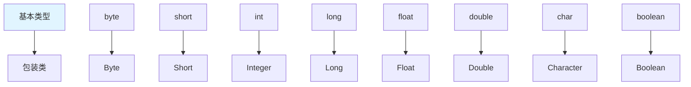

# 包装类

包装类是**基本数据类型对应的类**，使基本类型具有对象的特性。

## 包装类概述

### 8种包装类



**基本类型与包装类对应**：

| 基本类型 | 包装类 | 父类 |
|---------|--------|------|
| byte | Byte | Number |
| short | Short | Number |
| int | Integer | Number |
| long | Long | Number |
| float | Float | Number |
| double | Double | Number |
| char | Character | Object |
| boolean | Boolean | Object |

## 自动装箱与拆箱

### 装箱与拆箱

```java
public class AutoBoxing {
    public static void main(String[] args) {
        // 1. 装箱：基本类型 → 包装类
        Integer num1 = 100;  // 自动装箱
        Integer num2 = Integer.valueOf(100);  // 手动装箱
        
        // 2. 拆箱：包装类 → 基本类型
        int num3 = num1;  // 自动拆箱
        int num4 = num1.intValue();  // 手动拆箱
        
        System.out.println(num1 + ", " + num2 + ", " + num3 + ", " + num4);
    }
}
```

### 缓存机制

```java
public class CacheDemo {
    public static void main(String[] args) {
        // Integer 缓存：-128 ~ 127
        Integer i1 = 100;
        Integer i2 = 100;
        System.out.println(i1 == i2);  // true（缓存）
        
        Integer i3 = 200;
        Integer i4 = 200;
        System.out.println(i3 == i4);  // false（新对象）
        
        // Boolean 缓存：true、false
        Boolean b1 = true;
        Boolean b2 = true;
        System.out.println(b1 == b2);  // true（缓存）
    }
}
```

## 常用方法

### Integer 示例

```java
public class IntegerDemo {
    public static void main(String[] args) {
        // 1. 进制转换
        int num = 100;
        System.out.println(Integer.toBinaryString(num));   // 1100100
        System.out.println(Integer.toOctalString(num));     // 144
        System.out.println(Integer.toHexString(num));       // 64
        
        // 2. 字符串转整数
        int i1 = Integer.parseInt("123");       // 123
        int i2 = Integer.parseInt("101", 2);    // 5（二进制）
        Integer i3 = Integer.valueOf("456");   // 456
        
        // 3. 整数转字符串
        String s1 = Integer.toString(100);     // "100"
        String s2 = Integer.toHexString(255);  // "ff"
        
        // 4. 比较方法
        System.out.println(Integer.compare(10, 20));  // -1
        
        // 5. 最大值最小值
        System.out.println(Integer.MAX_VALUE);  // 2147483647
        System.out.println(Integer.MIN_VALUE);  // -2147483648
    }
}
```

## 小结

::: tip 核心要点

1. **8种包装类**：Byte、Short、Integer、Long、Float、Double、Character、Boolean
2. **自动装箱**：基本类型自动转为包装类
3. **自动拆箱**：包装类自动转为基本类型
4. **缓存机制**：Integer 缓存 -128~127，Boolean 缓存 true/false
5. **常用方法**：parseInt、toString、toBinaryString

:::

::: info 下一步
- [日期时间](/java/base/08-common-api/datetime.md) - 学习日期时间
:::
