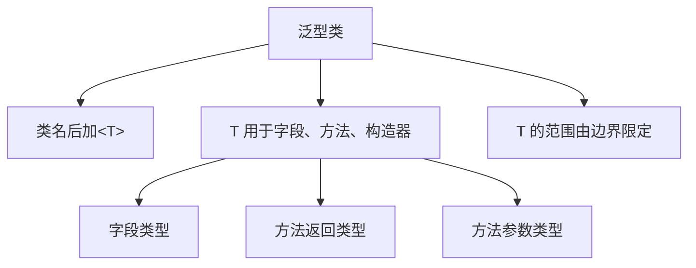
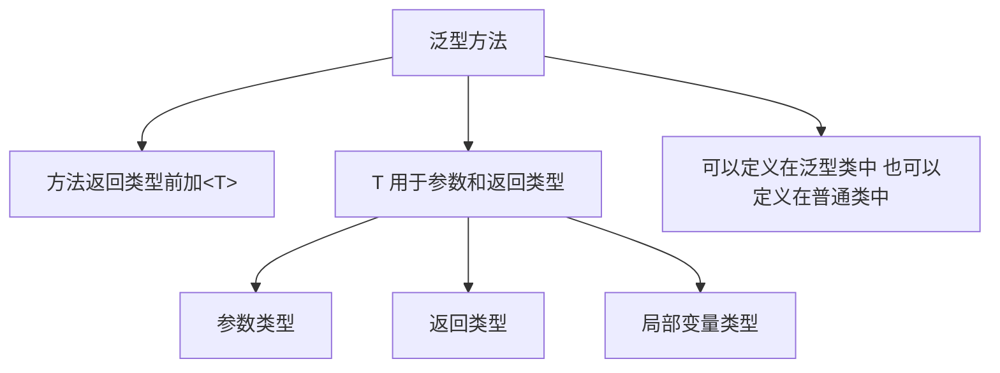
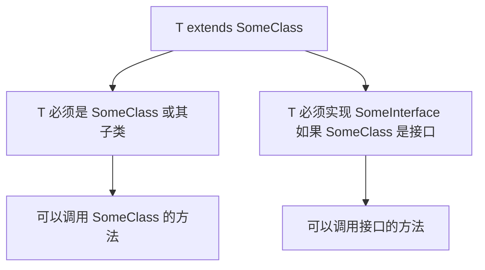

# 泛型详解

深入理解 Java 泛型的使用方式，包括泛型类、泛型接口、泛型方法和类型边界。

## 泛型类

### 定义泛型类



```java
// 基本泛型类
public class Box<T> {
    // 字段使用类型参数 T
    private T value;
    
    // 构造器使用 T
    public Box(T value) {
        this.value = value;
    }
    
    // 方法返回 T
    public T getValue() {
        return value;
    }
    
    // 方法参数使用 T
    public void setValue(T value) {
        this.value = value;
    }
    
    // 泛型方法
    public <E> void inspect(E e) {
        System.out.println("Type: " + e.getClass().getName());
        System.out.println("Value: " + e);
    }
}

// 使用
public class BoxDemo {
    public static void main(String[] args) {
        // 创建泛型类实例，指定类型参数
        Box<String> stringBox = new Box<>("Hello");
        String s = stringBox.getValue();
        stringBox.inspect(100);  // 可以调用泛型方法
        
        Box<Integer> intBox = new Box<>(123);
        Integer i = intBox.getValue();
    }
}
```

### 多个类型参数的类

```java
// 键值对类
public class Pair<K, V> {
    private K key;
    private V value;
    
    public Pair(K key, V value) {
        this.key = key;
        this.value = value;
    }
    
    public K getKey() { return key; }
    public V getValue() { return value; }
    
    public void setKey(K key) { this.key = key; }
    public void setValue(V value) { this.value = value; }
    
    @Override
    public String toString() {
        return key + " = " + value;
    }
}

// 三元组类
public class Triple<A, B, C> {
    private A first;
    private B second;
    private C third;
    
    public Triple(A first, B second, C third) {
        this.first = first;
        this.second = second;
        this.third = third;
    }
    
    public A getFirst() { return first; }
    public B getSecond() { return second; }
    public C getThird() { return third; }
}

// 使用
public class MultiTypeDemo {
    public static void main(String[] args) {
        Pair<String, Integer> pair = new Pair<>("年龄", 18);
        System.out.println(pair);  // 年龄 = 18
        
        Triple<String, Integer, Double> triple = 
            new Triple<>("数据", 100, 99.9);
        System.out.println(triple.getFirst());    // 数据
        System.out.println(triple.getSecond());   // 100
        System.out.println(triple.getThird());    // 99.9
    }
}
```

### 泛型类的继承

```java
// 父类是泛型类
public class Base<T> {
    protected T value;
    
    public Base(T value) {
        this.value = value;
    }
    
    public T getValue() {
        return value;
    }
}

// 子类指定父类的类型参数
class StringBase extends Base<String> {
    public StringBase(String value) {
        super(value);
    }
    
    public void print() {
        System.out.println("String: " + value);
    }
}

// 子类保留泛型
class GenericBase<T> extends Base<T> {
    public GenericBase(T value) {
        super(value);
    }
    
    public void printType() {
        System.out.println("Type: " + value.getClass().getSimpleName());
    }
}

// 子类添加新的类型参数
class DoubleGeneric<T, U> extends Base<T> {
    private U extra;
    
    public DoubleGeneric(T value, U extra) {
        super(value);
        this.extra = extra;
    }
    
    public U getExtra() {
        return extra;
    }
}

// 使用
public class InheritanceDemo {
    public static void main(String[] args) {
        StringBase sb = new StringBase("Hello");
        sb.print();
        
        GenericBase<Integer> gb = new GenericBase<>(100);
        gb.printType();
        
        DoubleGeneric<String, Integer> dg = 
            new DoubleGeneric<>("Test", 123);
        System.out.println(dg.getValue());  // Test
        System.out.println(dg.getExtra());  // 123
    }
}
```

## 泛型接口

### 定义泛型接口

```java
// 泛型接口
public interface Container<T> {
    void add(T item);
    T get(int index);
    int size();
    boolean isEmpty();
}

// 实现类指定类型参数
class StringContainer implements Container<String> {
    private String[] items = new String[10];
    private int count = 0;
    
    @Override
    public void add(String item) {
        if (count < items.length) {
            items[count++] = item;
        }
    }
    
    @Override
    public String get(int index) {
        return items[index];
    }
    
    @Override
    public int size() {
        return count;
    }
    
    @Override
    public boolean isEmpty() {
        return count == 0;
    }
}

// 实现类保留泛型
class GenericContainer<T> implements Container<T> {
    private Object[] items = new Object[10];
    private int count = 0;
    
    @Override
    public void add(T item) {
        if (count < items.length) {
            items[count++] = item;
        }
    }
    
    @Override
    @SuppressWarnings("unchecked")
    public T get(int index) {
        return (T) items[index];
    }
    
    @Override
    public int size() {
        return count;
    }
    
    @Override
    public boolean isEmpty() {
        return count == 0;
    }
}

// 使用
public class InterfaceDemo {
    public static void main(String[] args) {
        StringContainer sc = new StringContainer();
        sc.add("Hello");
        sc.add("World");
        System.out.println(sc.get(0));  // Hello
        
        GenericContainer<Integer> gc = new GenericContainer<>();
        gc.add(100);
        gc.add(200);
        System.out.println(gc.get(0));  // 100
    }
}
```

### 比较器接口示例

```java
// Comparable 接口（Java 自带）
public interface Comparable<T> {
    int compareTo(T o);
}

// 实现 Comparable
class Student implements Comparable<Student> {
    private String name;
    private int score;
    
    public Student(String name, int score) {
        this.name = name;
        this.score = score;
    }
    
    @Override
    public int compareTo(Student other) {
        // 按分数比较
        return this.score - other.score;
    }
    
    @Override
    public String toString() {
        return name + "(" + score + ")";
    }
}

// Comparator 接口（Java 自带）
@FunctionalInterface
public interface Comparator<T> {
    int compare(T o1, T o2);
}

// 实现自定义比较器
class NameComparator implements Comparator<Student> {
    @Override
    public int compare(Student s1, Student s2) {
        return s1.name.compareTo(s2.name);
    }
}

// 使用
public class ComparableDemo {
    public static void main(String[] args) {
        Student s1 = new Student("张三", 90);
        Student s2 = new Student("李四", 85);
        
        System.out.println(s1.compareTo(s2));  // 5（张三分数更高）
        
        NameComparator nc = new NameComparator();
        System.out.println(nc.compare(s1, s2));  // 比较名字
    }
}
```

## 泛型方法

### 定义泛型方法



```java
public class GenericMethods {
    // 泛型方法
    public static <T> void swap(T[] array, int i, int j) {
        T temp = array[i];
        array[i] = array[j];
        array[j] = temp;
    }
    
    // 泛型方法，返回泛型类型
    public static <T> T getMiddle(T... items) {
        return items[items.length / 2];
    }
    
    // 多个类型参数的泛型方法
    public static <K, V> Pair<K, V> createPair(K key, V value) {
        return new Pair<>(key, value);
    }
    
    // 有边界的泛型方法
    public static <T extends Comparable<T>> T max(T[] array) {
        if (array == null || array.length == 0) {
            return null;
        }
        
        T max = array[0];
        for (int i = 1; i < array.length; i++) {
            if (array[i].compareTo(max) > 0) {
                max = array[i];
            }
        }
        return max;
    }
    
    // 使用
    public static void main(String[] args) {
        // swap 方法
        String[] names = {"Alice", "Bob", "Charlie"};
        swap(names, 0, 2);
        System.out.println(Arrays.toString(names));  // [Charlie, Bob, Alice]
        
        // getMiddle 方法
        String middle = getMiddle("A", "B", "C", "D", "E");
        System.out.println(middle);  // C
        
        // createPair 方法
        Pair<String, Integer> pair = createPair("年龄", 18);
        System.out.println(pair);  // 年龄 = 18
        
        // max 方法
        Integer[] nums = {3, 1, 4, 1, 5, 9};
        Integer max = max(nums);
        System.out.println(max);  // 9
    }
}
```

### 静态泛型方法

```java
public class StaticGenericMethod {
    // 静态泛型方法
    public static <T> void printArray(T[] array) {
        for (T item : array) {
            System.out.println(item);
        }
    }
    
    // 静态泛型方法，创建数组
    @SuppressWarnings("unchecked")
    public static <T> T[] createArray(int size, Class<T> type) {
        return (T[]) java.lang.reflect.Array.newInstance(type, size);
    }
    
    // 静态泛型方法，创建列表
    public static <T> List<T> asList(T... items) {
        List<T> list = new ArrayList<>();
        for (T item : items) {
            list.add(item);
        }
        return list;
    }
    
    public static void main(String[] args) {
        String[] names = {"Alice", "Bob", "Charlie"};
        printArray(names);
        
        Integer[] nums = createArray(5, Integer.class);
        nums[0] = 100;
        System.out.println(nums[0]);  // 100
        
        List<String> list = asList("A", "B", "C");
        System.out.println(list);  // [A, B, C]
    }
}
```

### 泛型方法 vs 泛型类

```java
// 泛型类
class Box<T> {
    private T value;
    
    public void set(T value) {
        this.value = value;
    }
    
    public T get() {
        return value;
    }
    
    // 泛型方法（与类的 T 不同）
    public <E> void inspect(E e) {
        System.out.println("Inspecting: " + e);
    }
}

// 使用
public class MethodVsClass {
    public static void main(String[] args) {
        // 泛型类的 T 是 Integer
        Box<Integer> intBox = new Box<>();
        intBox.set(100);
        
        // 泛型方法的 E 是 String（独立于类的 T）
        intBox.inspect("Hello");
    }
}
```

::: tip 泛型方法的优点

1. **无需创建泛型类**：只在需要的方法上使用泛型
2. **静态方法也可以泛型**：不受类的类型参数限制
3. **更灵活**：可以为不同调用指定不同的类型参数

:::

## 类型边界

### 上界边界 extends



```java
// 上界边界：T 必须是 Number 或其子类
public class Calculator<T extends Number> {
    private T value;
    
    public Calculator(T value) {
        this.value = value;
    }
    
    // 因为有边界，可以调用 Number 的方法
    public double doubleValue() {
        return value.doubleValue();
    }
    
    public int intValue() {
        return value.intValue();
    }
}

// 使用
public class BoundedDemo {
    public static void main(String[] args) {
        Calculator<Integer> intCalc = new Calculator<>(100);
        System.out.println(intCalc.doubleValue());  // 100.0
        
        Calculator<Double> doubleCalc = new Calculator<>(3.14);
        System.out.println(doubleCalc.intValue());  // 3
        
        // Calculator<String> stringCalc = new Calculator<>("Hello");  // ❌ 编译错误
    }
}
```

### 多个边界

```java
// 多个边界：T 必须是 Number 的子类，并且实现 Comparable
public class SmartCalculator<T extends Number & Comparable<T>> {
    private T value;
    
    public SmartCalculator(T value) {
        this.value = value;
    }
    
    public boolean greaterThan(T other) {
        // 可以调用 Comparable 的方法
        return value.compareTo(other) > 0;
    }
    
    public double doubleValue() {
        // 也可以调用 Number 的方法
        return value.doubleValue();
    }
}

// 使用
public class MultipleBounds {
    public static void main(String[] args) {
        SmartCalculator<Integer> calc1 = new SmartCalculator<>(100);
        SmartCalculator<Integer> calc2 = new SmartCalculator<>(200);
        System.out.println(calc2.greaterThan(calc1.value));  // true
        
        // String 不是 Number 的子类
        // SmartCalculator<String> calc3 = new SmartCalculator<>("Hello");  // ❌
    }
}
```

::: warning 多个边界的限制

1. **第一个边界可以是类或接口**
2. **后续边界只能是接口**
3. **只能有一个类边界**（因为 Java 不支持多继承）

```java
// ✅ 正确
<T extends Number & Comparable & Serializable>

// ❌ 错误：两个类边界
<T extends Number & String>
```

:::

### 下界边界 ? super

下界边界主要用于**通配符**，不在类型参数定义中使用。

```java
public class LowerBounded {
    // 下界：? super Integer 表示 Integer 或其父类
    public static void addNumbers(List<? super Integer> list) {
        list.add(10);
        list.add(20);
        // 可以添加 Integer 及其子类
    }
    
    public static void main(String[] args) {
        List<Number> numbers = new ArrayList<>();
        addNumbers(numbers);
        
        List<Object> objects = new ArrayList<>();
        addNumbers(objects);
        
        // List<Integer> integers = new ArrayList<>();
        // addNumbers(integers);  // ❌ Integer 不是 Integer 的父类
    }
}
```

### 无界边界

```java
// 无界边界：相当于 extends Object
public class Unbounded<T> {
    private T value;
    
    public void setValue(T value) {
        this.value = value;
    }
    
    public T getValue() {
        return value;
    }
    
    // 只能调用 Object 的方法
    public void printInfo() {
        System.out.println("Type: " + value.getClass().getName());
        System.out.println("Value: " + value.toString());
    }
}

// 等价于
public class Unbounded2<T extends Object> {
    // ...
}
```

## 实际应用示例

### 泛型单例模式

```java
public class GenericSingleton {
    // 泛型单例工厂
    private static interface Factory<T> {
        T create();
    }
    
    // 单例
    private static final Factory<String> STRING_FACTORY = () -> "Hello";
    
    // 泛型方法返回单例
    @SuppressWarnings("unchecked")
    public static <T> Factory<T> getFactory() {
        // 注意：这只是一个示例，实际使用可能不安全
        return (Factory<T>) STRING_FACTORY;
    }
    
    public static void main(String[] args) {
        Factory<String> factory = getFactory();
        String str = factory.create();
        System.out.println(str);  // Hello
    }
}
```

### 泛型工具类

```java
public class GenericUtils {
    // 判断相等（支持 null）
    public static <T> boolean equals(T a, T b) {
        return a == null ? b == null : a.equals(b);
    }
    
    // 交换数组元素
    public static <T> void swap(T[] array, int i, int j) {
        T temp = array[i];
        array[i] = array[j];
        array[j] = temp;
    }
    
    // 复制数组
    public static <T> T[] copyOf(T[] original, int newLength) {
        return Arrays.copyOf(original, newLength);
    }
    
    // 查找最大值
    public static <T extends Comparable<T>> T max(T[] array) {
        if (array == null || array.length == 0) {
            return null;
        }
        
        T max = array[0];
        for (int i = 1; i < array.length; i++) {
            if (array[i].compareTo(max) > 0) {
                max = array[i];
            }
        }
        return max;
    }
    
    // 反转列表
    public static <T> void reverse(List<T> list) {
        int size = list.size();
        for (int i = 0; i < size / 2; i++) {
            T temp = list.get(i);
            list.set(i, list.get(size - 1 - i));
            list.set(size - 1 - i, temp);
        }
    }
    
    // 打印数组
    public static <T> void printArray(T[] array) {
        for (T item : array) {
            System.out.print(item + " ");
        }
        System.out.println();
    }
}
```

## 小结

::: tip 核心要点

1. **泛型类**：类名后加 `<T>`，T 用于字段、方法、构造器
2. **泛型接口**：定义和使用与泛型类类似
3. **泛型方法**：方法返回类型前加 `<T>`，可以定义在普通类中
4. **类型边界**：
   - `T extends Number`：上界，T 必须是 Number 或其子类
   - `T extends Number & Comparable`：多个边界
   - `? super Integer`：下界（用于通配符）
5. **泛型方法 vs 泛型类**：方法级别泛型更灵活，静态方法也可以泛型

:::

::: warning 注意事项

1. **类型参数不能用于静态上下文**（除非是泛型方法）
2. **不能创建泛型数组**：`new T[10]` 不合法
3. **多个边界时只能有一个类边界**
4. **边界限制了类型参数的范围**，但也提供了更多可用的方法

:::

::: info 下一步
- [通配符](/java/base/09-generic-reflection/wildcard.md) - 学习通配符的使用
:::
