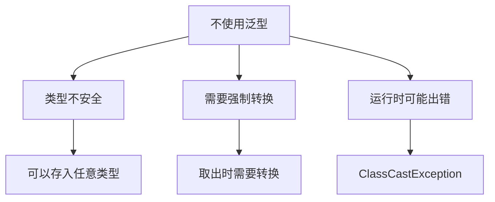
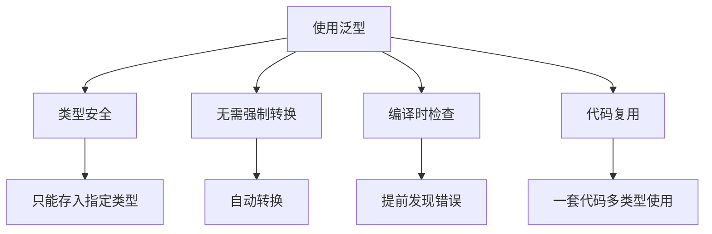
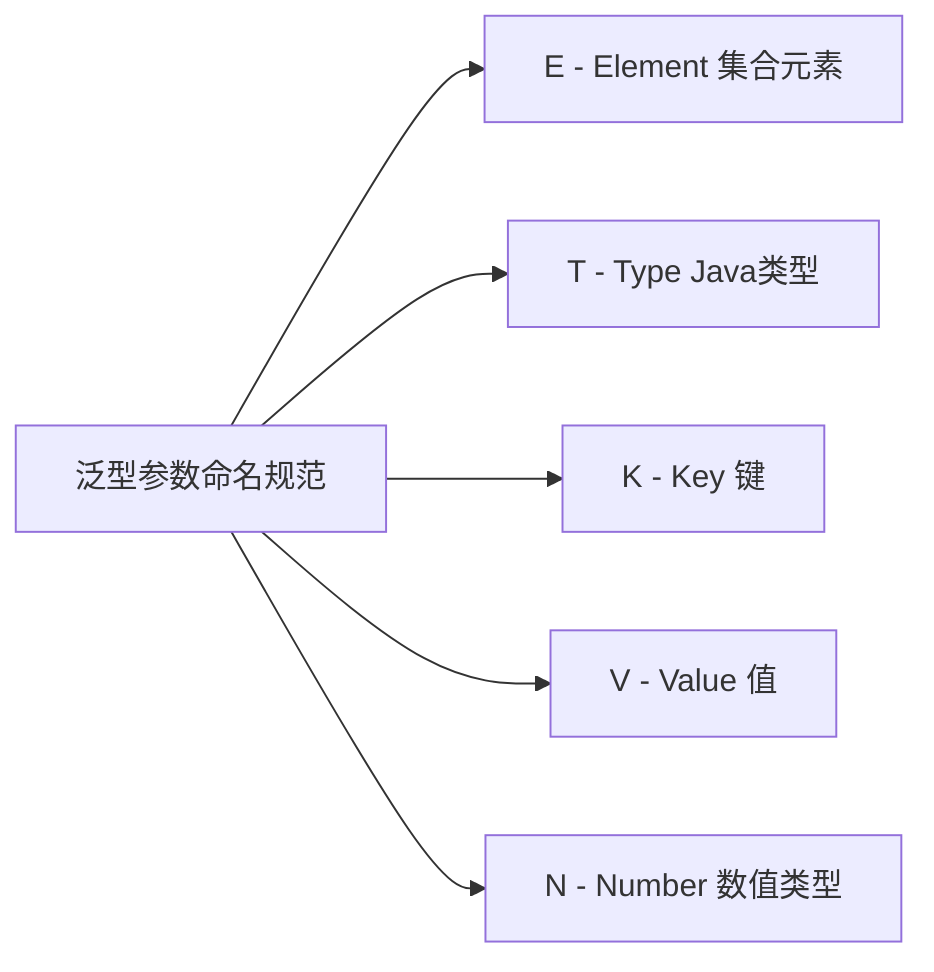
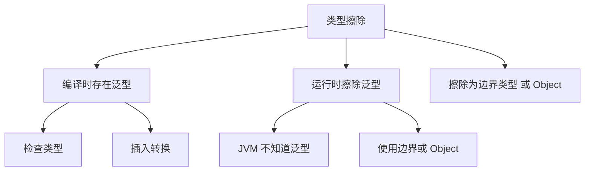
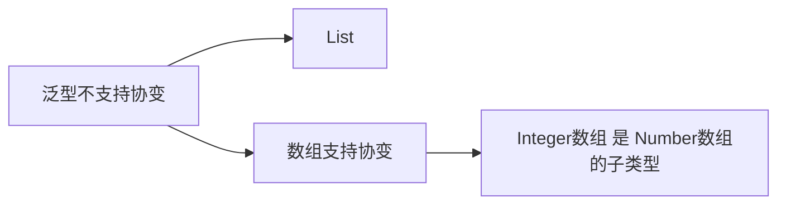

# 泛型概述

泛型（Generics）是 Java 5 引入的重要特性，允许在定义类、接口和方法时使用类型参数，从而编写更加通用和类型安全的代码。

## 为什么需要泛型

### 没有泛型的问题



```java
import java.util.ArrayList;
import java.util.List;

public class WithoutGeneric {
    public static void main(String[] args) {
        // 不使用泛型（旧版本）
        List list = new ArrayList();
        
        // 问题1：可以存入任意类型
        list.add("Hello");
        list.add(123);
        list.add(true);
        
        // 问题2：取出时需要强制转换
        String str = (String) list.get(0);
        
        // 问题3：运行时可能出错
        // String num = (String) list.get(1);  // ❌ ClassCastException
        
        // 遍历时需要转换
        for (Object obj : list) {
            if (obj instanceof String) {
                String s = (String) obj;
                System.out.println(s);
            }
        }
    }
}
```

### 使用泛型的好处



```java
import java.util.ArrayList;
import java.util.List;

public class WithGeneric {
    public static void main(String[] args) {
        // 使用泛型
        List<String> list = new ArrayList<>();
        
        // 好处1：类型安全，只能存入 String
        list.add("Hello");
        // list.add(123);  // ❌ 编译错误
        // list.add(true); // ❌ 编译错误
        
        // 好处2：无需强制转换
        String str = list.get(0);
        
        // 好处3：编译时检查
        for (String s : list) {
            System.out.println(s);
        }
        
        // 好处4：代码复用
        List<Integer> intList = new ArrayList<>();
        List<Double> doubleList = new ArrayList<>();
        // 同一套 List 代码，适用于不同类型
    }
}
```

::: tip 泛型的核心优势

| 优势 | 说明 | 示例 |
|------|------|------|
| **类型安全** | 编译时检查类型错误 | `List<String>` 只能存字符串 |
| **消除转换** | 无需手动强制转换 | `String s = list.get(0)` |
| **代码复用** | 一套代码适用多种类型 | `List<T>` 适用于所有类型 |
| **潜在性能优化** | 避免装箱/拆箱 | `List<Integer>` 比 `List` 更高效 |

:::

## 泛型类型

### 类型参数命名



**常用命名约定**：

```java
// E - Element（集合元素，广泛使用）
public interface List<E> {
    boolean add(E e);
    E get(int index);
}

// T - Type（Java 类）
public class Box<T> {
    private T value;
    public T get() { return value; }
}

// K - Key（键）
// V - Value（值）
public interface Map<K, V> {
    V get(K key);
    V put(K key, V value);
}

// N - Number（数值）
public class Calculator<N extends Number> {
    public N add(N a, N b) { return null; }
}
```

::: tip 命名建议
- **单个大写字母**：T、E、K、V、N
- **有意义的名称**：虽然可能，但不推荐（如 `Type` 而非 `T`）
- **避免混淆**：不要使用类似集合的名称（如 `List`）
:::

### 多个类型参数

```java
// 两个类型参数
public class Pair<K, V> {
    private K key;
    private V value;
    
    public Pair(K key, V value) {
        this.key = key;
        this.value = value;
    }
    
    public K getKey() { return key; }
    public V getValue() { return value; }
    
    public void setKey(K key) { this.key = key; }
    public void setValue(V value) { this.value = value; }
}

// 三个类型参数
public class Triple<A, B, C> {
    private A first;
    private B second;
    private C third;
    
    public Triple(A first, B second, C third) {
        this.first = first;
        this.second = second;
        this.third = third;
    }
    
    public A getFirst() { return first; }
    public B getSecond() { return second; }
    public C getThird() { return third; }
}

// 使用
public class MultiTypeDemo {
    public static void main(String[] args) {
        Pair<String, Integer> pair = new Pair<>("年龄", 18);
        System.out.println(pair.getKey() + ": " + pair.getValue());
        
        Triple<String, Integer, Double> triple = 
            new Triple<>("数据", 100, 99.9);
        System.out.println(triple.getFirst());
        System.out.println(triple.getSecond());
        System.out.println(triple.getThird());
    }
}
```

## 类型擦除

### 什么是类型擦除



**类型擦除**：Java 的泛型是**编译时特性**，运行时会擦除泛型信息。

### 类型擦除示例

```java
import java.util.List;

public class TypeErasure {
    public static void main(String[] args) {
        // 编译时
        List<String> stringList = new ArrayList<>();
        List<Integer> intList = new ArrayList<>();
        
        // 运行时：泛型被擦除，都是 List
        // 检查类型：两者是同一个类
        System.out.println(stringList.getClass() == intList.getClass());  // true
        System.out.println(stringList.getClass().getName());  // java.util.ArrayList
        System.out.println(intList.getClass().getName());     // java.util.ArrayList
    }
}

// 泛型类编译后的样子
class Box<T> {
    private T value;  // 擦除后：private Object value
    
    public T get() {  // 擦除后：public Object get()
        return value;
    }
}

// 有边界的泛型
class NumberBox<T extends Number> {
    private T value;  // 擦除后：private Number value
    
    public T get() {  // 擦除后：public Number get()
        return value;
    }
}
```

### 类型擦除的限制

```java
import java.util.List;

public class ErasureLimitations {
    // ❌ 不能实例化类型参数
    public static <T> void create() {
        // T t = new T();  // 编译错误：无法实例化类型参数
    }
    
    // ❌ 不能创建类型参数的数组
    public static <T> void array() {
        // T[] array = new T[10];  // 编译错误：无法创建类型参数数组
    }
    
    // ❌ 不能声明类型参数的静态字段
    class MyClass<T> {
        // private static T value;  // 编译错误：静态字段不能是类型参数
    }
    
    // ❌ 不能使用 instanceof 检查泛型类型
    public static void check(Object obj) {
        // if (obj instanceof List<String>) { }  // 编译错误
        if (obj instanceof List<?>) {  // ✅ 只能使用通配符
            System.out.println("是 List");
        }
    }
    
    // ❌ 不能创建参数化类型的数组
    public static void arrayCreation() {
        // List<String>[] lists = new List<String>[10];  // 编译错误
        List<?>[] lists = new List<?>[10];  // ✅ 可以使用通配符
    }
    
    // ✅ 可以使用类型参数声明异常
    public static <T extends Exception> void throwException() throws T {
        try {
            // ...
        } catch (Exception e) {
            // 可以抛出 T 类型的异常
        }
        return null;
    }
}
```

::: tip 类型擦除的影响

1. **运行时不知道泛型类型**：`List<String>` 和 `List<Integer>` 在运行时都是 `List`
2. **不能使用 instanceof**：无法检查 `obj instanceof List<String>`
3. **不能创建泛型数组**：`new T[10]` 或 `new List<String>[10]` 都不行
4. **静态上下文不能使用类型参数**：静态字段、静态方法不能使用类的类型参数

:::

## 泛型与继承

### 泛型类型不支持协变



```java
import java.util.ArrayList;
import java.util.List;

public class GenericInheritance {
    public static void main(String[] args) {
        // 数组支持协变
        Integer[] intArray = new Integer[10];
        Number[] numberArray = intArray;  // ✅ 编译通过
        
        // 泛型不支持协变
        List<Integer> intList = new ArrayList<>();
        // List<Number> numberList = intList;  // ❌ 编译错误
        
        // 为什么？看下面的例子
        List<Integer> integers = new ArrayList<>();
        integers.add(100);
        
        // 假设可以赋值
        List<Number> numbers = integers;  // ❌ 实际上不允许
        // numbers.add(3.14);  // 如果允许，这里就可以添加 Double
        // Integer i = integers.get(0);  // 取出时就是 Double，类型错误！
        
        // 正确的方式
        List<? extends Number> wildcardList = integers;  // ✅ 使用通配符
    }
}
```

### 泛型类继承

```java
// 泛型类可以继承
public class Box<T> {
    private T value;
    public T get() { return value; }
    public void set(T value) { this.value = value; }
}

// 子类保留泛型
class StringBox extends Box<String> {
    // 父类的 T 被 String 替换
    public void print() {
        System.out.println("String: " + get());
    }
}

// 子类仍然是泛型
class SmartBox<T> extends Box<T> {
    public void printType() {
        System.out.println("Type: " + get().getClass().getSimpleName());
    }
}

// 子类指定父类的类型参数
class IntegerBox extends Box<Integer> {
    public void increment() {
        set(get() + 1);
    }
}

// 使用
public class GenericClassInheritance {
    public static void main(String[] args) {
        StringBox sb = new StringBox();
        sb.set("Hello");
        sb.print();
        
        SmartBox<Double> smartBox = new SmartBox<>();
        smartBox.set(3.14);
        smartBox.printType();
        
        IntegerBox ib = new IntegerBox();
        ib.set(10);
        ib.increment();
        System.out.println(ib.get());  // 11
    }
}
```

### 泛型接口实现

```java
// 泛型接口
public interface Comparator<T> {
    int compare(T o1, T o2);
}

// 实现泛型接口
class StringComparator implements Comparator<String> {
    @Override
    public int compare(String o1, String o2) {
        return o1.compareTo(o2);
    }
}

// 仍然是泛型的实现类
class ReverseComparator<T extends Comparable<T>> implements Comparator<T> {
    @Override
    public int compare(T o1, T o2) {
        return o2.compareTo(o1);  // 反向比较
    }
}

// 使用
public class GenericInterface {
    public static void main(String[] args) {
        StringComparator sc = new StringComparator();
        System.out.println(sc.compare("A", "B"));  // -1
        
        ReverseComparator<Integer> rc = new ReverseComparator<>();
        System.out.println(rc.compare(10, 20));  // 1（反向）
    }
}
```

## 常用泛型类

### Java 集合框架中的泛型

```java
import java.util.*;

// List - 列表
List<String> list = new ArrayList<>();
list.add("Hello");
String s = list.get(0);

// Set - 集合
Set<Integer> set = new HashSet<>();
set.add(100);
set.add(200);

// Map - 映射
Map<String, Integer> map = new HashMap<>();
map.put("年龄", 18);
map.put("分数", 95);
Integer age = map.get("年龄");

// Queue - 队列
Queue<Double> queue = new LinkedList<>();
queue.offer(1.1);
queue.offer(2.2);
Double d = queue.poll();
```

### 自定义泛型类

```java
// 简单泛型类
public class Container<T> {
    private T item;
    
    public Container(T item) {
        this.item = item;
    }
    
    public T getItem() {
        return item;
    }
    
    public void setItem(T item) {
        this.item = item;
    }
}

// 使用
Container<String> stringContainer = new Container<>("Hello");
Container<Integer> intContainer = new Container<>(100);
```

```java
// 结果类（常用于返回多个值）
public class Result<T, E> {
    private T data;
    private E error;
    private boolean success;
    
    public static <T, E> Result<T, E> success(T data) {
        Result<T, E> result = new Result<>();
        result.data = data;
        result.success = true;
        return result;
    }
    
    public static <T, E> Result<T, E> error(E error) {
        Result<T, E> result = new Result<>();
        result.error = error;
        result.success = false;
        return result;
    }
    
    public boolean isSuccess() { return success; }
    public T getData() { return data; }
    public E getError() { return error; }
}

// 使用
public class ResultDemo {
    public static void main(String[] args) {
        Result<String, String> r1 = Result.success("成功的数据");
        Result<String, String> r2 = Result.error("出错了");
        
        if (r1.isSuccess()) {
            System.out.println(r1.getData());
        } else {
            System.out.println(r1.getError());
        }
    }
}
```

## 小结

::: tip 核心要点

1. **泛型目的**：类型安全、消除强制转换、代码复用
2. **类型参数**：使用 `<T>` 语法，常用 E、T、K、V、N 命名
3. **类型擦除**：Java 泛型是编译时特性，运行时擦除为边界或 Object
4. **不支持协变**：`List<Integer>` 不是 `List<Number>` 的子类型
5. **继承关系**：泛型类可以继承，泛型接口可以实现

:::

::: warning 注意事项

1. **基本类型不能作为类型参数**：使用包装类 `List<Integer>` 而非 `List<int>`
2. **不能实例化类型参数**：`new T()` 是不合法的
3. **静态成员不能使用类型参数**：静态字段和静态方法不能使用类的 T
4. **运行时无法获取泛型类型**：因为类型擦除，使用通配符 `<?>` 或反射

:::

::: info 下一步
- [泛型详解](/java/base/09-generic-reflection/generic-detail.md) - 学习泛型类、接口、方法
:::
