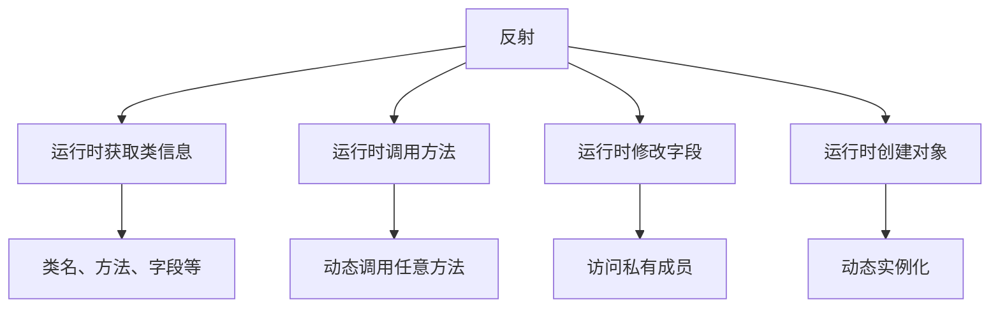
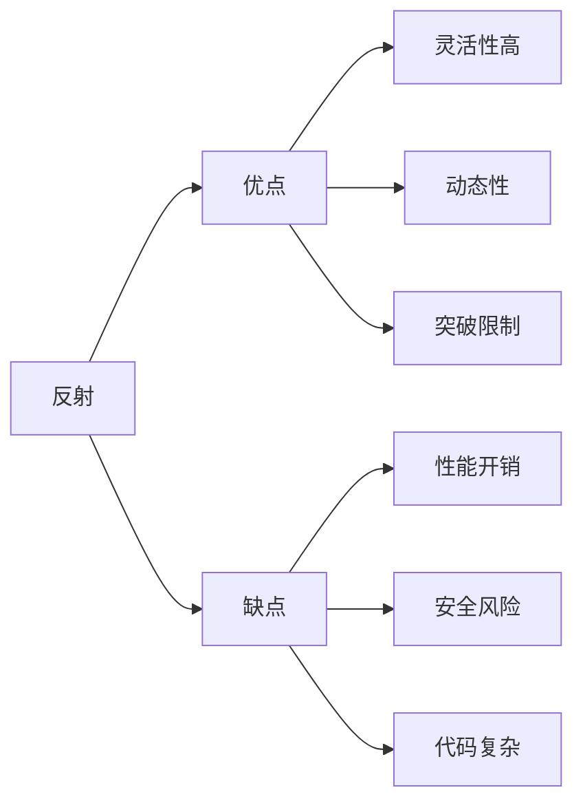
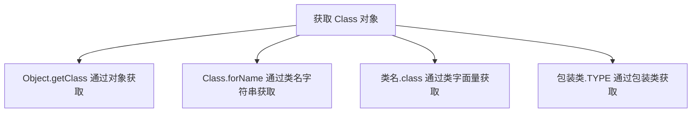
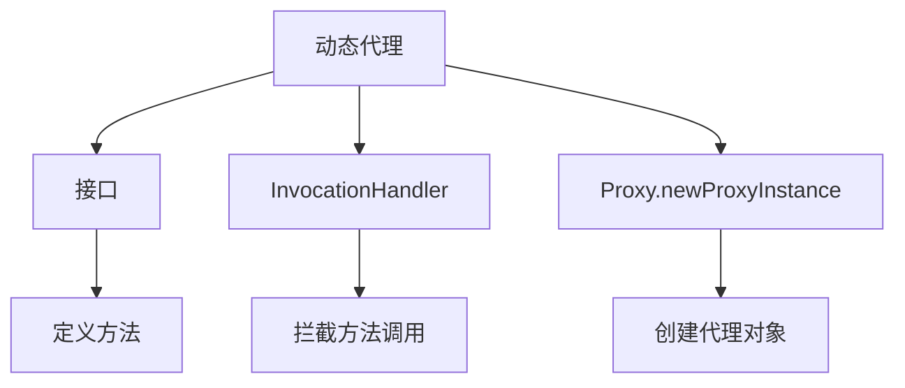

# 反射

反射（Reflection）是 Java 的一种强大机制，允许程序在**运行时**检查和修改类、方法、字段等的行为。反射被称为"动态语言的伪动态特性"。

## 反射概述

### 什么是反射



**反射的核心**：
- 在**运行时**而不是编译时操作类
- 可以访问类的**私有成员**
- 可以**动态调用**方法
- 可以**动态创建**对象

### 反射的优缺点



| 特性 | 说明 |
|------|------|
| **优点** | 灵活性高、可以在运行时动态操作、可以访问私有成员 |
| **缺点** | 性能开销大、破坏封装性、代码可读性差、可能存在安全风险 |

::: tip 反射的应用场景

1. **框架开发**：Spring、MyBatis、Hibernate 等框架大量使用反射
2. **动态代理**：JDK 动态代理、AOP 实现
3. **注解处理**：读取和处理自定义注解
4. **序列化/反序列化**：JSON、XML 转换
5. **插件系统**：动态加载和调用插件

:::

## Class 对象

### 获取 Class 对象



```java
import java.util.Date;

public class GetClassObject {
    public static void main(String[] args) throws ClassNotFoundException {
        // 方式1：通过对象获取（已知对象）
        Date date = new Date();
        Class<?> cls1 = date.getClass();
        System.out.println(cls1);  // class java.util.Date
        
        // 方式2：通过类名（已知类名，最常用）
        Class<?> cls2 = Date.class;
        System.out.println(cls2);  // class java.util.Date
        
        // 方式3：通过 Class.forName（类名字符串）
        Class<?> cls3 = Class.forName("java.util.Date");
        System.out.println(cls3);  // class java.util.Date
        
        // 方式4：基本类型的包装类.TYPE
        Class<?> cls4 = Integer.TYPE;
        System.out.println(cls4);  // int
        
        Class<?> cls5 = Double.TYPE;
        System.out.println(cls5);  // double
        
        // 验证：都是同一个 Class 对象
        System.out.println(cls1 == cls2);  // true
        System.out.println(cls2 == cls3);  // true
    }
}
```

### Class 对象的常用方法

```java
import java.lang.reflect.Constructor;
import java.lang.reflect.Field;
import java.lang.reflect.Method;
import java.lang.reflect.Modifier;

public class ClassMethods {
    public static void main(String[] args) throws ClassNotFoundException {
        Class<?> cls = Class.forName("java.util.ArrayList");
        
        // 获取类名
        System.out.println("类名: " + cls.getName());           // 完全限定名
        System.out.println("简单名: " + cls.getSimpleName());    // 简单类名
        System.out.println("包名: " + cls.getPackage().getName()); // 包名
        
        // 获取修饰符
        int modifiers = cls.getModifiers();
        System.out.println("修饰符: " + Modifier.toString(modifiers));
        
        // 获取父类
        Class<?> superClass = cls.getSuperclass();
        System.out.println("父类: " + superClass);
        
        // 获取接口
        Class<?>[] interfaces = cls.getInterfaces();
        System.out.println("实现的接口:");
        for (Class<?> iface : interfaces) {
            System.out.println("  - " + iface.getSimpleName());
        }
        
        // 获取构造器
        Constructor<?>[] constructors = cls.getConstructors();
        System.out.println("构造器:");
        for (Constructor<?> c : constructors) {
            System.out.println("  - " + c);
        }
        
        // 获取方法
        Method[] methods = cls.getMethods();  // 获取所有 public 方法（包括继承的）
        System.out.println("public 方法数量: " + methods.length);
        
        Method[] declaredMethods = cls.getDeclaredMethods();  // 获取所有方法（包括私有的）
        System.out.println("所有方法数量: " + declaredMethods.length);
        
        // 获取字段
        Field[] fields = cls.getFields();  // 获取所有 public 字段
        System.out.println("public 字段数量: " + fields.length);
        
        Field[] declaredFields = cls.getDeclaredFields();  // 获取所有字段（包括私有的）
        System.out.println("所有字段数量: " + declaredFields.length);
        
        // 判断类型
        System.out.println("是接口: " + cls.isInterface());
        System.out.println("是数组: " + cls.isArray());
        System.out.println("是注解: " + cls.isAnnotation());
        System.out.println("是枚举: " + cls.isEnum());
        System.out.println("是基本类型: " + cls.isPrimitive());
    }
}
```

## 反射操作

### 创建对象

```java
import java.lang.reflect.Constructor;

class Person {
    private String name;
    private int age;
    
    // 无参构造器
    public Person() {
        this.name = "Unknown";
        this.age = 0;
    }
    
    // 有参构造器
    public Person(String name, int age) {
        this.name = name;
        this.age = age;
    }
    
    @Override
    public String toString() {
        return "Person{name='" + name + "', age=" + age + "}";
    }
}

public class CreateInstance {
    public static void main(String[] args) throws Exception {
        Class<?> cls = Person.class;
        
        // 方式1：使用 Class.newInstance()（调用无参构造器）
        @SuppressWarnings("deprecation")
        Person p1 = (Person) cls.newInstance();
        System.out.println(p1);  // Person{name='Unknown', age=0}
        
        // 方式2：使用 Constructor.newInstance()
        // 调用无参构造器
        Constructor<?> constructor1 = cls.getConstructor();
        Person p2 = (Person) constructor1.newInstance();
        System.out.println(p2);  // Person{name='Unknown', age=0}
        
        // 调用有参构造器
        Constructor<?> constructor2 = cls.getConstructor(String.class, int.class);
        Person p3 = (Person) constructor2.newInstance("张三", 20);
        System.out.println(p3);  // Person{name='张三', age=20}
        
        // 调用私有构造器
        Constructor<?> constructor3 = cls.getDeclaredConstructor();
        constructor3.setAccessible(true);  // 暴力反射
        Person p4 = (Person) constructor3.newInstance();
        System.out.println(p4);
    }
}
```

### 访问字段

```java
import java.lang.reflect.Field;

class Student {
    private String name;
    private int age;
    public String school;
    
    public Student(String name, int age) {
        this.name = name;
        this.age = age;
        this.school = "清华大学";
    }
    
    @Override
    public String toString() {
        return "Student{name='" + name + "', age=" + age + ", school='" + school + "'}";
    }
}

public class AccessField {
    public static void main(String[] args) throws Exception {
        Student student = new Student("张三", 20);
        Class<?> cls = student.getClass();
        
        // 访问 public 字段
        Field schoolField = cls.getField("school");
        System.out.println("school: " + schoolField.get(student));  // 清华大学
        
        // 修改 public 字段
        schoolField.set(student, "北京大学");
        System.out.println(student);  // Student{..., school='北京大学'}
        
        // 访问 private 字段
        Field nameField = cls.getDeclaredField("name");
        nameField.setAccessible(true);  // 暴力反射
        System.out.println("name: " + nameField.get(student));  // 张三
        
        // 修改 private 字段
        nameField.set(student, "李四");
        System.out.println(student);  // Student{name='李四', ...}
        
        // 访问 private 字段
        Field ageField = cls.getDeclaredField("age");
        ageField.setAccessible(true);
        System.out.println("age: " + ageField.getInt(student));  // 20
        
        // 修改 private 字段
        ageField.setInt(student, 22);
        System.out.println(student);  // Student{..., age=22, ...}
        
        // 静态字段
        Field staticField = cls.getDeclaredField("school");
        staticField.setAccessible(true);
        staticField.set(null, "复旦大学");  // 静态字段，对象传 null
        System.out.println(student);  // school='复旦大学'
    }
}
```

### 调用方法

```java
import java.lang.reflect.Method;

class Calculator {
    public int add(int a, int b) {
        return a + b;
    }
    
    private int subtract(int a, int b) {
        return a - b;
    }
    
    public static double multiply(double a, double b) {
        return a * b;
    }
    
    private static void print(String message) {
        System.out.println("打印: " + message);
    }
}

public class InvokeMethod {
    public static void main(String[] args) throws Exception {
        Calculator calc = new Calculator();
        Class<?> cls = calc.getClass();
        
        // 调用 public 方法
        Method addMethod = cls.getMethod("add", int.class, int.class);
        int result = (int) addMethod.invoke(calc, 10, 20);
        System.out.println("add(10, 20) = " + result);  // 30
        
        // 调用 private 方法
        Method subtractMethod = cls.getDeclaredMethod("subtract", int.class, int.class);
        subtractMethod.setAccessible(true);
        int result2 = (int) subtractMethod.invoke(calc, 20, 10);
        System.out.println("subtract(20, 10) = " + result2);  // 10
        
        // 调用静态方法
        Method multiplyMethod = cls.getMethod("multiply", double.class, double.class);
        double result3 = (double) multiplyMethod.invoke(null, 3.0, 4.0);
        System.out.println("multiply(3.0, 4.0) = " + result3);  // 12.0
        
        // 调用 private 静态方法
        Method printMethod = cls.getDeclaredMethod("print", String.class);
        printMethod.setAccessible(true);
        printMethod.invoke(null, "Hello Reflection");  // 打印: Hello Reflection
    }
}
```

### 操作数组

```java
import java.lang.reflect.Array;

public class ArrayReflection {
    public static void main(String[] args) {
        // 创建数组
        int[] arr = (int[]) Array.newInstance(int.class, 5);
        
        // 设置数组元素
        Array.set(arr, 0, 10);
        Array.set(arr, 1, 20);
        Array.setInt(arr, 2, 30);
        
        // 获取数组元素
        int val1 = Array.getInt(arr, 0);
        int val2 = (int) Array.get(arr, 1);
        System.out.println(val1);  // 10
        System.out.println(val2);  // 20
        
        // 获取数组长度
        int length = Array.getLength(arr);
        System.out.println("长度: " + length);  // 5
        
        // 遍历数组
        for (int i = 0; i < length; i++) {
            System.out.println("arr[" + i + "] = " + Array.getInt(arr, i));
        }
    }
}
```

## 动态代理

### JDK 动态代理



```java
import java.lang.reflect.InvocationHandler;
import java.lang.reflect.Method;
import java.lang.reflect.Proxy;

// 接口
interface UserService {
    void login(String username);
    void logout();
}

// 实现类
class UserServiceImpl implements UserService {
    @Override
    public void login(String username) {
        System.out.println("用户登录: " + username);
    }
    
    @Override
    public void logout() {
        System.out.println("用户登出");
    }
}

// 代理处理器
class LogHandler implements InvocationHandler {
    private Object target;  // 被代理对象
    
    public LogHandler(Object target) {
        this.target = target;
    }
    
    @Override
    public Object invoke(Object proxy, Method method, Object[] args) throws Throwable {
        // 前置增强
        System.out.println(">>> 方法调用前: " + method.getName());
        
        // 调用目标方法
        Object result = method.invoke(target, args);
        
        // 后置增强
        System.out.println("<<< 方法调用后: " + method.getName());
        
        return result;
    }
}

// 使用
public class DynamicProxy {
    public static void main(String[] args) {
        // 目标对象
        UserService target = new UserServiceImpl();
        
        // 创建代理对象
        UserService proxy = (UserService) Proxy.newProxyInstance(
            target.getClass().getClassLoader(),     // 类加载器
            target.getClass().getInterfaces(),      // 实现的接口
            new LogHandler(target)                   // 代理处理器
        );
        
        // 通过代理调用方法
        proxy.login("张三");
        System.out.println("---");
        proxy.logout();
    }
}
```

**输出**：
```
>>> 方法调用前: login
用户登录: 张三
<<< 方法调用后: login
---
>>> 方法调用前: logout
用户登出
<<< 方法调用后: logout
```

### 动态代理应用

```java
import java.lang.reflect.InvocationHandler;
import java.lang.reflect.Method;
import java.lang.reflect.Proxy;
import java.util.HashMap;
import java.util.Map;

// 计算接口
interface Calculator {
    int add(int a, int b);
    int subtract(int a, int b);
}

// 缓存代理处理器
class CachingHandler implements InvocationHandler {
    private Object target;
    private Map<String, Integer> cache = new HashMap<>();
    
    public CachingHandler(Object target) {
        this.target = target;
    }
    
    @Override
    public Object invoke(Object proxy, Method method, Object[] args) throws Throwable {
        // 生成缓存键
        String key = method.getName() + "(" + args[0] + ", " + args[1] + ")";
        
        // 检查缓存
        if (cache.containsKey(key)) {
            System.out.println("从缓存获取: " + key);
            return cache.get(key);
        }
        
        // 调用目标方法
        Object result = method.invoke(target, args);
        
        // 存入缓存
        cache.put(key, (Integer) result);
        System.out.println("计算并缓存: " + key);
        
        return result;
    }
}

// 计算器实现
class CalculatorImpl implements Calculator {
    @Override
    public int add(int a, int b) {
        return a + b;
    }
    
    @Override
    public int subtract(int a, int b) {
        return a - b;
    }
}

// 使用
public class CachingProxy {
    public static void main(String[] args) {
        Calculator target = new CalculatorImpl();
        
        Calculator proxy = (Calculator) Proxy.newProxyInstance(
            target.getClass().getClassLoader(),
            target.getClass().getInterfaces(),
            new CachingHandler(target)
        );
        
        System.out.println("结果: " + proxy.add(10, 20));  // 计算
        System.out.println("结果: " + proxy.add(10, 20));  // 从缓存
        System.out.println("结果: " + proxy.subtract(20, 5));  // 计算
        System.out.println("结果: " + proxy.subtract(20, 5));  // 从缓存
    }
}
```

## 反射与泛型

### 获取泛型信息

```java
import java.lang.reflect.Field;
import java.lang.reflect.Method;
import java.lang.reflect.ParameterizedType;
import java.lang.reflect.Type;
import java.util.List;
import java.util.Map;

class GenericClass {
    private List<String> stringList;
    private Map<String, Integer> stringIntMap;
    
    public void setList(List<String> list) { }
    public Map<String, Integer> getMap() { return null; }
}

public class GenericReflection {
    public static void main(String[] args) throws Exception {
        Class<?> cls = GenericClass.class;
        
        // 获取字段的泛型类型
        Field field1 = cls.getDeclaredField("stringList");
        Type genericType1 = field1.getGenericType();
        System.out.println("字段泛型类型: " + genericType1);
        
        if (genericType1 instanceof ParameterizedType) {
            ParameterizedType pType = (ParameterizedType) genericType1;
            Type[] actualTypes = pType.getActualTypeArguments();
            System.out.println("实际类型参数: ");
            for (Type type : actualTypes) {
                System.out.println("  - " + type);
            }
        }
        
        // 获取方法返回值的泛型类型
        Method method = cls.getMethod("getMap");
        Type genericType2 = method.getGenericReturnType();
        System.out.println("\n方法返回值泛型类型: " + genericType2);
        
        if (genericType2 instanceof ParameterizedType) {
            ParameterizedType pType = (ParameterizedType) genericType2;
            Type[] actualTypes = pType.getActualTypeArguments();
            System.out.println("实际类型参数: ");
            for (Type type : actualTypes) {
                System.out.println("  - " + type);
            }
        }
    }
}
```

**输出**：
```
字段泛型类型: java.util.List<java.lang.String>
实际类型参数: 
  - class java.lang.String

方法返回值泛型类型: java.util.Map<java.lang.String, java.lang.Integer>
实际类型参数: 
  - class java.lang.String
  - class java.lang.Integer
```

## 反射的性能

### 反射 vs 直接调用

```java
import java.lang.reflect.Method;

public class ReflectionPerformance {
    public static void main(String[] args) throws Exception {
        int iterations = 10000000;
        
        // 目标对象
        Calculator calc = new Calculator();
        
        // 直接调用
        long start1 = System.nanoTime();
        for (int i = 0; i < iterations; i++) {
            calc.add(10, 20);
        }
        long end1 = System.nanoTime();
        System.out.println("直接调用: " + (end1 - start1) / 1000000 + " ms");
        
        // 反射调用（每次获取 Method）
        long start2 = System.nanoTime();
        for (int i = 0; i < iterations; i++) {
            Method method = Calculator.class.getMethod("add", int.class, int.class);
            method.invoke(calc, 10, 20);
        }
        long end2 = System.nanoTime();
        System.out.println("反射调用（每次获取 Method）: " + (end2 - start2) / 1000000 + " ms");
        
        // 反射调用（缓存 Method）
        Method method = Calculator.class.getMethod("add", int.class, int.class);
        long start3 = System.nanoTime();
        for (int i = 0; i < iterations; i++) {
            method.invoke(calc, 10, 20);
        }
        long end3 = System.nanoTime();
        System.out.println("反射调用（缓存 Method）: " + (end3 - start3) / 1000000 + " ms");
    }
    
    static class Calculator {
        public int add(int a, int b) {
            return a + b;
        }
    }
}
```

::: tip 反射性能优化

1. **缓存 Method 对象**：避免每次调用都获取 Method
2. **使用 setAccessible**：关闭安全检查，提高性能
3. **避免过度使用**：反射性能较差，能不用就不用
4. **使用编译时生成代码**：如注解处理器

:::

## 小结

::: tip 核心要点

1. **反射机制**：在运行时检查和修改类、方法、字段等
2. **Class 对象**：通过 getClass()、.class、Class.forName() 获取
3. **反射操作**：
   - 创建对象：Class.newInstance() 或 Constructor.newInstance()
   - 访问字段：Field.get() / Field.set()
   - 调用方法：Method.invoke()
4. **动态代理**：Proxy.newProxyInstance() + InvocationHandler
5. **泛型反射**：通过 ParameterizedType 获取泛型实际类型
6. **性能考虑**：反射性能较差，应缓存 Method 对象

:::

::: warning 注意事项

1. **破坏封装性**：可以访问 private 成员
2. **性能开销**：反射比直接调用慢很多
3. **安全风险**：可能被恶意代码利用
4. **代码复杂**：反射代码难以理解和维护

:::

::: info 延伸学习

- **注解**：[注解详解](/java/base/08-common-api/annotation.md)
- **动态代理**：Spring AOP、Retrofit 等框架的核心
- **序列化**：Gson、Jackson 使用反序列化

:::
