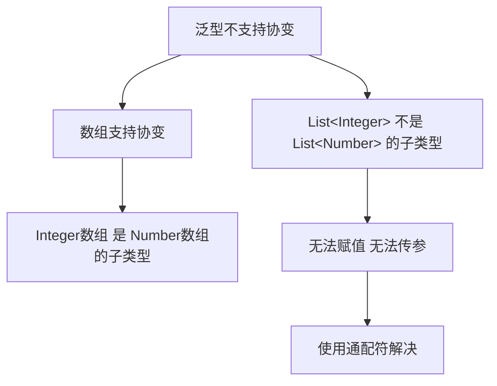
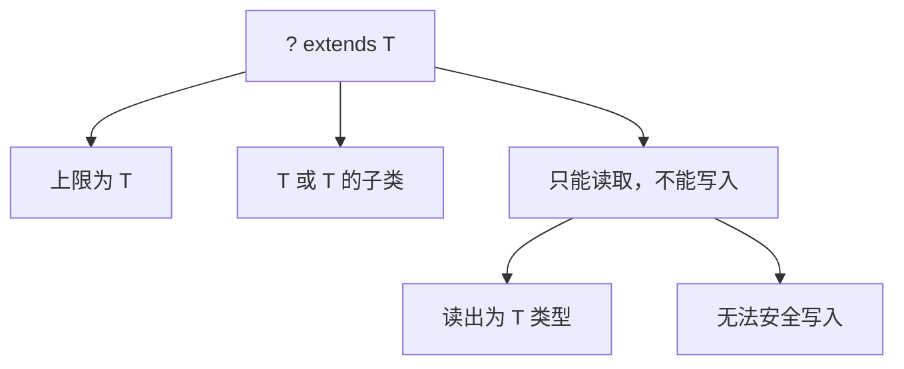
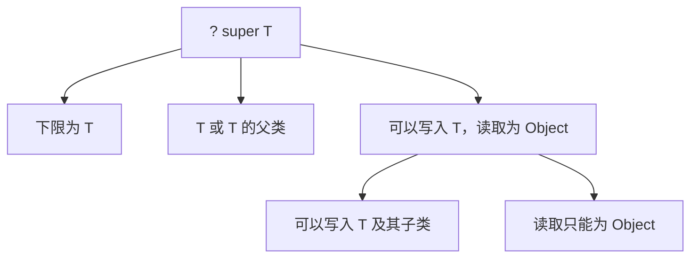
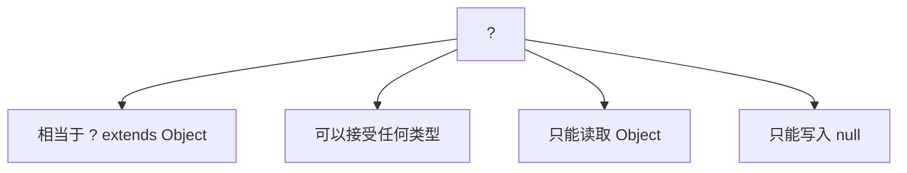
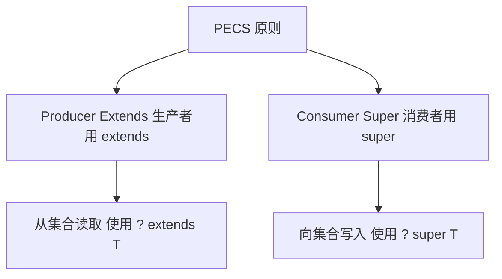

# 通配符

通配符（Wildcard）是 Java 泛型中的一种特殊语法，用 `?` 表示未知类型。通配符可以让泛型更加灵活，解决一些泛型类型无法协变的问题。

## 为什么需要通配符

### 泛型不支持协变



```java
import java.util.ArrayList;
import java.util.List;

public class WithoutWildcard {
    public static void main(String[] args) {
        List<Integer> intList = new ArrayList<>();
        intList.add(1);
        intList.add(2);
        intList.add(3);
        
        // ❌ 无法赋值：泛型不支持协变
        // List<Number> numberList = intList;
        
        // ❌ 无法传参：泛型不支持协变
        // printList(intList);
    }
    
    // 接受 List<Number> 的方法
    public static void printList(List<Number> list) {
        for (Number num : list) {
            System.out.println(num);
        }
    }
}
```

### 使用通配符解决问题

```java
import java.util.ArrayList;
import java.util.List;

public class WithWildcard {
    public static void main(String[] args) {
        List<Integer> intList = new ArrayList<>();
        intList.add(1);
        intList.add(2);
        
        List<Double> doubleList = new ArrayList<>();
        doubleList.add(1.5);
        doubleList.add(2.5);
        
        // ✅ 可以传参：使用通配符
        printList(intList);     // Integer 是 Number 的子类
        printList(doubleList);  // Double 是 Number 的子类
    }
    
    // 使用通配符：List<?> 可以接受任何类型的 List
    public static void printList(List<?> list) {
        for (Object obj : list) {
            System.out.println(obj);
        }
    }
}
```

## 上界通配符 ? extends

### 基本用法



```java
import java.util.ArrayList;
import java.util.List;

public class UpperBoundedWildcard {
    public static void main(String[] args) {
        List<Integer> intList = new ArrayList<>();
        intList.add(100);
        intList.add(200);
        
        List<Double> doubleList = new ArrayList<>();
        doubleList.add(3.14);
        doubleList.add(2.71);
        
        // ✅ 可以传参
        printNumbers(intList);     // Integer extends Number
        printNumbers(doubleList);  // Double extends Number
        
        // ❌ String 不是 Number 的子类
        // List<String> strList = new ArrayList<>();
        // printNumbers(strList);
    }
    
    // 上界通配符：只能接受 Number 及其子类
    public static void printNumbers(List<? extends Number> list) {
        // ✅ 可以读取：读取为 Number 类型
        for (Number num : list) {
            System.out.println(num.doubleValue());
        }
        
        // ❌ 不能写入：编译错误
        // list.add(100);       // 不知道具体类型，无法安全添加
        // list.add(3.14);      // 编译错误
        
        // ✅ 只能添加 null
        list.add(null);
    }
}
```

::: tip 上界通配符的特点

1. **可以读取**：读取的数据类型是上界类型（Number）
2. **不能写入**：无法确定具体类型，不能安全添加元素（null 除外）
3. **适用于生产者**：从集合中读取数据，称为 "Producer Extends"

:::

### 上界通配符示例

```java
import java.util.List;

public class UpperBoundedExamples {
    // 计算列表总和
    public static double sum(List<? extends Number> list) {
        double sum = 0;
        for (Number num : list) {
            sum += num.doubleValue();
        }
        return sum;
    }
    
    // 获取最大值
    public static <T extends Comparable<? super T>> T max(List<? extends T> list) {
        if (list == null || list.isEmpty()) {
            return null;
        }
        
        T max = list.get(0);
        for (T item : list) {
            if (item.compareTo(max) > 0) {
                max = item;
            }
        }
        return max;
    }
    
    // 复制列表
    public static <T> List<T> copy(List<? extends T> source, List<? super T> dest) {
        List<T> result = new ArrayList<>();
        for (T item : source) {
            dest.add(item);
            result.add(item);
        }
        return result;
    }
    
    public static void main(String[] args) {
        List<Integer> ints = List.of(1, 2, 3, 4, 5);
        System.out.println("Sum: " + sum(ints));  // 15.0
        System.out.println("Max: " + max(ints));  // 5
        
        List<Double> doubles = List.of(1.1, 2.2, 3.3);
        System.out.println("Sum: " + sum(doubles));  // 6.6
        System.out.println("Max: " + max(doubles));  // 3.3
    }
}
```

## 下界通配符 ? super

### 基本用法



```java
import java.util.ArrayList;
import java.util.List;

public class LowerBoundedWildcard {
    public static void main(String[] args) {
        List<Number> numberList = new ArrayList<>();
        List<Object> objectList = new ArrayList<>();
        
        // ✅ 可以传参
        addNumbers(numberList);  // Number 是 Integer 的父类
        addNumbers(objectList);  // Object 是 Integer 的父类
        
        // ❌ List<Integer> 不是 Integer 的父类
        // List<Integer> intList = new ArrayList<>();
        // addNumbers(intList);
    }
    
    // 下界通配符：可以接受 Integer 及其父类
    public static void addNumbers(List<? super Integer> list) {
        // ✅ 可以写入：可以添加 Integer 及其子类
        list.add(100);
        list.add(200);
        
        // ❌ 不能读取为特定类型：只能读取为 Object
        // Integer num = list.get(0);  // 编译错误
        Object obj = list.get(0);     // ✅ 只能读取为 Object
        
        System.out.println(obj);
    }
}
```

::: tip 下界通配符的特点

1. **可以写入**：可以添加 T 及其子类
2. **读取受限**：只能读取为 Object 类型
3. **适用于消费者**：向集合中写入数据，称为 "Consumer Super"

:::

### 下界通配符示例

```java
import java.util.ArrayList;
import java.util.List;

public class LowerBoundedExamples {
    // 向列表添加元素
    public static void addAll(List<? super Integer> list, int... values) {
        for (int value : values) {
            list.add(value);
        }
    }
    
    // 将一个列表的元素复制到另一个列表
    public static <T> void copy(List<? super T> dest, List<? extends T> src) {
        for (T item : src) {
            dest.add(item);
        }
    }
    
    public static void main(String[] args) {
        List<Number> numbers = new ArrayList<>();
        addAll(numbers, 1, 2, 3, 4, 5);
        System.out.println(numbers);  // [1, 2, 3, 4, 5]
        
        List<Object> objects = new ArrayList<>();
        addAll(objects, 100, 200);
        System.out.println(objects);  // [100, 200]
        
        // 复制
        List<Integer> ints = List.of(1, 2, 3);
        List<Number> dest = new ArrayList<>();
        copy(dest, ints);
        System.out.println(dest);  // [1, 2, 3]
    }
}
```

## 无界通配符 ?

### 基本用法



```java
import java.util.ArrayList;
import java.util.List;

public class UnboundedWildcard {
    public static void main(String[] args) {
        List<String> strings = new ArrayList<>();
        List<Integer> integers = new ArrayList<>();
        List<Double> doubles = new ArrayList<>();
        
        // ✅ 可以接受任何类型
        printList(strings);
        printList(integers);
        printList(doubles);
        
        // 获取列表大小
        List<String> list = List.of("A", "B", "C");
        System.out.println("Size: " + getSize(list));  // 3
    }
    
    // 无界通配符：可以接受任何类型的 List
    public static void printList(List<?> list) {
        // ✅ 可以读取为 Object
        for (Object obj : list) {
            System.out.println(obj);
        }
        
        // ❌ 不能写入特定类型
        // list.add("Hello");  // 编译错误
        
        // ✅ 只能添加 null
        list.add(null);
    }
    
    // 适用于不关心类型的情况
    public static int getSize(List<?> list) {
        return list.size();
    }
    
    // 清空列表
    public static void clear(List<?> list) {
        list.clear();
    }
}
```

### 无界通配符 vs Object

```java
import java.util.List;

public class UnboundedVsObject {
    // 使用无界通配符
    public static void printList1(List<?> list) {
        for (Object obj : list) {
            System.out.println(obj);
        }
    }
    
    // 使用 Object
    public static void printList2(List<Object> list) {
        for (Object obj : list) {
            System.out.println(obj);
        }
    }
    
    public static void main(String[] args) {
        List<String> strings = List.of("A", "B", "C");
        
        // ✅ List<?> 可以接受任何 List
        printList1(strings);
        
        // ❌ List<Object> 不能接受 List<String>
        // printList2(strings);  // 编译错误
        
        List<Object> objects = List.of(1, "A", 2.5);
        printList2(objects);  // ✅ 可以
    }
}
```

::: tip 何时使用无界通配符

1. **不关心类型**：只是读取或操作列表结构
2. **类型无关的方法**：如 size()、clear() 等
3. **不能写入**：除了 null，不能添加任何元素

:::

## PECS 原则

### PECS: Producer Extends, Consumer Super



**PECS 原则**：
- **Producer Extends**：如果需要从集合中**读取**数据（生产者），使用 `? extends T`
- **Consumer Super**：如果需要向集合中**写入**数据（消费者），使用 `? super T`

### PECS 示例

```java
import java.util.ArrayList;
import java.util.List;

public class PECSExample {
    // Producer：只读取，使用 extends
    public static double sum(List<? extends Number> list) {
        double sum = 0;
        // 只读取，不写入
        for (Number num : list) {
            sum += num.doubleValue();
        }
        return sum;
    }
    
    // Consumer：只写入，使用 super
    public static void addNumbers(List<? super Integer> list) {
        // 只写入，不读取为特定类型
        list.add(1);
        list.add(2);
        list.add(3);
    }
    
    // 既是 Producer 又是 Consumer：不使用通配符
    public static <T> void copy(List<T> dest, List<T> src) {
        for (T item : src) {
            dest.add(item);
        }
    }
    
    // PECS 结合使用
    public static <T> void copyWithPECS(List<? super T> dest, List<? extends T> src) {
        for (T item : src) {  // src 是 Producer，用 extends
            dest.add(item);   // dest 是 Consumer，用 super
        }
    }
    
    public static void main(String[] args) {
        // Producer 示例
        List<Integer> ints = List.of(1, 2, 3, 4, 5);
        System.out.println("Sum: " + sum(ints));  // 15.0
        
        List<Double> doubles = List.of(1.1, 2.2, 3.3);
        System.out.println("Sum: " + sum(doubles));  // 6.6
        
        // Consumer 示例
        List<Number> numbers = new ArrayList<>();
        addNumbers(numbers);
        System.out.println(numbers);  // [1, 2, 3]
        
        // PECS 结合示例
        List<Integer> src = List.of(1, 2, 3);
        List<Number> dest = new ArrayList<>();
        copyWithPECS(dest, src);
        System.out.println(dest);  // [1, 2, 3]
    }
}
```

### PECS 实际应用

```java
import java.util.*;

public class PECSInCollections {
    // Collections.copy 的简化版本
    public static <T> void copy(List<? super T> dest, List<? extends T> src) {
        int srcSize = src.size();
        if (srcSize > dest.size())
            throw new IndexOutOfBoundsException("Source does not fit in dest");
        
        for (int i = 0; i < srcSize; i++) {
            dest.set(i, src.get(i));
        }
    }
    
    // Collections.addAll 的简化版本
    @SafeVarargs
    public static <T> boolean addAll(Collection<? super T> c, T... elements) {
        boolean result = false;
        for (T element : elements)
            result |= c.add(element);
        return result;
    }
    
    public static void main(String[] args) {
        // copy 示例
        List<Integer> src = List.of(1, 2, 3);
        List<Number> dest = new ArrayList<>(Arrays.asList(0, 0, 0, 0, 0));
        copy(dest, src);
        System.out.println(dest);  // [1, 2, 3, 0, 0]
        
        // addAll 示例
        List<Number> numbers = new ArrayList<>();
        addAll(numbers, 1, 2.5, 3L);
        System.out.println(numbers);  // [1, 2.5, 3]
    }
}
```

## 通配符捕获

### 通配符捕获问题

```java
import java.util.ArrayList;
import java.util.List;

public class WildcardCapture {
    // 使用通配符的方法
    public static void swap(List<?> list, int i, int j) {
        // ❌ 编译错误：list.get(i) 返回的是 ?，不能直接赋值给 list 的元素
        // list.set(i, list.set(j, list.get(i)));
        
        // ✅ 使用私有辅助方法捕获通配符
        swapHelper(list, i, j);
    }
    
    // 私有辅助方法：捕获通配符类型
    private static <T> void swapHelper(List<T> list, int i, int j) {
        // 这里 T 是具体的类型，可以安全操作
        list.set(i, list.set(j, list.get(i)));
    }
    
    public static void main(String[] args) {
        List<String> strings = new ArrayList<>(List.of("A", "B", "C"));
        swap(strings, 0, 2);
        System.out.println(strings);  // [C, B, A]
        
        List<Integer> ints = new ArrayList<>(List.of(1, 2, 3));
        swap(ints, 0, 2);
        System.out.println(ints);  // [3, 2, 1]
    }
}
```

::: tip 通配符捕获

当使用通配符时，编译器无法确定具体的类型，因此不能直接进行某些操作。解决方法是**创建一个私有的泛型辅助方法**，让编译器捕获具体的类型。

:::

## 常见问题

### 问题1：何时使用通配符

```java
import java.util.List;

public class WhenToUseWildcard {
    // ❌ 不需要通配符：既读又写
    public static <T> void process1(List<T> list) {
        for (T item : list) {
            System.out.println(item);
        }
        list.add(null);
    }
    
    // ✅ 使用 extends：只读（Producer）
    public static void process2(List<? extends Number> list) {
        for (Number num : list) {
            System.out.println(num.doubleValue());
        }
    }
    
    // ✅ 使用 super：只写（Consumer）
    public static void process3(List<? super Integer> list) {
        list.add(1);
        list.add(2);
    }
    
    // ✅ 使用 ?：不关心类型
    public static int size(List<?> list) {
        return list.size();
    }
}
```

### 问题2：通配符嵌套

```java
import java.util.List;
import java.util.Map;

public class NestedWildcard {
    // List 的元素是 Map，Map 的键是 String，值可以是任何类型
    public void printMapList(List<Map<String, ?>> list) {
        for (Map<String, ?> map : list) {
            System.out.println(map);
        }
    }
    
    // Map 的键是 String，值是 List，List 的元素可以是任何类型
    public void printStringListMap(Map<String, List<?>> map) {
        for (var entry : map.entrySet()) {
            System.out.println(entry.getKey() + ": " + entry.getValue());
        }
    }
    
    public static void main(String[] args) {
        List<Map<String, ?>> list = List.of(
            Map.of("name", "Alice", "age", 20),
            Map.of("name", "Bob", "age", 25)
        );
        
        Map<String, List<?>> map = Map.of(
            "fruits", List.of("Apple", "Banana"),
            "numbers", List.of(1, 2, 3)
        );
    }
}
```

## 小结

::: tip 核心要点

1. **上界通配符 `? extends T`**：
   - 只能读取，不能写入（null 除外）
   - 读取为 T 类型
   - 适用于 Producer（生产者）

2. **下界通配符 `? super T`**：
   - 只能写入 T 及其子类
   - 读取只能为 Object
   - 适用于 Consumer（消费者）

3. **无界通配符 `?`**：
   - 相当于 `? extends Object`
   - 只能读取为 Object，只能写入 null
   - 适用于不关心类型的情况

4. **PECS 原则**：
   - Producer Extends：生产者用 `? extends`
   - Consumer Super：消费者用 `? super`

5. **通配符捕获**：使用私有泛型辅助方法捕获具体类型

:::

::: warning 注意事项

1. **不要滥用通配符**：如果既读又写，使用泛型方法更合适
2. **不能嵌套通配符**：`List<?>` 可以，但 `List<List<?>>` 需要谨慎
3. **通配符不能用于类型参数定义**：只能在方法参数或变量声明中使用

:::

::: info 下一步
- [反射](/java/base/09-generic-reflection/reflection.md) - 学习 Java 反射机制
:::
