# 网络基础

Java 网络编程提供了强大的网络通信能力，支持基于 TCP 和 UDP 协议的编程。本节介绍网络编程的基础知识。

## 网络编程概述

### 什么是网络编程

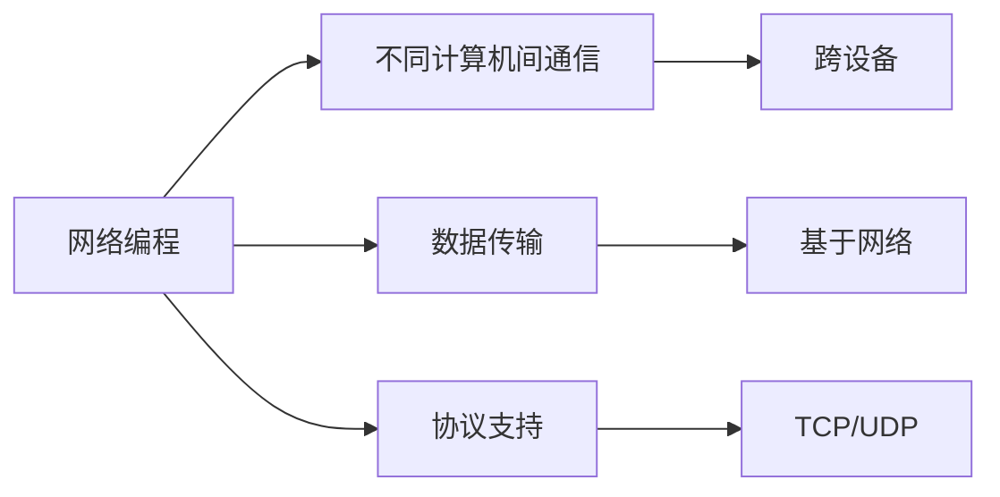

**网络编程**：
- 在不同计算机之间进行**数据传输**
- 基于**网络协议**（TCP/IP、UDP）
- 使用**Socket**（套接字）进行通信

### 网络模型

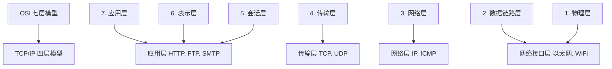

::: tip Java 网络编程主要使用
- **应用层**：HTTP、FTP 等应用协议
- **传输层**：TCP、UDP 协议
:::

## IP 地址

### IP 地址概念

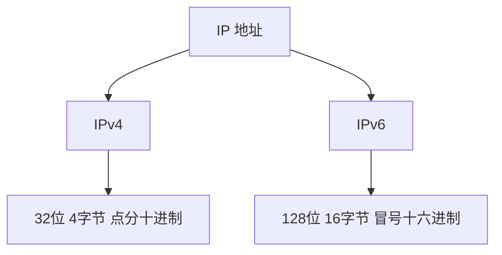

### InetAddress 类

```java
import java.net.InetAddress;
import java.net.UnknownHostException;

public class InetAddressDemo {
    public static void main(String[] args) throws UnknownHostException {
        // 获取本地主机地址
        InetAddress localHost = InetAddress.getLocalHost();
        System.out.println("本地主机: " + localHost);
        System.out.println("主机名: " + localHost.getHostName());
        System.out.println("IP地址: " + localHost.getHostAddress());
        
        // 根据主机名获取 IP 地址
        InetAddress[] addresses = InetAddress.getAllByName("www.baidu.com");
        System.out.println("\n百度的 IP 地址:");
        for (InetAddress addr : addresses) {
            System.out.println("  " + addr.getHostAddress());
        }
        
        // 根据 IP 地址获取主机信息
        InetAddress address = InetAddress.getByName("220.181.38.148");
        System.out.println("\nIP: " + address.getHostAddress());
        System.out.println("主机名: " + address.getHostName());
        
        // 判断是否可达
        boolean reachable = address.isReachable(5000);  // 5秒超时
        System.out.println("是否可达: " + reachable);
    }
}
```

### IPv4 vs IPv6

```java
import java.net.Inet4Address;
import java.net.Inet6Address;
import java.net.InetAddress;
import java.net.UnknownHostException;

public class IPVersion {
    public static void main(String[] args) throws UnknownHostException {
        // IPv4 地址
        InetAddress ipv4 = InetAddress.getByName("192.168.1.1");
        System.out.println("IPv4: " + ipv4.getHostAddress());
        System.out.println("是否 IPv4: " + (ipv4 instanceof Inet4Address));
        
        // IPv6 地址
        InetAddress ipv6 = InetAddress.getByName("::1");
        System.out.println("\nIPv6: " + ipv6.getHostAddress());
        System.out.println("是否 IPv6: " + (ipv6 instanceof Inet6Address));
        
        // 本地回环地址
        InetAddress loopback = InetAddress.getByName("localhost");
        System.out.println("\nLoopback: " + loopback.getHostAddress());
    }
}
```

::: tip 常用 IP 地址

| IP 地址 | 说明 |
|---------|------|
| `127.0.0.1` | 本地回环地址（localhost） |
| `0.0.0.0` | 表示本机所有 IP 地址 |
| `192.168.x.x` | 私有地址（局域网） |
| `255.255.255.255` | 广播地址 |

:::

## 端口

### 端口概念

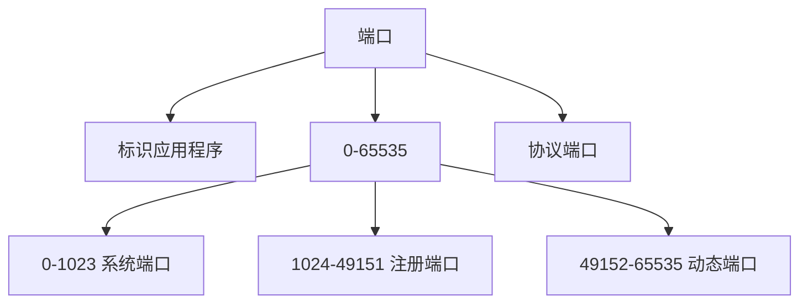

**端口作用**：
- 区分同一台计算机上的**不同应用程序**
- 与 IP 地址一起确定网络通信的**端点**
- 范围：0 - 65535

::: tip 端口分类

| 范围 | 类型 | 说明 |
|------|------|------|
| 0 - 1023 | 系统端口 | 需要 root 权限，如 HTTP(80), SSH(22) |
| 1024 - 49151 | 注册端口 | 注册给应用程序使用 |
| 49152 - 65535 | 动态端口 | 客户端临时使用 |

:::

### 常用端口号

```java
public class CommonPorts {
    public static void main(String[] args) {
        System.out.println("常用端口号:");
        System.out.println("HTTP: 80");
        System.out.println("HTTPS: 443");
        System.out.println("FTP: 21");
        System.out.println("SSH: 22");
        System.out.println("Telnet: 23");
        System.out.println("SMTP: 25");
        System.out.println("DNS: 53");
        System.out.println("DHCP: 67/68");
        System.out.println("MySQL: 3306");
        System.out.println("Redis: 6379");
    }
}
```

## 网络协议

### TCP 协议

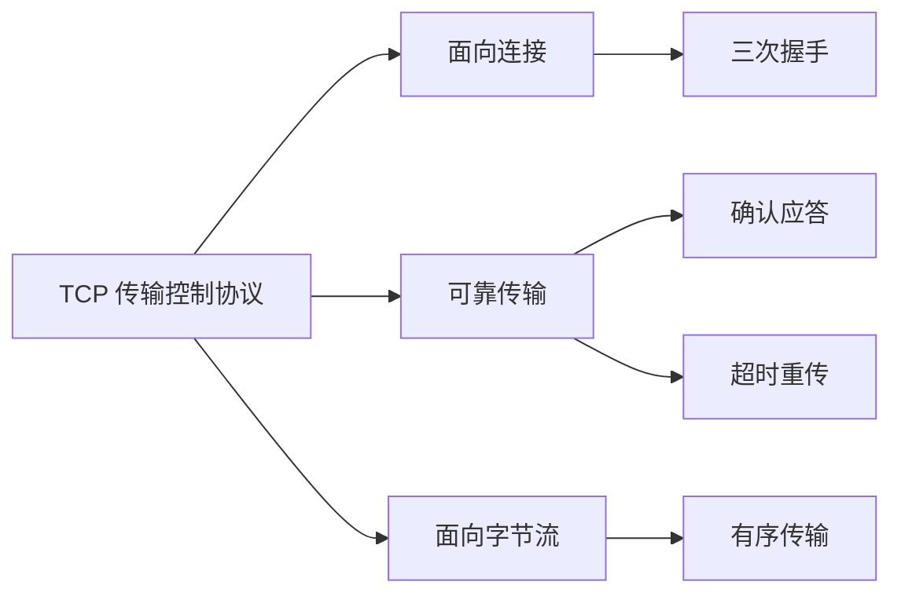

**TCP 特点**：
- **面向连接**：传输数据前必须建立连接
- **可靠传输**：保证数据无差错、不丢失、不重复
- **面向字节流**：将数据看作字节流
- **全双工通信**：双方可以同时发送和接收数据

**TCP 三次握手**：
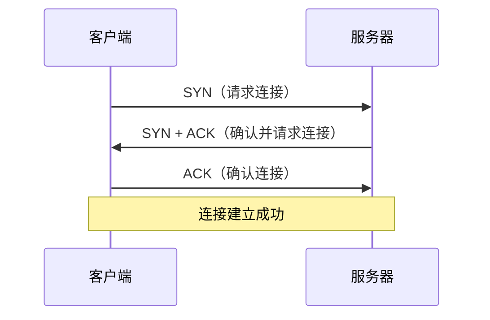

### UDP 协议

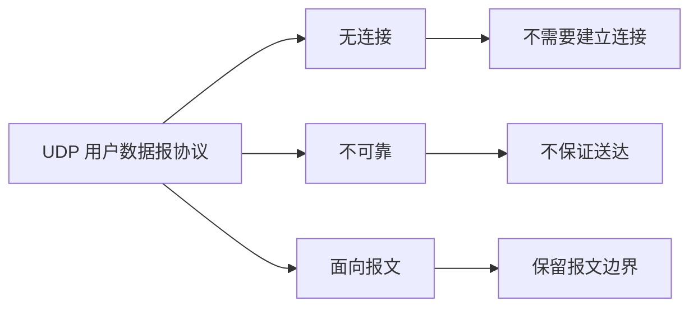

**UDP 特点**：
- **无连接**：不需要建立连接，直接发送数据
- **不可靠**：不保证数据送达，可能丢失或重复
- **面向报文**：保留报文的边界
- **高效**：头部开销小，传输速度快

::: tip TCP vs UDP

| 特性 | TCP | UDP |
|------|-----|-----|
| 连接 | 面向连接 | 无连接 |
| 可靠性 | 可靠 | 不可靠 |
| 速度 | 较慢 | 较快 |
| 开销 | 大 | 小 |
| 应用 | HTTP, FTP, SMTP | DNS, 视频流, 游戏 |

:::

## Socket 概述

### Socket 是什么

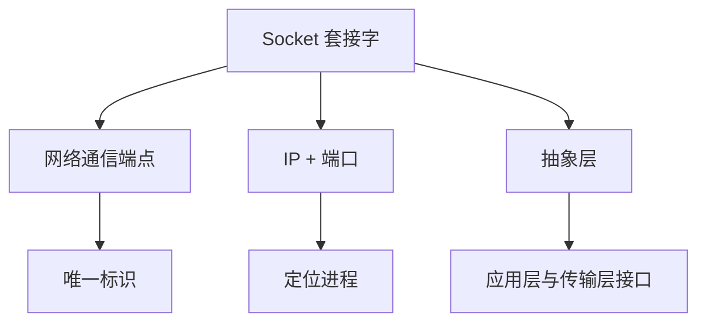

**Socket（套接字）**：
- 网络通信的**端点**（Endpoint）
- 由 **IP 地址 + 端口号** 唯一确定
- 提供了**应用层**与**传输层**之间的接口

### Socket 通信模型

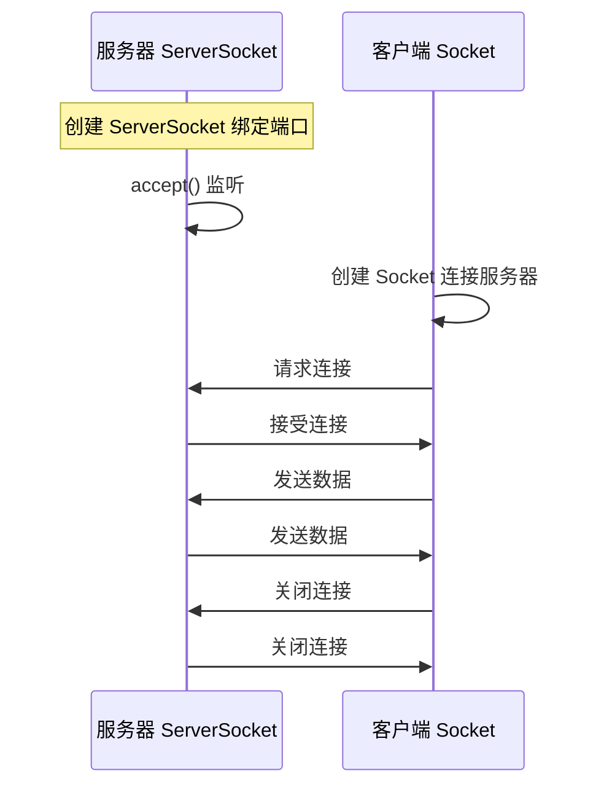

## Java 网络编程 API

### 主要类

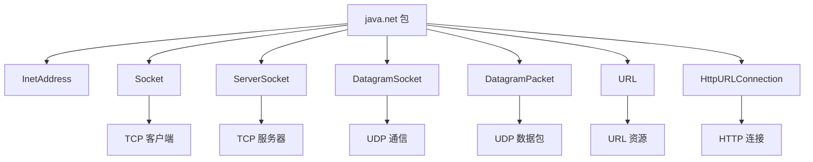

### 简单的 TCP 示例

```java
import java.io.*;
import java.net.*;

// TCP 服务器
class SimpleServer {
    public static void main(String[] args) throws IOException {
        // 创建 ServerSocket，监听 8888 端口
        ServerSocket serverSocket = new ServerSocket(8888);
        System.out.println("服务器启动，等待连接...");
        
        // 等待客户端连接
        Socket socket = serverSocket.accept();
        System.out.println("客户端已连接: " + socket.getInetAddress());
        
        // 获取输入流，读取客户端数据
        BufferedReader in = new BufferedReader(
            new InputStreamReader(socket.getInputStream())
        );
        String message = in.readLine();
        System.out.println("客户端消息: " + message);
        
        // 获取输出流，向客户端发送数据
        PrintWriter out = new PrintWriter(
            socket.getOutputStream(), true
        );
        out.println("你好，我是服务器");
        
        // 关闭资源
        in.close();
        out.close();
        socket.close();
        serverSocket.close();
    }
}

// TCP 客户端
class SimpleClient {
    public static void main(String[] args) throws IOException {
        // 连接服务器
        Socket socket = new Socket("127.0.0.1", 8888);
        System.out.println("已连接到服务器");
        
        // 获取输出流，向服务器发送数据
        PrintWriter out = new PrintWriter(
            socket.getOutputStream(), true
        );
        out.println("你好，我是客户端");
        
        // 获取输入流，读取服务器数据
        BufferedReader in = new BufferedReader(
            new InputStreamReader(socket.getInputStream())
        );
        String response = in.readLine();
        System.out.println("服务器消息: " + response);
        
        // 关闭资源
        in.close();
        out.close();
        socket.close();
    }
}
```

### 简单的 UDP 示例

```java
import java.net.*;

// UDP 接收端
class SimpleReceiver {
    public static void main(String[] args) throws IOException {
        // 创建 DatagramSocket，监听 9999 端口
        DatagramSocket socket = new DatagramSocket(9999);
        System.out.println("接收端启动，等待数据...");
        
        // 创建数据包，用于接收数据
        byte[] buffer = new byte[1024];
        DatagramPacket packet = new DatagramPacket(buffer, buffer.length);
        
        // 接收数据
        socket.receive(packet);
        
        // 解析数据
        String message = new String(
            packet.getData(), 
            0, 
            packet.getLength()
        );
        System.out.println("收到数据: " + message);
        System.out.println("发送方: " + packet.getAddress());
        System.out.println("端口: " + packet.getPort());
        
        // 关闭资源
        socket.close();
    }
}

// UDP 发送端
class SimpleSender {
    public static void main(String[] args) throws IOException {
        // 创建 DatagramSocket
        DatagramSocket socket = new DatagramSocket();
        
        // 准备数据
        String message = "你好，UDP";
        byte[] data = message.getBytes();
        
        // 创建数据包，指定目标 IP 和端口
        DatagramPacket packet = new DatagramPacket(
            data,
            data.length,
            InetAddress.getByName("127.0.0.1"),
            9999
        );
        
        // 发送数据
        socket.send(packet);
        System.out.println("数据已发送");
        
        // 关闭资源
        socket.close();
    }
}
```

## 网络编程注意事项

### 常见问题

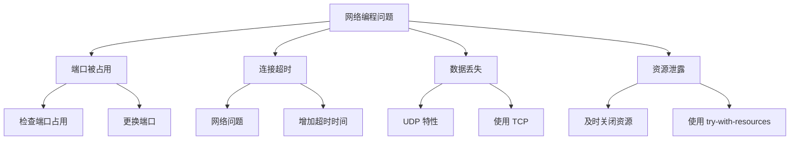

::: tip 最佳实践

1. **资源管理**：使用 try-with-resources 自动关闭资源
2. **异常处理**：捕获 IOException，提供友好的错误信息
3. **超时设置**：设置连接超时和读取超时
4. **端口选择**：使用大于 1024 的端口，避免冲突
5. **线程安全**：多线程环境下注意同步问题

:::

### 资源管理示例

```java
import java.io.*;
import java.net.*;

public class ResourceManagement {
    public static void main(String[] args) {
        // ✅ 使用 try-with-resources 自动关闭资源
        try (
            ServerSocket serverSocket = new ServerSocket(8888);
            Socket socket = serverSocket.accept();
            BufferedReader in = new BufferedReader(
                new InputStreamReader(socket.getInputStream())
            );
            PrintWriter out = new PrintWriter(
                socket.getOutputStream(), true
            )
        ) {
            // 使用资源
            String message = in.readLine();
            out.println("Echo: " + message);
        } catch (IOException e) {
            e.printStackTrace();
        }
        // 资源会自动关闭
    }
}
```

## 小结

::: tip 核心要点

1. **网络编程**：不同计算机间的数据传输
2. **IP 地址**：标识网络中的计算机
3. **端口**：标识计算机上的应用程序（0-65535）
4. **协议**：
   - TCP：面向连接、可靠传输
   - UDP：无连接、不可靠但快速
5. **Socket**：网络通信的端点（IP + 端口）
6. **Java API**：
   - TCP：Socket、ServerSocket
   - UDP：DatagramSocket、DatagramPacket

:::

::: warning 注意事项

1. **端口冲突**：避免使用常用端口，检查端口占用
2. **资源泄露**：及时关闭 Socket 和流
3. **异常处理**：捕获 IOException，处理网络异常
4. **超时设置**：避免无限期等待

:::

::: info 下一步
- [UDP 编程](/java/base/10-network/udp.md) - 学习 UDP 通信详解
- [TCP 编程](/java/base/10-network/tcp.md) - 学习 TCP 通信详解
:::
