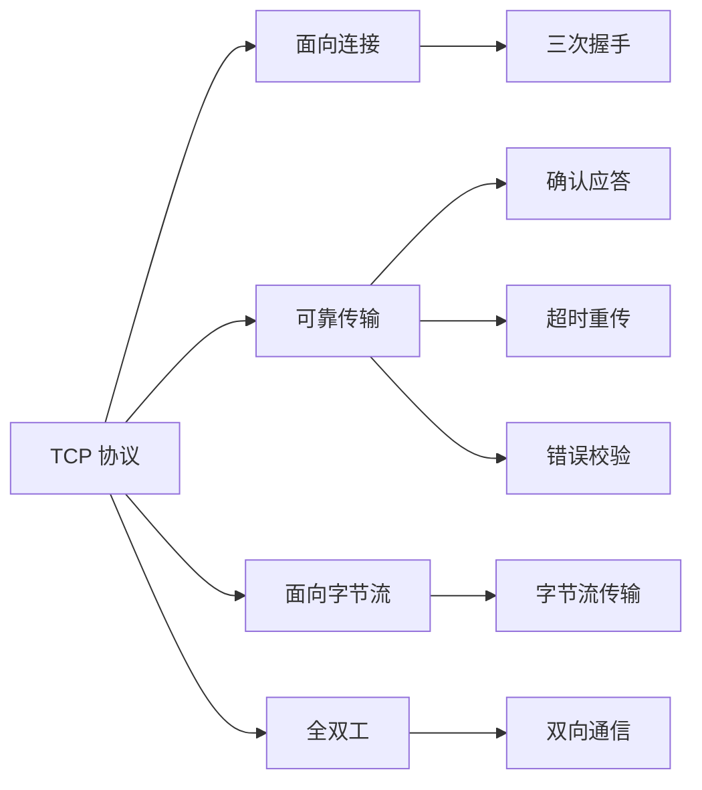
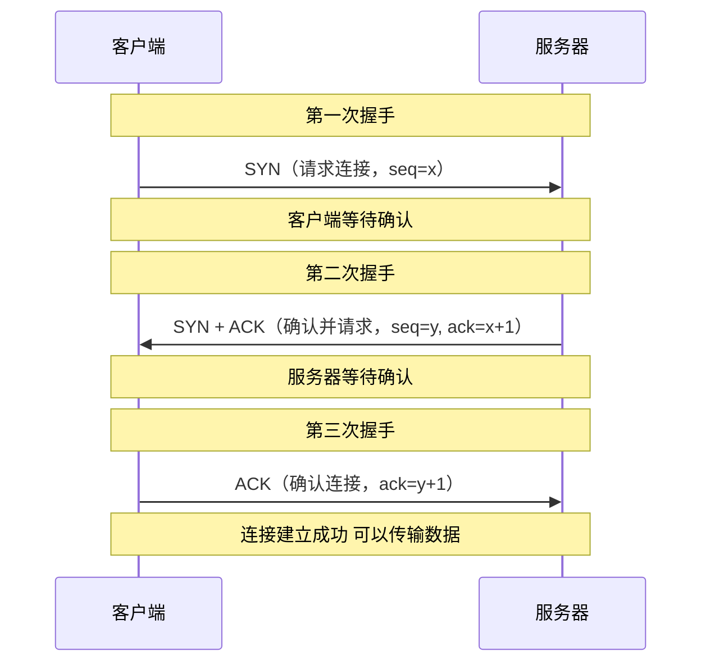
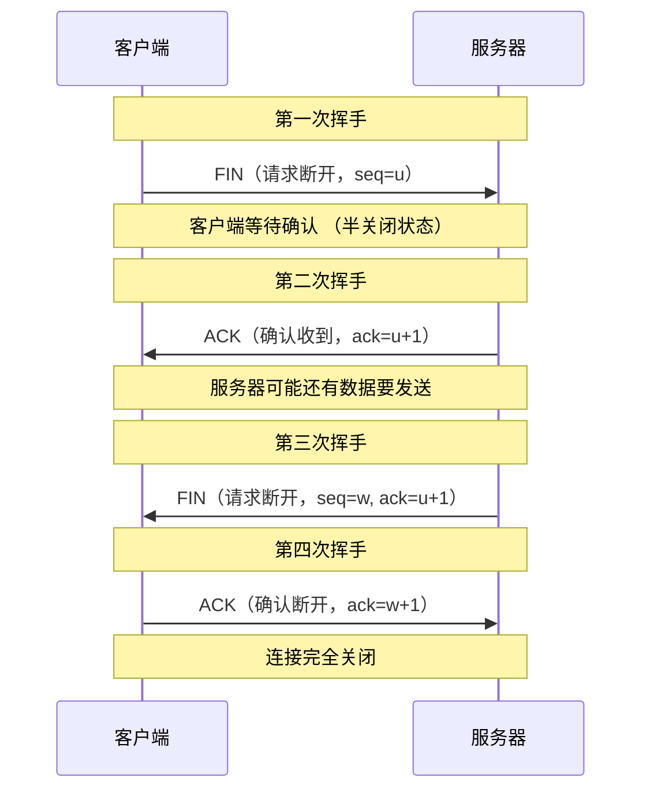
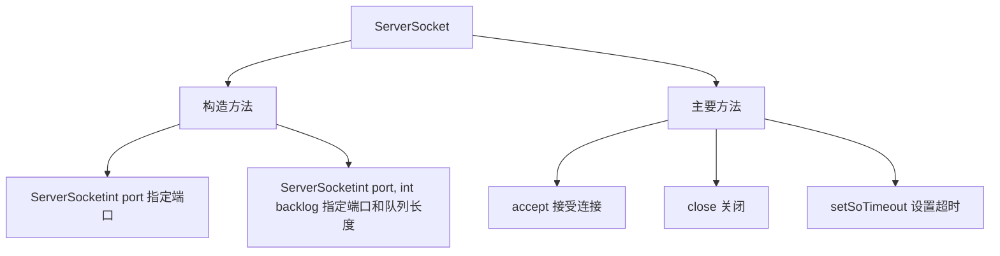
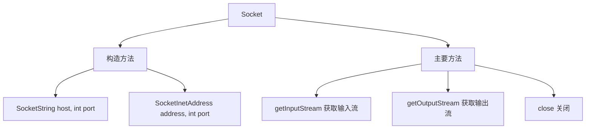
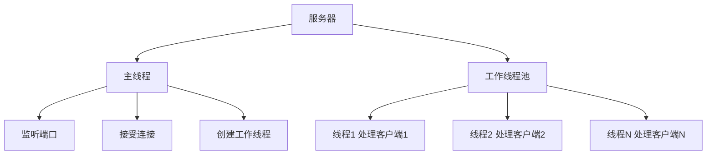

# TCP 编程

TCP（Transmission Control Protocol，传输控制协议）是一种**面向连接**的、**可靠**的传输层协议。本节详细介绍 Java TCP 编程。

## TCP 概述

### TCP 特点



**TCP 特点**：
- **面向连接**：传输数据前必须建立连接
- **可靠传输**：保证数据无差错、不丢失、不重复、按序到达
- **面向字节流**：将数据看作字节流进行传输
- **全双工通信**：双方可以同时发送和接收数据
- **点对点**：每条 TCP 连接只能有两个端点

### TCP 三次握手



### TCP 四次挥手



## ServerSocket

### ServerSocket 类



### 创建 ServerSocket

```java
import java.io.IOException;
import java.net.ServerSocket;
import java.net.Socket;

public class CreateServerSocket {
    public static void main(String[] args) throws IOException {
        // 方式1：创建 ServerSocket，指定端口
        ServerSocket serverSocket = new ServerSocket(8888);
        System.out.println("服务器启动，监听端口: " + serverSocket.getLocalPort());
        
        // 获取服务器信息
        System.out.println("超时时间: " + serverSocket.getSoTimeout());
        System.out.println("接收缓冲区: " + serverSocket.getReceiveBufferSize());
        
        // 关闭 ServerSocket
        serverSocket.close();
        
        // 方式2：指定端口和队列长度（backlog）
        ServerSocket serverSocket2 = new ServerSocket(9999, 50);
        System.out.println("队列长度: " + serverSocket2.getSoTimeout());
        
        serverSocket2.close();
    }
}
```

### ServerSocket 常用方法

```java
import java.io.IOException;
import java.net.ServerSocket;
import java.net.Socket;
import java.net.SocketTimeoutException;

public class ServerSocketMethods {
    public static void main(String[] args) throws IOException {
        ServerSocket serverSocket = new ServerSocket(8888);
        
        // 设置超时（毫秒）
        serverSocket.setSoTimeout(5000);  // 5秒超时
        
        try {
            // 等待客户端连接（阻塞）
            System.out.println("等待客户端连接...");
            Socket socket = serverSocket.accept();
            System.out.println("客户端已连接: " + socket.getInetAddress());
            
            socket.close();
        } catch (SocketTimeoutException e) {
            System.out.println("等待超时");
        } finally {
            serverSocket.close();
        }
    }
}
```

## Socket

### Socket 类



### 创建 Socket

```java
import java.io.IOException;
import java.net.Socket;
import java.net.UnknownHostException;

public class CreateSocket {
    public static void main(String[] args) {
        try {
            // 方式1：通过主机名和端口创建
            Socket socket1 = new Socket("localhost", 8888);
            System.out.println("已连接到服务器");
            System.out.println("本地地址: " + socket1.getLocalAddress());
            System.out.println("本地端口: " + socket1.getLocalPort());
            System.out.println("远程地址: " + socket1.getInetAddress());
            System.out.println("远程端口: " + socket1.getPort());
            socket1.close();
            
            // 方式2：通过 InetAddress 创建
            Socket socket2 = new Socket(
                java.net.InetAddress.getByName("127.0.0.1"),
                8888
            );
            socket2.close();
            
        } catch (UnknownHostException e) {
            System.out.println("主机不存在: " + e.getMessage());
        } catch (IOException e) {
            System.out.println("连接失败: " + e.getMessage());
        }
    }
}
```

### Socket 常用方法

```java
import java.io.IOException;
import java.net.Socket;

public class SocketMethods {
    public static void main(String[] args) throws IOException {
        Socket socket = new Socket("localhost", 8888);
        
        // 设置超时（毫秒）
        socket.setSoTimeout(5000);
        System.out.println("读取超时: " + socket.getSoTimeout());
        
        // 设置发送缓冲区
        socket.setSendBufferSize(8192);
        System.out.println("发送缓冲区: " + socket.getSendBufferSize());
        
        // 设置接收缓冲区
        socket.setReceiveBufferSize(8192);
        System.out.println("接收缓冲区: " + socket.getReceiveBufferSize());
        
        // 获取输入/输出流
        var inputStream = socket.getInputStream();
        var outputStream = socket.getOutputStream();
        System.out.println("输入流: " + inputStream);
        System.out.println("输出流: " + outputStream);
        
        // 关闭 Socket
        socket.close();
        System.out.println("Socket 是否关闭: " + socket.isClosed());
    }
}
```

## TCP 通信示例

### 基本通信

```java
import java.io.*;
import java.net.*;

// TCP 服务器
public class SimpleServer {
    public static void main(String[] args) throws IOException {
        // 1. 创建 ServerSocket，监听 8888 端口
        ServerSocket serverSocket = new ServerSocket(8888);
        System.out.println("服务器启动，监听端口 8888...");
        
        // 2. 等待客户端连接
        Socket socket = serverSocket.accept();
        System.out.println("客户端已连接: " + socket.getInetAddress());
        
        // 3. 获取输入流，读取客户端数据
        BufferedReader in = new BufferedReader(
            new InputStreamReader(socket.getInputStream())
        );
        String message = in.readLine();
        System.out.println("客户端消息: " + message);
        
        // 4. 获取输出流，向客户端发送数据
        PrintWriter out = new PrintWriter(
            socket.getOutputStream(), true
        );
        out.println("你好，我是服务器");
        
        // 5. 关闭资源
        in.close();
        out.close();
        socket.close();
        serverSocket.close();
    }
}

// TCP 客户端
public class SimpleClient {
    public static void main(String[] args) throws IOException {
        // 1. 连接服务器
        Socket socket = new Socket("127.0.0.1", 8888);
        System.out.println("已连接到服务器");
        
        // 2. 获取输出流，向服务器发送数据
        PrintWriter out = new PrintWriter(
            socket.getOutputStream(), true
        );
        out.println("你好，我是客户端");
        
        // 3. 获取输入流，读取服务器数据
        BufferedReader in = new BufferedReader(
            new InputStreamReader(socket.getInputStream())
        );
        String response = in.readLine();
        System.out.println("服务器消息: " + response);
        
        // 4. 关闭资源
        in.close();
        out.close();
        socket.close();
    }
}
```

### 双向通信

```java
import java.io.*;
import java.net.*;
import java.util.Scanner;

// 聊天服务器
public class ChatServer {
    public static void main(String[] args) throws IOException {
        ServerSocket serverSocket = new ServerSocket(8888);
        System.out.println("服务器启动，等待连接...");
        
        Socket socket = serverSocket.accept();
        System.out.println("客户端已连接");
        
        // 创建接收线程
        new Thread(() -> {
            try {
                BufferedReader in = new BufferedReader(
                    new InputStreamReader(socket.getInputStream())
                );
                String line;
                while ((line = in.readLine()) != null) {
                    System.out.println("\n客户端: " + line);
                    System.out.print("你: ");
                }
            } catch (IOException e) {
                System.out.println("连接断开");
            }
        }).start();
        
        // 主线程发送消息
        PrintWriter out = new PrintWriter(
            socket.getOutputStream(), true
        );
        Scanner scanner = new Scanner(System.in);
        
        System.out.println("=== 聊天开始（输入 quit 退出）===");
        while (true) {
            System.out.print("你: ");
            String message = scanner.nextLine();
            
            if ("quit".equalsIgnoreCase(message)) {
                out.println("bye");
                break;
            }
            
            out.println(message);
        }
        
        scanner.close();
        socket.close();
        serverSocket.close();
    }
}

// 聊天客户端
public class ChatClient {
    public static void main(String[] args) throws IOException {
        Socket socket = new Socket("127.0.0.1", 8888);
        System.out.println("已连接到服务器");
        
        // 创建接收线程
        new Thread(() -> {
            try {
                BufferedReader in = new BufferedReader(
                    new InputStreamReader(socket.getInputStream())
                );
                String line;
                while ((line = in.readLine()) != null) {
                    if ("bye".equals(line)) {
                        System.out.println("服务器断开连接");
                        System.exit(0);
                    }
                    System.out.println("\n服务器: " + line);
                    System.out.print("你: ");
                }
            } catch (IOException e) {
                System.out.println("连接断开");
            }
        }).start();
        
        // 主线程发送消息
        PrintWriter out = new PrintWriter(
            socket.getOutputStream(), true
        );
        Scanner scanner = new Scanner(System.in);
        
        System.out.println("=== 聊天开始（输入 quit 退出）===");
        while (true) {
            System.out.print("你: ");
            String message = scanner.nextLine();
            
            out.println(message);
            
            if ("quit".equalsIgnoreCase(message)) {
                break;
            }
        }
        
        scanner.close();
        socket.close();
    }
}
```

## 多线程服务器

### 多线程处理多个客户端



```java
import java.io.*;
import java.net.*;
import java.util.concurrent.*;

// 工作线程：处理单个客户端
class ClientHandler implements Runnable {
    private Socket socket;
    private int clientId;
    
    public ClientHandler(Socket socket, int clientId) {
        this.socket = socket;
        this.clientId = clientId;
    }
    
    @Override
    public void run() {
        try (
            BufferedReader in = new BufferedReader(
                new InputStreamReader(socket.getInputStream())
            );
            PrintWriter out = new PrintWriter(
                socket.getOutputStream(), true
            )
        ) {
            // 发送欢迎消息
            out.println("欢迎，你是第 " + clientId + " 个客户端");
            
            String message;
            while ((message = in.readLine()) != null) {
                if ("bye".equalsIgnoreCase(message)) {
                    out.println("再见！");
                    break;
                }
                
                // 回显消息
                out.println("Echo: " + message);
            }
        } catch (IOException e) {
            System.out.println("客户端 " + clientId + " 断开连接");
        } finally {
            try {
                socket.close();
            } catch (IOException e) {
                e.printStackTrace();
            }
        }
    }
}

// 多线程服务器
public class MultiThreadServer {
    private static int clientId = 0;
    private static ExecutorService threadPool = Executors.newFixedThreadPool(10);
    
    public static void main(String[] args) throws IOException {
        ServerSocket serverSocket = new ServerSocket(8888);
        System.out.println("多线程服务器启动，监听端口 8888...");
        
        while (true) {
            // 等待客户端连接
            Socket socket = serverSocket.accept();
            clientId++;
            
            System.out.println("客户端 " + clientId + " 已连接");
            
            // 提交任务到线程池
            threadPool.execute(new ClientHandler(socket, clientId));
        }
    }
}
```

## 文件传输

### 上传文件

```java
import java.io.*;
import java.net.*;

// 文件上传服务器
public class FileUploadServer {
    public static void main(String[] args) throws IOException {
        ServerSocket serverSocket = new ServerSocket(8888);
        System.out.println("文件上传服务器启动...");
        
        while (true) {
            Socket socket = serverSocket.accept();
            new Thread(() -> {
                try {
                    // 接收文件名
                    DataInputStream dis = new DataInputStream(socket.getInputStream());
                    String fileName = dis.readUTF();
                    long fileSize = dis.readLong();
                    
                    System.out.println("接收文件: " + fileName + " (" + fileSize + " 字节)");
                    
                    // 保存文件
                    try (FileOutputStream fos = new FileOutputStream("upload_" + fileName)) {
                        byte[] buffer = new byte[8192];
                        int bytesRead;
                        long totalRead = 0;
                        
                        while ((bytesRead = dis.read(buffer)) != -1) {
                            fos.write(buffer, 0, bytesRead);
                            totalRead += bytesRead;
                            
                            // 显示进度
                            System.out.printf("\r进度: %.2f%%", 
                                (double) totalRead / fileSize * 100);
                        }
                        System.out.println("\n文件接收完成");
                    }
                    
                } catch (IOException e) {
                    e.printStackTrace();
                } finally {
                    try {
                        socket.close();
                    } catch (IOException e) {
                        e.printStackTrace();
                    }
                }
            }).start();
        }
    }
}

// 文件上传客户端
public class FileUploadClient {
    public static void main(String[] args) throws IOException {
        Socket socket = new Socket("127.0.0.1", 8888);
        
        File file = new File("test.txt");
        if (!file.exists()) {
            System.out.println("文件不存在");
            return;
        }
        
        DataOutputStream dos = new DataOutputStream(socket.getOutputStream());
        
        // 发送文件名和大小
        dos.writeUTF(file.getName());
        dos.writeLong(file.length());
        
        // 发送文件内容
        try (FileInputStream fis = new FileInputStream(file)) {
            byte[] buffer = new byte[8192];
            int bytesRead;
            
            while ((bytesRead = fis.read(buffer)) != -1) {
                dos.write(buffer, 0, bytesRead);
            }
        }
        
        System.out.println("文件上传完成");
        socket.close();
    }
}
```

## 小结

::: tip 核心要点

1. **TCP 特点**：面向连接、可靠传输、面向字节流、全双工
2. **ServerSocket**：服务器端套接字，监听端口、接受连接
3. **Socket**：客户端套接字，连接服务器、传输数据
4. **通信流程**：
   - 服务器：创建 ServerSocket → accept() → 获取流 → 读写 → 关闭
   - 客户端：创建 Socket → 获取流 → 读写 → 关闭
5. **多线程服务器**：使用线程池处理多个客户端
6. **资源管理**：使用 try-with-resources 自动关闭资源

:::

::: warning 注意事项

1. **端口占用**：确保端口未被占用，使用后及时关闭
2. **异常处理**：捕获 IOException，处理网络异常
3. **超时设置**：避免无限期等待，设置合理的超时时间
4. **线程安全**：多线程环境下注意共享资源的同步
5. **资源泄露**：及时关闭 Socket、ServerSocket 和流

:::

::: info 下一步
- [Lambda 表达式](/java/base/11-lambda-stream/lambda.md) - 学习 Lambda 表达式
:::
