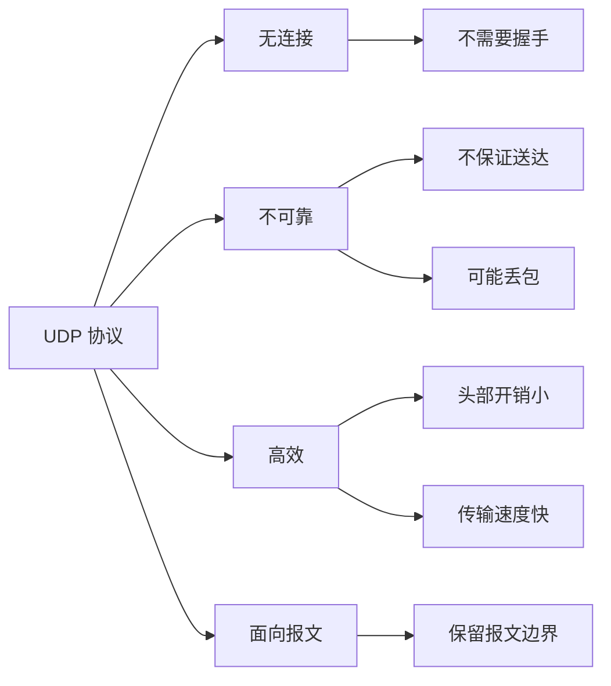
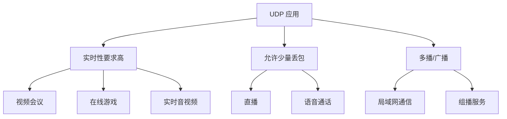
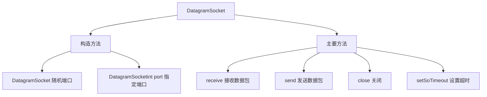
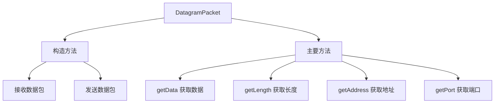
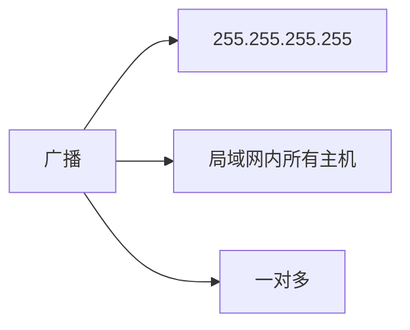
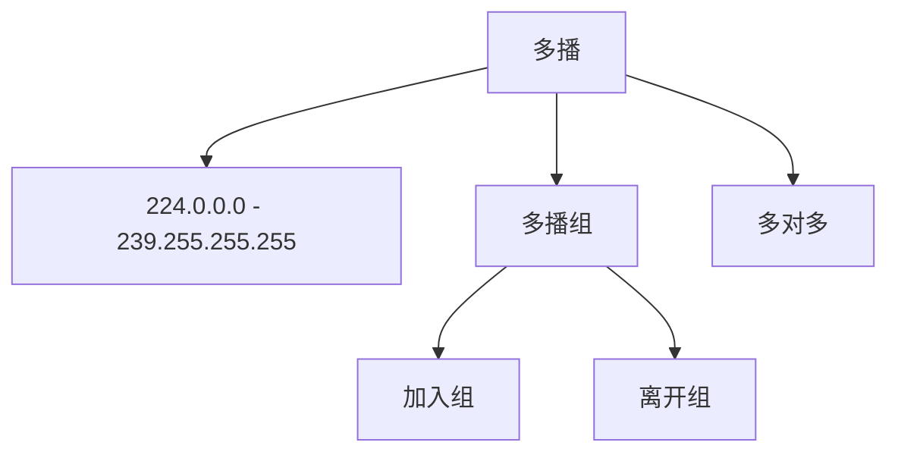

# UDP 编程

UDP（User Datagram Protocol，用户数据报协议）是一种**无连接**的传输层协议。本节详细介绍 Java UDP 编程。

## UDP 概述

### UDP 特点



**UDP 特点**：
- **无连接**：发送数据前不需要建立连接
- **不可靠**：不保证数据送达，可能丢失、重复
- **面向报文**：保留应用程序定义的报文边界
- **高效**：头部开销小（仅 8 字节），传输速度快
- **支持一对一、一对多、多对多**通信

::: tip UDP vs TCP

| 特性 | UDP | TCP |
|------|-----|-----|
| 连接 | 无连接 | 面向连接 |
| 可靠性 | 不可靠 | 可靠 |
| 速度 | 快 | 慢 |
| 开销 | 小（8字节头部） | 大（20字节头部） |
| 应用场景 | 视频、游戏、DNS | HTTP、FTP、SMTP |

:::

### UDP 应用场景



::: tip UDP 适用场景

1. **实时应用**：视频会议、在线游戏（实时性 > 可靠性）
2. **广播/多播**：一对多通信
3. **简单请求/响应**：DNS 查询
4. **数据量小**：头部开销小

:::

## DatagramSocket

### DatagramSocket 类



### 创建 DatagramSocket

```java
import java.net.DatagramSocket;
import java.net.SocketException;

public class CreateSocket {
    public static void main(String[] args) throws SocketException {
        // 方式1：创建 Socket，系统随机分配端口
        DatagramSocket socket1 = new DatagramSocket();
        System.out.println("随机端口: " + socket1.getLocalPort());
        
        // 方式2：创建 Socket，绑定指定端口
        DatagramSocket socket2 = new DatagramSocket(8888);
        System.out.println("指定端口: " + socket2.getLocalPort());
        
        // 获取 Socket 信息
        System.out.println("本地地址: " + socket2.getLocalAddress());
        System.out.println("本地端口: " + socket2.getLocalPort());
        System.out.println("缓冲区大小: " + socket2.getReceiveBufferSize());
        
        // 关闭 Socket
        socket1.close();
        socket2.close();
    }
}
```

### DatagramSocket 常用方法

```java
import java.io.IOException;
import java.net.DatagramPacket;
import java.net.DatagramSocket;
import java.net.SocketException;

public class SocketMethods {
    public static void main(String[] args) throws SocketException {
        DatagramSocket socket = new DatagramSocket(9999);
        
        // 设置超时（毫秒）
        try {
            socket.setSoTimeout(5000);  // 5秒超时
            System.out.println("接收超时: " + socket.getSoTimeout() + " ms");
        } catch (IOException e) {
            e.printStackTrace();
        }
        
        // 设置发送缓冲区大小
        socket.setSendBufferSize(8192);
        System.out.println("发送缓冲区: " + socket.getSendBufferSize());
        
        // 设置接收缓冲区大小
        socket.setReceiveBufferSize(8192);
        System.out.println("接收缓冲区: " + socket.getReceiveBufferSize());
        
        // 是否启用广播
        socket.setBroadcast(true);
        System.out.println("广播启用: " + socket.getBroadcast());
        
        // 关闭 Socket
        socket.close();
        System.out.println("Socket 是否关闭: " + socket.isClosed());
    }
}
```

## DatagramPacket

### DatagramPacket 类



### 创建数据包

```java
import java.net.DatagramPacket;
import java.net.InetAddress;

public class CreatePacket {
    public static void main(String[] args) throws Exception {
        // 接收数据包（指定缓冲区）
        byte[] buffer = new byte[1024];
        DatagramPacket receivePacket = new DatagramPacket(buffer, buffer.length);
        System.out.println("接收数据包容量: " + receivePacket.getLength());
        
        // 发送数据包（指定目标地址和端口）
        String message = "Hello, UDP!";
        byte[] data = message.getBytes();
        DatagramPacket sendPacket = new DatagramPacket(
            data,                          // 数据
            data.length,                   // 数据长度
            InetAddress.getByName("127.0.0.1"),  // 目标地址
            8888                          // 目标端口
        );
        System.out.println("目标地址: " + sendPacket.getAddress());
        System.out.println("目标端口: " + sendPacket.getPort());
    }
}
```

### DatagramPacket 常用方法

```java
import java.net.DatagramPacket;
import java.net.InetAddress;

public class PacketMethods {
    public static void main(String[] args) throws Exception {
        String message = "Hello, World!";
        byte[] data = message.getBytes();
        
        DatagramPacket packet = new DatagramPacket(
            data,
            data.length,
            InetAddress.getByName("127.0.0.1"),
            8888
        );
        
        // 获取数据
        byte[] receivedData = packet.getData();
        String receivedMessage = new String(
            receivedData,
            0,
            packet.getLength()
        );
        System.out.println("数据: " + receivedMessage);
        
        // 获取地址和端口
        InetAddress address = packet.getAddress();
        int port = packet.getPort();
        System.out.println("地址: " + address.getHostAddress());
        System.out.println("端口: " + port);
        
        // 获取数据长度
        int length = packet.getLength();
        System.out.println("数据长度: " + length);
    }
}
```

## UDP 通信示例

### 基本通信

```java
import java.net.DatagramPacket;
import java.net.DatagramSocket;
import java.net.InetAddress;

// UDP 接收端
public class UDPReceiver {
    public static void main(String[] args) throws Exception {
        // 1. 创建 DatagramSocket，指定端口
        DatagramSocket socket = new DatagramSocket(9999);
        System.out.println("接收端启动，监听端口 9999...");
        
        // 2. 创建数据包，用于接收数据
        byte[] buffer = new byte[1024];
        DatagramPacket packet = new DatagramPacket(buffer, buffer.length);
        
        // 3. 接收数据
        socket.receive(packet);  // 阻塞等待
        System.out.println("收到数据!");
        
        // 4. 解析数据
        String message = new String(
            packet.getData(),
            0,
            packet.getLength()
        );
        System.out.println("发送方: " + packet.getAddress());
        System.out.println("端口: " + packet.getPort());
        System.out.println("内容: " + message);
        
        // 5. 关闭资源
        socket.close();
    }
}

// UDP 发送端
public class UDPSender {
    public static void main(String[] args) throws Exception {
        // 1. 创建 DatagramSocket
        DatagramSocket socket = new DatagramSocket();
        System.out.println("发送端启动");
        
        // 2. 准备数据
        String message = "你好，UDP!";
        byte[] data = message.getBytes();
        
        // 3. 创建数据包，指定目标地址和端口
        DatagramPacket packet = new DatagramPacket(
            data,
            data.length,
            InetAddress.getByName("127.0.0.1"),
            9999
        );
        
        // 4. 发送数据
        socket.send(packet);
        System.out.println("数据已发送: " + message);
        
        // 5. 关闭资源
        socket.close();
    }
}
```

### 双向通信

```java
import java.net.DatagramPacket;
import java.net.DatagramSocket;
import java.net.InetAddress;
import java.util.Scanner;

// UDP 双向通信
public class UDPEcho {
    public static void main(String[] args) throws Exception {
        DatagramSocket socket = new DatagramSocket(8888);
        Scanner scanner = new Scanner(System.in);
        
        System.out.println("聊天程序启动（输入 quit 退出）");
        
        while (true) {
            // 接收消息
            byte[] buffer = new byte[1024];
            DatagramPacket receivePacket = new DatagramPacket(buffer, buffer.length);
            socket.receive(receivePacket);
            
            String received = new String(
                receivePacket.getData(),
                0,
                receivePacket.getLength()
            );
            System.out.println("\n对方: " + received);
            
            if ("quit".equalsIgnoreCase(received)) {
                System.out.println("对方退出了聊天");
                break;
            }
            
            // 发送消息
            System.out.print("你: ");
            String message = scanner.nextLine();
            
            if ("quit".equalsIgnoreCase(message)) {
                byte[] data = message.getBytes();
                DatagramPacket sendPacket = new DatagramPacket(
                    data,
                    data.length,
                    receivePacket.getAddress(),
                    receivePacket.getPort()
                );
                socket.send(sendPacket);
                break;
            }
            
            byte[] data = message.getBytes();
            DatagramPacket sendPacket = new DatagramPacket(
                data,
                data.length,
                receivePacket.getAddress(),
                receivePacket.getPort()
            );
            socket.send(sendPacket);
        }
        
        socket.close();
        scanner.close();
    }
}
```

## UDP 广播与多播

### UDP 广播



```java
import java.net.DatagramPacket;
import java.net.DatagramSocket;
import java.net.InetAddress;

// 广播发送端
public class BroadcastSender {
    public static void main(String[] args) throws Exception {
        DatagramSocket socket = new DatagramSocket();
        socket.setBroadcast(true);  // 启用广播
        
        String message = "广播消息：大家好！";
        byte[] data = message.getBytes();
        
        // 广播地址：255.255.255.255
        DatagramPacket packet = new DatagramPacket(
            data,
            data.length,
            InetAddress.getByName("255.255.255.255"),
            9999
        );
        
        socket.send(packet);
        System.out.println("广播消息已发送");
        
        socket.close();
    }
}

// 广播接收端
public class BroadcastReceiver {
    public static void main(String[] args) throws Exception {
        DatagramSocket socket = new DatagramSocket(9999);
        
        byte[] buffer = new byte[1024];
        DatagramPacket packet = new DatagramPacket(buffer, buffer.length);
        
        socket.receive(packet);
        
        String message = new String(
            packet.getData(),
            0,
            packet.getLength()
        );
        System.out.println("收到广播: " + message);
        
        socket.close();
    }
}
```

### UDP 多播



```java
import java.net.DatagramPacket;
import java.net.InetAddress;
import java.net.MulticastSocket;

// 多播发送端
public class MulticastSender {
    public static void main(String[] args) throws Exception {
        DatagramSocket socket = new DatagramSocket();
        
        String message = "多播消息：欢迎加入！";
        byte[] data = message.getBytes();
        
        // 多播地址范围：224.0.0.0 - 239.255.255.255
        InetAddress group = InetAddress.getByName("239.0.0.1");
        
        DatagramPacket packet = new DatagramPacket(
            data,
            data.length,
            group,
            9999
        );
        
        socket.send(packet);
        System.out.println("多播消息已发送");
        
        socket.close();
    }
}

// 多播接收端
public class MulticastReceiver {
    public static void main(String[] args) throws Exception {
        // 创建 MulticastSocket
        MulticastSocket socket = new MulticastSocket(9999);
        
        // 加入多播组
        InetAddress group = InetAddress.getByName("239.0.0.1");
        socket.joinGroup(group);
        System.out.println("已加入多播组");
        
        // 接收数据
        byte[] buffer = new byte[1024];
        DatagramPacket packet = new DatagramPacket(buffer, buffer.length);
        socket.receive(packet);
        
        String message = new String(
            packet.getData(),
            0,
            packet.getLength()
        );
        System.out.println("收到多播: " + message);
        
        // 离开多播组
        socket.leaveGroup(group);
        socket.close();
    }
}
```

::: tip 多播地址范围

| 范围 | 用途 |
|------|------|
| 224.0.0.0 - 224.0.0.255 | 本地子网，路由器不转发 |
| 224.0.1.0 - 238.255.255.255 | 全局范围，路由器可转发 |
| 239.0.0.0 - 239.255.255.255 | 本地管理范围 |

:::

## UDP 实际应用

### 简单聊天室

```java
import java.net.DatagramPacket;
import java.net.DatagramSocket;
import java.net.InetAddress;
import java.util.Scanner;

// 聊天室接收线程
class ChatReceiver implements Runnable {
    private DatagramSocket socket;
    
    public ChatReceiver(DatagramSocket socket) {
        this.socket = socket;
    }
    
    @Override
    public void run() {
        try {
            while (true) {
                byte[] buffer = new byte[1024];
                DatagramPacket packet = new DatagramPacket(buffer, buffer.length);
                socket.receive(packet);
                
                String message = new String(
                    packet.getData(),
                    0,
                    packet.getLength()
                );
                System.out.println("\n" + packet.getAddress() + ": " + message);
                System.out.print("你: ");
            }
        } catch (Exception e) {
            System.out.println("接收线程退出");
        }
    }
}

// 聊天室主程序
public class ChatRoom {
    public static void main(String[] args) throws Exception {
        DatagramSocket socket = new DatagramSocket(8888);
        Scanner scanner = new Scanner(System.in);
        
        // 启动接收线程
        new Thread(new ChatReceiver(socket)).start();
        
        System.out.println("=== UDP 聊天室 ===");
        System.out.print("输入对方 IP 地址: ");
        String targetIP = scanner.nextLine();
        
        InetAddress targetAddress = InetAddress.getByName(targetIP);
        
        while (true) {
            System.out.print("你: ");
            String message = scanner.nextLine();
            
            if ("bye".equalsIgnoreCase(message)) {
                break;
            }
            
            byte[] data = message.getBytes();
            DatagramPacket packet = new DatagramPacket(
                data,
                data.length,
                targetAddress,
                8888
            );
            socket.send(packet);
        }
        
        socket.close();
        scanner.close();
    }
}
```

## 小结

::: tip 核心要点

1. **UDP 特点**：无连接、不可靠、高效、面向报文
2. **DatagramSocket**：UDP 通信的套接字
3. **DatagramPacket**：UDP 数据包
4. **通信流程**：
   - 接收端：创建 Socket → 创建数据包 → 接收 → 解析
   - 发送端：创建 Socket → 准备数据 → 创建数据包 → 发送
5. **广播**：255.255.255.255，一对多
6. **多播**：224.x.x.x - 239.x.x.x，多对多

:::

::: warning 注意事项

1. **数据包大小**：UDP 数据包最大 64KB，建议不超过 1472 字节（避免分片）
2. **丢包问题**：UDP 不保证送达，重要数据需要应用层确认
3. **端口占用**：确保端口未被占用
4. **资源管理**：及时关闭 DatagramSocket
5. **防火墙**：UDP 可能被防火墙阻止

:::

::: info 下一步
- [TCP 编程](/java/base/10-network/tcp.md) - 学习 TCP 通信详解
:::
