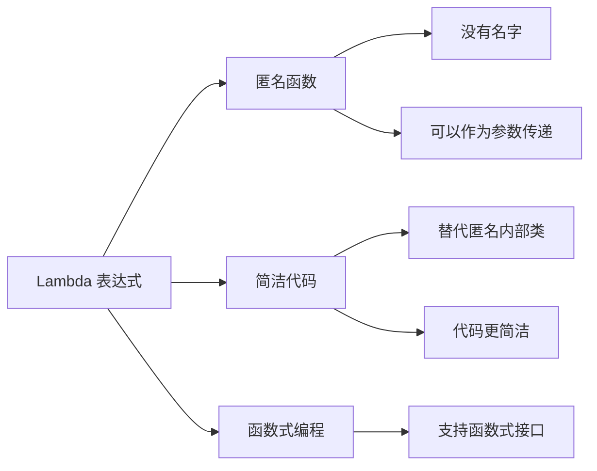
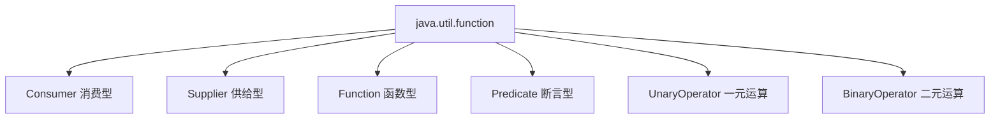
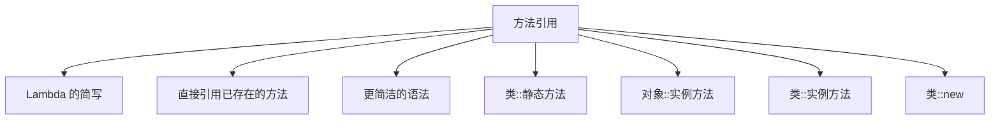
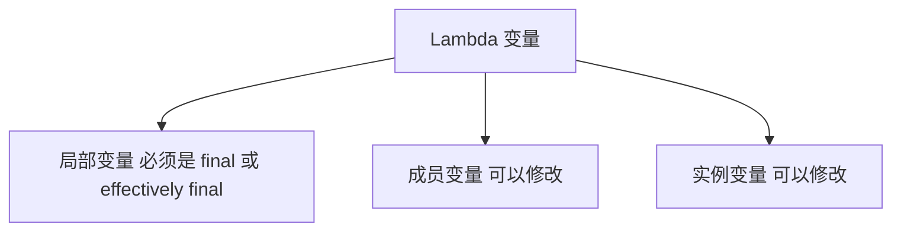

# Lambda 表达式

Lambda 表达式是 Java 8 引入的重要特性，它允许我们将函数作为方法参数传递，使代码更加简洁和灵活。

## Lambda 概述

### 什么是 Lambda



**Lambda 表达式**：
- **匿名函数**：没有名称的函数
- **可以作为参数**传递给方法
- **简洁**：替代冗长的匿名内部类
- **函数式接口**：只适用于函数式接口

### 为什么要使用 Lambda

```java
import java.util.*;

public class WithoutLambda {
    public static void main(String[] args) {
        List<String> names = Arrays.asList("Alice", "Bob", "Charlie");
        
        // ❌ 传统方式：使用匿名内部类
        Collections.sort(names, new Comparator<String>() {
            @Override
            public int compare(String a, String b) {
                return a.compareTo(b);
            }
        });
        
        // ✅ 使用 Lambda：简洁
        Collections.sort(names, (a, b) -> a.compareTo(b));
    }
}
```

::: tip Lambda 的优势

| 特性 | 说明 |
|------|------|
| **简洁** | 减少样板代码，提高可读性 |
| **灵活** | 可以作为参数传递，支持高阶函数 |
| **并行** | 配合 Stream API 支持并行处理 |
| **函数式** | 支持函数式编程风格 |

:::

## Lambda 语法

### 基本语法

```mermaid
graph TD
    A[Lambda 语法] --> B[参数列表]
    A --> C[箭头符号]
    A --> D[函数体]
    
    B --> B1["a 或 a 或 a, b"]
    C --> C2[-> 或 ->]
    D --> D3[表达式 或 {语句块}]
```

**Lambda 语法格式**：

```java
// 格式1：无参数，无返回值
() -> System.out.println("Hello");

// 格式2：一个参数，无返回值（参数括号可省略）
x -> System.out.println(x);

// 格式3：多个参数，有返回值
(a, b) -> a + b;

// 格式4：多条语句，需要花括号
(a, b) -> {
    int sum = a + b;
    return sum;
};

// 格式5：显式指定类型
(int a, int b) -> a + b;
```

### Lambda 语法示例

```java
import java.util.function.*;

public class LambdaSyntax {
    public static void main(String[] args) {
        // 1. 无参数
        Runnable runnable = () -> System.out.println("Hello Lambda");
        runnable.run();
        
        // 2. 一个参数（括号可省略）
        Consumer<String> consumer = s -> System.out.println(s);
        consumer.accept("Hello");
        
        // 3. 多个参数
        BiFunction<Integer, Integer, Integer> add = (a, b) -> a + b;
        System.out.println(add.apply(10, 20));  // 30
        
        // 4. 多条语句
        Predicate<Integer> predicate = x -> {
            System.out.println("检查: " + x);
            return x > 0;
        };
        System.out.println(predicate.test(10));  // true
        
        // 5. 显式指定类型
        BinaryOperator<Integer> multiply = 
            (Integer a, Integer b) -> a * b;
        System.out.println(multiply.apply(5, 3));  // 15
    }
}
```

## 函数式接口

### 什么是函数式接口

```mermaid
graph TD
    A[函数式接口] --> B[只有一个抽象方法]
    A --> C[@FunctionalInterface 注解]
    A --> D[Lambda 表达式的目标类型]
    
    B --> B1[可以有默认方法]
    B --> B2[可以有静态方法]
    B --> B3[可以有 Object 的方法]
    
    C --> C1[可选]
    C --> C2[编译时检查]
```

**函数式接口**：
- **只有一个抽象方法**的接口
- 可以有**默认方法**（default）
- 可以有**静态方法**（static）
- 可以继承 **Object** 的方法

::: tip @FunctionalInterface 注解

- **可选**：不加也不影响功能
- **编译检查**：如果不符合函数式接口定义，编译错误
- **文档作用**：明确表示这是函数式接口

:::

### 常用函数式接口



#### Consumer - 消费型接口

```java
import java.util.function.Consumer;

public class ConsumerDemo {
    public static void main(String[] args) {
        // Consumer<T>: 接受一个参数，不返回结果
        Consumer<String> print = s -> System.out.println(s);
        print.accept("Hello");  // Hello
        
        // BiConsumer<T, U>: 接受两个参数
        java.util.function.BiConsumer<String, Integer> printInfo =
            (name, age) -> System.out.println(name + ": " + age);
        printInfo.accept("张三", 20);  // 张三: 20
        
        // andThen：链式调用
        Consumer<String> first = s -> System.out.print("Hello ");
        Consumer<String> second = s -> System.out.println(s);
        first.andThen(second).accept("World");  // Hello World
    }
}
```

#### Supplier - 供给型接口

```java
import java.util.function.Supplier;

public class SupplierDemo {
    public static void main(String[] args) {
        // Supplier<T>: 不接受参数，返回结果
        Supplier<String> supplier = () -> "Hello Supplier";
        System.out.println(supplier.get());  // Hello Supplier
        
        // 生成随机数
        Supplier<Double> random = () -> Math.random();
        System.out.println(random.get());  // 0.123...
        
        // 生成对象
        Supplier<StringBuilder> sbSupplier = StringBuilder::new;
        StringBuilder sb = sbSupplier.get();
        sb.append("Hello");
        System.out.println(sb);  // Hello
    }
}
```

#### Function - 函数型接口

```java
import java.util.function.Function;

public class FunctionDemo {
    public static void main(String[] args) {
        // Function<T, R>: 接受一个参数，返回结果
        Function<String, Integer> length = s -> s.length();
        System.out.println(length.apply("Hello"));  // 5
        
        // BiFunction<T, U, R>: 接受两个参数
        java.util.function.BiFunction<Integer, Integer, Integer> add =
            (a, b) -> a + b;
        System.out.println(add.apply(10, 20));  // 30
        
        // compose 和 andThen：链式调用
        Function<Integer, Integer> multiply2 = x -> x * 2;
        Function<Integer, Integer> add10 = x -> x + 10;
        
        // compose：先执行参数，再执行当前
        Function<Integer, Integer> f1 = multiply2.compose(add10);
        System.out.println(f1.apply(5));  // (5 + 10) * 2 = 30
        
        // andThen：先执行当前，再执行参数
        Function<Integer, Integer> f2 = multiply2.andThen(add10);
        System.out.println(f2.apply(5));  // 5 * 2 + 10 = 20
    }
}
```

#### Predicate - 断言型接口

```java
import java.util.function.Predicate;

public class PredicateDemo {
    public static void main(String[] args) {
        // Predicate<T>: 接受一个参数，返回 boolean
        Predicate<Integer> isPositive = x -> x > 0;
        System.out.println(isPositive.test(10));   // true
        System.out.println(isPositive.test(-10));  // false
        
        // BiPredicate<T, U>: 接受两个参数
        java.util.function.BiPredicate<Integer, Integer> greater =
            (a, b) -> a > b;
        System.out.println(greater.test(10, 5));   // true
        
        // and: 逻辑与
        Predicate<Integer> isEven = x -> x % 2 == 0;
        Predicate<Integer> isPositiveAndEven = isPositive.and(isEven);
        System.out.println(isPositiveAndEven.test(4));   // true
        System.out.println(isPositiveAndEven.test(-2));  // false
        
        // or: 逻辑或
        Predicate<Integer> isPositiveOrEven = isPositive.or(isEven);
        System.out.println(isPositiveOrEven.test(-2));  // true
        
        // negate: 逻辑非
        Predicate<Integer> isNotPositive = isPositive.negate();
        System.out.println(isNotPositive.test(-10));  // true
    }
}
```

### 自定义函数式接口

```java
@FunctionalInterface
interface Calculator {
    int calculate(int a, int b);
    
    // 可以有默认方法
    default void print(int a, int b) {
        System.out.println("计算: " + a + ", " + b);
    }
    
    // 可以有静态方法
    static Calculator add() {
        return (a, b) -> a + b;
    }
}

public class CustomFunctionalInterface {
    public static void main(String[] args) {
        // 使用 Lambda 实现
        Calculator add = (a, b) -> a + b;
        System.out.println(add.calculate(10, 20));  // 30
        
        Calculator multiply = (a, b) -> a * b;
        System.out.println(multiply.calculate(5, 3));  // 15
        
        // 使用默认方法
        add.print(10, 20);  // 计算: 10, 20
        
        // 使用静态方法
        Calculator addCalc = Calculator.add();
        System.out.println(addCalc.calculate(100, 200));  // 300
    }
}
```

## 方法引用

### 方法引用概述



**方法引用**：
- Lambda 表达式的**简写形式**
- 直接引用**已存在的方法**
- 代码**更加简洁**

### 方法引用语法

```java
import java.util.function.*;
import java.util.*;

public class MethodReference {
    public static void main(String[] args) {
        List<String> names = Arrays.asList("Alice", "Bob", "Charlie");
        
        // 1. 静态方法引用：Class::staticMethod
        // Lambda: s -> Integer.parseInt(s)
        // 方法引用: Integer::parseInt
        Function<String, Integer> parse = Integer::parseInt;
        System.out.println(parse.apply("123"));  // 123
        
        // 2. 实例方法引用：object::instanceMethod
        // Lambda: s -> s.length()
        // 方法引用: String::length
        Function<String, Integer> length = String::length;
        System.out.println(length.apply("Hello"));  // 5
        
        // 3. 对象方法引用：instance::method
        PrintStream printer = System.out;
        // Lambda: s -> printer.println(s)
        // 方法引用: printer::println
        Consumer<String> print = printer::println;
        print.accept("Hello");  // Hello
        
        // 4. 构造器引用：Class::new
        // Lambda: () -> new ArrayList()
        // 方法引用: ArrayList::new
        Supplier<List<String>> listSupplier = ArrayList::new;
        List<String> list = listSupplier.get();
        list.add("Hello");
        System.out.println(list);  // [Hello]
        
        // 5. 数组构造器引用：TypeName[]::new
        // Lambda: n -> new int[n]
        // 方法引用: int[]::new
        Function<Integer, int[]> arrayCreator = int[]::new;
        int[] arr = arrayCreator.apply(10);
        System.out.println(arr.length);  // 10
        
        // 实际应用：排序
        names.sort(String::compareTo);
        System.out.println(names);  // [Alice, Bob, Charlie]
    }
}
```

### 方法引用示例

```java
import java.util.*;
import java.util.function.*;

public class MethodReferenceExamples {
    public static void main(String[] args) {
        // 示例1：静态方法引用
        List<String> numbers = Arrays.asList("1", "2", "3", "4", "5");
        numbers.stream()
               .map(Integer::parseInt)      // 静态方法引用
               .forEach(System.out::println);
        
        // 示例2：实例方法引用
        List<String> words = Arrays.asList("hello", "world", "java");
        words.stream()
            .map(String::toUpperCase)       // 实例方法引用
            .forEach(System.out::println);
        
        // 示例3：构造器引用
        List<String> names = Arrays.asList("Alice", "Bob", "Charlie");
        names.stream()
             .map(User::new)                // 构造器引用
             .forEach(System.out::println);
        
        // 示例4：对象方法引用
        User user = new User("Alice");
        Consumer<String> consumer = user::setName;
        consumer.accept("Bob");
        System.out.println(user.getName());  // Bob
    }
}

class User {
    private String name;
    
    public User(String name) {
        this.name = name;
    }
    
    public String getName() { return name; }
    public void setName(String name) { this.name = name; }
    
    @Override
    public String toString() {
        return "User{name='" + name + "'}";
    }
}
```

## Lambda 变量作用域

### 变量捕获



```java
import java.util.function.Consumer;

public class LambdaScope {
    private int instanceVar = 10;  // 实例变量
    private static int staticVar = 20;  // 静态变量
    
    public void test() {
        int localVar = 30;  // 局部变量
        
        // Lambda 可以访问实例变量和静态变量
        Consumer<Integer> consumer = x -> {
            // instanceVar = x;       // ✅ 可以修改实例变量
            // staticVar = x;         // ✅ 可以修改静态变量
            // localVar = x;          // ❌ 不能修改局部变量
            System.out.println(instanceVar + staticVar + localVar + x);
        };
        
        consumer.accept(5);
        
        // localVar 必须是 effectively final
        // localVar = 40;  // ❌ 如果修改，Lambda 就无法访问
    }
    
    public static void main(String[] args) {
        int num = 100;
        
        // Lambda 可以访问外部 effectively final 变量
        Consumer<Integer> consumer = x -> {
            // num = x;  // ❌ 编译错误：num 必须是 final
            System.out.println(num + x);
        };
        
        consumer.accept(50);  // 150
    }
}
```

::: warning effectively final

**effectively final**：虽然不显式使用 `final` 关键字，但变量在初始化后**不能被修改**。

```java
// ✅ effectively final
int num = 100;
Consumer<Integer> c = x -> System.out.println(num + x);

// ❌ 不是 effectively final
int num = 100;
num = 200;  // 修改了
// Consumer<Integer> c = x -> System.out.println(num + x);  // 编译错误
```

:::

## Lambda 实际应用

### 集合操作

```java
import java.util.*;

public class LambdaWithCollection {
    public static void main(String[] args) {
        List<String> names = Arrays.asList(
            "Alice", "Bob", "Charlie", "David", "Eve"
        );
        
        // 1. 遍历
        System.out.println("--- 遍历 ---");
        names.forEach(System.out::println);
        
        // 2. 排序
        System.out.println("\n--- 排序 ---");
        names.sort(String::compareTo);
        names.forEach(System.out::println);
        
        // 3. 删除
        System.out.println("\n--- 删除 ---");
        names.removeIf(s -> s.length() > 4);
        names.forEach(System.out::println);
        
        // 4. 替换
        System.out.println("\n--- 替换 ---");
        names.replaceAll(String::toUpperCase);
        names.forEach(System.out::println);
    }
}
```

### 事件处理

```java
import javax.swing.*;
import java.awt.*;

public class LambdaInGUI {
    public static void main(String[] args) {
        JFrame frame = new JFrame("Lambda GUI");
        JButton button = new JButton("点击我");
        
        // 传统方式：匿名内部类
        /*
        button.addActionListener(new ActionListener() {
            @Override
            public void actionPerformed(ActionEvent e) {
                System.out.println("按钮被点击");
            }
        });
        */
        
        // Lambda 方式：简洁
        button.addActionListener(e -> System.out.println("按钮被点击"));
        
        frame.add(button);
        frame.setSize(300, 200);
        frame.setDefaultCloseOperation(JFrame.EXIT_ON_CLOSE);
        frame.setVisible(true);
    }
}
```

## 小结

::: tip 核心要点

1. **Lambda 语法**：`(参数) -> {函数体}`
2. **函数式接口**：只有一个抽象方法的接口
3. **常用接口**：
   - `Consumer<T>`：消费型
   - `Supplier<T>`：供给型
   - `Function<T, R>`：函数型
   - `Predicate<T>`：断言型
4. **方法引用**：Lambda 的简写，`Class::method`
5. **变量作用域**：访问的局部变量必须是 effectively final

:::

::: warning 注意事项

1. **this 指向**：Lambda 中的 `this` 指向外部类对象，而不是 Lambda 本身
2. **性能**：Lambda 比匿名内部类性能更好（不会产生额外的 .class 文件）
3. **可读性**：简单的 Lambda 提高可读性，复杂的 Lambda 降低可读性
4. **异常**：Lambda 中不能抛出 checked 异常（除非函数式接口允许）

:::

::: info 下一步
- [Stream API](/java/base/11-lambda-stream/stream.md) - 学习 Stream 流式操作
:::
