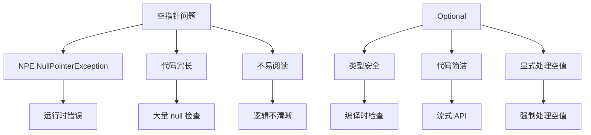
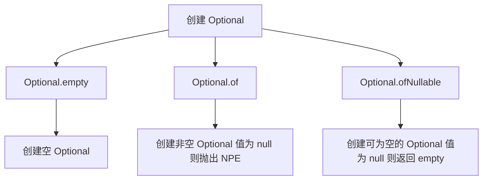

# Optional 类

Optional 是 Java 8 引入的容器类，用于**优雅地处理空值**，避免空指针异常（NullPointerException）。

## Optional 概述

### 为什么需要 Optional



**Optional 的作用**：
- **避免 NPE**：优雅地处理可能为 null 的值
- **代码简洁**：减少 if (obj != null) 检查
- **显式处理**：明确表示值可能不存在
- **类型安全**：在编译期提醒处理空值

### Optional vs null

```java
import java.util.Optional;

public class OptionalVsNull {
    public static void main(String[] args) {
        // 传统方式：使用 null
        String name1 = getName();
        if (name1 != null) {
            System.out.println(name1.toUpperCase());
        }
        
        // 使用 Optional：更优雅
        Optional<String> name2 = getOptionalName();
        name2.ifPresent(name -> System.out.println(name.toUpperCase()));
    }
    
    private static String getName() {
        return null;
    }
    
    private static Optional<String> getOptionalName() {
        return Optional.empty();
    }
}
```

## 创建 Optional

### 创建方式



```java
import java.util.Optional;

public class CreateOptional {
    public static void main(String[] args) {
        // 1. Optional.empty()：创建空 Optional
        Optional<String> empty = Optional.empty();
        System.out.println(empty.isPresent());  // false
        
        // 2. Optional.of(value)：创建非空 Optional
        // 如果 value 为 null，抛出 NullPointerException
        Optional<String> nonNull = Optional.of("Hello");
        System.out.println(nonNull.isPresent());  // true
        
        // Optional<String> nullOpt = Optional.of(null);  // ❌ 抛出 NPE
        
        // 3. Optional.ofNullable(value)：创建可为空的 Optional
        Optional<String> nullable1 = Optional.ofNullable("Hello");
        Optional<String> nullable2 = Optional.ofNullable(null);
        System.out.println(nullable1.isPresent());  // true
        System.out.println(nullable2.isPresent());  // false
    }
}
```

## Optional 操作

### 判断操作

```java
import java.util.Optional;

public class OptionalCheck {
    public static void main(String[] args) {
        Optional<String> opt1 = Optional.of("Hello");
        Optional<String> opt2 = Optional.empty();
        
        // isPresent()：是否包含值
        System.out.println(opt1.isPresent());  // true
        System.out.println(opt2.isPresent());  // false
        
        // isEmpty()：是否为空（Java 11+）
        // System.out.println(opt1.isEmpty());  // false
        // System.out.println(opt2.isEmpty());  // true
        
        // ifPresent()：如果有值，执行操作
        opt1.ifPresent(s -> System.out.println("值: " + s));  // 值: Hello
        opt2.ifPresent(s -> System.out.println("值: " + s));  // 不执行
    }
}
```

### 获取操作

```java
import java.util.Optional;

public class OptionalGet {
    public static void main(String[] args) {
        Optional<String> opt1 = Optional.of("Hello");
        Optional<String> opt2 = Optional.empty();
        
        // get()：获取值（如果为空，抛出 NoSuchElementException）
        try {
            String value1 = opt1.get();
            System.out.println(value1);  // Hello
            
            // String value2 = opt2.get();  // ❌ 抛出异常
        } catch (Exception e) {
            System.out.println("异常: " + e.getMessage());
        }
        
        // orElse()：如果为空，返回默认值
        String value3 = opt1.orElse("Default");
        String value4 = opt2.orElse("Default");
        System.out.println(value3);  // Hello
        System.out.println(value4);  // Default
        
        // orElseGet()：如果为空，调用 Supplier
        String value5 = opt2.orElseGet(() -> {
            System.out.println("执行 Supplier");
            return "Default from Supplier";
        });
        System.out.println(value5);
        
        // orElseThrow()：如果为空，抛出异常
        try {
            String value6 = opt2.orElseThrow();
            // String value6 = opt2.orElseThrow(() -> new RuntimeException("值为空"));
        } catch (Exception e) {
            System.out.println("异常: " + e.getMessage());
        }
    }
}
```

### 转换操作

```java
import java.util.Optional;

public class OptionalTransform {
    public static void main(String[] args) {
        Optional<String> opt1 = Optional.of("Hello");
        Optional<String> opt2 = Optional.empty();
        
        // map()：对值进行转换
        Optional<Integer> length1 = opt1.map(String::length);
        Optional<Integer> length2 = opt2.map(String::length);
        System.out.println(length1);  // Optional[5]
        System.out.println(length2);  // Optional.empty
        
        // flatMap()：对值进行转换（返回值已经是 Optional）
        Optional<String> upper1 = opt1.flatMap(s -> Optional.of(s.toUpperCase()));
        System.out.println(upper1);  // Optional[HELLO]
        
        // filter()：过滤值
        Optional<String> filtered1 = opt1.filter(s -> s.length() > 3);
        Optional<String> filtered2 = opt1.filter(s -> s.length() > 10);
        System.out.println(filtered1);  // Optional[Hello]
        System.out.println(filtered2);  // Optional.empty
    }
}
```

## Optional 实际应用

### 方法返回值

```java
import java.util.Optional;

public class OptionalAsReturn {
    
    // ✅ 推荐：返回 Optional
    public Optional<String> findUserName(int userId) {
        if (userId <= 0) {
            return Optional.empty();
        }
        return Optional.of("User" + userId);
    }
    
    // ❌ 不推荐：返回 null
    public String findUserNameOld(int userId) {
        if (userId <= 0) {
            return null;
        }
        return "User" + userId;
    }
    
    public static void main(String[] args) {
        OptionalAsReturn example = new OptionalAsReturn();
        
        // 使用 Optional
        Optional<String> userName = example.findUserName(100);
        userName.ifPresent(name -> System.out.println("用户名: " + name));
        
        // 链式调用
        String result = example.findUserName(100)
                               .map(String::toUpperCase)
                               .orElse("UNKNOWN");
        System.out.println(result);  // USER100
    }
}
```

### 链式调用

```java
import java.util.Optional;

public class OptionalChaining {
    
    static class User {
        private String name;
        private Address address;
        
        public User(String name) {
            this.name = name;
        }
        
        public String getName() { return name; }
        public Address getAddress() { return address; }
    }
    
    static class Address {
        private String city;
        
        public Address(String city) {
            this.city = city;
        }
        
        public String getCity() { return city; }
    }
    
    public static void main(String[] args) {
        User user = new User("张三");
        user.address = new Address("北京");
        
        // 传统方式：多层 null 检查
        /*
        String city = null;
        if (user != null) {
            Address address = user.getAddress();
            if (address != null) {
                city = address.getCity();
            }
        }
        */
        
        // 使用 Optional：简洁
        String city = Optional.ofNullable(user)
                             .map(User::getAddress)
                             .map(Address::getCity)
                             .orElse("未知");
        System.out.println(city);  // 北京
        
        // user 为 null 的情况
        User nullUser = null;
        String city2 = Optional.ofNullable(nullUser)
                              .map(User::getAddress)
                              .map(Address::getCity)
                              .orElse("未知");
        System.out.println(city2);  // 未知
    }
}
```

### 与 Stream 集成

```java
import java.util.*;
import java.util.stream.*;

public class OptionalWithStream {
    public static void main(String[] args) {
        List<Optional<String>> list = Arrays.asList(
            Optional.of("A"),
            Optional.empty(),
            Optional.of("B"),
            Optional.empty(),
            Optional.of("C")
        );
        
        // 过滤掉空 Optional
        List<String> filtered = list.stream()
                                     .filter(Optional::isPresent)
                                     .map(Optional::get)
                                     .collect(Collectors.toList());
        System.out.println(filtered);  // [A, B, C]
        
        // 使用 flatMap（Java 9+）
        /*
        List<String> result = list.stream()
                                   .flatMap(Optional::stream)
                                   .collect(Collectors.toList());
        System.out.println(result);  // [A, B, C]
        */
    }
}
```

## Optional 最佳实践

### ✅ 推荐用法

```java
import java.util.Optional;

public class BestPractices {
    
    // 1. 方法返回 Optional
    public Optional<String> findUser(int id) {
        return Optional.ofNullable("User" + id);
    }
    
    // 2. 使用 orElse 提供默认值
    public String getUserName(int id) {
        return findUser(id).orElse("匿名用户");
    }
    
    // 3. 使用 orElseGet 延迟计算
    public String getUserNameLazy(int id) {
        return findUser(id).orElseGet(() -> {
            // 复杂的默认值计算
            return "匿名用户-" + System.currentTimeMillis();
        });
    }
    
    // 4. 使用 ifPresent 避免显式检查
    public void printUserName(int id) {
        findUser(id).ifPresent(name -> System.out.println("用户: " + name));
    }
    
    // 5. 链式调用
    public String getUserInfo(int id) {
        return findUser(id)
                   .map(String::toUpperCase)
                   .filter(name -> name.startsWith("USER"))
                   .orElse("无效用户");
    }
}
```

### ❌ 不推荐用法

```java
import java.util.Optional;

public class AntiPatterns {
    
    // ❌ 1. 直接调用 get()（可能抛出异常）
    public String badGet(Optional<String> opt) {
        // return opt.get();  // 不安全
        return opt.orElse("默认值");  // ✅ 正确
    }
    
    // ❌ 2. 使用 isPresent() + get()（违背 Optional 的初衷）
    public void badCheck(Optional<String> opt) {
        /*
        if (opt.isPresent()) {
            System.out.println(opt.get());
        }
        */
        
        // ✅ 正确
        opt.ifPresent(System.out::println);
    }
    
    // ❌ 3. Optional 作为字段
    /*
    public class User {
        private Optional<String> name;  // ❌ 不推荐
    }
    */
    
    // ✅ 正确：直接使用 nullable
    public class User {
        private String name;  // ✅ 推荐
    }
    
    // ❌ 4. Optional 作为方法参数
    /*
    public void method(Optional<String> param) { }  // ❌ 不推荐
    */
    
    // ✅ 正确：使用 null 或重载
    public void method(String param) { }
    public void method() { }
}
```

## Optional 工具方法

### 常用工具

```java
import java.util.*;
import java.util.stream.*;

public class OptionalUtils {
    
    // 第一个非空 Optional
    @SafeVarargs
    public static <T> Optional<T> firstPresent(Optional<T>... optionals) {
        return Arrays.stream(optionals)
                    .filter(Optional::isPresent)
                    .findFirst()
                    .orElse(Optional.empty());
    }
    
    // 将 nullable 转为 Optional
    public static <T> Optional<T> ofNullable(T value) {
        return Optional.ofNullable(value);
    }
    
    // 将 Optional 转回 nullable（用于遗留代码）
    public static <T> T orElseNull(Optional<T> optional) {
        return optional.orElse(null);
    }
    
    // 测试
    public static void main(String[] args) {
        Optional<String> opt1 = Optional.empty();
        Optional<String> opt2 = Optional.of("A");
        Optional<String> opt3 = Optional.of("B");
        
        Optional<String> first = firstPresent(opt1, opt2, opt3);
        System.out.println(first);  // Optional[A]
    }
}
```

## 小结

::: tip 核心要点

1. **创建 Optional**：
   - `Optional.empty()`：空 Optional
   - `Optional.of(value)`：非空 Optional
   - `Optional.ofNullable(value)`：可为空 Optional

2. **判断操作**：
   - `isPresent()`：是否包含值
   - `ifPresent()`：有值时执行操作

3. **获取操作**：
   - `orElse()`：返回默认值
   - `orElseGet()`：调用 Supplier
   - `orElseThrow()`：抛出异常

4. **转换操作**：
   - `map()`：转换值
   - `flatMap()`：扁平化转换
   - `filter()`：过滤值

5. **最佳实践**：
   - ✅ 作为方法返回值
   - ❌ 不作为字段
   - ❌ 不作为方法参数

:::

::: warning 注意事项

1. **不要过度使用**：Optional 不是万能的
2. **不要嵌套 Optional**：使用 flatMap 避免嵌套
3. **性能考虑**：Optional 有一定开销，不适合性能敏感场景
4. **序列化**：Optional 不可序列化，不要作为字段

:::

::: info 延伸学习

- **Lambda 表达式**：[Lambda 详解](/java/base/11-lambda-stream/lambda.md)
- **Stream API**：[Stream 流式操作](/java/base/11-lambda-stream/stream.md)
- **函数式编程**：Java 函数式编程风格

:::
