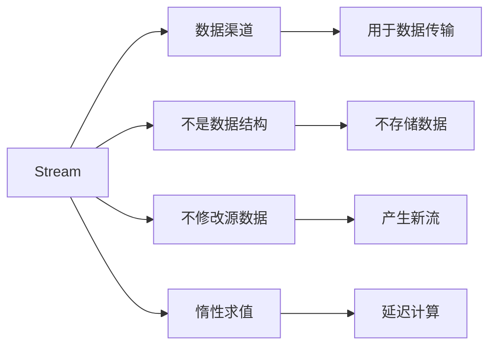
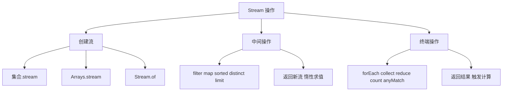
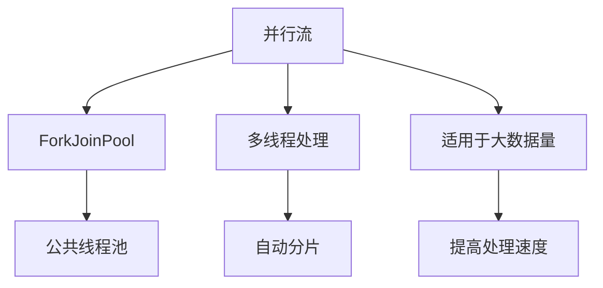

# Stream API

Stream API 是 Java 8 引入的重要特性，它提供了一种**声明式**的方式来处理集合数据，使代码更加简洁和高效。

## Stream 概述

### 什么是 Stream



**Stream（流）**：
- **数据渠道**：用于传输数据的管道
- **不是数据结构**：不存储数据
- **不修改源数据**：操作返回新的流
- **惰性求值**：只有终端操作才会执行

::: tip Stream vs 集合

| 特性 | 集合 | Stream |
|------|------|--------|
| 用途 | 存储和访问数据 | 计算和处理数据 |
| 特点 | 惰性、可修改 | 惰性、不可修改 |
| 遍历 | 外部迭代 | 内部迭代 |
| 操作 | 多次遍历 | 只能遍历一次 |

:::

### Stream 操作分类



**Stream 操作类型**：
1. **创建流**：从数据源创建流
2. **中间操作**：对流进行处理，返回新的流
3. **终端操作**：触发计算，返回结果

## 创建 Stream

### 常见创建方式

```java
import java.util.*;
import java.util.stream.*;

public class CreateStream {
    public static void main(String[] args) {
        // 1. 从集合创建
        List<String> list = Arrays.asList("a", "b", "c");
        Stream<String> stream1 = list.stream();
        Stream<String> stream2 = list.parallelStream();  // 并行流
        
        // 2. 从数组创建
        int[] array = {1, 2, 3, 4, 5};
        IntStream stream3 = Arrays.stream(array);
        
        // 3. 使用 Stream.of
        Stream<String> stream4 = Stream.of("a", "b", "c");
        Stream<Integer> stream5 = Stream.of(1, 2, 3, 4, 5);
        
        // 4. 使用 Stream.generate
        Stream<Double> stream6 = Stream.generate(Math::random);
        // stream6.limit(10).forEach(System.out::println);
        
        // 5. 使用 Stream.iterate
        Stream<Integer> stream7 = Stream.iterate(0, n -> n + 2);
        // stream7.limit(10).forEach(System.out::println);
        
        // 6. 从范围创建
        IntStream stream8 = IntStream.range(1, 5);     // [1, 5)
        IntStream stream9 = IntStream.rangeClosed(1, 5); // [1, 5]
        
        // 7. 从 BufferedReader
        // try (BufferedReader br = new BufferedReader(new FileReader("file.txt"))) {
        //     Stream<String> lines = br.lines();
        // }
    }
}
```

## 中间操作

### filter - 过滤

```java
import java.util.*;
import java.util.stream.*;

public class FilterDemo {
    public static void main(String[] args) {
        List<Integer> numbers = Arrays.asList(1, 2, 3, 4, 5, 6, 7, 8, 9, 10);
        
        // 过滤偶数
        numbers.stream()
               .filter(n -> n % 2 == 0)
               .forEach(System.out::println);
        
        // 链式过滤
        System.out.println("--- 链式过滤 ---");
        numbers.stream()
               .filter(n -> n > 5)    // 大于5
               .filter(n -> n % 2 == 0) // 偶数
               .forEach(System.out::println);
        
        // 过滤字符串
        List<String> words = Arrays.asList("hello", "world", "java", "stream");
        words.stream()
             .filter(s -> s.length() > 4)
             .forEach(System.out::println);
    }
}
```

### map - 映射

```java
import java.util.*;
import java.util.stream.*;

public class MapDemo {
    public static void main(String[] args) {
        List<Integer> numbers = Arrays.asList(1, 2, 3, 4, 5);
        
        // 每个元素乘以2
        numbers.stream()
               .map(n -> n * 2)
               .forEach(System.out::println);
        
        // 字符串转大写
        List<String> words = Arrays.asList("hello", "world", "java");
        words.stream()
             .map(String::toUpperCase)
             .forEach(System.out::println);
        
        // flatMap：扁平化
        System.out.println("--- flatMap ---");
        List<List<Integer>> nested = Arrays.asList(
            Arrays.asList(1, 2),
            Arrays.asList(3, 4),
            Arrays.asList(5, 6)
        );
        nested.stream()
              .flatMap(List::stream)
              .forEach(System.out::println);
    }
}
```

### sorted - 排序

```java
import java.util.*;
import java.util.stream.*;

public class SortedDemo {
    public static void main(String[] args) {
        List<Integer> numbers = Arrays.asList(5, 2, 8, 1, 9, 3);
        
        // 自然排序
        numbers.stream()
               .sorted()
               .forEach(System.out::println);
        
        // 自定义排序
        System.out.println("--- 降序 ---");
        numbers.stream()
               .sorted((a, b) -> b - a)
               .forEach(System.out::println);
        
        // 对象排序
        List<String> words = Arrays.asList("banana", "apple", "cherry");
        words.stream()
             .sorted(Comparator.comparingInt(String::length))
             .forEach(System.out::println);
    }
}
```

### distinct - 去重

```java
import java.util.*;
import java.util.stream.*;

public class DistinctDemo {
    public static void main(String[] args) {
        List<Integer> numbers = Arrays.asList(1, 2, 2, 3, 3, 3, 4, 5);
        
        numbers.stream()
               .distinct()
               .forEach(System.out::println);
        
        // 对象去重
        List<String> words = Arrays.asList("a", "b", "a", "c", "b");
        words.stream()
             .distinct()
             .forEach(System.out::println);
    }
}
```

### limit 和 skip

```java
import java.util.*;
import java.util.stream.*;

public class LimitSkipDemo {
    public static void main(String[] args) {
        List<Integer> numbers = Arrays.asList(1, 2, 3, 4, 5, 6, 7, 8, 9, 10);
        
        // limit：限制数量
        System.out.println("--- 前5个 ---");
        numbers.stream()
               .limit(5)
               .forEach(System.out::println);
        
        // skip：跳过前n个
        System.out.println("--- 跳过前5个 ---");
        numbers.stream()
               .skip(5)
               .forEach(System.out::println);
        
        // 分页
        System.out.println("--- 第2页（每页3个）---");
        int pageSize = 3;
        int pageNum = 2;
        numbers.stream()
               .skip((pageNum - 1) * pageSize)
               .limit(pageSize)
               .forEach(System.out::println);
    }
}
```

## 终端操作

### forEach - 遍历

```java
import java.util.*;
import java.util.stream.*;

public class ForEachDemo {
    public static void main(String[] args) {
        List<String> words = Arrays.asList("hello", "world", "java");
        
        // forEach
        words.stream()
             .forEach(System.out::println);
        
        // forEachOrdered（并行流保持顺序）
        List<Integer> numbers = Arrays.asList(5, 2, 8, 1, 9);
        numbers.parallelStream()
               .forEachOrdered(System.out::println);
    }
}
```

### collect - 收集

```java
import java.util.*;
import java.util.stream.*;

public class CollectDemo {
    public static void main(String[] args) {
        List<String> words = Arrays.asList("hello", "world", "java", "stream");
        
        // 收集为 List
        List<String> list = words.stream()
                                  .filter(s -> s.length() > 4)
                                  .collect(Collectors.toList());
        System.out.println(list);
        
        // 收集为 Set
        Set<String> set = words.stream()
                               .map(String::toUpperCase)
                               .collect(Collectors.toSet());
        System.out.println(set);
        
        // 收集为 Map
        Map<String, Integer> map = words.stream()
                                        .collect(Collectors.toMap(
                                            s -> s,           // key
                                            String::length    // value
                                        ));
        System.out.println(map);
        
        // 分组
        Map<Integer, List<String>> grouped = words.stream()
                                                 .collect(Collectors.groupingBy(
                                                     String::length
                                                 ));
        System.out.println(grouped);
        
        // 分区
        Map<Boolean, List<String>> partitioned = words.stream()
                                                     .collect(Collectors.partitioningBy(
                                                         s -> s.length() > 4
                                                     ));
        System.out.println(partitioned);
        
        // 字符串连接
        String joined = words.stream()
                             .collect(Collectors.joining(", "));
        System.out.println(joined);
    }
}
```

### reduce - 归约

```java
import java.util.*;
import java.util.stream.*;

public class ReduceDemo {
    public static void main(String[] args) {
        List<Integer> numbers = Arrays.asList(1, 2, 3, 4, 5);
        
        // 求和
        int sum = numbers.stream()
                        .reduce(0, (a, b) -> a + b);
        System.out.println("求和: " + sum);
        
        // 求和（使用方法引用）
        sum = numbers.stream()
                     .reduce(0, Integer::sum);
        System.out.println("求和: " + sum);
        
        // 求最大值
        numbers.stream()
               .reduce(Integer::max)
               .ifPresent(System.out::println);
        
        // 求最小值
        numbers.stream()
               .reduce(Integer::min)
               .ifPresent(System.out::println);
        
        // 字符串连接
        List<String> words = Arrays.asList("Hello", " ", "World", "!");
        String result = words.stream()
                             .reduce("", (a, b) -> a + b);
        System.out.println(result);
    }
}
```

### count、anyMatch、allMatch、noneMatch

```java
import java.util.*;
import java.util.stream.*;

public class MatchDemo {
    public static void main(String[] args) {
        List<Integer> numbers = Arrays.asList(1, 2, 3, 4, 5, 6, 7, 8, 9, 10);
        
        // count：计数
        long count = numbers.stream()
                           .filter(n -> n % 2 == 0)
                           .count();
        System.out.println("偶数个数: " + count);
        
        // anyMatch：任意匹配
        boolean hasEven = numbers.stream()
                                .anyMatch(n -> n % 2 == 0);
        System.out.println("有偶数: " + hasEven);
        
        // allMatch：全部匹配
        boolean allPositive = numbers.stream()
                                     .allMatch(n -> n > 0);
        System.out.println("全是正数: " + allPositive);
        
        // noneMatch：全部不匹配
        boolean noneNegative = numbers.stream()
                                      .noneMatch(n -> n < 0);
        System.out.println("没有负数: " + noneNegative);
        
        // findFirst：查找第一个
        numbers.stream()
               .filter(n -> n > 5)
               .findFirst()
               .ifPresent(System.out::println);
        
        // findAny：查找任意一个
        numbers.stream()
               .filter(n -> n > 5)
               .findAny()
               .ifPresent(System.out::println);
    }
}
```

## 并行流

### 并行流概述



**并行流**：
- 使用 **ForkJoinPool** 并行处理
- 自动将数据分片处理
- 适用于**大数据量**、**计算密集型**操作

### 并行流示例

```java
import java.util.*;
import java.util.stream.*;

public class ParallelStream {
    public static void main(String[] args) {
        List<Integer> numbers = Arrays.asList(
            1, 2, 3, 4, 5, 6, 7, 8, 9, 10
        );
        
        // 串行流
        long start1 = System.currentTimeMillis();
        long sum1 = numbers.stream()
                           .mapToLong(n -> {
                               try {
                                   Thread.sleep(100);
                               } catch (InterruptedException e) {
                                   e.printStackTrace();
                               }
                               return n;
                           })
                           .sum();
        long end1 = System.currentTimeMillis();
        System.out.println("串行: " + sum1 + ", 耗时: " + (end1 - start1) + "ms");
        
        // 并行流
        long start2 = System.currentTimeMillis();
        long sum2 = numbers.parallelStream()
                           .mapToLong(n -> {
                               try {
                                   Thread.sleep(100);
                               } catch (InterruptedException e) {
                                   e.printStackTrace();
                               }
                               return n;
                           })
                           .sum();
        long end2 = System.currentTimeMillis();
        System.out.println("并行: " + sum2 + ", 耗时: " + (end2 - start2) + "ms");
    }
}
```

::: tip 并行流注意事项

1. **适用场景**：大数据量、计算密集型
2. **不适用场景**：小数据量、简单操作
3. **线程安全**：操作应该是无状态的
4. **顺序敏感**：如果需要顺序，使用 forEachOrdered

:::

## 实际应用示例

### 复杂数据处理

```java
import java.util.*;
import java.util.stream.*;

class Employee {
    private String name;
    private String department;
    private int age;
    private double salary;
    
    public Employee(String name, String department, int age, double salary) {
        this.name = name;
        this.department = department;
        this.age = age;
        this.salary = salary;
    }
    
    public String getName() { return name; }
    public String getDepartment() { return department; }
    public int getAge() { return age; }
    public double getSalary() { return salary; }
    
    @Override
    public String toString() {
        return name + "(" + department + ", " + age + ", " + salary + ")";
    }
}

public class StreamExamples {
    public static void main(String[] args) {
        List<Employee> employees = Arrays.asList(
            new Employee("张三", "IT", 25, 8000),
            new Employee("李四", "IT", 30, 12000),
            new Employee("王五", "HR", 28, 6000),
            new Employee("赵六", "IT", 35, 15000),
            new Employee("钱七", "HR", 32, 7000)
        );
        
        // 1. 筛选IT部门员工
        System.out.println("--- IT 部门员工 ---");
        employees.stream()
                 .filter(e -> e.getDepartment().equals("IT"))
                 .forEach(System.out::println);
        
        // 2. 按部门分组
        System.out.println("\n--- 按部门分组 ---");
        Map<String, List<Employee>> byDept = employees.stream()
                                                       .collect(Collectors.groupingBy(
                                                           Employee::getDepartment
                                                       ));
        byDept.forEach((dept, empList) -> {
            System.out.println(dept + ": " + empList);
        });
        
        // 3. 计算每个部门的平均工资
        System.out.println("\n--- 部门平均工资 ---");
        Map<String, Double> avgSalary = employees.stream()
                                                 .collect(Collectors.groupingBy(
                                                     Employee::getDepartment,
                                                     Collectors.averagingDouble(Employee::getSalary)
                                                 ));
        avgSalary.forEach((dept, avg) -> {
            System.out.printf("%s: %.2f\n", dept, avg);
        });
        
        // 4. 找出工资最高的员工
        System.out.println("\n--- 工资最高 ---");
        employees.stream()
                 .max(Comparator.comparingDouble(Employee::getSalary))
                 .ifPresent(System.out::println);
        
        // 5. 获取员工姓名列表
        System.out.println("\n--- 员工姓名 ---");
        List<String> names = employees.stream()
                                       .map(Employee::getName)
                                       .collect(Collectors.toList());
        System.out.println(names);
    }
}
```

## 小结

::: tip 核心要点

1. **Stream 创建**：集合.stream()、Arrays.stream()、Stream.of()
2. **中间操作**：filter、map、sorted、distinct、limit、skip
3. **终端操作**：forEach、collect、reduce、count、match
4. **收集器**：Collectors.toList()、groupingBy、partitioningBy
5. **并行流**：parallelStream()，适用于大数据量
6. **惰性求值**：只有终端操作才会执行

:::

::: warning 注意事项

1. **只能遍历一次**：Stream 是一次性的，不能重复使用
2. **不修改源数据**：操作返回新的流或结果
3. **性能考虑**：小数据量时 Stream 可能比循环慢
4. **线程安全**：并行流操作应该是无状态的

:::

::: info 下一步
- [Optional 类](/java/base/11-lambda-stream/optional.md) - 学习 Optional 空指针处理
:::
