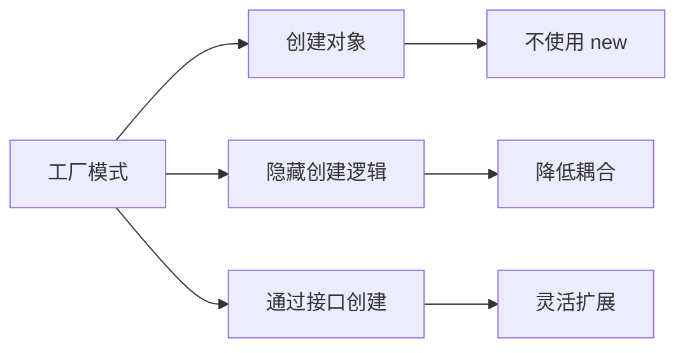
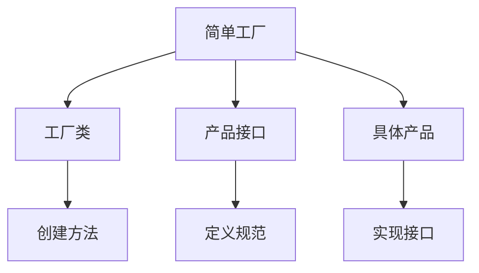
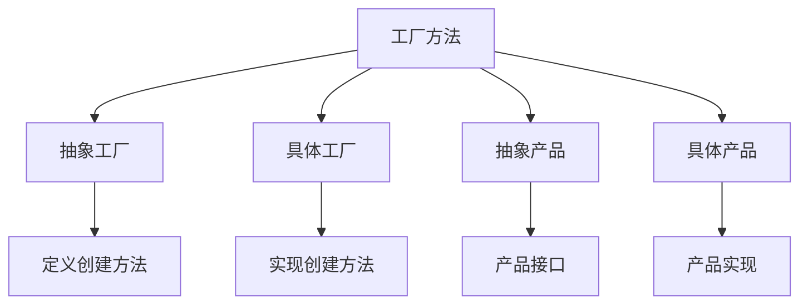
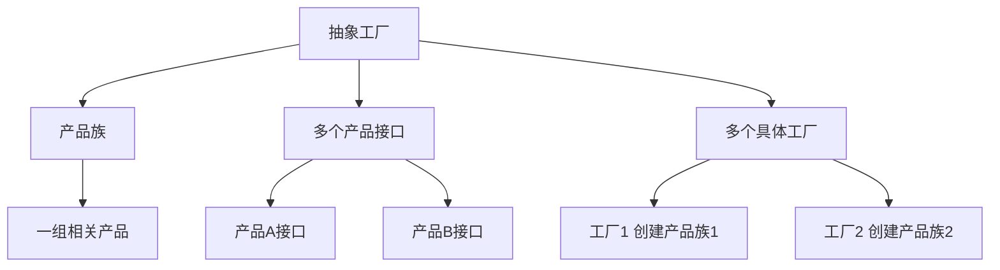
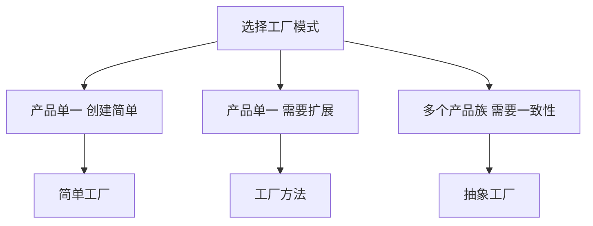

# 工厂模式

工厂模式是 Java 中最常用的设计模式之一，它提供了一种**创建对象的最佳方式**，在创建对象时不会对客户端暴露创建逻辑。

## 工厂模式概述

### 什么是工厂模式



**工厂模式的作用**：
- **解耦**：将对象创建和使用分离
- **复用**：集中管理对象创建逻辑
- **扩展**：方便新增产品类
- **封装**：隐藏复杂的创建逻辑

::: tip 为什么需要工厂模式

```java
// ❌ 不使用工厂：直接 new
public class Client {
    public void doSomething() {
        Product product = new ConcreteProduct();  // 耦合具体类
        product.use();
    }
}

// ✅ 使用工厂：通过工厂创建
public class Client {
    public void doSomething() {
        Product product = Factory.createProduct();  // 只依赖接口
        product.use();
    }
}
```

:::

## 简单工厂

### 基本实现



```java
// 产品接口
interface Product {
    void use();
}

// 具体产品A
class ConcreteProductA implements Product {
    @Override
    public void use() {
        System.out.println("使用产品 A");
    }
}

// 具体产品B
class ConcreteProductB implements Product {
    @Override
    public void use() {
        System.out.println("使用产品 B");
    }
}

// 简单工厂类
class SimpleFactory {
    // 根据类型创建产品
    public static Product createProduct(String type) {
        switch (type) {
            case "A":
                return new ConcreteProductA();
            case "B":
                return new ConcreteProductB();
            default:
                throw new IllegalArgumentException("未知产品类型");
        }
    }
}

// 使用
class SimpleFactoryDemo {
    public static void main(String[] args) {
        Product productA = SimpleFactory.createProduct("A");
        productA.use();  // 使用产品 A
        
        Product productB = SimpleFactory.createProduct("B");
        productB.use();  // 使用产品 B
    }
}
```

### 简单工厂示例

```java
// 图形接口
interface Shape {
    void draw();
}

// 圆形
class Circle implements Shape {
    @Override
    public void draw() {
        System.out.println("绘制圆形");
    }
}

// 矩形
class Rectangle implements Shape {
    @Override
    public void draw() {
        System.out.println("绘制矩形");
    }
}

// 三角形
class Triangle implements Shape {
    @Override
    public void draw() {
        System.out.println("绘制三角形");
    }
}

// 图形工厂
class ShapeFactory {
    public static Shape createShape(String type) {
        if (type == null) {
            return null;
        }
        
        switch (type.toUpperCase()) {
            case "CIRCLE":
                return new Circle();
            case "RECTANGLE":
                return new Rectangle();
            case "TRIANGLE":
                return new Triangle();
            default:
                throw new IllegalArgumentException("未知图形类型: " + type);
        }
    }
}

// 使用
class ShapeFactoryDemo {
    public static void main(String[] args) {
        Shape circle = ShapeFactory.createShape("circle");
        circle.draw();
        
        Shape rectangle = ShapeFactory.createShape("rectangle");
        rectangle.draw();
    }
}
```

::: tip 简单工厂优缺点

| 优点 | 缺点 |
|------|------|
| 创建逻辑集中 | 违反开闭原则 |
| 客户端无需知道具体类 | 工厂类职责过重 |
| 易于使用 | 扩展需要修改工厂类 |

:::

## 工厂方法

### 基本实现



```java
// 抽象产品
interface Animal {
    void speak();
}

// 具体产品：狗
class Dog implements Animal {
    @Override
    public void speak() {
        System.out.println("汪汪汪");
    }
}

// 具体产品：猫
class Cat implements Animal {
    @Override
    public void speak() {
        System.out.println("喵喵喵");
    }
}

// 抽象工厂
interface AnimalFactory {
    Animal createAnimal();
}

// 具体工厂：狗工厂
class DogFactory implements AnimalFactory {
    @Override
    public Animal createAnimal() {
        return new Dog();
    }
}

// 具体工厂：猫工厂
class CatFactory implements AnimalFactory {
    @Override
    public Animal createAnimal() {
        return new Cat();
    }
}

// 使用
class FactoryMethodDemo {
    public static void main(String[] args) {
        // 使用狗工厂
        AnimalFactory dogFactory = new DogFactory();
        Animal dog = dogFactory.createAnimal();
        dog.speak();  // 汪汪汪
        
        // 使用猫工厂
        AnimalFactory catFactory = new CatFactory();
        Animal cat = catFactory.createAnimal();
        cat.speak();  // 喵喵喵
    }
}
```

### 工厂方法示例

```java
// 日志接口
interface Logger {
    void log(String message);
}

// 文件日志
class FileLogger implements Logger {
    @Override
    public void log(String message) {
        System.out.println("写入文件: " + message);
    }
}

// 控制台日志
class ConsoleLogger implements Logger {
    @Override
    public void log(String message) {
        System.out.println("控制台输出: " + message);
    }
}

// 数据库日志
class DatabaseLogger implements Logger {
    @Override
    public void log(String message) {
        System.out.println("写入数据库: " + message);
    }
}

// 抽象工厂
interface LoggerFactory {
    Logger createLogger();
}

// 具体工厂
class FileLoggerFactory implements LoggerFactory {
    @Override
    public Logger createLogger() {
        return new FileLogger();
    }
}

class ConsoleLoggerFactory implements LoggerFactory {
    @Override
    public Logger createLogger() {
        return new ConsoleLogger();
    }
}

class DatabaseLoggerFactory implements LoggerFactory {
    @Override
    public Logger createLogger() {
        return new DatabaseLogger();
    }
}

// 使用
class LoggerFactoryDemo {
    public static void main(String[] args) {
        // 可以通过配置文件或反射选择工厂
        LoggerFactory factory = new ConsoleLoggerFactory();
        Logger logger = factory.createLogger();
        logger.log("系统启动");
    }
}
```

::: tip 工厂方法优缺点

| 优点 | 缺点 |
|------|------|
| 符合开闭原则 | 类的数量增多 |
| 每个工厂只负责一种产品 | 增加系统复杂性 |
| 客户端只需知道抽象工厂 | 需要引入抽象层 |

:::

## 抽象工厂

### 基本实现



```java
// 抽象产品A：按钮
interface Button {
    void click();
}

// 抽象产品B：文本框
interface TextField {
    void input();
}

// 具体产品：Windows 风格
class WindowsButton implements Button {
    @Override
    public void click() {
        System.out.println("Windows 风格按钮点击");
    }
}

class WindowsTextField implements TextField {
    @Override
    public void input() {
        System.out.println("Windows 风格文本框输入");
    }
}

// 具体产品：Mac 风格
class MacButton implements Button {
    @Override
    public void click() {
        System.out.println("Mac 风格按钮点击");
    }
}

class MacTextField implements TextField {
    @Override
    public void input() {
        System.out.println("Mac 风格文本框输入");
    }
}

// 抽象工厂：UI 组件工厂
interface UIComponentFactory {
    Button createButton();
    TextField createTextField();
}

// 具体工厂：Windows 组件工厂
class WindowsUIFactory implements UIComponentFactory {
    @Override
    public Button createButton() {
        return new WindowsButton();
    }
    
    @Override
    public TextField createTextField() {
        return new WindowsTextField();
    }
}

// 具体工厂：Mac 组件工厂
class MacUIFactory implements UIComponentFactory {
    @Override
    public Button createButton() {
        return new MacButton();
    }
    
    @Override
    public TextField createTextField() {
        return new MacTextField();
    }
}

// 使用
class AbstractFactoryDemo {
    public static void main(String[] args) {
        // 根据 OS 选择工厂
        String os = System.getProperty("os.name").toLowerCase();
        UIComponentFactory factory;
        
        if (os.contains("mac")) {
            factory = new MacUIFactory();
        } else {
            factory = new WindowsUIFactory();
        }
        
        // 创建组件
        Button button = factory.createButton();
        TextField textField = factory.createTextField();
        
        button.click();
        textField.input();
    }
}
```

### 抽象工厂示例

```java
// 抽象产品：数据库连接
interface DatabaseConnection {
    void connect();
}

// 抽象产品：SQL 语句
interface SqlStatement {
    void execute();
}

// MySQL 产品族
class MySqlConnection implements DatabaseConnection {
    @Override
    public void connect() {
        System.out.println("连接 MySQL 数据库");
    }
}

class MySqlStatement implements SqlStatement {
    @Override
    public void execute() {
        System.out.println("执行 MySQL 语句");
    }
}

// Oracle 产品族
class OracleConnection implements DatabaseConnection {
    @Override
    public void connect() {
        System.out.println("连接 Oracle 数据库");
    }
}

class OracleStatement implements SqlStatement {
    @Override
    public void execute() {
        System.out.println("执行 Oracle 语句");
    }
}

// 抽象工厂：数据库工厂
interface DatabaseFactory {
    DatabaseConnection createConnection();
    SqlStatement createStatement();
}

// 具体工厂：MySQL 工厂
class MySqlFactory implements DatabaseFactory {
    @Override
    public DatabaseConnection createConnection() {
        return new MySqlConnection();
    }
    
    @Override
    public SqlStatement createStatement() {
        return new MySqlStatement();
    }
}

// 具体工厂：Oracle 工厂
class OracleFactory implements DatabaseFactory {
    @Override
    public DatabaseConnection createConnection() {
        return new OracleConnection();
    }
    
    @Override
    public SqlStatement createStatement() {
        return new OracleStatement();
    }
}

// 使用
class DatabaseFactoryDemo {
    public static void main(String[] args) {
        // 根据配置选择工厂
        String dbType = "mysql";
        DatabaseFactory factory;
        
        if ("mysql".equals(dbType)) {
            factory = new MySqlFactory();
        } else if ("oracle".equals(dbType)) {
            factory = new OracleFactory();
        } else {
            throw new IllegalArgumentException("未知数据库类型");
        }
        
        // 使用工厂创建产品族
        DatabaseConnection connection = factory.createConnection();
        SqlStatement statement = factory.createStatement();
        
        connection.connect();
        statement.execute();
    }
}
```

::: tip 抽象工厂优缺点

| 优点 | 缺点 |
|------|------|
| 保证产品族一致性 | 产品族扩展困难 |
| 分离客户端和具体实现 | 增加系统复杂性 |
| 符合开闭原则 | 需要大量接口和类 |

:::

## 三种工厂模式对比

### 对比表

| 特性 | 简单工厂 | 工厂方法 | 抽象工厂 |
|------|----------|----------|----------|
| **复杂度** | 简单 | 中等 | 复杂 |
| **开闭原则** | 不符合 | 符合 | 符合 |
| **产品扩展** | 修改工厂类 | 新建工厂类 | 新建工厂族 |
| **产品数量** | 单一产品 | 单一产品 | 产品族 |
| **客户端** | 依赖工厂类 | 依赖抽象工厂 | 依赖抽象工厂 |

### 选择建议



## 实际应用

### Calendar 示例

```java
import java.util.Calendar;
import java.util.GregorianCalendar;

// Calendar 使用了工厂方法
public class CalendarExample {
    public static void main(String[] args) {
        // 工厂方法：根据时区/地区创建
        Calendar calendar1 = Calendar.getInstance();
        Calendar calendar2 = Calendar.getInstance(java.util.Locale.CHINA);
        Calendar calendar3 = new GregorianCalendar();  // 具体工厂
    }
}
```

### JDK 中的工厂

```java
// Collection 使用了工厂方法
public class JDKFactory {
    public static void main(String[] args) {
        // 静态工厂方法
        List<String> list = List.of("A", "B", "C");
        Set<Integer> set = Set.of(1, 2, 3);
        Map<String, Integer> map = Map.of("key", 100);
        
        // Collections 工具类
        List<String> synchronizedList = Collections.synchronizedList(list);
        List<String> unmodifiableList = Collections.unmodifiableList(list);
    }
}
```

## 小结

::: tip 核心要点

1. **简单工厂**：
   - 一个工厂类，根据参数创建不同产品
   - 优点：简单易用
   - 缺点：违反开闭原则

2. **工厂方法**：
   - 定义抽象工厂，每个具体工厂创建一种产品
   - 优点：符合开闭原则
   - 缺点：类数量增多

3. **抽象工厂**：
   - 创建产品族（一组相关产品）
   - 优点：保证产品族一致性
   - 缺点：扩展困难

4. **选择建议**：
   - 产品单一、简单 → 简单工厂
   - 产品单一、需扩展 → 工厂方法
   - 多个产品族 → 抽象工厂

:::

::: warning 注意事项

1. **不要过度使用**：简单场景直接 new 即可
2. **考虑依赖注入**：Spring 等框架提供更灵活的方式
3. **命名规范**：工厂类命名为 XxxFactory
4. **异常处理**：工厂方法应该处理无效参数

:::

::: info 下一步
- [观察者模式](/java/base/12-design-patterns/observer.md) - 学习观察者模式详解
:::
